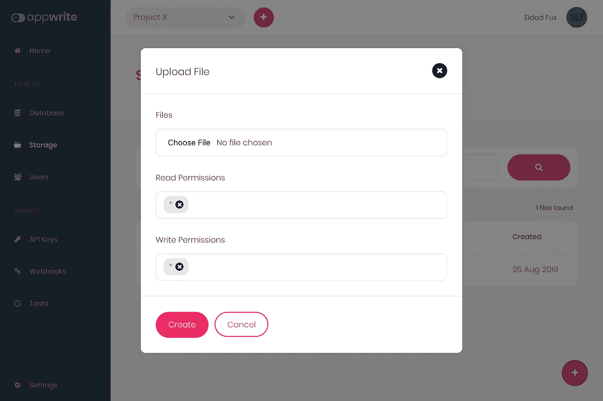

# 了解如何使用开源后端服务器 Appwrite 裁剪和优化您的图像

> 原文：<https://betterprogramming.pub/how-to-use-appwrite-open-source-platform-as-your-image-cropping-optimisation-service-2c5efab4edcb>

## 更快地传送更好的图像

如果你还没有听说过 [Appwrite](https://appwrite.io) ，这是一个新的 web 和移动开发，[开源](https://github.com/appwrite/appwrite)后端服务器，它抽象了常见的开发任务，帮助开发者更快地交付软件。

Appwrite 有很多服务可以帮助你更快的写代码。它可以帮助您管理用户的身份验证、持久数据库和文件管理。Appwrite 最酷的功能之一是它能够帮助您裁剪图像文件，从而帮助您在应用程序中使用优化的图像并提高性能。

Appwrite 是跨平台和框架不可知的，这意味着您可以将它与任何可用的 Appwrite SDKs 一起使用，或者直接使用 HTTP API。您可以从您的客户端应用程序或后端直接与 Appwrite API 集成。您可以根据自己的特定用例和需求来决定如何与它集成。

# 开始

Appwrite 是一个打包为 Docker 映像的自托管项目，因此要设置它，您需要做的就是在您选择的主机上运行 Docker 映像(Linux、Mac OS 和 Windows 都支持)。最快的开始方式是从终端运行 Appwrite 快速安装命令。请注意，您需要安装 Docker CLI 才能工作。

一旦 Docker 完成了对 Appwrite 服务器环境的设置，就可以通过端口 80 (http://localhost)访问您的本地主机，进入 Appwrite 控制台。如果您的主机已经使用了端口 80，您可以在上面的命令中更改端口号。

# 创建您的第一个项目

Appwrite 项目是数据库文档、存储文件和项目用户等应用资源的容器。要创建一个新项目，你需要做的就是从 [http://localhost](http://localhost) (或者你可能设置的任何其他主机)登录或者注册到你的新控制台，然后点击 Create Project 按钮。选择您的项目名称，并在创建后访问它。

您的 Appwrite 项目仪表板

# 上传您的文件

要了解图像裁剪是如何工作的，首先需要将一些文件上传到 Appwrite 服务器。最简单的方法是从 Appwrite 控制台 UI 上传文件。

在新项目控制面板中，从左侧导航访问存储部分。进入后，点击屏幕右下角的圆形+添加按钮。

Appwrite 控制台文件创建表单。

单击添加按钮后，您将访问文件创建表单，选择您的文件并单击创建按钮开始上传它们。如果您想知道什么是读和写权限字段，您可以在这里阅读关于 Appwrite 中的资源访问控制的更多信息。默认情况下，出于本教程的考虑，保留星号标记，为任何希望读写新文件的人提供通配符权限。

请注意，尽管在这个示例中我们使用 Appwrite 控制台来上传文件，但是您可以在控制台中执行的任何操作也可以在 Appwrite REST API 和 Appwrite 团队提供的不同 SDK 中使用。

# 裁剪您的文件

单击文件名会显示更多信息，包括它的唯一 ID。

要开始裁剪文件，您首先需要获得项目和文件的唯一 id(uid)。要获得您的文件 UID，您需要做的就是点击您想要裁剪的文件的名称，并从文件 UID 输入字段中复制其唯一的 ID 值。要获得新的项目 UID，请从左侧导航按钮转到项目设置页面，并复制其 UID 输入字段值。

有了 uid 之后，使用这个 API 调用来调用文件，以查看新文件的预览:

[http://localhost/v1/storage/files/[FILE-UID]/preview？project=[PROJECT-UID]](http://localhost/v1/storage/files/[FILE-UID]/preview?project=[PROJECT-UID])

最后，要裁剪您的文件，请使用您选择的像素大小传递宽度和高度参数:

[http://localhost/v1/storage/files/[FILE-UID]/preview？PROJECT =[PROJECT-UID]&width = 100&height = 100](http://localhost/v1/storage/files/[FILE-UID]/preview?project=[PROJECT-UID]&width=100&height=100)

当 API 调用只传递宽度或高度参数中的一个时，Appwrite 服务器将自动调整第二个参数以保持图像的纵横比不变。

还要注意，为了避免滥用您的服务器，目前在宽度或高度上有一个最大 4000 像素的限制。有关详细文档，请访问完整的[预览 API 参考页面](https://appwrite.io/docs/storage#getFilePreview)。

# 优化您的预览图像

当在 web 上提供图像服务时，速度是至关重要的，这就是为什么 Appwrite 服务器为您提供了几个选项来加快图像服务的速度。

## 更改图像质量

默认情况下，您的图像质量设置为最高 100，但如果可能，您可以更改它以减小图像大小。要更改图像大小，您只需将质量参数添加到 API 调用中:

[http://localhost/v1/storage/files/[FILE-UID]/preview？project=[PROJECT-UID] &宽度=100 &高度=100 &质量=75](http://localhost/v1/storage/files/[FILE-UID]/preview?project=[PROJECT-UID]&width=100&height=100&quality=75)

## 使用 WebP 压缩提供图像

WEBP 是 Google 开发的一种压缩格式，有助于优化您的图像大小，而不会损失明显的图像质量。迄今为止，大多数现代 web 浏览器都支持 WebP。为了避免不必要的错误，Appwrite 服务器检查 WebP 客户端支持，并在必要时退回到使用旧的 JPEG 格式。

要添加支持 WebP 的图像，您只需将输出参数添加到 API 调用中，并设置为 WEBP:

[http://localhost/v1/storage/files/[FILE-UID]/preview？PROJECT =[PROJECT-UID]&width = 100&height = 100&output = webp](http://localhost/v1/storage/files/[FILE-UID]/preview?project=[PROJECT-UID]&width=100&height=100&output=webp)