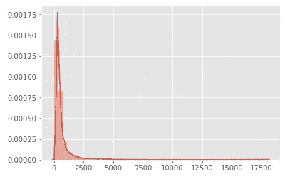
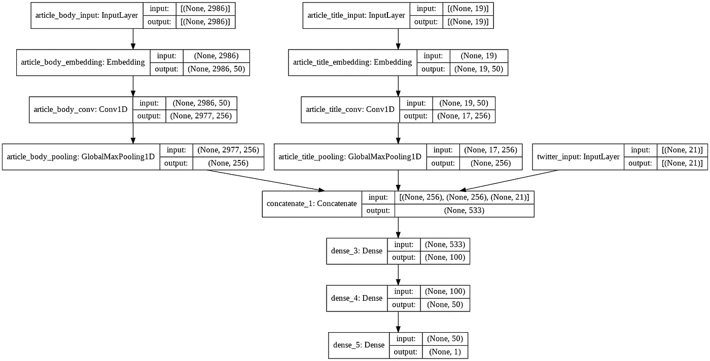

# 如何使用人工智能和 Twitter 来检测假新闻

> 原文：<https://betterprogramming.pub/how-to-use-artificial-intelligence-and-twitter-to-detect-fake-news-a-python-tutorial-75a4132acf7f>

## 使用 Python 和 TensorFlow 创建一个神经网络，该网络可以使用来自 Twitter 的数据对假新闻文章进行准确分类


在 [Unsplash](https://unsplash.com?utm_source=medium&utm_medium=referral) 上由 [Waldemar Brandt](https://unsplash.com/@waldemarbrandt67w?utm_source=medium&utm_medium=referral) 拍照

# **背景**

2016 年大选后，“假新闻”成为大多数美国人耳熟能详的一句话。不管是好是坏，我们面临的事实是，我们依赖社交媒体来保持我们的信息，这让我们有可能被坏人操纵。

随着 2020 年大选的临近，我们将再次受到通过每一个可以想象的社交媒体媒体的政治信息的冲击。其中一些信息是真实的，旨在帮助我们做出明智的投票决定。相比之下，其他信息将被设计成让我们彼此对立，变得更加政治两极化，这一切都是为了推进那些传播它的人的隐藏议程。

无论你站在政治通道的哪一边，你都应该关注假新闻已经(并将继续)对我们的民主进程产生的有害影响。政治话语应该由人类来推动，而不是机器人和旨在让我们互相仇恨的算法。

我相信，人工智能像任何技术或工具一样，有可能让我们受益，也有可能给我们带来巨大的伤害。由我们自己决定如何使用它。

我想向大家展示，针对我们发布假新闻的工具是如何帮助我们打击假新闻的。

# **先决条件**

出于本文的目的，我将假设您已经知道如何用 Python 3 编程。有机器学习的基础知识也会有帮助。您也应该对在命令行中工作感到舒适，因为我们将使用的许多工具缺少[图形用户界面(GUI)](https://en.wikipedia.org/wiki/Graphical_user_interface) 。

如果你是编程新手，我向大家强烈推荐 Chuck Severance 博士的 Python。如果你已经知道如何编程，但对 Python 或机器学习不熟悉，我建议你去密歇根大学的[Coursera](https://www.coursera.org/specializations/data-science-python)上的应用数据科学与 Python 专门化[。](http://coursera.org)

# **算法**

我们将用来构建假新闻检测器的算法被称为卷积神经网络或 CNN。CNN 通常用于图像分类任务(例如面部识别)，但我们也可以将它们用于文本分类任务，如假新闻检测！

解释 CNN 如何工作超出了本文的范围，但是 Adit Deshpande 的 [*理解卷积神经网络*](https://adeshpande3.github.io/A-Beginner%27s-Guide-To-Understanding-Convolutional-Neural-Networks/) 的初学者指南提供了一个很好的概述*。那些想要更严谨一点的人可能会对斯坦福大学 CS231n 课程的材料感兴趣。*

免责声明:我将向您展示的 CNN 将*而不是* 产生全世界有史以来最好、最先进的假新闻检测结果。有很多研究人员从事这方面的工作，比我强得多。如果你对他们的工作感兴趣，我建议阅读 [Oshikawa 等人关于该主题的 2018 年文献综述](https://arxiv.org/abs/1811.00770)。然而，我的算法将允许你用有限的计算资源快速得到相当好的结果。我强烈建议你把它作为你自己进行深度学习和文本分类实验的起点。

# **数据集**

我们在这个项目中使用的数据集是舒等人在他们的论文 [*FakeNewsNet:一个包含新闻内容、社会背景和时空信息的数据仓库，用于研究社交媒体上的假新闻*](https://arxiv.org/abs/1809.01286) *中描述的 FakeNewsNet 数据集。*

FakeNewsNet 结合了来自 [Politifact](https://www.politifact.com/) 和[gossi COP](https://www.gossipcop.com/)的一组由人工标记的真实和虚假文章，以及来自 Twitter 的关于发布这些文章的用户的数据。我们可以将文章的原始数据与 Twitter 数据结合起来，做出比单独使用任何一个来源都更好的假新闻检测器！

# **第一部分:收集数据**

现在已经聊得够多了。让我们开始编码吧！首先，你要确保你已经安装了[Python](http://python.org)(3.6 或更高版本)和 [Git](https://git-scm.com/) 。我们将通过启动一个终端窗口并运行以下命令来克隆 [FakeNewsNet GitHub 存储库](https://github.com/KaiDMML/FakeNewsNet)开始:

```
git clone [https://github.com/KaiDMML/FakeNewsNet.git](https://github.com/KaiDMML/FakeNewsNet.git)
```

然后，将目录切换到我们刚刚下载的 FakeNewsNet 文件夹，并使用 pip 安装所需的软件包:

```
cd FakeNewsNet/
pip install -r requirements.txt
```

这就是事情变得有点混乱的地方。由于 Twitter 不允许 tweet 数据被重新分发，我们将不得不通过创建一个 [Twitter 开发者账户](https://developer.twitter.com/)并获得一个 API 密钥来收集 Tweet 数据。如果你还没有 Twitter 开发者账户，你必须注册并等待几天的批准。在填写申请开发者账户的理由时，一定要彻底和诚实——我听说过用户没有认真对待被拒绝的那部分注册。

一旦你的开发者账户被批准，登录，悬停在你的名字上，点击下拉菜单中的“应用”。然后点击蓝色的“创建应用程序”按钮。你需要填写一些关于你的应用程序的详细信息。一旦你创建了它，跳转到“密钥和令牌”页面，点击“访问令牌和访问令牌密码”下面的蓝色“生成”按钮

您需要将这些值与您的 API 密匙和 API 密匙粘贴到`code/resources/`下 FakeNewsNet 文件夹的`tweet_keys_file.json` 中。注意，API 密钥和秘密进入`app_key`和`app_secret`字段，而访问令牌和秘密进入`oauth_token`和`oauth_token_secret`字段。 ***不要*** *与任何人分享任何这些值*或将它们上传到像 GitHub 这样的公共代码库。如果其他人得到了这些，他们就可以控制你的 Twitter 账户。

如果您愿意，可以在`code/config.json`中更改其他设置*。但是对于大多数用例来说，缺省值应该没问题。返回到您的终端窗口，cd 进入 code 文件夹，并使用以下命令运行数据收集服务器:*

```
cd code/
nohup python -m resource_server.app &> keys_server.out&
nohup python main.py &> data_collection.out&
```

不幸的是，在撰写本文时，数据收集代码还没有得到很好的优化，需要很长时间才能运行。过了一段时间，我厌倦了等待，中断了数据收集，给我留下了 20，795 篇文章及其下载的推文。其中 5100 篇是假新闻，15659 篇是真新闻。您的里程可能会有所不同。

# **第二部分:数据处理**

现在数据已经收集好了，我们需要执行一些处理步骤来准备将它输入我们的 CNN。如果您还没有安装`numpy`和`pandas`库，请在您的终端窗口中运行以下命令来安装它们:

```
pip install numpy
pip install pandas
```

在数据收集过程结束后(或者你中断了它)，你应该会留下一个名为`fakenewsnet_dataset` *的新文件夹。*这个文件夹里面应该是另外两个文件夹:`politifact` 和`gossipcop` *。在`fakenewsnet_dataset`**内创建一个新的 Python 文件，名为`build_dataset.py` *。我会提供你应该放在这个文件中的代码，以及每个部分的简要说明。**

*首先，我们需要导入`pandas`和`numpy`库，以及我们需要的其他一些 Python 模块:*

```
*import json
import os
import numpy as np
import pandas as pd*
```

*然后我们创建一个函数，`load_data`，，它将搜索我们下载的所有文件，提取它们的原始 JSON 数据，并将这些数据组合成一个 Python 字典列表，我们可以使用它来进行进一步的处理。这种方法确保了文章数据和正确的 tweets 在我们继续之前正确匹配。如果文章数据或特定文章的推文丢失，它将被跳过，不包括在我们的最终数据集中。*

*每篇文章都有许多相关的推文，每篇文章可能有不同数量的推文。因此，我们希望总结每篇文章在整个推文中的特征，如关注者数量、关注人数、发布状态数量、喜欢数量、转发数量、验证推文数量和收藏数量。为此，我们可以创建一个名为的函数:*

*然后，我们编写另一个函数，`process_example` *，*，它获取一篇文章，找到文章标题、文本和真假标签，将这些信息与 Twitter 统计数据结合起来，并将文章打包成一个简明的 Python 字典。*

*最后，我们调用我们根据收集的数据编写的函数:*

*然后，我们使用 pandas 整合所有处理过的数据，并将其写入一个 CSV 文件— `dataset.csv`:*

```
*df = pd.DataFrame(pf_fake)
df = df.append(pf_real)
df = df.append(gc_fake)
df = df.append(gc_real)df.reset_index(inplace=True, drop=True)df.to_csv('dataset.csv', index=False)*
```

*根据你从数据集中下载的文章数量和你机器的计算能力，这可能需要一段时间来运行。然而，一旦完成，您将在`dataset.csv`中留下所有合并的数据。*

# ***第三部分:文本预处理***

*在本教程的其余部分，我们将严重依赖于 [TensorFlow](http://tensorflow.org) ，这是一个由 [Google](http://google.com) 开发的流行的开源机器学习框架。*

*训练 CNN 的过程是高度计算密集型的，并且可能花费很长时间。幸运的是，TensorFlow 内置了对 GPU 加速的支持，这使得这个过程快了很多。然而，即使您的机器上有兼容的 GPU，配置 TensorFlow(和 CUDA)来使用它的过程也可能是痛苦的。因此，我建议在 [Google Colab](https://colab.research.google.com/) 中继续本教程的剩余部分，它将为您处理所有这些问题。*

*首先，将 `*dataset.csv*` 上传到你的 Google Drive 账号。然后去[https://colab.research.google.com/](https://colab.research.google.com/)推出新的 Python 3 笔记本。从“编辑”菜单中，选择“笔记本设置”。确保“运行时类型”设置为 Python 3，将“硬件加速器”设置为 GPU。*

*在第一个代码单元中，我们将导入并配置各种 Python 库，我们将在本教程的剩余部分使用这些库:*

```
*import tensorflow as tf
import numpy as np
import pandas as pd
from sklearn.model_selection import train_test_split
from sklearn.metrics import precision_score, recall_score, f1_score
import matplotlib.pyplot as plt
plt.style.use('ggplot')
import seaborn as sns*
```

*通过单击单元格左侧的播放按钮来运行该单元格。然后，创建一个新的代码单元格，并粘贴以下代码以允许 Colab 访问您的 Google Drive 中的`dataset.csv` 。*

```
*from google.colab import drive
drive.mount('/content/drive')*
```

*运行此单元格，然后单击出现在它下面的 URL。授予 Colab 访问您的 GDrive 的权限，然后将您收到的访问代码复制并粘贴到 Colab 提供的框中，并按 enter 键。在一个新的单元格中，我们将数据集读入一个`pandas` `DataFrame`，并删除任何缺少值的行:*

```
*# add any necessary folders after "My Drive" if you placed 
# dataset.csv inside a folderdf = pd.read_csv('/content/drive/My Drive/dataset.csv')
df.dropna(inplace=True)*
```

*为了让 TensorFlow 理解我们的数据，一切都需要用数字表示。由于我们正在处理文本，这显然是有问题的。*

*幸运的是，TensorFlow 有一个内置的标记器，可以将文本数据转换为数字格式，其中每个唯一的单词都由一个不同的数字表示。它还会自动去除标点符号，并将所有单词转换为小写。*

*在这里，我们将每篇文章的正文文本转换成整数的 numpy 数组:*

```
*tokenizer = tf.keras.preprocessing.text.Tokenizer()
tokenizer.fit_on_texts(df['text'])
df['text'] = tokenizer.texts_to_sequences(df['text'])*
```

*不幸的是，CNN 要求我们的每个输入都具有相同的维度。然而，由于每篇文章都有不同的长度，这就带来了挑战。一种解决方案是设置最大文章长度，并在小于该长度的任何文章的整数数组的末尾添加 0。我们可以选择数据集中最长的文章作为最大值，但是假设 [Zipf 定律](https://en.wikipedia.org/wiki/Zipf%27s_law)成立，我们知道大多数文章会相对较短，少数文章会非常长，导致长尾 Zipfian(或[幂定律](https://en.wikipedia.org/wiki/Power_law))分布。让我们画出每篇文章的长度，一探究竟！*

```
*X_lens = [len(x) for x in df['text'].values]
X_lens = np.array(X_lens)
sns.distplot(X_lens)*
```

**

*物品长度分布的密度图*

*根据你在数据收集阶段下载的文章数量的不同，你的精确图可能会有所不同，但从这个图表中可以清楚地看出，Zipf 定律确实适用于文章的长度。我们可以清楚地看到，绝大多数文章都在 2500 字以下。*

*如果我们选择 17，500(或更多)个单词作为最大文章长度，我们将拥有非常大的向量，而这些向量只对数据集的一小部分有益。此外，使用 17，500 维向量会使训练 CNN 的计算复杂度大得多。*

*相反，我决定计算平均文章长度，文章长度的标准差，并使用平均值加上两个标准差作为我的最大文章长度。这里的直觉是选择一个最大长度，它不会缩短绝大多数文章，但仍然足够小，以允许有效的计算。*

```
*# calculate the mean article length - mine was 622.0563602325352
np.mean(X_lens)# calculate the standard deviation of article length
# mine was 1182.0848019657983
np.std(X_lens)*
```

*我将这些数字四舍五入到最接近的整数，得到 622 个单词的近似平均值和大约 1182 个单词的标准偏差。在近似平均值上加上两倍的近似标准差后，我得到的最大文章长度为 2986 字。为了验证这不会删减太多文章，我进行了以下计算:*

```
*MAX_LENGTH = 2986
np.unique((X_lens >= MAX_LENGTH), return_counts=True)# for me this returns:
# (array([False,  True]), array([19689,   609]))*
```

*这里的返回值告诉我，我的文章中有 19689 篇小于等于 2986 字，609 篇大于 2986 字。通过执行以下计算:19，689/(19，689+609)我知道我的文章中有超过 96.9997%的文章少于或正好是 2986 个单词。对我来说，这个数字是可以接受的。但是如果少于 95%的文章小于或等于你的最大长度，你可能希望考虑使用更大的最大长度。*

*然后，我对文章标题进行了标记化处理，使用了与处理文章正文相同的过程:*

```
*title_tokenizer = tf.keras.preprocessing.text.Tokenizer()
title_tokenizer.fit_on_texts(df['title'])
df['title'] = title_tokenizer.texts_to_sequences(df['title'])*
```

*我重复了计算最大标题长度和计算最大文章正文长度的相同过程。为了简单起见，我不会在这里显示计算，但是您可以简单地重用相同的代码，用 df['title']替换 df['text']。我计算的最大标题长度是 19，98.0293%的文章标题小于或等于 19。我将结果保存为常量:*

```
*MAX_TITLE = 19*
```

*在设置了最大标题长度和最大文章长度之后，我们需要去掉一些不必要的特性。*

*我们需要删除文章 ID，因为虽然它有助于收集数据和将所有东西放在一起，但它与文章是否是假的没有任何关系。我也把文章来源信息掉了。您可能希望尝试一下，但是我发现包含源信息是没有帮助的，因为有太多的源来对它们进行有意义的编码。此外，研究表明，包括来源信息可能会引入过度的偏见。*

```
*df.drop('source', axis=1, inplace=True)
df.drop('id', axis=1, inplace=True)*
```

*接下来，我们将标签从其余数据中分离出来，用`0`替换“真实”标签，用`1`替换“虚假”标签:*

```
*labels = df.pop('label')
labels.replace({'fake': 1, 'real': 0}, inplace=True)*
```

*然后，我们将数据分为训练集和测试集:*

```
*X_train, X_test, y_train, y_test = train_test_split(df, labels)*
```

*接下来，我们将文章标题和正文从其余数据中分离出来。他们每个人都将从推特数据中独立出来，输入 CNN。*

```
*X_train_title = X_train.pop('title')
X_test_title = X_test.pop('title')X_train_text = X_train.pop('text')
X_test_text = X_test.pop('text')*
```

*然后，我们通过切掉太长标题的末端，并为太短标题的向量添加`0` s，来应用最大标题长度:*

```
*X_train_title = tf.keras.preprocessing.sequence.pad_sequences(X_train_title,
                                              maxlen=MAX_TITLE,
                                              padding='post',
                                              truncating='post')
X_test_title = tf.keras.preprocessing.sequence.pad_sequences(X_test_title,
                                              maxlen=MAX_TITLE,
                                              padding='post',
                                              truncating='post')*
```

*对文章正文重复相同的过程:*

```
*X_train_text = tf.keras.preprocessing.sequence.pad_sequences(X_train_text,
                                              maxlen=MAX_LENGTH,
                                              padding='post',
                                              truncating='post')
X_test_text = tf.keras.preprocessing.sequence.pad_sequences(X_test_text,
                                              maxlen=MAX_LENGTH,
                                              padding='post',
                                              truncating='post')*
```

# ***第四部分:模型创建与培训***

*下一步是构建和编译 CNN。由于我们创建的模型不遵循线性层序列，我们将使用 Keras functional API 来定义它:*

*在不涉及太多细节的情况下，该模型接受三个独立的输入:文章标题、文章正文和 Twitter 数据。文章标题和正文被传递到单独的嵌入层，每个单词被转换成一个 50 维向量。产生的矩阵被传递到卷积层，在那里应用 256 个滤波器。最后，使用全局最大池化将矩阵池化为向量，并将得到的向量与 Twitter 向量连接，并传递到前馈网络以产生二进制分类。*

*我的最终模型的架构图如下所示:*

**

*模型完全编译后，我们现在必须训练它。为了确保我们在测试集上保留具有最佳精确度的模型，我们在五个时期后应用`Early Stopping`而没有精确度改进。*

# ***第五部分:模型评估***

*一旦模型完成训练，我们需要在测试集上测试它的准确性——模型以前没有见过的例子。我们首先需要模型来输出对所有测试文章的预测:*

```
*preds = model.predict([X_test_text, X_test_title, X_test])*
```

*一旦做出了预测，我们就可以对它们的准确性进行评分:*

```
*model.evaluate([X_test_text, X_test_title, X_test], y_test)*
```

*对我来说，准确率是 90.84%。您的准确性可能会有所不同，这取决于您下载的特定文章以及您最终获得的特定培训/测试结果。一般来说，你应该期望看到 80 多或 90 多的准确度。*

*然而，我们正在处理不平衡的类(假文章的数量明显少于真文章的数量)，所以准确性不能给我们完整的故事。我们应该关注的一些其他指标包括精确度、召回率和 F1 分数。*

*Precision 告诉我们有多少被模型*标记为*假的文章实际上是*假的。在我的模型中，分数是 82.59%，但是您可以用下面的代码检查您的分数:**

```
*precision_score(y_test.values, preds.reshape(-1).astype('int64'))*
```

*回忆告诉我们有多少*实际上*是假的文章，被正确地*标记为*是假的。在我的模型中，这个分数是 78.74%。您可以通过以下方式查看您的分数:*

```
*recall_score(y_test.values, preds.reshape(-1).astype('int64'))*
```

*最后，我们可以计算 F1 分数，它是精确度和召回率的调和平均值。我的是 0.8061，但您可以通过以下方式获得您的:*

```
*f1_score(y_test.values, preds.reshape(-1).astype('int64'))*
```

*这就是全部了。*

*我们已经成功地创建了一个模型，可以从一篇文章的文本、标题和 Twitter 的社交媒体上下文中对假新闻进行分类！*

*在未来的工作中，我将发布一个教程，介绍如何将该模型推广到不在原始数据集中的文本，以及如何使其对未知单词具有鲁棒性。*