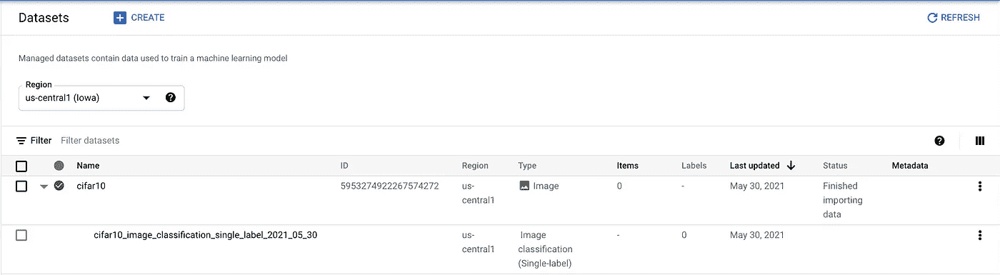
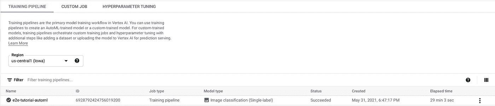
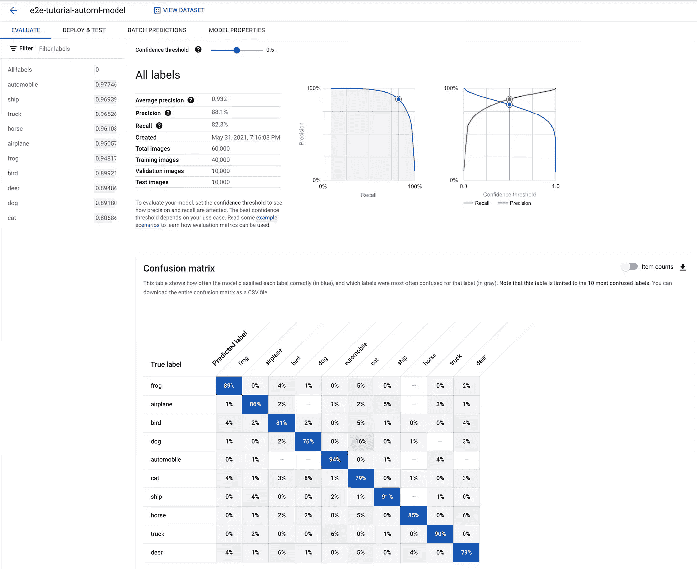
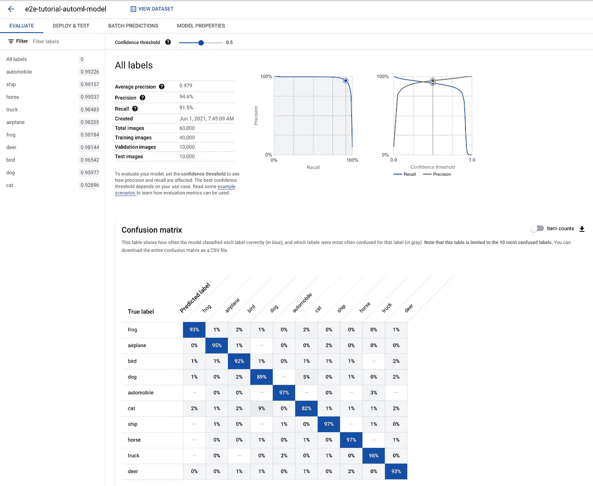

# 如何在 Google Cloud 的 Vertex AI 上使用 AutoML

> 原文：<https://betterprogramming.pub/how-to-use-automl-on-google-clouds-vertex-ai-27f8778239ea>

## 定制培训的替代方案:AutoML——从头构建一个伟大的模型


顶点 AI(来源:[谷歌云](https://cloud.google.com/vertex-ai))

# 顶点 AI 教程系列

1.  [在谷歌云的顶点人工智能上训练模型的逐步指南](/a-step-by-step-guide-to-train-a-model-on-google-clouds-vertex-ai-47faafae1330)
2.  [在谷歌云的顶点人工智能上调整模型的逐步指南](/a-step-by-step-guide-to-tune-a-model-on-google-clouds-vertex-ai-afd2e72af595)
3.  [如何在谷歌云的顶点人工智能上操作模型](/how-to-operationalize-a-model-on-google-clouds-vertex-ai-53298b530703)
4.  如何在谷歌云的 Vertex AI 上使用 AutoML(本文)
5.  [如何在 Google Cloud 的 Vertex AI 上使用 big query ML](/how-to-use-bigquery-ml-on-google-clouds-vertex-ai-23b1ca0b635)
6.  [如何在 Google Cloud 的 Vertex AI 上使用 Pipeline](/how-to-use-pipeline-on-google-clouds-vertex-ai-863b429c811f)

# 背景

在本系列的 [part 1](/a-step-by-step-guide-to-train-a-model-on-google-clouds-vertex-ai-47faafae1330) 、 [part 2](/a-step-by-step-guide-to-tune-a-model-on-google-clouds-vertex-ai-afd2e72af595) 和 [part 3](/how-to-operationalize-a-model-on-google-clouds-vertex-ai-53298b530703) 中，我们从零开始，训练了一个自定义模型，对其进行了优化，并将其部署在 [Vertex AI](https://cloud.google.com/vertex-ai) 上，以服务于在线预测。这是一个相当长的旅程，但仍然相对简单。然而，在现实中，我们可能会在模型训练和优化阶段停留数月，因为为现实世界的问题找到最佳的模型结构和训练方案可能非常具有挑战性。

AutoML 是谷歌云解决这一挑战的尝试。AutoML 允许用户以无代码的方式引导模型创建。它基于典型数据类型和机器学习任务的预训练模型，如图像分类、文本实体提取、视频对象跟踪、表格回归等。用户只需提供训练数据，并指示 AutoML 对预训练模型进行微调，以“适应”它们。

在本文中，我们将探索使用 AutoML 来解决我们在以前的文章中已经解决的相同的图像分类问题。简单回顾一下，我们一直在使用的数据集是 [CIFAR10](https://www.tensorflow.org/datasets/catalog/cifar10) ，它包含 10 个类的 60，000 张 32x32 的图像。

# 准备数据

首先，我们需要准备数据。与第一篇文章一样，我们需要以一种易于下游消费的形式获取数据。我们还需要将它放在谷歌云存储(GCS)上，以便 Vertex AI 可以访问它。对于 AutoML，普通的 JPEG 图像就可以了。但是我们需要一个元数据文件来告诉 AutoML 这些图像的 GCS 位置、它们的标签和它们的分割。这里的一个额外问题是，来自 Tensorflow 数据集目录的 CIFAR10 数据集是在 TFRecords 中编码的。所以我们需要把它们提取出来，保存为普通的 JPEG 图像。

有关详细信息，请参见下面的代码片段。

数据准备代码

除了提取和保存 JPEG 图像，上面的代码还创建了一个`metadata.jsonl`文件，其中包含如下记录。

```
{“imageGcsUri”:”GCS_PATH_FOR_DATA/train_123.jpeg”, “classificationAnnotation”: {“displayName”: “horse”}, “dataItemResourceLabels”: {“aiplatform.googleapis.com/ml_use”: train}}{“imageGcsUri”:”GCS_PATH_FOR_DATA/validation_456.jpeg”, “classificationAnnotation”: {“displayName”: “ship”}, “dataItemResourceLabels”: {“aiplatform.googleapis.com/ml_use”: validation}}{“imageGcsUri”:”GCS_PATH_FOR_DATA/test_789.jpeg”, “classificationAnnotation”: {“displayName”: “truck”}, “dataItemResourceLabels”: {“aiplatform.googleapis.com/ml_use”: test}}
```

**这里要非常小心:**写的时候顶点 AI [文档](https://cloud.google.com/vertex-ai/docs/datasets/prepare-image)错了。这个字段叫做`classificationAnnotation`，根据他们的模式，它是一个单一的对象字段。但是文档上提供的例子说它叫做`classificationAnnotations`，它是一个对象列表。在遵循文档中的例子时，我得到了一个`Cannot find field: classificationAnnotations`错误。这个错误给我造成了一个小时的调试时间。

一旦创建了 JPEG 图像和元数据，使用`gsutil`将它们上传到`GCS_PATH_FOR_DATA`位置。请注意，您可能无法使用通配符匹配在一个命令中上传所有这些内容，因为这超过了参数长度`gsutil`。您可能需要多次运行`gsutil`命令，手动选择要上传的文件子集。

# 实例化顶点人工智能数据集

现在数据在 Google 云存储上，我们需要创建一个相应的数据集。这一步很简单。

直接调用 Vertex AI 的 Dataset API 来创建一个空数据集，该数据集返回一个数据集 ID，我们将在后续命令中用到它。

```
curl -X POST \
-H "Authorization: Bearer "$(gcloud auth application-default print-access-token) \
-H "Content-Type: application/json; charset=utf-8" \
-d '{"display_name": "cifar10","metadata_schema_uri": "gs://google-cloud-aiplatform/schema/dataset/metadata/image_1.0.0.yaml"}' \
https://us-central1-aiplatform.googleapis.com/v1/projects/PROJECT_ID/locations/us-central1/datasets
```

然后将我们在 GCS 中准备的数据导入到这个数据集，它返回一个导入操作 ID。

```
curl -X POST \
-H "Authorization: Bearer "$(gcloud auth application-default print-access-token) \
-H "Content-Type: application/json; charset=utf-8" \
-d '{"import_configs":[{"gcs_source":{"uris":"GCS_PATH_FOR_DATA/metadata.jsonl"},"import_schema_uri":"gs://google-cloud-aiplatform/schema/dataset/ioformat/image_classification_single_label_io_format_1.0.0.yaml"}]}' \
https://us-central1-aiplatform.googleapis.com/v1/projects/PROJECT_ID/locations/us-central1/datasets/DATASET_ID:import
```

进口需要半个小时。我们可以使用以下命令来轮询导入状态。

```
curl \
-H "Authorization: Bearer "$(gcloud auth application-default print-access-token) \
https://us-central1-aiplatform.googleapis.com/v1/projects/PROJECT_ID/locations/us-central1/datasets/DATASET_ID/operations/IMPORT_OPERATION_ID
```

我们还可以在 UI 上检查状态，但是当我们在导入过程中遇到错误时，上面的命令行会变得非常有用。上述命令将从导入中返回示例错误消息。在撰写本文时，没有其他方法可以获得详细信息。我用它发现了前面提到的`classificationAnnotations` bug。尽管有这些错误，导入仍然被标记为成功，但是数据集实际上是空的，因为所有元数据实例都无法解析。

修复错误后，我们能够导入数据集。我们可以在 UI: Vertex AI -> Dataset 上检查数据集是否在那里，并且附加了导入结果。当我们点击导入结果时，我们看到我们的数据在那里。



数据集概述


数据集导入结果

# 启动培训

我们现在可以开始 AutoML 培训了。我们使用下面的 curl 命令启动训练管道。

```
curl -X POST \
-H "Authorization: Bearer "$(gcloud auth application-default print-access-token) \
-H "Content-Type: application/json; charset=utf-8" \
-d @automl.json \
https://us-central1-aiplatform.googleapis.com/v1/projects/PROJECT_ID/locations/us-central1/trainingPipelines
```

请求的核心内容在`automl.json`文件中，如下所示。

自动请求

大多数自动化要求都是机械性的。关键部分是`filterSplit`，它详细描述了数据集用于训练、验证和测试的部分。它对应于之前在准备数据部分介绍的`dataItemResourceLabels`。值得注意的一件有趣的事情是，即使我们在数据准备中将训练的`aiplatform.googleapis.com/ml_use`标签设置为“训练”，我们实际上需要过滤“训练”否则，管道找不到训练数据集。

另一个值得注意的领域是`budgetMilliNodeHours`。它决定了花费在该训练上的计算预算。我把它设置为 16000。培训管道在 30 分钟内完成。

我们导航到 UI:Vertex AI-> Training-> Training Pipeline 查看管道，并单击管道转到已训练的模型。训练好的模型也会上传到 Vertex AI。所以我们可以在 UI 中找到它:顶点 AI ->模型。



自动管道



模型训练 30 分钟的结果

经训练的模型报告在精确度/召回率和混淆矩阵方面的表现。由于数据集是完全平衡的，所以精度只是混淆矩阵中对角线元素的平均值。模型精度(平均对角线值)为 85%，这比我们在之前的 [part 2 文章](/a-step-by-step-guide-to-tune-a-model-on-google-clouds-vertex-ai-afd2e72af595)中获得的定制模型(精度:74%)要好得多。这一点也不奇怪，因为我预计在 AutoML 培训中会用到很多先进的技术。我们还可以指定更大的计算预算，并训练具有更好性能的模型(准确率:93%)。吸取的教训:不要重新发明轮子；总是先尝试 AutoML。



模型训练 24 小时的结果

# 包裹

我们已经展示了如何以(几乎)无代码的方式从 AutoML 获得一个训练好的模型。我们可以按照[第三部分文章](/how-to-operationalize-a-model-on-google-clouds-vertex-ai-53298b530703)部署模型进行在线预测。这里就不赘述了。再见，下次见。