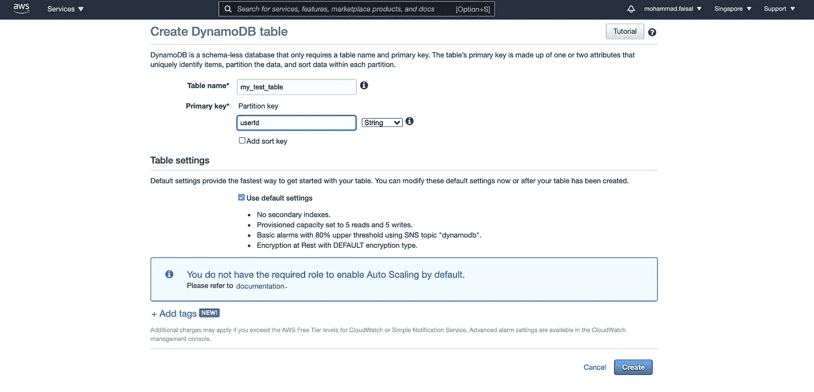

# 如何在 React 中使用 AWS DynamoDB

> 原文：<https://betterprogramming.pub/how-to-use-aws-dynamodb-in-react-70b55ffff93e>

## 让我们尝试从 React 应用程序访问 DynamoDB


[坦纳·博瑞克](https://unsplash.com/@tannerboriack?utm_source=medium&utm_medium=referral)在 [Unsplash](https://unsplash.com?utm_source=medium&utm_medium=referral) 上拍照。

掌握一些云知识变得越来越重要。如果您主要是前端开发人员，那么拥有 AWS 知识可以让您在竞争中保持领先。

今天，我们将学习如何从 React 应用程序中使用 [AWS DynamoDB](https://aws.amazon.com/dynamodb/) 。这是 AWS 最受欢迎的服务之一，绝对值得学习。

要跟进，您应该:

*   AWS 帐户
*   React 的基础知识

我们开始吧！

# 1.创建一个 DynamoDB 表

前往 AWS 管理控制台，搜索 DynamoDB。然后点击“创建新表”按钮，你会看到这个屏幕。

*   给出您选择的表名。
*   添加一个主键。这是您打算用作唯一标识符的字段。



创建 DynamoDB 表

点击“创建”，你就完成了。由于 DynamoDB 存储 JSON 数据，您不需要提供任何其他模式。

走向表，手动添加一些数据，这样当我们取数据时，就能得到一些东西。

# 2.获取用户详细信息

现在，为了从前端或服务器访问 DynamoDB，我们需要获得授权。AWS 使用 IAM 角色的概念对此进行管理。

*   转到 IAM 控制台并创建一个新用户。
*   为他们提供 AWS DynamoDB 访问的完全权限。
*   然后得到`secret access key`和`access key ID`。
*   将它们存储在安全的地方，永远不要与任何人或通过源代码控制来共享它们！


# 3.安装依赖项

我想你已经有了一个正在运行的 React 项目。如果没有，那就去你的终端，搭建一个新的应用程序:

```
npm create-react-app dynamodb-with-react
```

现在我们将需要另一个依赖项来访问 AWS 服务。那就是`aws-sdk`。在项目中安装它:

```
yarn add aws-sdk
```

# 4.配置您的项目

转到您的根文件(可能是`index.js`)并将您的项目配置为与 AWS 一起使用。

*   提供您所在的地区。
*   和上一步得到的两把钥匙。

# 5.创建一个函数来访问你的对象

现在创建一个名为`AwsFunctions.js`的新文件，并放入以下代码。这段代码从 DynamoDB 获取数据，并在控制台中打印出来。你可以在这里做各种新奇的事情。在这篇文章中，我保持了简单。

从某处调用此函数:

用于检查功能的代码

# 6.将数据添加到迪纳摩数据库

这很好，但是我们也需要从前端添加数据。不然也没那么有用！

在您的`AwsFunctions.js`文件中添加以下函数，并从某处调用它，将数据直接添加到 DynamoDB 中。

Put 函数

稍后，您可以再次获取并验证它的工作！让我们更新我们的`App.js`来验证这一点:

更新的 App.js

给你。现在你知道如何使用 React 中的 DynamoDB 了。

# 放弃

本文纯属学习目的。你不应该在你的前端代码中存储你的 AWS 秘密。

如果您想构建任何严肃的应用程序，可以考虑将 AWS Lambda 与 AWS 的 API 网关一起使用，或者构建一个定制的后端。

但是，如果您只是在玩 DynamoDB 和 React，而不想增加访问数据的复杂性或试图构建某种快速演示，那么您可以尝试这种方法。

我希望你喜欢这篇文章。祝您愉快！

**有什么话要说？**

**通过**[**LinkedIn**](https://www.linkedin.com/in/56faisal/)**或我的** [**个人网站**](https://www.mohammadfaisal.dev/) **与我取得联系。**