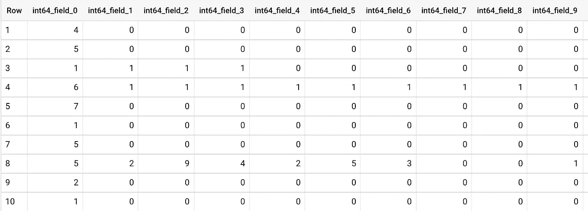
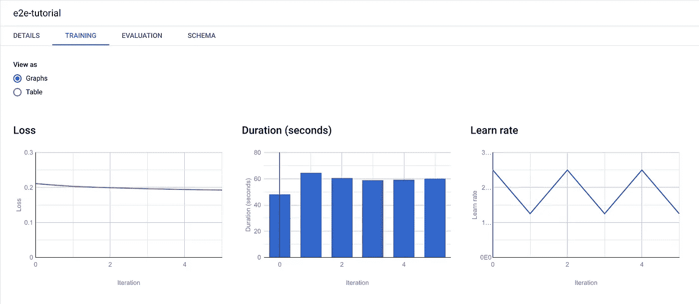
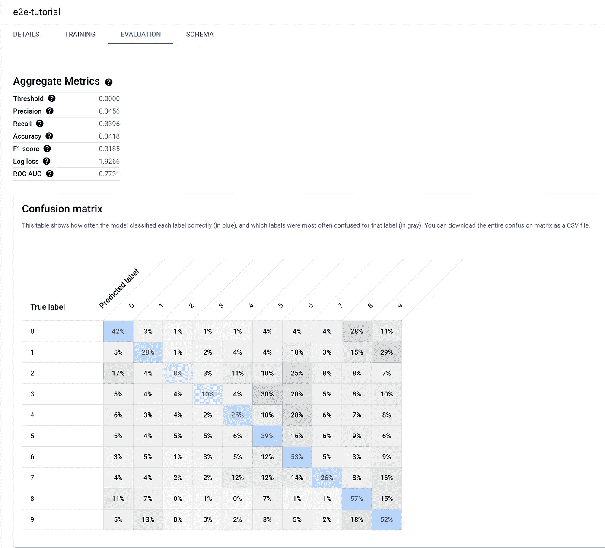
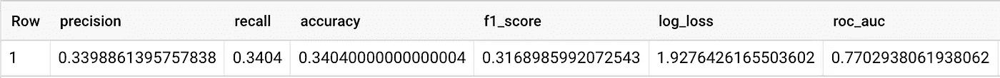
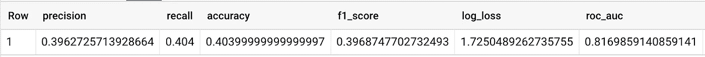
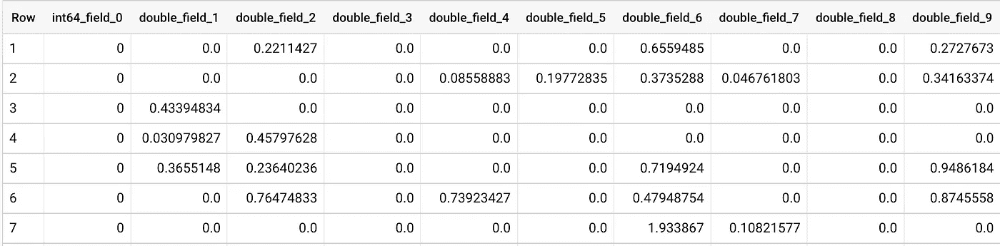
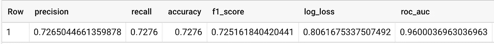

# 如何在谷歌云的 Vertex AI 上使用 BigQuery ML

> 原文：<https://betterprogramming.pub/how-to-use-bigquery-ml-on-google-clouds-vertex-ai-23b1ca0b635>

## 将 BigQuery ML 的思想用于图像分类


迈克尔·泽兹奇在 [Unsplash](https://unsplash.com?utm_source=medium&utm_medium=referral) 上的照片

# 顶点 AI 教程系列

1.  [在谷歌云的顶点人工智能上训练模型的逐步指南](/a-step-by-step-guide-to-train-a-model-on-google-clouds-vertex-ai-47faafae1330)
2.  [在谷歌云的顶点人工智能上调整模型的逐步指南](/a-step-by-step-guide-to-tune-a-model-on-google-clouds-vertex-ai-afd2e72af595)
3.  [如何在谷歌云的顶点人工智能上操作模型](/how-to-operationalize-a-model-on-google-clouds-vertex-ai-53298b530703)
4.  [如何在 Google Cloud 的 Vertex AI 上使用 AutoML](/how-to-use-automl-on-google-clouds-vertex-ai-27f8778239ea)
5.  如何在 Google Cloud 的 Vertex AI 上使用 BigQuery ML(本文)
6.  [如何在 Google Cloud 的 Vertex AI 上使用 Pipeline](/how-to-use-pipeline-on-google-clouds-vertex-ai-863b429c811f)

# 背景

到目前为止，我们已经介绍了许多顶点 AI 服务——笔记本、定制训练、hypertune、实验、数据集、AutoML、模型、端点等。—在[之前的文章](/how-to-use-automl-on-google-clouds-vertex-ai-27f8778239ea)中。我们将在本文中尝试一些新的东西: [BigQuery ML](https://cloud.google.com/bigquery-ml/docs/introduction) 。BigQuery ML 的基本前提很简单。BigQuery 通常是许多数据分析工作流的核心，人们喜欢将其用作他们的数据仓库。既然机器学习都是关于数据的，为什么不把 ML 带到数据所在的地方呢？

具体地说，BigQuery ML 允许我们使用 SQL 创建和训练模型。我们编写一个简单的 SQL 来告诉 BigQuery 哪一列是标签，哪一列是输入特征，以及我们想要执行哪种 ML 任务。BigQuery 负责模型的训练和优化。所以它有点像 AutoML，但是不需要从其他地方显式加载数据。

我们将在 [CIFAR10](https://www.tensorflow.org/datasets/catalog/cifar10) 数据集上继续我们的图像分类故事，该数据集包含 10 个类别的 60，000 张 32x32 图像。BigQuery ML 更适合表格数据。但是让我们考虑一下使用 BigQuery ML 进行图像分类的想法。这篇文章的重点是过程，而不是结果。

# 数据准备

显然，要使用 BigQuery ML，我们必须首先将数据加载到 BigQuery 中。让我们在这里做一件非常简单和愚蠢的事情:我们展平图像并存储每列一个像素值。图像分辨率为 32x32，有三个颜色通道(RBG)。因此，每幅图像的总列数为 32x32x3=3，072。此外，我们需要将标签作为图像的一列存储。因此总列数是 3，073，这在 10k BigQuery 列数限制之内。

我们首先处理 CIFAR10 数据集，并将训练和测试图像和标签存储在 CSV 文件中。

数据准备代码

然后，我们使用`gsutil`将 CSV 文件上传到 Google 云存储(GCS)。

```
gsutil cp *.csv GCS_PATH_FOR_DATA
```

接下来，我们需要创建一个 BigQuery 数据集，并将 CSV 文件从 GCS 上传到 BigQuery 以创建新表。我们使用`[bq](https://cloud.google.com/bigquery/docs/bq-command-line-tool)` [命令行工具](https://cloud.google.com/bigquery/docs/bq-command-line-tool)。

```
bq --location=us-central1 mk --dataset PROJECT_ID:bqmlbq --location=us-central1 load --source_format=CSV --autodetect PROJECT_ID:bqml.train GCS_PATH_FOR_DATA/train.csvbq --location=us-central1 load --source_format=CSV --autodetect PROJECT_ID:bqml.test GCS_PATH_FOR_DATA/test.csv
```

我们可以转到 BigQuery UI，通过在 BigQuery 查询编辑器 UI 中运行一个简单的查询来确认数据是否存在。

在 BigQuery 中查询数据



BigQuery 中的数据

列名是由 BigQuery 自动创建的。第一列，`int64_field_0`，是我们的标签。剩下的都是像素值。总共有 3073 列。截图只显示了前十条。

# 训练模型

在 BigQuery ML 中训练模型非常简单:

模特培训

然后我们就等着它完成。完成后，模型存储在我们指定的数据集下，`bqml`。我们可以检查它的细节，包括训练历史和验证结果。



培训历史



验证结果

我们还可以使用测试表来评估模型:

模型评估代码



模型评估结果

# 优化模型

表演糟透了。准确率只有 34%，离随机猜测(10%)不远。让我们试着降低维度，看看是否有帮助。我们使用主成分分析(PCA)通过下面的代码片段将维度从 3，072 降低到 300。

PCA 数据集生成

然后，我们按照上面详述的相同步骤将 CSV 文件上传到 GCS，并从 CSV 文件创建 BigQuery 表。以下是训练表的预览。第一列是标签。其余的是 PCA'd 数据。


PCA 数据

接下来，我们使用相同的查询来训练和评估模型。结果如下。



PCA 模型评估结果

与上面的非 PCA 版本相比，似乎有微小的改进。新的准确率是 40%。但还是挺糟糕的。在某种程度上，这是意料之中的，因为当我们将一个图像展平为一维数组时，我们基本上丢弃了空间信息。此外，逻辑回归通常无法提取输入的复杂表示。

让我们再试一次。我们将使用在第二篇文章中构建的自定义模型中的展平层作为 BigQuery ML 的输入。我们将把展平层的输出保存在 CSV 文件中，并按照上面相同的过程在 BigQuery ML 上创建一个模型。

首先，我们加载保存的模型并检查它的层组成。我们看到我们想要的展平图层叫做`flatten`。

负载模型

然后，我们将展平层的输出和相应的标签写入 CSV 文件。

编码数据

接下来，我们上传 CSV 文件来创建新的 BigQuery 表。以下是训练表的预览。标签在第一列。其余的是编码数据。



编码数据

最后，我们按照相同的步骤在 BigQuery ML 上创建和评估一个模型。我们看到性能要好得多。新的准确率是 73%。



编码模型评估结果

# 包裹

这篇快速文章就到这里。它很快，因为使用 BigQuery ML 非常容易，尤其是当您的数据已经在 BigQuery 中时。与以前的文章相比，在以前的文章中，我们必须启动各种管道并调用一堆命令(即使是在 AutoML 的情况下)，BigQuery ML 带来的简化是巨大的。显然，我们需要用它来完成正确的任务。