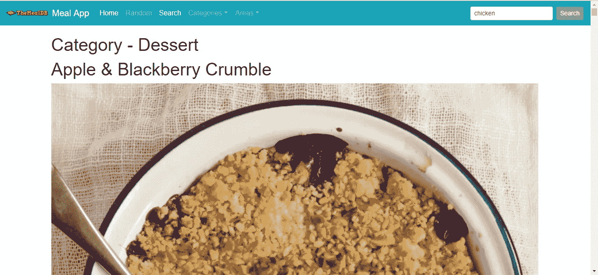
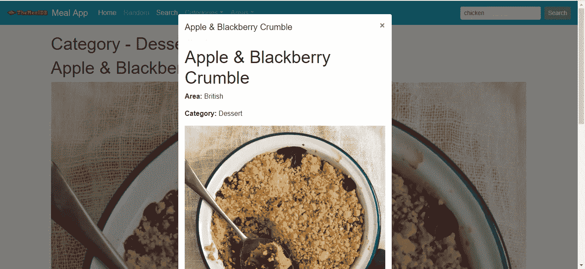
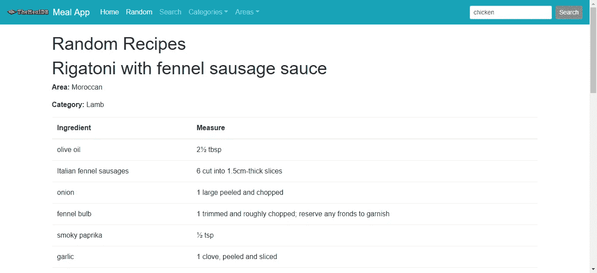

# 如何在 Vue.js 应用中使用 Bootstrap

> 原文：<https://betterprogramming.pub/how-to-use-bootstrap-in-your-vue-js-apps-e655b8b1ef43>

## 带示例的简单指南


查尔斯·🇵🇭在 [Unsplash](https://unsplash.com/search/photos/twitter?utm_source=unsplash&utm_medium=referral&utm_content=creditCopyText) 上的照片

Vue.js 是一个流行的构建单页面应用的前端框架。它提供了结构和抽象。应用程序是通过将部分应用程序组织成组件来构建的。数据绑定也是使用 Vue.js 的一个重要好处，每个组件都有自己的逻辑，显示东西的模板，风格。它还提供可选的路由和通量存储。 [Bootstrap](https://getbootstrap.com/) 是一个流行的框架，它提供了一组看起来不错的风格化小部件，减少了开发时间。Vue.js 使构建前端应用程序变得非常容易和愉快。

Twitter 制作了 Bootstrap 来设计他们自己的 UI 元素。它提供 HTML、CSS 和普通 JavaScript 形式的小部件。开发人员已经为 Vue.js 开发了一个 Bootstrap 插件，它提供了所有与 Bootstrap 相同的好处以及 Vue.js 的好处，比如数据绑定。Vue.js 版本的 Bootstrap 称为 [Vue-Bootstrap](https://bootstrap-vue.js.org/) ，作为一系列组件提供。

为了使用 BootstrapVue，我们将小部件导入到我们的 Vue 应用程序中，并在模板中引用 BootstrapVue 组件。完整的组件列表[可用](https://bootstrap-vue.js.org/docs/components/alert)，还有[一些修改现有元素的指令](https://bootstrap-vue.js.org/docs/directives/popover)。

在这个故事中，我们将创建一个使用[膳食 API](https://www.themealdb.com/api.php) 的应用程序。

# 构建应用程序

用 Bootstrap 构建 Vue.js 很容易。首先，我们需要 Vue CLI。我们通过运行`npm install -g @vue/cli`来安装它。我们需要初始化项目。运行`vue create meal-app`。命令运行后，你可以进入`meal-app`文件夹，开始编写应用程序。

现在我们可以开始构建应用程序了。我们运行`vue serve`来启动开发服务器。每当我们在项目文件夹中更改代码时，它都会刷新。

我们必须安装一些依赖项，如 BootstrapVue 和一个 HTTP 客户端，让我们通过应用程序发送和接收数据。为此，我们运行:

```
npm i bootstrap bootstrap-vue superagent vee-validate vue-router
```

我们需要这些库，因为我们使用 Bootstrap 来构建我们的应用程序。满足了这一需求。`superagent`是我们选择的 HTTP 客户端。`vee-validate`是一个用于验证 Vue.js 表单的库。`vue-router`用于路由用户输入到我们组件中的 URL，以便我们的组件可以被看到。

现在我们拥有了编写代码所需的一切。我们从去`App.vue`开始，在那里我们补充:

```
<template>
  <div id="app">
    <nav-bar></nav-bar>
    <div id='router-view'>
      <router-view/>
    </div>
  </div>
</template><script>
export default {
  name: "app"
};
</script><style>
#app {
  font-family: "Avenir", Helvetica, Arial, sans-serif;
  -webkit-font-smoothing: antialiased;
  -moz-osx-font-smoothing: grayscale;
}#router-view {
  padding: 20px 0px;
  margin: 0 auto;
}
</style>
```

这是我们页面的主要组成部分。它在`<router-view/>`中显示路由器路由到的内容，以及我们将创建的导航栏。

接下来在`main.js`中，我们放入:

```
// The Vue build version to load with the `import` command
// (runtime-only or standalone) has been set in webpack.base.conf with an alias.
import Vue from 'vue'
import App from './App'
import router from './router'
router.beforeEach((to, from, next) => {
  document.title = to.meta.title;
  next()
})let APIURL = '[http://mealapi.jauyeung.net/index.php/'](http://mealapi.jauyeung.net/index.php/');Vue.config.productionTip = false/* eslint-disable no-new */
new Vue({
  el: '#app',
  router,
  template: '<App/>',
  components: { App }
})export { APIURL };
```

我们将页面标题放在这个块中:

```
router.beforeEach((to, from, next) => {
  document.title = to.meta.title;
  next()
})
```

我们需要调用`next()`以便加载下一条路线。

Vue 路由器会监视 URL 的变化，并相应地设置标题。

下面的方块是我们应用程序的入口。

```
new Vue({
  el: '#app',
  router,
  template: '<App/>',
  components: { App }
})
```

我们将应用程序放在 ID 为`app`的元素中。现在我们向`components`文件夹添加一些组件。如果不存在，请创建该文件夹。

然后在文件夹中，我们创建以下文件:

```
Filter.vue
[FilterRow.vue](https://bitbucket.org/hauyeung/meal-app/src/master/src/components/FilterRow.vue)
Latest.vue
MealRow.vue
NavBar.vue
Random.vue
Search.vue
```

在路由器中，我们创建`index.js`，并输入:

```
import Vue from 'vue'
import Router from 'vue-router'
import Latest from '@/components/Latest'
import Random from '@/components/Random'
import Search from '@/components/Search'
import BootstrapVue from 'bootstrap-vue'
import 'bootstrap/dist/css/bootstrap.css'
import 'bootstrap-vue/dist/bootstrap-vue.css'
import VeeValidate from 'vee-validate';
import MealRow from '../components/MealRow'
import NavBar from '../components/NavBar'
import Filter from '../components/Filter'
import FilterRow from '../components/FilterRow'Vue.component('meal-row', MealRow);
Vue.component('nav-bar', NavBar);
Vue.component('filter-row', FilterRow);
Vue.use(Router);
Vue.use(BootstrapVue);
Vue.use(VeeValidate);export default new Router({
  routes: [
    {
      path: '/',
      name: 'latest',
      component: Latest,
      meta: { title: 'Home' }
    },
    {
      path: '/random',
      name: 'random',
      component: Random,
      meta: { title: 'Random' }
    },
    {
      path: '/search',
      name: 'search',
      component: Search,
      meta: { title: 'Search' }
    },
    {
      path: '/search/:keyword',
      name: 'search-keyword',
      component: Search,
      meta: { title: 'Search' }
    },
    {
      path: '/search/:type/:keyword',
      name: 'filter-keyword',
      component: Filter,
      meta: { title: 'Filter' }
    }
  ]
})
```

这定义了我们所有的路线，以及我们与`Vue.use`一起使用的 Vue 附件。下面的代码块是我们注册模板中嵌套的组件的地方:

```
Vue.component('meal-row', MealRow);
Vue.component('nav-bar', NavBar);
Vue.component('filter-row', FilterRow);
```

我们将有一个搜索页面，一个页面显示随机食谱，一个页面显示来自膳食 API 的最新食谱。

在`Filter.vue`中，我们输入:

```
<template>
  <div class="container">
    <div class='row'>
      <div class="col-12">
        <h1>
          <span v-if="$route.params.type == 'category'">Category - </span>
          <span v-if="$route.params.type == 'area'">Area - </span>
          {{$route.params.keyword}}
        </h1>
        <div v-for="meal in meals" v-bind:key='meal.idMeal'>
          <filter-row :meal='meal'></filter-row>
        </div>
      </div>
    </div>
  </div>
</template><script>
const request = require("superagent");
import { APIURL } from "../main";
import MealRow from "./MealRow";export default {
  name: "search",
  data() {
    return {
      keyword: "",
      meals: []
    };
  },
  methods: {
    searchByParam(type, keyword) {
      request.get(`${APIURL}filter/${type}/${keyword}`).end((err, res) => {
        this.meals = res.body.meals;
        if (!res.body.meals){
          return;
        }
        this.meals = this.meals.map(m => {
          m.ingredients = [];
          m.measures = [];
          for (let key in m) {
            if (key.includes("strIngredient")) {
              let index = +key.replace("strIngredient", "");
              m.ingredients[index] = m[key];
            }if (key.includes("strMeasure")) {
              let index = +key.replace("strMeasure", "");
              m.measures[index] = m[key];
            }
          }
          m.ingredients = m.ingredients.filter(i => {
            return i;
          });m.measures = m.measures.filter(m => {
            return m;
          });
          return m;
        });
      });
    }
  },
  beforeMount() {
    if (this.$route.params.keyword) {
      this.searchByParam(this.$route.params.type, this.$route.params.keyword);
    }
  },
  beforeRouteUpdate(to, from, next) {
    this.searchByParam(to.params.type, to.params.keyword);
    next();
  }
};
</script><!-- Add "scoped" attribute to limit CSS to this component only -->
<style scoped>
h1,
h2 {
  font-weight: normal;
}
ul {
  list-style-type: none;
  padding: 0;
}
li {
  display: inline-block;
  margin: 0 10px;
}
a {
  color: #42b983;
}
</style>
```

这是我们从 API 获取搜索结果的地方。我们触发对膳食 API 的请求并返回结果。使用 Vue 的数据绑定特性将结果返回给模板，并通过使用`v-for`指令循环显示结果。指令是修改现有元素的 Vue.js 代码片段。

例如，当您转到`/#/search/chicken`时，`chicken`关键字被`this.$route.params.keyword`变量接收，并且`searchByParam`函数被运行以进行搜索。

`FilterRow.vue`是`Filter.vue`的子组件。我们添加以下内容:

```
<template>
  <div class="row">
    <div class="col">
      <h1>{{meal.strMeal}}</h1>
      
      <b-modal ref="mealModal" hide-footer :title="meal.strMeal">
        <div class="row">
          <div class="col">
            <h1>{{meal.strMeal}}</h1>
            <p>
              <b>Area:</b> {{meal.strArea}}</p>
            <p>
              <b>Category:</b> {{meal.strCategory}}</p>
            
            <table class="table">
              <thead>
                <tr>
                  <th>Ingredient</th>
                  <th>Measure</th>
                </tr>
              </thead>
              <tbody>
                <tr v-for="(ingredient, index) in meal.ingredients" v-bind:key="index">
                  <td>{{meal.ingredients[index]}}</td>
                  <td>{{meal.measures[index]}}</td>
                </tr>
              </tbody>
            </table>
          </div>
        </div>
        <b-btn class="mt-3" variant="outline-danger" block [@click](http://twitter.com/click)="hideModal">Close</b-btn>
      </b-modal>
    </div>
  </div>
</template><script>
const request = require("superagent");
import { APIURL } from "../main";export default {
  name: "meal-row",
  props: ["meal"],
  data() {
    return {};
  },
  methods: {
    showModal() {
      this.$refs.mealModal.show();
      this.getMeal(this.meal.idMeal);
    },
    hideModal() {
      this.$refs.mealModal.hide();
    },
    getMeal(id) {
      request.get(`${APIURL}lookup/${id}`).end((err, res) => {
        this.meal = res.body.meals[0];
        this.meal.ingredients = [];
        this.meal.measures = [];
        for (let key in this.meal) {
          if (key.includes("strIngredient")) {
            let index = +key.replace("strIngredient", "");
            this.meal.ingredients[index] = this.meal[key];
          }if (key.includes("strMeasure")) {
            let index = +key.replace("strMeasure", "");
            this.meal.measures[index] = this.meal[key];
          }
        }
        this.meal.ingredients = this.meal.ingredients.filter(i => {
          return i;
        });this.meal.measures = this.meal.measures.filter(m => {
          return m;
        });
      });
    }
  },
  computed: {
    computedClass: function() {
      if (this.meal != null) {
        return this.meal;
      }return {};
    }
  }
};
</script><!-- Add "scoped" attribute to limit CSS to this component only -->
<style scoped>
.meal-photo {
  width: 100%;
}.meal-thumb {
  cursor: pointer;
  width: 100%;
}
</style>
```

`meal`属性是我们传入对象让`FilterRow`组件显示的地方。`b-modal`是 BootstrapVue 模式，我们用它来显示一个包含菜谱数据的弹出窗口。我们可以通过调用`this.$refs.mealModal.hide()`隐藏一个模态。`request.get`来自`superagent`图书馆。它返回 promise，我们可以在它后面链接一个`then`函数，以便在 promise 完成后运行更多代码。

在`Latest.vue`中，我们放入:

```
<template>
  <div class="container">
    <div class="row">
      <div class="col">
        <h1>Today's Meal: {{meal.strMeal}}</h1>
        <p>Area: {{meal.strArea}}</p>
        <p>Category: {{meal.strCategory}}</p>
        
        <table class="table">
          <thead>
            <tr>
              <th>Ingredient</th>
              <th>Measure</th>
            </tr>
          </thead>
          <tbody>
            <tr v-for="(ingredient, index) in meal.ingredients" v-bind:key="index">
              <td>{{meal.ingredients[index]}}</td>
              <td>{{meal.measures[index]}}</td>
            </tr>
          </tbody>
        </table>
      </div>
    </div>
  </div>
</template><script>
const request = require("superagent");
import { APIURL } from "../main";export default {
  name: "latest",
  data() {
    return {
      meal: {}
    };
  },
  methods: {},
  beforeMount: function() {
    request.get(`${APIURL}latest`).end((err, res) => {
      this.meal = res.body.meals[0];
      this.meal.ingredients = [];
      this.meal.measures = [];
      for (let key in this.meal) {
        if (key.includes("strIngredient")) {
          let index = +key.replace("strIngredient", "");
          this.meal.ingredients[index] = this.meal[key];
        } if (key.includes("strMeasure")) {
          let index = +key.replace("strMeasure", "");
          this.meal.measures[index] = this.meal[key];
        }
      }
      this.meal.ingredients = this.meal.ingredients.filter(i => {
        return i;
      });this.meal.measures = this.meal.measures.filter(m => {
        return m;
      });
    });
  }
};
</script><!-- Add "scoped" attribute to limit CSS to this component only -->
<style scoped>
.meal-photo {
  width: 100%;
}
</style>
```

该页面获取最新的膳食，并在我们应用程序的主页上显示给用户，因为我们在`index.js`中有以下行。

```
{
  path: '/',
  name: 'latest',
  component: Latest,
  meta: { title: 'Home' }
},
```

`title`字段是页面的标题。它将位于以下对象的`to`对象的`to.meta.title`字段中:

```
router.beforeEach((to, from, next) => {
  document.title = to.meta.title;
  next()
})
```

在`MealRow.vue`中，我们输入:

```
<template>
  <div class="row">
    <div class="col">
      <h1>{{meal.strMeal}}</h1>
      <p>
        <b>Area:</b> {{meal.strArea}}</p>
      <p>
        <b>Category:</b> {{meal.strCategory}}</p>
      <table class="table">
        <thead>
          <tr>
            <th>Ingredient</th>
            <th>Measure</th>
          </tr>
        </thead>
        <tbody>
          <tr v-for="(ingredient, index) in meal.ingredients" v-bind:key="index">
            <td>{{meal.ingredients[index]}}</td>
            <td>{{meal.measures[index]}}</td>
          </tr>
        </tbody>
      </table>
      
    </div>
  </div>
</template><script>
const request = require("superagent");
import { APIURL } from "../main";export default {
  name: "meal-row",
  props: ["meal"],
  data() {
    return {};
  },
  methods: {},
  computed: {
    computedClass: function() {
      if (this.meal != null) {
        return this.meal;
      }return {};
    }
  }
};
</script><!-- Add "scoped" attribute to limit CSS to this component only -->
<style scoped>
img {
    max-width: 100%;
}
</style>
```

它显示了食谱的成分。

`NavBar.vue`包含我们应用程序的导航栏。我们把:

```
<template>
  <b-navbar toggleable="md" type="dark" variant="info"> <b-navbar-toggle target="nav_collapse"></b-navbar-toggle> <b-navbar-brand>
       Meal App
    </b-navbar-brand> <b-collapse is-nav id="nav_collapse"> <b-navbar-nav>
        <b-nav-item :to="{ name: 'latest'}" :active="$route.name == 'latest'">Home</b-nav-item>
        <b-nav-item :to="{ name: 'random'}" :active="$route.name.includes('random')">Random</b-nav-item>
        <b-nav-item :to="{ name: 'search'}" :active="$route.name.includes('search')">Search</b-nav-item> <b-nav-item-dropdown text="Categories" right>
          <b-dropdown-item v-for="(cat, index) in categories" :active="$route.path.includes(`search/category/${cat.strCategory}`)" :key='index' :to="`/search/category/${cat.strCategory}`">
            {{cat.strCategory}}
          </b-dropdown-item>
        </b-nav-item-dropdown> <b-nav-item-dropdown text="Areas" right>
          <b-dropdown-item v-for="(area, index) in areas" :active="$route.path.includes(`search/area/${area.strArea}`)" :key='index' :to="`/search/area/${area.strArea}`">
            {{area.strArea}}
          </b-dropdown-item>
        </b-nav-item-dropdown> </b-navbar-nav> <!-- Right aligned nav items -->
     <b-navbar-nav class="ml-auto">
        <b-nav-form [@submit](http://twitter.com/submit)="search">
          <b-form-input size="sm" class="mr-sm-2" type="text" placeholder="Search" name='keyword' v-model="keyword" v-validate="'required'" />
          <b-button size="sm" class="my-2 my-sm-0" type="submit">Search</b-button>
        </b-nav-form>
      </b-navbar-nav> </b-collapse>
  </b-navbar>
</template><script>
const request = require("superagent");
import { APIURL } from "../main";export default {
  name: "nav-bar",
  data() {
    return {
      keyword: "",
      categories: [],
      areas: [],
      ingredients: []
    };
  },
  methods: {
    search(evt) {
      evt.preventDefault();
      if (this.errors.any()){
        return;
      }
      this.$router.push({
        name: 'search-keyword',
        params: {
          keyword: this.keyword
        }
      });      
    }
  },
  beforeMount() {
    request.get(`${APIURL}categories`).end((err, res) => {
      this.categories = res.body.meals;
    });request.get(`${APIURL}area`).end((err, res) => {
      this.areas = res.body.meals;
    });request.get(`${APIURL}ingredients`).end((err, res) => {
      this.ingredients = res.body.meals;
    });
  }
};
</script><!-- Add "scoped" attribute to limit CSS to this component only -->
<style scoped>
#logo {
  width: 100px;
  margin-top: -3px;
}
</style>
```

从 MealDB API 获取类别后，我们显示类别下拉列表，并对 Areas 菜单进行同样的操作。

请注意，我们有:

```
<b-navbar toggleable="md" type="dark" variant="info"> <b-navbar-toggle target="nav_collapse"></b-navbar-toggle> <b-navbar-brand>
       Meal App
  </b-navbar-brand> <b-collapse is-nav id="nav_collapse"> <b-navbar-nav>
        <b-nav-item :to="{ name: 'latest'}" :active="$route.name == 'latest'">Home</b-nav-item>
        <b-nav-item :to="{ name: 'random'}" :active="$route.name.includes('random')">Random</b-nav-item>
        <b-nav-item :to="{ name: 'search'}" :active="$route.name.includes('search')">Search</b-nav-item> <b-nav-item-dropdown text="Categories" right>
          <b-dropdown-item v-for="(cat, index) in categories" :active="$route.path.includes(`search/category/${cat.strCategory}`)" :key='index' :to="`/search/category/${cat.strCategory}`">
            {{cat.strCategory}}
          </b-dropdown-item>
        </b-nav-item-dropdown> <b-nav-item-dropdown text="Areas" right>
          <b-dropdown-item v-for="(area, index) in areas" :active="$route.path.includes(`search/area/${area.strArea}`)" :key='index' :to="`/search/area/${area.strArea}`">
            {{area.strArea}}
          </b-dropdown-item>
        </b-nav-item-dropdown> </b-navbar-nav><!-- Right aligned nav items -->
     <b-navbar-nav class="ml-auto">
        <b-nav-form [@submit](http://twitter.com/submit)="search">
          <b-form-input size="sm" class="mr-sm-2" type="text" placeholder="Search" name='keyword' v-model="keyword" v-validate="'required'" />
          <b-button size="sm" class="my-2 my-sm-0" type="submit">Search</b-button>
        </b-nav-form>
      </b-navbar-nav> </b-collapse>
</b-navbar>
```

这定义了我们的左右导航。BootstrapVue 使得定义导航栏变得非常简单。左边部分是菜单，右边部分是搜索框，当我们提交搜索关键字时，搜索框将重定向到`Filter.vue`组件。

注意，我们使用`form-input`作为输入。这样我们就可以从 Vue.js 提供的双向数据绑定中获益。`v-model`是我们进行数据绑定的地方。`v-validate`提供`vee-validate` Vue 包。它表示表单字段是必需的。它还用下面的代码块向我们的组件添加了一个`this.errors`对象:

```
if (this.errors.any()){
  return;
}
```

我们还添加了`evt.preventDefault();`来防止浏览器的默认提交行为，即向某个服务器发送请求并刷新页面。相反，这允许提交处理函数的其余部分继续运行，并让我们向 MealDB API 发出请求以获得我们想要的数据。

这将防止表单提交无效数据。

下面的块使用关键字作为查询参数进行重定向。

```
this.$router.push({
  name: 'search-keyword',
  params: {
    keyword: this.keyword
  }
});
```

在`Random.vue`中，我们输入:

```
<template>
  <div class="container">
    <h1>Random Recipes</h1>
    <div class='row'>
      <div class="col-12">
        <div v-for="meal in meals" :key='meal.idMeal'>
          <meal-row :meal='meal'></meal-row>
        </div>
      </div>
    </div>
  </div>
</template><script>
const request = require("superagent");
import { APIURL } from "../main";export default {
  name: "random-recipe",
  data() {
    return {
      meals: []
    };
  },
  methods: {
    search() {
      request.get(`${APIURL}random`).end((err, res) => {
        this.meals = res.body.meals;
        this.meals = this.meals.map(m => {
          m.ingredients = [];
          m.measures = [];
          for (let key in m) {
            if (key.includes("strIngredient")) {
              let index = +key.replace("strIngredient", "");
              m.ingredients[index] = m[key];
            } if (key.includes("strMeasure")) {
              let index = +key.replace("strMeasure", "");
              m.measures[index] = m[key];
            }
          }
          m.ingredients = m.ingredients.filter(i => {
            return i;
          }); m.measures = m.measures.filter(m => {
            return m;
          });
          return m;
        });
      });
    }
  },
  beforeMount() {
    this.search();
  }
};
</script><!-- Add "scoped" attribute to limit CSS to this component only -->
<style scoped></style>
```

这将通过调用`random`端点并显示从该端点返回的任何内容，从 MealDB API 生成一个随机配方。

在`Search.vue`中，我们输入:

```
<template>
  <div class="container">
    <div class='row'>
      <div class="col-12">
        <h1>Search</h1>
      </div>
    </div>
    <div class='row'>
      <div class="col-12">
        <b-form [@submit](http://twitter.com/submit)="search" [@reset](http://twitter.com/reset)="keyword = ''">
          <b-form-group label="Keyword">
            <b-form-input type="text" v-model="keyword" required name="keyword" v-validate="'required'" placeholder="Search keyword">
            </b-form-input>
            <span v-show="errors.has('keyword')">{{ errors.first('keyword') }}</span>
          </b-form-group>
          <b-button type="submit" variant="primary">Search</b-button>
        </b-form>
      </div>
    </div>
    <div class='row'>
      <div class="col-12" v-if="meals && meals.length > 0">
        <h1>Results</h1>
        <div v-for="meal in meals" v-bind:key='meal.idMeal'>
          <meal-row :meal='meal'></meal-row>
        </div>
      </div>
      <div class="col-12" v-else>
        <h2>No Results Found</h2>
      </div>
    </div>
  </div>
</template><script>
const request = require("superagent");
import { APIURL } from "../main";
import MealRow from "./MealRow";export default {
  name: "search",
  data() {
    return {
      keyword: "",
      meals: []
    };
  },
  methods: {
    search(evt) {
      evt.preventDefault();
      if (this.errors.any()) {
        return;
      }
      request.get(`${APIURL}search/${this.keyword}`).end((err, res) => {
        this.meals = res.body.meals;
        if (!res.body.meals){
          return;
        }
        this.meals = this.meals.map(m => {
          m.ingredients = [];
          m.measures = [];
          for (let key in m) {
            if (key.includes("strIngredient")) {
              let index = +key.replace("strIngredient", "");
              m.ingredients[index] = m[key];
            } if (key.includes("strMeasure")) {
              let index = +key.replace("strMeasure", "");
              m.measures[index] = m[key];
            }
          }
          m.ingredients = m.ingredients.filter(i => {
            return i;
          }); m.measures = m.measures.filter(m => {
            return m;
          });
          return m;
        });
      });
    }, searchParam(keyword) {
      this.keyword = keyword;
      request
        .get(`${APIURL}search/${keyword}`)
        .end((err, res) => {
          this.meals = res.body.meals;
          this.meals = this.meals.map(m => {
            m.ingredients = [];
            m.measures = [];
            for (let key in m) {
              if (key.includes("strIngredient")) {
                let index = +key.replace("strIngredient", "");
                m.ingredients[index] = m[key];
              } if (key.includes("strMeasure")) {
                let index = +key.replace("strMeasure", "");
                m.measures[index] = m[key];
              }
            }
            m.ingredients = m.ingredients.filter(i => {
              return i;
            }); m.measures = m.measures.filter(m => {
              return m;
            });
            return m;
          });
        });
    }
  },
  beforeMount() {
    this.$route.params.keyword && this.searchParam(this.$route.params.keyword);
  },
  beforeRouteUpdate(to, from, next) {
    this.searchParam(to.params.keyword);
    next();
  }
};
</script><!-- Add "scoped" attribute to limit CSS to this component only -->
<style scoped>
h1,
h2 {
  font-weight: normal;
}
ul {
  list-style-type: none;
  padding: 0;
}
li {
  display: inline-block;
  margin: 0 10px;
}
a {
  color: #42b983;
}
</style>
```

这是一个搜索页面，我们可以通过关键字进行搜索。它通过发送表单中输入的关键字并显示数据来工作。

在`assets`文件夹中，我们可以添加一个徽标，也可以从工具栏中删除图像。

# **结果**

添加所有代码后，我们有:



**现在在【http://jauyeung.net/subscribe/】[](http://jauyeung.net/subscribe/)****订阅我的邮件列表。在推特上关注我，点击**[**https://twitter.com/AuMayeung**](https://twitter.com/AuMayeung)****