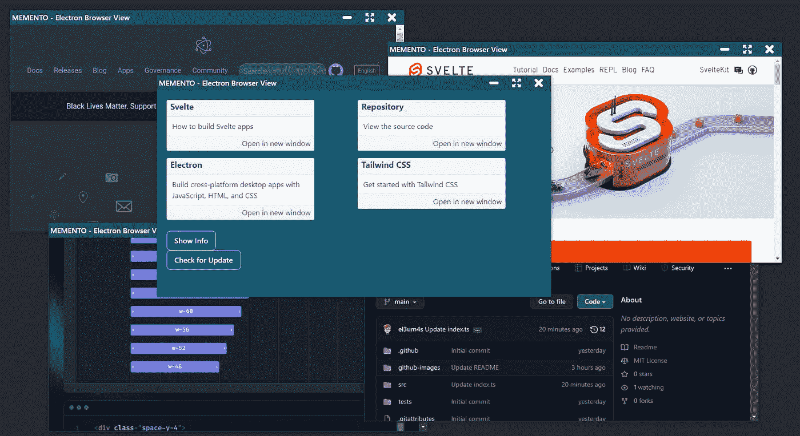
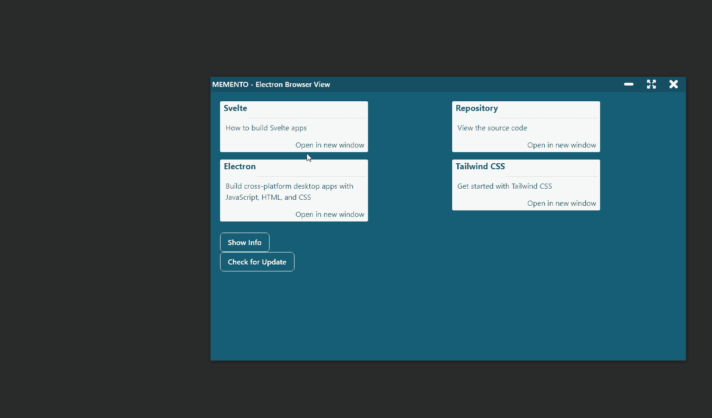
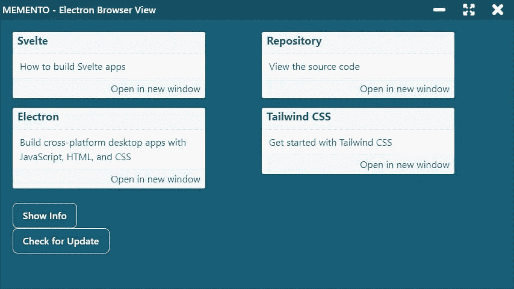
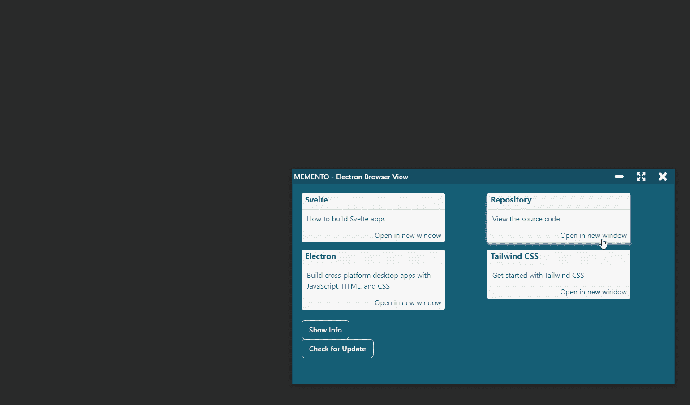

# 如何使用浏览器查看电子版

> 原文：<https://betterprogramming.pub/how-to-use-browserview-with-electron-9998fa834b44>

## 了解如何管理多个窗口



在我的[大仪表板](https://javascript.plainenglish.io/the-journey-of-a-novice-programmer-82366ec7851a)项目中，我面临的一个问题是用电子方式管理几个窗口。这是一个比我想象的更复杂的问题，它促使我研究这个问题。经过一些测试后，我放弃了 iframe 和 webview。相反，我把重点放在如何使用[浏览器查看](https://www.electronjs.org/docs/latest/api/browser-view)与电子版。

目标？得到类似这样的东西:能够将外部页面加载到 Electron 中，同时保持对[浏览器窗口](https://www.electronjs.org/docs/latest/api/browser-window)的控制。



因为这篇文章是关于一个非常具体的主题，我不会涵盖建立一个新的电子项目的所有步骤。为了简单起见，我使用了[el3um 4s/memento-svelte-electronic-typescript](https://github.com/el3um4s/memento-svelte-electron-typescript)模板，但这不是强制性的。

相反，在开始之前，重要的是理解一件事:如何使用 ipcMain 和 ipcRenderer 使各种窗口与 electronic 通信。网上有一些有趣的指南。在本教程中，我从以下内容开始:

[](https://javascript.plainenglish.io/electron-and-typescript-how-to-use-ipcmain-and-ipcrenderer-english-4ebd4addf8e5) [## 电子和打字稿:如何使用 ipcMain 和 ipcRenderer

### 在玩电子、打字稿和电子的时候，我遇到了一些问题。在我的模板的第一个版本中(…

javascript.plainenglish.io](https://javascript.plainenglish.io/electron-and-typescript-how-to-use-ipcmain-and-ipcrenderer-english-4ebd4addf8e5) 

# 但是首先:为什么要使用浏览器视图？

必须回答这个问题:为什么使用浏览器视图而不是更简单的 [webview 标签](https://www.electronjs.org/docs/latest/api/webview-tag)？

第一个原因是 Electron 自己的文档建议这样做。网络视图现已停止。引用 [developer.chrome](https://developer.chrome.com/docs/extensions/reference/webviewTag/) 的话:

```
chrome.webviewTag: This API is part of the deprecated Chrome Apps platform. Learn more about migrating your app.
```

因此，最好转向其他海岸。一个有趣的解决方案是使用`iframes`。不幸的是，它制造的问题比解决的问题还多。也许将来我会做更深入的测试。

好在问题早就被比我聪明的人解决了。我推荐阅读这两个故事，它们很有启发性:

*   [Slack 工程——成长的烦恼:将 Slack 的桌面应用迁移到 BrowserView](https://slack.engineering/growing-pains-migrating-slacks-desktop-app-to-browserview/)
*   [Figma-推出电子浏览器视图](https://www.figma.com/blog/introducing-browserview-for-electron/)

总结我需要的，并且我相信浏览器视图能够给我的，是一种方法:

*   查看电子外部的页面
*   将这些页面集成到应用程序中
*   从外部页面使用 ipcMain-ipcRenderer 系统

也就是说，按照代码去做！

# 界面



我首先需要的是一个按钮。出于美学原因，我创造了一个`Card.svelte`组件:

重要的部分是调用`click`的功能:

我从渲染器发送`openInNewWindow`命令，其中包含了我感兴趣的细节(要打开的页面的`link`)。但是我必须创建一个特殊的 API。

# 添加窗口管理器应用编程接口

我创造了`src\electron\IPC\windowManager.ts`。首先，我导入我的 API 的核心库:

然后，我定义了用来调用它的名称:

然后，我定义了输出中的开放通道，用于从窗口发送命令的通道

然后是进入的通道，可以用来向窗口发送响应的通道。为简单起见，在此示例中，我将列表留空:

最后，我初始化应用编程接口并将其导出:

# 定义要执行的命令

显然，这还不够。我需要实际定义要运行的命令。为此，我创建了`openInNewWindow()`功能:

这样，如果我从主窗口中单击一个按钮，我就可以创建一个新窗口。

我必须指出一件事。我导入了模块`src\electron\globals.ts`以便于传递起始页的 url:

这样，我可以从任何模块调用主页。

但我还没说完。我最好给新窗户一些“特殊的力量”。至少能够使用标题栏按钮:

剩下的就是向新窗口添加浏览器视图。我称之为`addBrowserView`和`setIpcMainView`方法:

# 创建电子浏览器视图

现在我必须定义这些方法。为此，我更改了`CustomWindow`类(`src\electron\customWindow.ts`)。

首先增加`browserView`属性:

创建和添加电子版浏览器视图的一般过程如下:

从这开始，我给我的类添加了一个方法:

我已经将位置设置为`x = 1`和`y = 32`，因为我想在主窗口中为标题栏留出空间。

有一个小细节需要解决:



如果我改变窗口的大小，浏览器视图的大小不会改变。尺寸不是我想要的。

首先，我在启动时使用 [BrowserWindow.getSize()](https://www.electronjs.org/docs/latest/api/browser-window#wingetsize) 确保大小是正确的

然后我用[browser view . setautoresize(options)](https://www.electronjs.org/docs/latest/api/browser-view)在 BrowserWindow 改变时自动改变大小:


要完成所有工作，我必须允许 BrowserView 访问 API:

# 注册窗口管理器 API

定义 WindowManager API 是不够的，我还需要在`src\electron\preload.ts`中启用它:

最后，我只允许主窗口创建新窗口。为此，我编辑了`src\electron\index.ts`:

完成所有这些步骤后，我可以使用一行简单的代码打开一个嵌入了 BrowserView 的新窗口:

像往常一样，项目代码可以在 GitHub 上免费获得

[](https://github.com/el3um4s/memento-electron-browser-view) [## GitHub-el3um 4s/memento-电子-浏览器-查看

### 展示如何在电子版中使用浏览器视图的模板。基于(纪念-苗条-电子打字稿)[…

github.com](https://github.com/el3um4s/memento-electron-browser-view) 

感谢阅读！敬请关注更多内容。

***不要错过我的下一篇文章—报名参加我的*** [***中邮箱列表***](https://medium.com/subscribe/@el3um4s)

[](https://el3um4s.medium.com/membership) [## 通过我的推荐链接加入 Medium—Samuele

### 阅读萨缪尔的每一个故事(以及媒体上成千上万的其他作家)。不是中等会员？在这里加入一块…

el3um4s.medium.com](https://el3um4s.medium.com/membership) 

*原载于*[*https://blog.stranianelli.com*](https://blog.stranianelli.com/how-to-use-browser-view-with-electron/)