# 如何使用 Chrome DevTools 调试单元测试用例

> 原文：<https://betterprogramming.pub/how-to-use-chrome-devtools-to-debug-unit-test-cases-db20ffabb33f>

## 使用 Chrome DevTools 进行更好的调试


[Robynne Hu](https://unsplash.com/@robynnexy?utm_source=unsplash&utm_medium=referral&utm_content=creditCopyText) 在 [Unsplash](https://unsplash.com/s/photos/future?utm_source=unsplash&utm_medium=referral&utm_content=creditCopyText) 上拍摄的照片

你如何调试单元测试用例？有两种流行的方法:

*   [使用 Visual Studio 代码(俗称 VS 代码)的内置功能](https://medium.com/better-programming/how-to-use-vs-code-to-debug-unit-test-cases-6aebfd7021bd)
*   使用 Chrome dev tools 内置调试器

在本文中，我们将介绍第二种方法:使用 Chrome DevTools 来调试单元测试用例。

什么是 [Node.js](https://nodejs.dev/) ？这是一个开源的跨平台 JavaScript 运行时环境。它可以互换地称为 nodejs、NodeJS 或 node。它是 Web 开发的流行工具。Node.js 在浏览器之外运行 V8 JavaScript 引擎，这是谷歌 Chrome 的核心。这允许我们使用 Node.js 和 Chrome DevTools 来调试单元测试用例。

# 调试最初的 Create React App 单元测试用例

让我们以脸书著名的 [Create React App](https://github.com/facebook/create-react-app) 为例。代码库中有一个单元测试文件`src/App.test.js`:

正如我们在[使用 Visual Studio 代码调试单元测试用例](https://medium.com/better-programming/how-to-use-vs-code-to-debug-unit-test-cases-6aebfd7021bd)中所描述的，你可以运行这个命令:`npm run test`。

```
**PASS ** src/**App.test.js** ✓ renders without crashing (3ms)
**Test Suites: 1 passed**, 1 total
**Tests:       1 passed**, 1 total
**Snapshots:** 0 total
**Time:**        0.056s, estimated 1s
Ran all test suites related to changed files.
```

所有测试都通过了。

然而，我们希望有一种方法来调试单元测试用例。第二种方法是使用 Chrome DevTools 调试器。

给`package.json`增加了一个`test:debug`的剧本:

```
"scripts": {
  "start": "react-scripts start",
  "build": "react-scripts build",
  "test": "react-scripts test",
  **"test:debug": "react-scripts --inspect-brk test --runInBand --no-cache --watchAll=false",**
  "eject": "react-scripts eject"
}
```

与`"test"`脚本相比，`"test:debug"`脚本有额外的选项。

*   `--inspect-brk`:开启 inspector 代理的 [Node.js](https://nodejs.dev/) 选项，监听默认地址和端口(127.0.0.1:9229，可以通过【host:port】配置)。与`--inspect`相比，`--inspect-brk`在用户代码开始前增加了一个断点。
*   `—-runInBand`:别名`-i`。这是一个 Jest 选项，用于在当前流程中连续运行所有测试，而不是创建运行测试的子流程的工作池。这是用于调试环境的。
*   `--no-cache`:禁用缓存。这是一个禁用缓存的 Jest 选项。平均来说，禁用缓存会使 Jest 至少慢两倍。
*   `--watchAll=false`:这是一个笑话，不运行一个监视文件来监视变化，而在某些事情发生变化时重新运行所有测试。

运行此命令将为单元测试用例启动一个节点流程:

```
**$** npm run test:debug> react-app@0.1.0 test:debug /Users/fuje/codeTemp/react-app
> react-scripts --inspect-brk test --runInBand --no-cache --watchAll=falseDebugger listening on ws://127.0.0.1:9229/d50dfe5e-d0b2-4032-a6d6-bf9dedf8fd85For help, see: https://nodejs.org/en/docs/inspector
```

在基于 Chromium 的浏览器中打开`chrome://inspect`(Edge 中的`edge://inspect`):

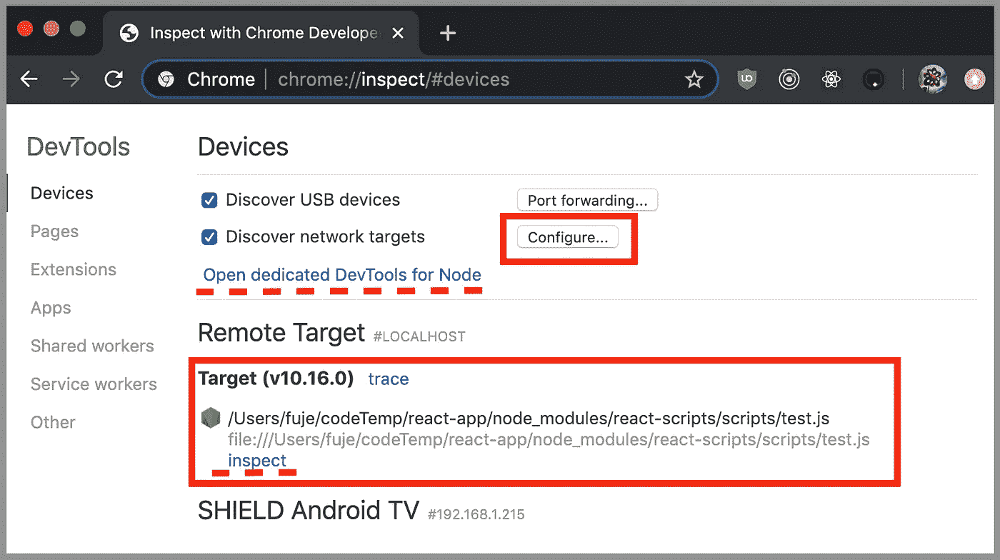

单击标有红色小框的配置按钮。这将显示目标发现设置。确保配置了默认地址和端口(`127.0.0.1:9229`)或指定的【主机:端口】。这里的本地主机是`127.0.0.1`。

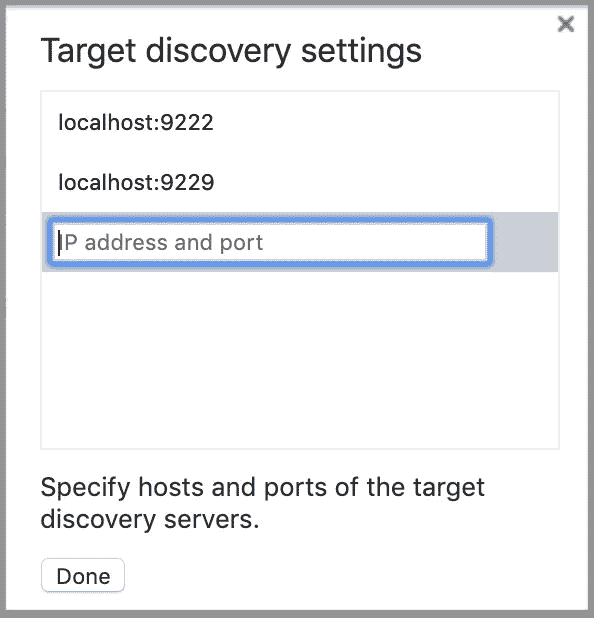

`npm run test:debug`运行时，较大的红色方框显示目标。您可以点击红色虚线上方的`inspect`链接。或者您可以点击红色虚线上方的`Open dedicated DevTools for Node`链接。它弹出调试窗口，在第一行代码处中断。

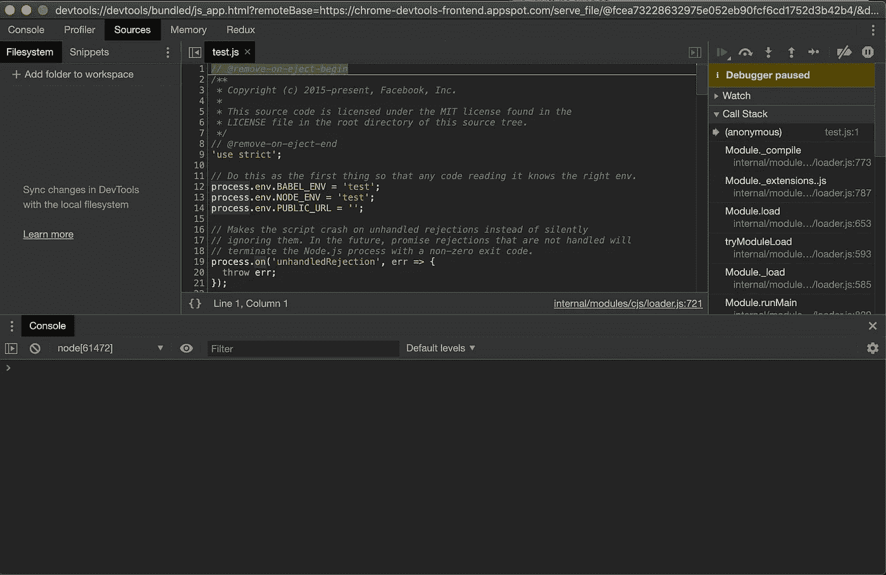

点击继续调试按钮，单元测试成功完成:

```
**$** npm run test:debug> react-app@0.1.0 test:debug /Users/fuje/codeTemp/react-app
> react-scripts --inspect-brk test --runInBand --no-cache --watchAll=falseDebugger listening on ws://127.0.0.1:9229/d50dfe5e-d0b2-4032-a6d6-bf9dedf8fd85
For help, see: [https://nodejs.org/en/docs/inspector](https://nodejs.org/en/docs/inspector)
Debugger attached.
**PASS ** src/**App.test.js** ✓ renders without crashing (19ms)
**Test Suites: 1 passed**, 1 total
**Tests:       1 passed**, 1 total
**Snapshots:** 0 total
**Time:**        4.711s
Ran all test suites.Waiting for the debugger to disconnect...
```

但是怎么调试呢？

事实证明，我们必须在测试用例中添加调试器语句来启用断点。

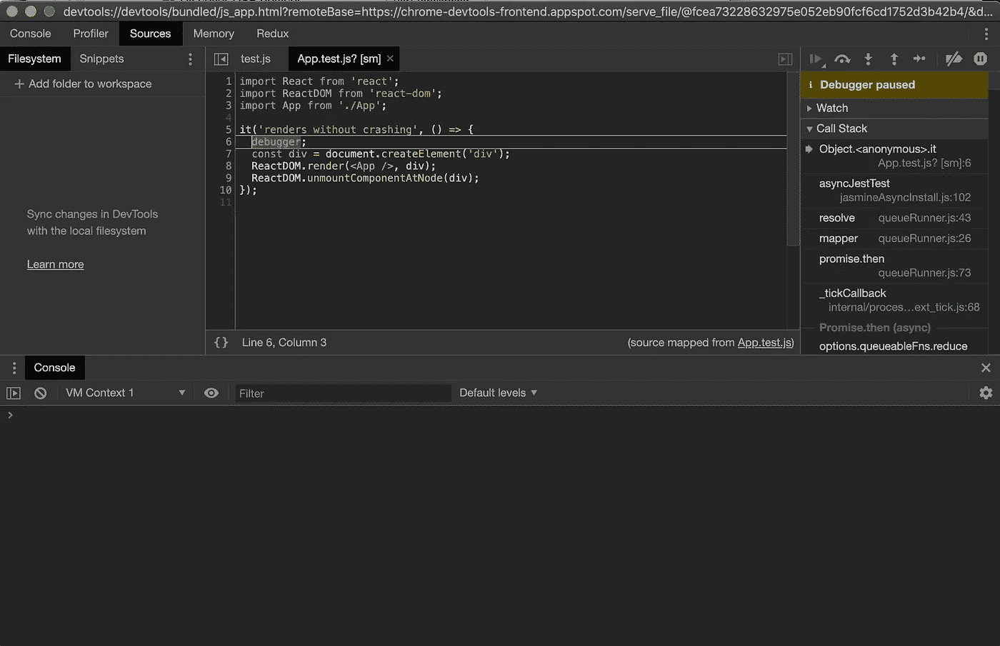

完成后，记得关闭调试器。

这是关于如何使用 Chrome DevTools 调试单元测试用例的完整解决方案。

## 奖励步骤

这种方法似乎需要很多手动步骤。我们如何使这个过程自动化？

`[nodevtools](https://github.com/rcoedo/chrome-nodevtools)`是帮手。这是一个小的 AppleScript 脚本，用于从命令行界面打开 Chrome DevTools for node。由于`nodevtools`是一个 AppleScript 脚本，它只适用于 Mac OS X 或 OS X。此外，这个选项需要启用。

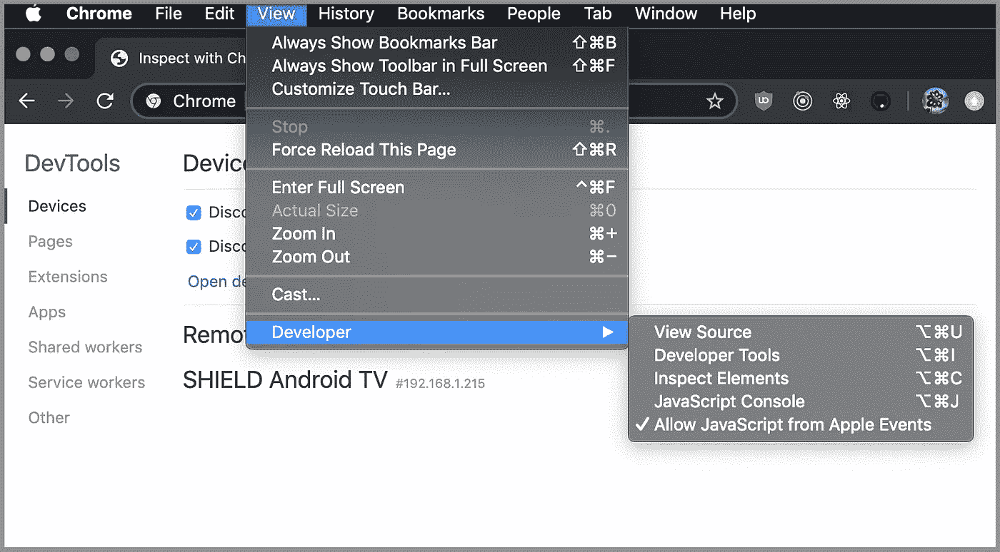

安装`[nodevtools](https://github.com/rcoedo/chrome-nodevtools)`的步骤如下:

```
brew tap rcoedo/tap
brew install nodevtools
```

启用 AppleScript 和安装`[nodevtools](https://github.com/rcoedo/chrome-nodevtools)`是一次性任务。下面是最后的`package.json`:

第 14 行是使用 Chrome DevTools 调试单元测试用例的必选项。

第 15 行`—` 16 和第 34 行`—` 36 是奖励步骤的实现。我们使用`[npm-run-all](https://www.npmjs.com/package/npm-run-all)`来并行运行多个 NPM 脚本。

有了这些，你就可以通过输入`npm run test:debugAll`来启动一切。

# 调试重新连接的 Create React App 单元测试用例

对于使用重新连接的 Create React 应用程序的项目(参见[关于 Create React 应用程序的有趣事实# 5](https://medium.com/better-programming/10-fun-facts-about-create-react-app-eb7124aa3785))，我们遵循相同的步骤并使用以下`package.json`:

第 18 行是使用 Chrome DevTools 调试单元测试用例的必选项。这里可执行的是`react-app-rewired`。可以通过输入`npm run test:debug`来调用。

第 19 行`—` 20 和第 38 行`—` 40 是奖励步骤的实现。下面是`npm run test:debugAll`的截图。

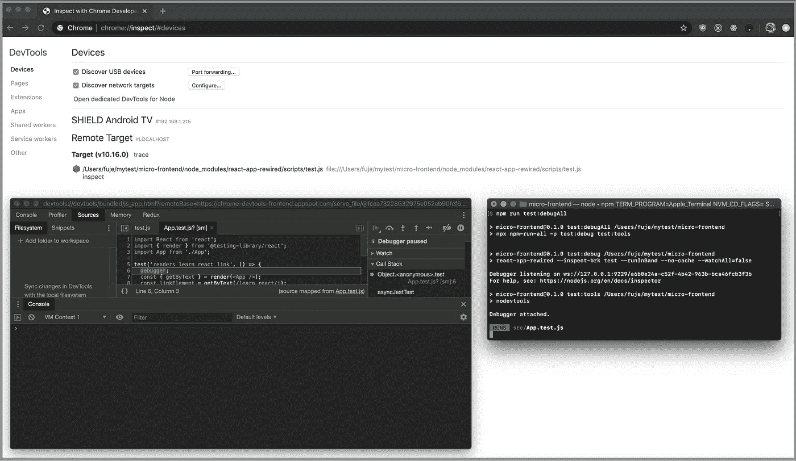

# 调试弹出的 Create React App 单元测试用例

我们使用弹出的 Create React 应用程序作为例子。这展示了如何调试常规的 JavaScript 单元测试用例。遵循相同的步骤。下面是`package.json`:

第 68 行是使用 Chrome DevTools 调试单元测试用例的必选项。这里可执行文件是`node`，它调用`jest`。可以通过键入`npm run test:debug`来调用它。

第 69 行`—` 70 和第 142 行`—` 144 是奖励步骤的实现。下面是`npm run test:debugAll`的截图:

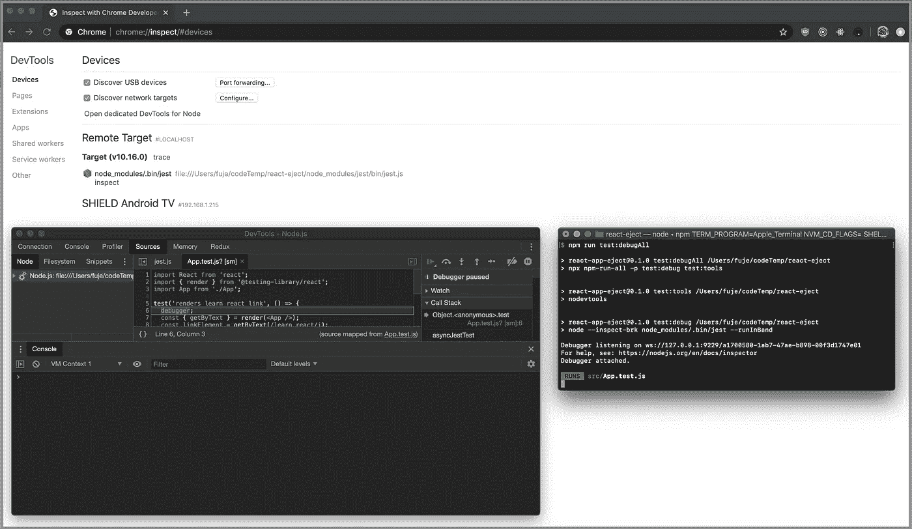

# 单元测试用例的调试选项

类似于使用 VS 代码调试单元测试用例，我们可以为 Jest 设置更多选项。让我们看看弹出的 Create React 应用程序代码库中修改后的 App.test.js 的几个例子:

默认情况下，`npm run test:debugAll`运行所有的测试用例:

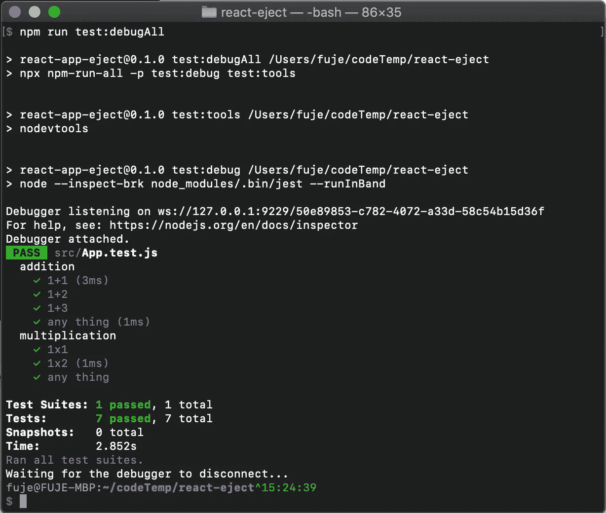

我们可以使用选项`"--testNamePattern=<regex>"`来匹配单元测试名称。别名:`-t <regex>`。它只运行名称与正则表达式匹配的测试。

`"-t <regex>"`可以用来开始命名测试用例。

通过不改变`package.json`，我们可以将命令行参数传递给 npm 脚本:`npm run test:debug —- -t 1\\+1`。

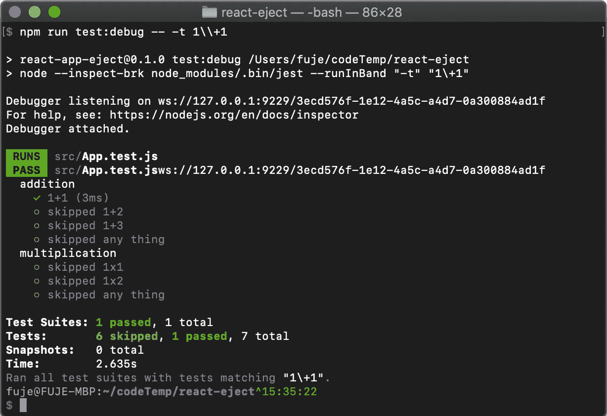

然而，`test:debugAll`不能使用命令行参数，因为`npm-run-all`不能将命令行参数传递给每个脚本。

我们必须对`package.json`做出改变:

```
“scripts”: {
  "test:debug": "node --inspect-brk node_modules/.bin/jest --runInBand '-t 1\\+1'"
}
```

`npm run test:debug`作品:

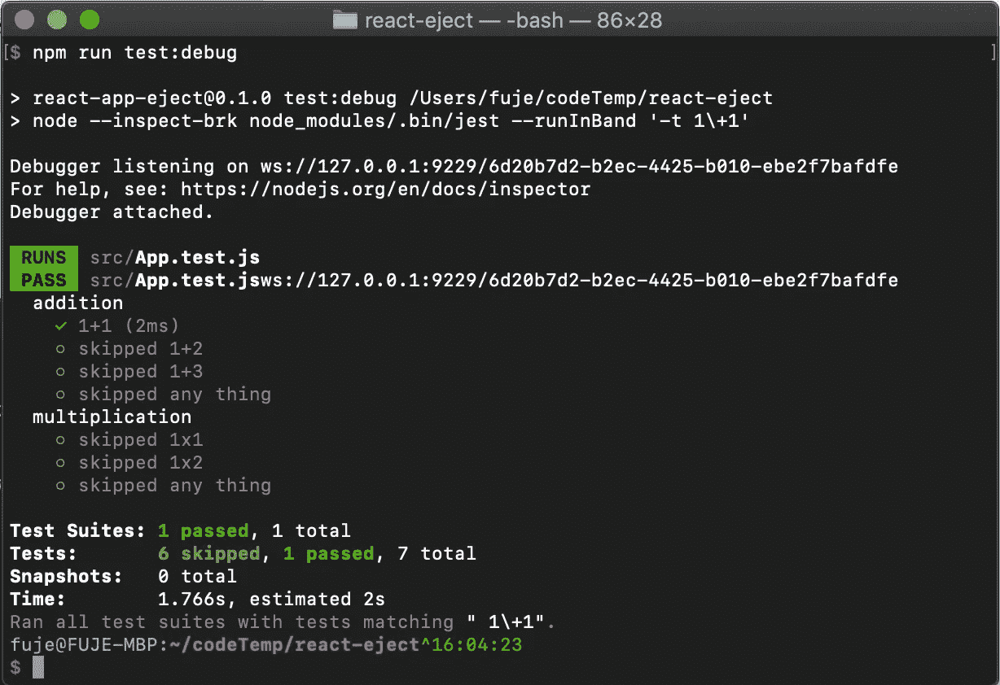

`npm run test:debugAll`作品也一样:

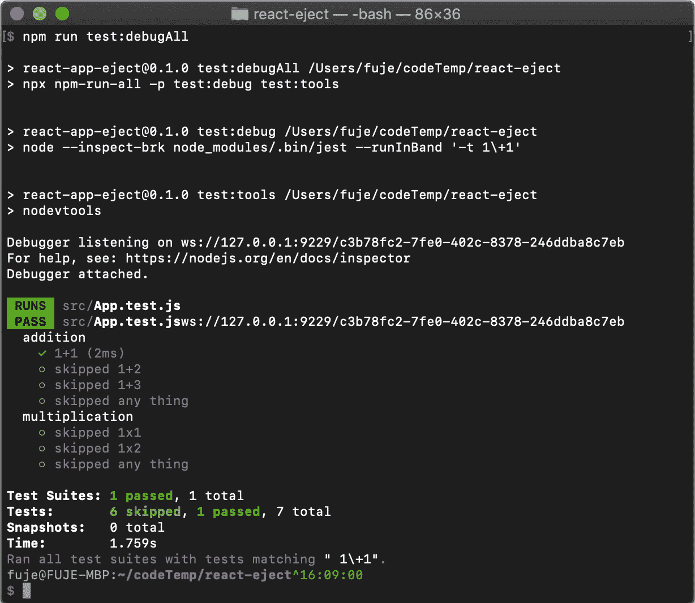

同样，文件名也可以匹配:

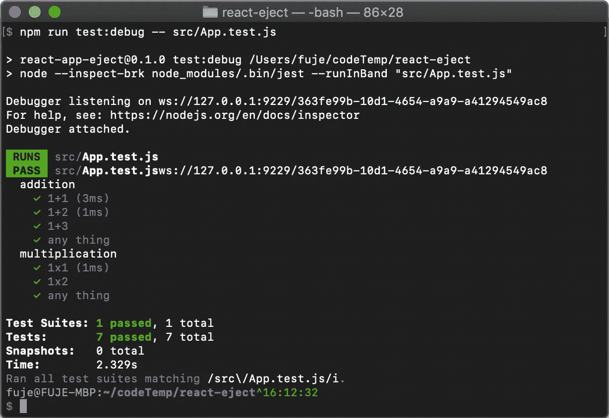

目录名也可以匹配:

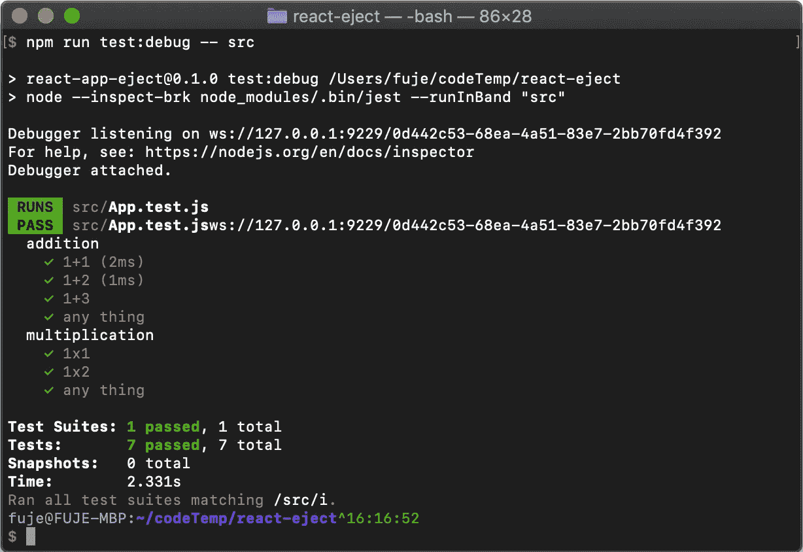

是不是很酷？

如果您想尝试更高级的 Jest 选项，请访问[Jest 官方网站](https://jestjs.io/docs/en/cli.html)了解更多详情。

# 警告

一般来说，Chrome DevTools 调试器运行良好。`npm run test:debug`比`npm run test:debugAll`更稳定。偶尔，Ctrl-C 一个正在进行的进程或忘记关闭一个已完成的调试器可能会导致一些问题。但是我们可以解决这些小问题:

*   如果`chrome://inspect`未启动，在新的标签页/窗口中启动`chrome://inspect`。
*   如果`chrome://inspect`在没有调试器窗口的情况下启动，单击两个链接之一进行检查。
*   可能会有剩余的调试器窗口。只需关闭它们。
*   可能有多个检查选项卡。简单地关闭它们(对于额外步骤)。
*   最后，重启运行`npm run test:debugAll`的终端(作为奖励步骤)。

感谢阅读。我希望这有所帮助。如果你有任何问题，请随时回复。你可以在这里看到我的其他媒体出版物。