# 如何使用 Chrome DevTools 提高性能

> 原文：<https://betterprogramming.pub/how-to-use-chrome-devtools-to-improve-performance-1709cb55d7d3>

## 速度是你最重要的特征


马修·施瓦茨在 [Unsplash](https://unsplash.com?utm_source=medium&utm_medium=referral) 上的照片。

在构建现代 web 应用程序时，网站性能应该始终是一个高度关注的问题。如今，拥有一个表现良好的网站是人们的期望。如果访问者不得不等待，他们会在几秒钟内放弃你的网站。

[根据谷歌](https://www.thinkwithgoogle.com/marketing-resources/experience-design/mobile-site-speed-importance/)所做的研究，“移动加载时间延迟一秒钟会影响高达 20%的转化率。”谷歌的更多研究表明“53%的移动用户放弃了加载时间超过三秒的网站。”

显然，监控和调整网站性能对底线有直接影响。

但是，我们该怎么做呢？我们从哪里开始？

# 入门指南

Chrome DevTools 为现代开发者提供了奇妙的特性。性能测试工具只是箭筒中的另一支箭。

始终在隐姓埋名模式下进行性能测试。隐姓埋名模式可以防止你安装的任何 Chrome 扩展干扰测试。

一旦你打开了一个隐藏窗口，在 Mac 上使用 Command + Option + J 或者在 Windows 上使用 Control + Option + J 打开 DevTools。

# 知道你从哪里开始

如果我们不知道从哪里开始，就很难知道我们是否取得了进展。因此，我们需要做的第一件事是执行审计，为我们提供一个基准。

注意:对于这篇文章，我将使用一个用 React 构建的应用程序，我稍微修改了一下，以降低它的性能。

它看起来是这样的:


正在运行的应用程序！

它允许用户跟踪他们想读、正在读或已经读过的书。

打开 DevTools，打开 Audits 选项卡。如果您没有看到它，请按 Command+Shift+P(Windows 上的 Control + Shift + P)打开命令菜单并输入 Audits。从列表中选择它。

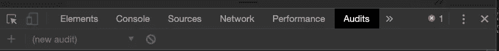

已选择审计选项卡。

当您打开“审计”选项卡时，您将看到以下选项:


审计选项。

我选择在移动设备上进行测试，因为这是世界上大多数人访问互联网的方式。我还选择了这是一个性能审计，并添加了一些限制。我选择了“清除存储”复选框来模拟第一次访问网站的新用户。

选中这些选项后，我点击“Run audits ”, dev tools 开始运行。

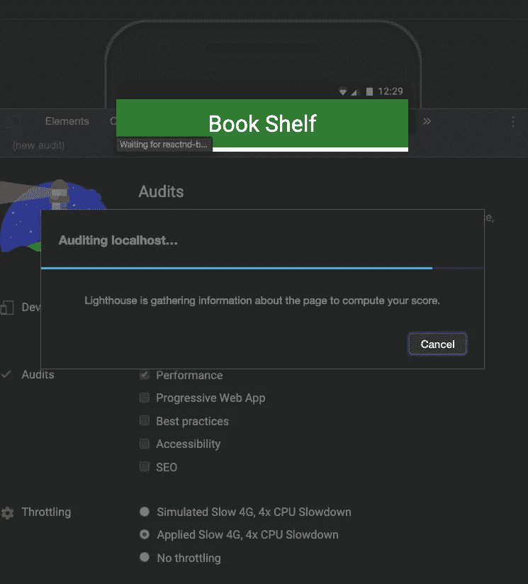

运行我的审计。

完成后，我会收到一份报告，显示我的总分(满分为 100 分):

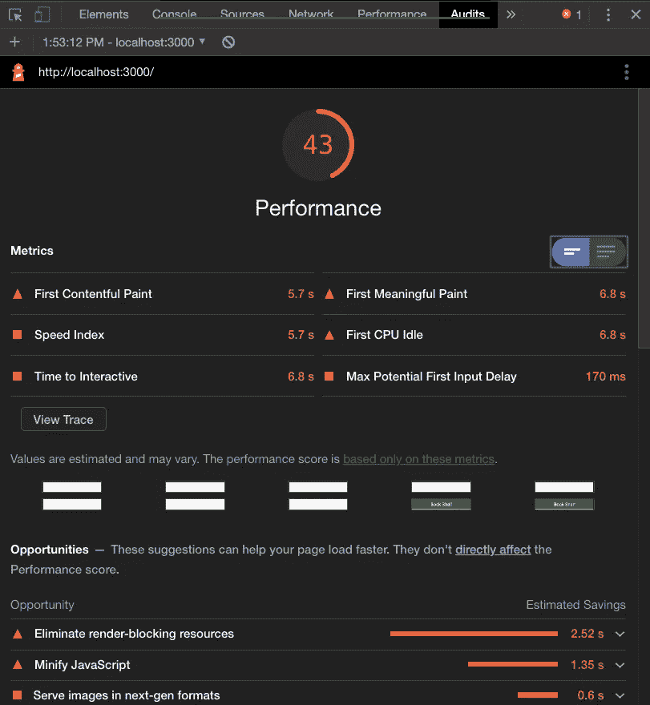

Booo！A 43 臭死了！

好的，从结果来看，很明显我可以提高我的网站性能。点击“机会”部分下的“消除渲染阻塞资源”会显示一些有趣的信息。

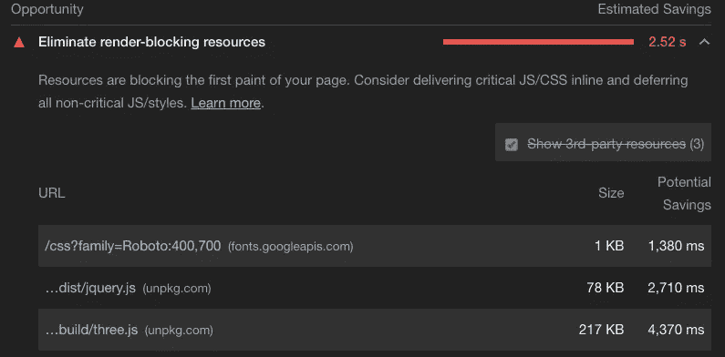

潜在的问题。

看这个列表，我看到`jquery.js`和`three.js`都在里面。嗯…看起来好像我没有使用脚本的缩小版本。让我们继续在`index.html`做那个改变。


改为使用缩小版。

什么地方发生了变化，让我们继续并重新运行审计，看看我们是否取得了任何进展。

当努力提高你的性能时，一次只对你的站点做一个修改。然后重新运行审计。如果你做了不止一个改变，你将无法判断哪个改变产生了影响。

这是更改后的输出:

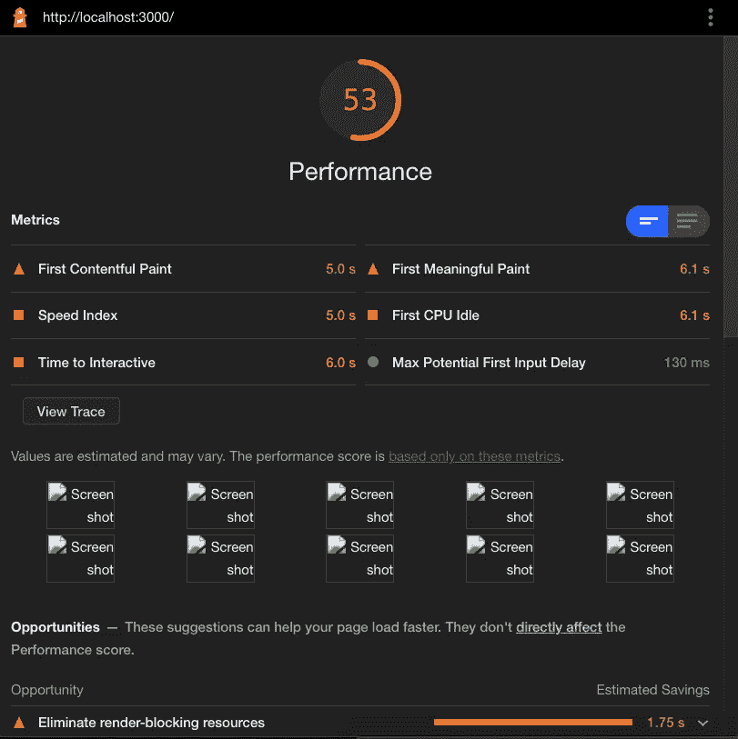

进步…但还是垃圾。

还不错。十分的进步，但是我们可以做得更好。

仔细想想，我根本不确定我们在网站上使用的是`jQuery`还是`three.js`。如果能知道这些脚本是否在某个地方被使用，那就太好了。

嘿，你知道什么！DevTools 也可以做到这一点！

为此，我们将使用 Coverage 选项卡。你可以在下图中看到我是如何在我的机器上访问它的。也可以在 Mac 上使用 Command + Shift + P(在 Windows 上使用 Control + Shift + P)。这将打开命令面板。然后开始输入“显示覆盖范围”并从列表中选择它。

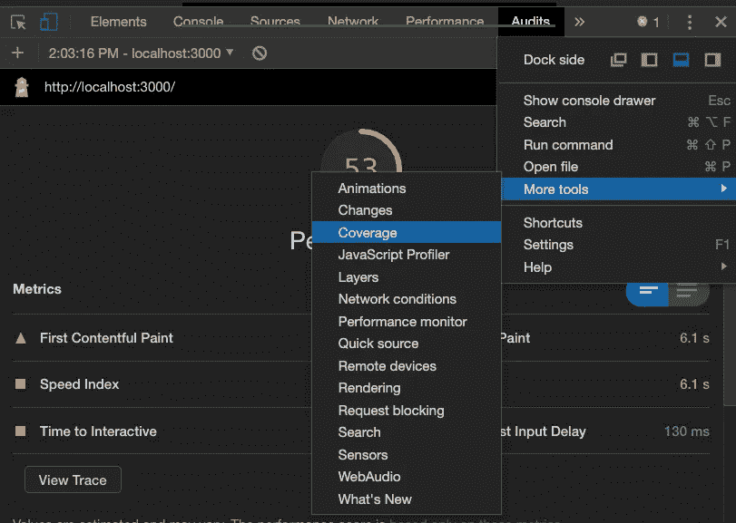

该做些报道了！

“覆盖范围”选项卡显示以下内容:

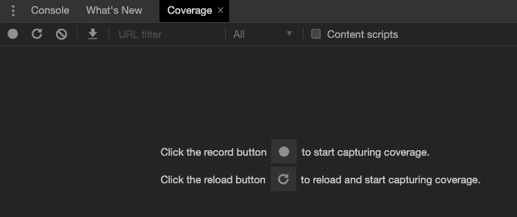

覆盖范围选项卡。

看起来我们需要点击 reload 按钮来获取覆盖率，所以这就是我要做的。它给我以下输出:

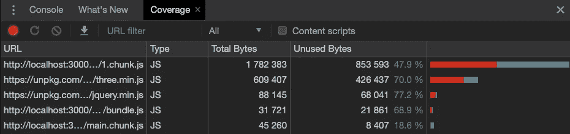

覆盖率结果。

在这里，我可以看到大部分的`three.js`和`jQuery`根本没有被使用。事实上，我发现这些信息非常有用。它报告未使用字节的准确数量。相当酷。

知道这些库没有被使用，我将把它们从`index.html`页面中完全删除。之后，我重新运行审计。

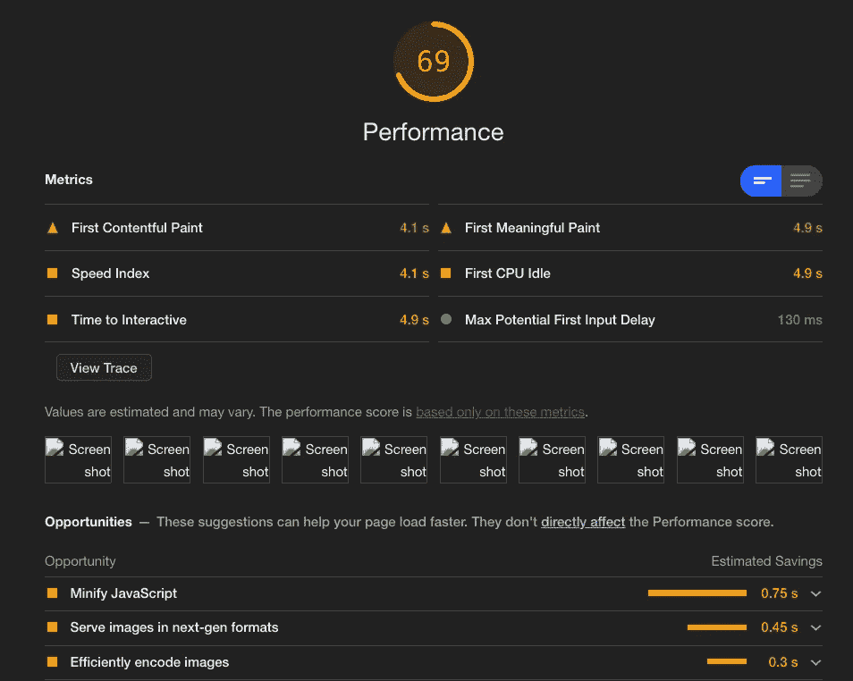

甚至更好！

在那次改变之后，我们在 69！黑仔！但是我们还可以做得更好！

现在回顾机会部分，我看到“缩小 JavaScript”

Doh。我想我正在运行一个网站的开发版本。

[React Chrome 开发者工具](https://chrome.google.com/webstore/detail/react-developer-tools/fmkadmapgofadopljbjfkapdkoienihi)提供的小红符号验证了这一点。

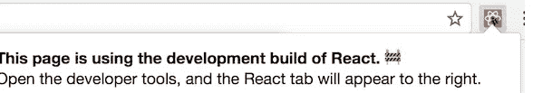

嗯…对不起，我把开发代码投入生产。

如果我有一个生产版本，React 符号后面的背景将是黑色的。

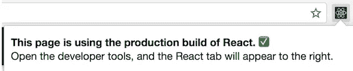

王牌！

有了这些知识，我关掉 web 服务器，跳到命令行，运行:

```
npm run build
```

完成后，我输入:

```
> yarn global add serve
> serve -s build
```

现在，如果我再次浏览该网站并重新运行我的审计，我会得到(请击鼓):

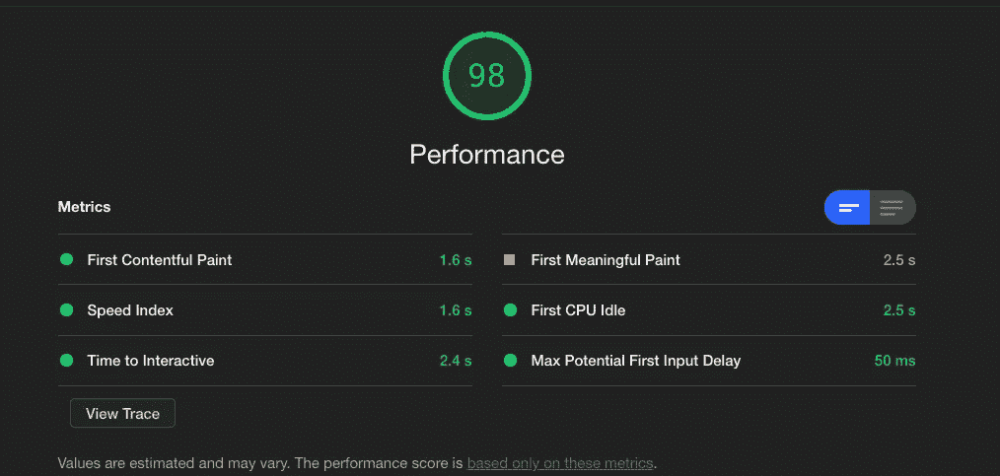

我能加薪吗？

Chrome DevTools 充满了很棒的特性，会让你看起来像一个拥有疯狂绝地技能的开发者。


Stephanie Klepacki 在 [Unsplash](https://unsplash.com?utm_source=medium&utm_medium=referral) 上的照片。

# 关键要点

1.  网站性能对于良好的用户体验至关重要，也是互联网用户所期待的。
2.  互联网用户会因为糟糕的表现而离开你的网站。
3.  Chrome DevTools 允许你测试你的站点的性能，并进行增量修改，这样你就可以确信你没有造成伤害。
4.  总是在匿名模式下运行您的性能测试。
5.  运行一个初始测试来获得一个基准。
6.  一次只做一个改变，然后重新测试看看你的立场。
7.  始终确保您正在使用代码的生产版本。

# 结论

一如既往，感谢阅读。如果你觉得这篇文章有帮助，请查看[我在媒体](https://medium.com/@aritzcovan)上写的其他文章。

[](https://medium.com/@aritzcovan) [## 亚历克斯·里茨科万-中等

### 阅读 Alex Ritzcovan 在媒体上的文章。高级软件顾问、作家、丈夫和父亲。我喜欢编码…

medium.com](https://medium.com/@aritzcovan)