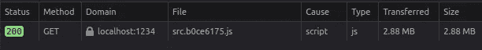
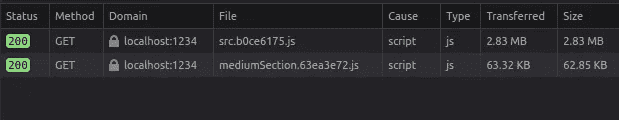

# 如何在 React 和 Parcel 中使用代码分割

> 原文：<https://betterprogramming.pub/how-to-use-code-splitting-with-react-and-parcel-e8bb37be4160>

## 什么是代码分割，我们为什么要使用它？


照片由 [amoon ra](https://unsplash.com/@amoonra?utm_source=unsplash&utm_medium=referral&utm_content=creditCopyText) 在 [Unsplash](https://unsplash.com/s/photos/half?utm_source=unsplash&utm_medium=referral&utm_content=creditCopyText) 上拍摄

代码分割是将捆绑提升到下一个级别的过程。当您有一个小项目时，捆绑是很好的，但是随着项目的增长，您的捆绑也会增长。最终，您的包会变得非常大，以至于您的包加载速度很慢，这就违背了捆绑的全部目的。通过代码分割，仅当用户需要时才创建和加载多个包，这意味着我们可以通过不加载我们不需要的资源来大大减少加载时间。

# 在活动

## 没有代码分割



在上面的例子中，我们加载了一个 2.88MB 的资源，在下面的例子中，我们加载了两个资源，一个 2.83MB 的初始父包。然后当用户访问另一个页面时，他们请求一个 63KB 的子包。虽然这看起来不多；这些数字来自一个非常小的应用程序，由一些图片组成，我创建它是为了演示本文的捆绑。您可以想象，通过使用代码分割，您实际上可以减少一个更大项目的初始包大小，从而减少初始加载时间。

## 使用代码分割



# 如何对包裹使用代码分割

[包裹](https://parceljs.org/)一如既往的坚持其炒作背后的大特色，零配置。这意味着我们不必创建一个配置文件来实际使用这个特性。Parcel 只知道如何处理它那端的一切，所以我们所要做的就是使用动态的`import()`函数语法。

对于没有呈现组件的代码，简单的方法是使用动态导入，如下所示。

定义逻辑:

```
//math.jsexport default function add(a, b) {return a + b;}
```

在其他地方使用逻辑:

```
//frontpage.jsimport("./math").then(math => {
  console.log(math.add(1, 2));
});
```

但是如果我们有一个组件要呈现，我们需要首先定义我们的子组件:

然后，为了在我们应用程序的其他地方使用这个组件，我们需要通过这样做在一个`suspense`组件中使用`React.lazy`:

我们需要这样做，因为`React.lazy`允许我们将动态导入作为常规组件呈现，而`suspense`组件允许在加载组件时呈现回退。

# 使用路由进行代码拆分

在 SPA 中，你很可能不需要代码分割，但是在一个有多个页面的应用中，我们可能会遇到前面提到的包减速。基于路由的代码分割是有用的，因为加载代码束需要时间，并且用户在切换页面时会期望一些时间来加载。此外，我们不会期望用户在重新呈现整个页面时使用元素，所以他们在与元素交互时不会注意到速度变慢。

为了根据路线进行代码分割，我们将路线包装在一个`suspense`组件中，如下所示:

# React 的缺点。懒惰和悬念

使用`React.lazy`进行代码分割的一个缺点是它目前只支持默认导出。如果您想要导入命名导出，您需要创建一个中间模块，将它作为缺省值重新导出。另外，`React.lazy`和`suspense`不支持服务器端渲染。要在服务器端渲染的同时对 React 应用进行代码拆分，目前推荐使用`[@loadable/component](https://loadable-components.com/docs/getting-started/)`。

# 结论

在我看来，代码分割是另一个很棒的工具，是简单捆绑的逻辑升级。希望这篇文章对你有所帮助。

如果您有任何问题、建议或其他任何事情，请随时发表评论！