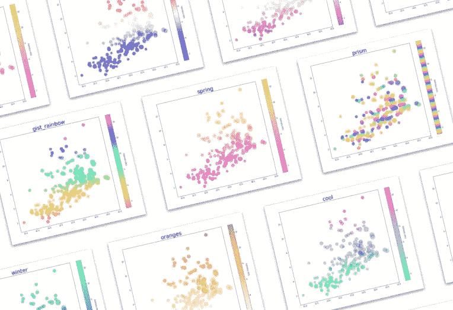
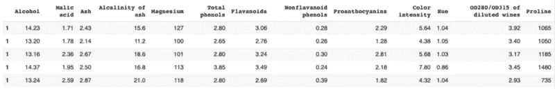
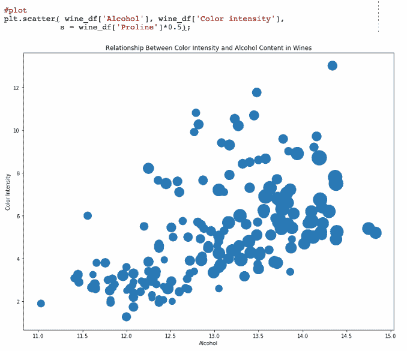
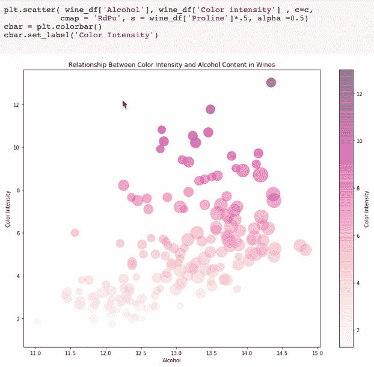
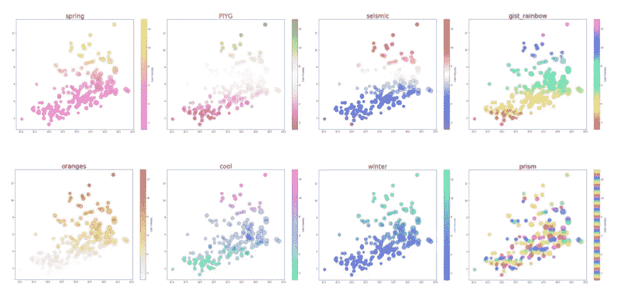

# 如何在 Python 中使用 Matplotlib 和 Colormaps 创建彩色绘图

> 原文：<https://betterprogramming.pub/how-to-use-colormaps-with-matplotlib-to-create-colorful-plots-in-python-969b5a892f0c>

## 使用 matplotlib 色彩映射表将您的图表转换成视觉上更吸引人且更易访问的东西



# **概述**

数据科学家是视觉故事讲述者，为了让这些故事栩栩如生，颜色在实现这一目标的过程中扮演着重要角色。使用流行的 Python 库 [matplotlib](https://pandas.pydata.org/) 可以很容易地可视化数据。Matplotlib 是一个 2D 可视化工具，允许创建散点图，条形图，直方图，等等。Matplotlib 与 [pandas](https://pandas.pydata.org/) 配合得非常好，后者是 Python 中另一个用于数据分析的流行库。Pandas 对于构建数据非常有用，然后用 matplotlib 绘制。

一旦您使用这些工具创建了一个地块，您就可以使用预定义的色彩映射表(matplotlib 中内置的 RGBA 色彩集)轻松地为它们添加色彩。您甚至可以创建自己的 matplotlib 色彩映射表！

matplotlib 色彩映射表的一个重要应用是使用它使您的工作对于色觉缺陷的人来说更容易理解。最常见的色觉缺陷是无法区分红色和绿色，因此避免将这些颜色放在一起是一个好主意。

在本文中，我将向您展示如何使用 matplotlib 色彩映射表将您的图表转换成视觉上更吸引人、更易于访问的东西。

# **创建散点图**

首先，导入所需的两个库，pandas 和 matplotlib:

```
import pandas as pd
import matplotlib.pyplot as plt
```

现在，让我们使用任何数据集创建一个数据帧。我将使用来自 [UCI 机器学习库](http://archive.ics.uci.edu/ml/index.php)的[葡萄酒数据集](https://archive.ics.uci.edu/ml/datasets/Wine)来创建将要绘制的数据帧。代码如下:

```
wine_url = 'https://archive.ics.uci.edu/ml/machine-learning-databases/wine/wine.data'

#define column headers
wine_column_headers = ['Alcohol','Malic acid','Ash','Alcalinity of ash', 'Magnesium','Total phenols','Flavanoids','Nonflavanoid phenols','Proanthocyanins','Color intensity','Hue','OD280/OD315 of diluted wines','Proline']
wine_df = pd.read_csv(wine_url, names = wine_column_headers)
```



葡萄酒数据框架

我对酒精含量和颜色强度之间的关系很好奇，所以我选择绘制这些变量。这是默认的散点图，代码如下:


默认散点图

```
#figure
fig, ax1 = plt.subplots()
fig.set_size_inches(13, 10)

#labels
ax1.set_xlabel('Alcohol')
ax1.set_ylabel('Color Intensity')
ax1.set_title('Relationship Between Color Intensity and Alcohol Content in Wines')

#plot
plt.scatter( wine_df['Alcohol'], wine_df['Color intensity'], s = wine_df['Proline']*0.5)
```

现在我们有了默认的绘图，我们可以尝试改变颜色和不透明度，看看是什么样子:



更好，但是让我们用彩色地图试试。

# **色彩映射表的参数:C 和 Cmap**

与色彩映射表的主要区别在于，它需要 *scatter()* 中的参数 *c* 和 *cmap* ，而不是*颜色*。所以要使用 matplotlib 颜色图，我们需要用 *c* 和 *cmap* 替换之前使用的*颜色*参数。在此之前，让我们简要回顾一下这些术语代表什么。

***c* 代表一种颜色、序列或颜色序列**，其可能值为:

*   单色格式字符串。
*   长度为 n 的颜色规格序列。
*   要使用 *cmap* 和*范数*映射到颜色的 n 个数字的标量或序列。
*   行是 RGB 或 RGBA 的 2D 数组。

在这种情况下，我们的 c 将是第三个选项，“使用 *cmap* 和 *norm 映射到颜色的标量或 n 个数字的序列。”*

***cmap* 代表 colormap** ，它是一个 colormap 实例或注册的 colormap 名称( *cmap* 只有在 *c* 是一个 floats 数组时才有效)。

Matplotlib 色彩映射表分为以下几类:连续、发散和定性。您可以在[文档](https://matplotlib.org/examples/color/colormaps_reference.html)中查看所有色彩映射表的配色方案，下面列出了当前可用的色彩映射表名称(它们区分大小写！):

```
**Perceptually Uniform Sequential** ['viridis', 'plasma', 'inferno', 'magma']**Sequential** ['Greys', 'Purples', 'Blues', 'Greens', 'Oranges', 'Reds', 'YlOrBr', 'YlOrRd', 'OrRd', 'PuRd', 'RdPu', 'BuPu', 'GnBu', 'PuBu', 'YlGnBu', 'PuBuGn', 'BuGn', 'YlGn']**Sequential (2)**
['binary', 'gist_yarg', 'gist_gray', 'gray', 'bone', 'pink', 'spring', 'summer', 'autumn', 'winter', 'cool', 'Wistia', 'hot', 'afmhot', 'gist_heat', 'copper']**Diverging**
['PiYG', 'PRGn', 'BrBG', 'PuOr', 'RdGy', 'RdBu', 'RdYlBu', 'RdYlGn', 'Spectral', 'coolwarm', 'bwr', 'seismic']**Qualitative**
['Pastel1', 'Pastel2', 'Paired', 'Accent', 'Dark2', 'Set1', 'Set2', 'Set3', 'tab10', 'tab20', 'tab20b', 'tab20c']**Miscellaneous**
['flag', 'prism', 'ocean', 'gist_earth', 'terrain', 'gist_stern', 'gnuplot', 'gnuplot2', 'CMRmap', 'cubehelix', 'brg', 'hsv', 'gist_rainbow', 'rainbow', 'jet', 'nipy_spectral', 'gist_ncar']
```

# 使用 Matplotlib 色彩映射表绘图

值 *c* 需要是一个数组，所以在这个例子中我将它设置为*wine _ df[' Color intensity ']*。您还可以使用 *numpy.arange()* 创建一个与 dataframe 长度相同的 numpy 数组，并将该值设置为 c。在选择色彩映射表时，我喜欢稍微考虑一下数据通常会与什么颜色相关联，并从那里开始。我选择在这个例子中使用“RdPu ”,因为这是你会遇到的葡萄酒的颜色。

将它应用到前面的图中，我们得到:


带彩色地图的散点图

下面是将色彩映射表应用于原始绘图并生成上图的最终代码:

您也可以通过在任何颜色代码的末尾添加“_r”来颠倒任何颜色图上的颜色顺序:



有如此多的色彩映射表选项可供选择。这里有几个应用于相同的情节，并命名为颜色代码，所以你可以很容易地测试你喜欢什么。



不同的色彩映射表选项

这就是:matplotlib 彩色地图在散点图上的简单应用。

在推特上找我 [@elizabethets](https://twitter.com/elizabethets) ！

**来源**:

[](https://matplotlib.org/3.1.0/api/_as_gen/matplotlib.pyplot.scatter.html) [## Matplotlib . py plot . scatter-Matplotlib 3 . 1 . 0 文档

### 编辑描述

matplotlib.org](https://matplotlib.org/3.1.0/api/_as_gen/matplotlib.pyplot.scatter.html) [](https://matplotlib.org/3.1.0/tutorials/colors/colormaps.html#overview) [## 在 Matplotlib - Matplotlib 3.1.0 文档中选择色彩映射表

### Matplotlib 有许多内置的色彩映射表，可以通过。还有外部库，如[palettable]和…

matplotlib.org](https://matplotlib.org/3.1.0/tutorials/colors/colormaps.html#overview) [](https://matplotlib.org/examples/color/colormaps_reference.html) [## 颜色示例代码:colormaps _ reference . py-Matplotlib 2 . 0 . 2 文档

### 编辑描述

matplotlib.org](https://matplotlib.org/examples/color/colormaps_reference.html) 

[https://archive.ics.uci.edu/ml/datasets/Wine](https://archive.ics.uci.edu/ml/datasets/Wine)