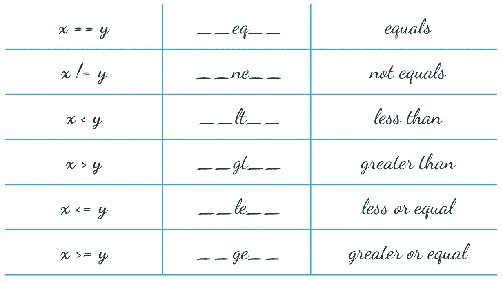
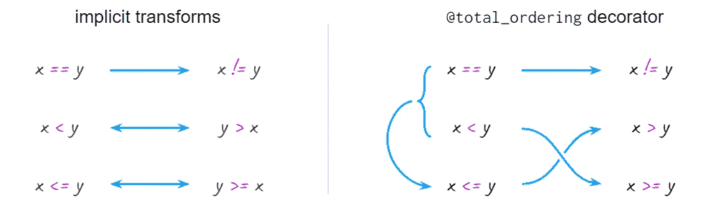

# 如何在 Python 中构建可比较的类

> 原文：<https://betterprogramming.pub/how-to-use-comparable-classes-in-python-a897f9bccf25>

## 关于如何使类实例具有可比性和可排序性的基础教程

通常，您会希望让用户定义的类的实例具有可比性。

假设您需要测试您的函数是否返回正确的值。如果该值恰好是某个类的对象，您可能会大吃一惊:

但是

当`==`操作符没有重载时，Python 使用`is`操作符作为后备。它检查两个参数是否是内存中的同一个对象，显然在第一个例子中是这样，但在第二个例子中不是。

要使实例“通过值”而不是“通过引用”进行比较，您需要重载比较运算符。

# 支持==

通过定义`__eq__` [方法](https://docs.python.org/3.9/reference/datamodel.html?highlight=__lt__#object.__eq__)重载相等运算符后，不等运算符“免费”到来，因此不需要实现`__ne__`方法:

现在假设你需要订购一个物品列表(或者找到其中的一个`min`或者`max`):

一种选择是使用“key”参数:

它可以工作，但是很难判断它是否正确工作，除非我们重载`__repr__`方法:

这是一个可行的选择，但是如果键总是相同的，一个可读性更好且不易出错的方法是将键合并到类定义中。

# 支持< and >

既然已经定义了严格的比较运算符

排序将“开箱即用”:

请注意，这里有更多的函数调用，所以如果您的`__lt__`函数做了一些重要的事情，那么“key”方法可能会工作得更快。

以类似于`==`和`!=`操作符的方式，Python 足够聪明，可以减轻为一个类同时实现<和>的负担。如果您要求进行“大于”比较，并且只提供了“小于”运算符，它将交换参数以获得结果，因此没有必要严格实现`__gt__`方法:

在这一点上，假设 Python 能够从我们提供的`<`和`==`构造`<=`操作符似乎是合乎逻辑的，但事实并非如此:

在这种情况下，Python 依赖于“显式优于隐式”的规则。

# 支持<= and > =

一种选择是显式定义操作:

就像严格的比较一样，Python 猜测所谓的“反射”操作的含义:

另一个选择是使用标准库中的`[total_ordering](https://docs.python.org/3/library/functools.html#functools.total_ordering)`装饰器。如果你给它两个基本操作:`==`和一个`>, <, <=, >=`，它将构建剩下的四个:

以下是这两种方法的基本视图:

依赖隐式反射可能会开一个糟糕的玩笑的一种情况是继承。

# 反思与继承

同样，为了让它像预期的那样工作，您要么需要显式地实现所有的操作符，要么使用`total_ordering`装饰器:

不过值得注意的是，由于 Python 的动态特性，反射操作和`total_ordering`的魔力都发生在“运行时”(即调用操作符时，而不是定义类时)，所以代价是速度稍微慢了一点。

一个更快的替代方法是使用一个已经可以比较的类作为起点。

# 基于现有的可比类

例如，`[namedtuple](https://docs.python.org/3/library/collections.html#collections.namedtuple)`实现了所有六个操作符，用于从左到右比较其元素:

如果你需要进一步扩展类的功能(添加不需要参与比较的字段或者一些额外的方法)，你可以直接从一个`list`继承

或者来自一个`tuple`(有些人为，因为它必须是不可变的):

# 结论

实现实例比较的正确方法是

1.  过载所有六个操作符。

    为了减少代码中的冗余，使其更具可读性，更少出错，可以:
2.  只实现操作的一个子集，让 Python 通过使用操作符(也称为反射操作)的对称性来处理剩下的部分(例如`a < b`，也就是`b > a`)
3.  进一步减少比较操作的数量，并指示 Python 通过`functools.total_ordering`装饰器构建余数(例如`a < b`或`a==b`从而`a <= b`
4.  通过依赖来自`collections.namedtuple`类的代码(没有自定义字段或方法)，完全避免操作符的显式实现。
5.  通过继承列表或元组实现中的操作符来重用它们(自定义字段和方法，但是代码要多一点)。

对于快速实验,( 2)和(3)是可以的，但是对于时间关键的应用,( 1)、(4)或(5)是更好的。

另外，Python 2.x 中的 `__cmp__`丰富的比较方法(返回一个有符号的数字，作为定义所有 6 个操作的替代方法)启发了 C++20 中的`[operator<=>](https://en.cppreference.com/w/cpp/language/operators)`，但是没有找到进入 Python3 的方法，因为`total_ordering`是官方的迁移路径。