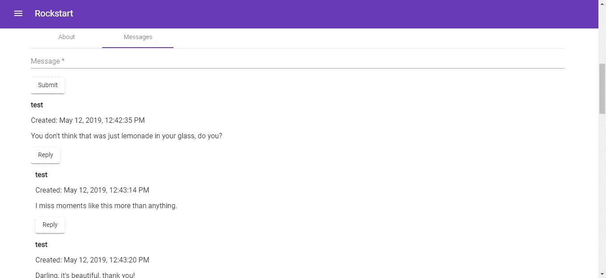

# 如何在 Angular 中递归使用组件

> 原文：<https://betterprogramming.pub/how-to-use-components-recursively-in-angular-6569459f6318>

## 构建显示事件的 Angular 应用程序


[布兰登·格林](https://unsplash.com/@brandgreen?utm_source=unsplash&utm_medium=referral&utm_content=creditCopyText)在 [Unsplash](https://unsplash.com/search/photos/tree?utm_source=unsplash&utm_medium=referral&utm_content=creditCopyText) 上拍摄的照片

在 Angular 中，可以递归引用组件来创建树结构。然而，有几个陷阱你应该知道。你必须防止递归无限地进行下去。如果使用 flux architecture，还必须确保它只在数据实际更新时才重新呈现。如果不注意这些事情，您可能会遇到浏览器冻结的问题，因为代码运行没有结束。

在这一部分中，我们将构建一个显示事件的 Angular 应用程序，并为每个事件显示消息。

该应用程序的结构将与其他 Angular 应用程序类似。在开始 Angular 的工作之前，我们创建一个简单的后端来存储消息。首先，我们使用以下 SQL 脚本创建数据库:

```
create database rockstart;create table events(
    id int not null auto_increment,
    name varchar(1000),
    startdt date,
    enddt date,
    address varchar(1000),
    photo mediumtext,
    logo mediumtext,
    primary key (id)
);create table users(
    id int not null auto_increment,
    username varchar(1000),
    password varchar(1000),
    isadmin boolean,
    primary key (id)
);create table messages(
    id int not null auto_increment,
    username varchar(1000),
    content varchar(1000),
    eventid int,
    parentid int,
    createddt datetime,
    primary key (id),
    foreign key (eventid) references events(id)
);
```

创建两个表。消息表是自引用的。`messages`表的`parentid`引用其父条目的`id`字段。

接下来，我们编写代码来保存消息和用户数据。这个 PHP 脚本保存数据:

```
<?php// web/index.php
require_once __DIR__.'/vendor/autoload.php';
use Symfony\Component\HttpFoundation\Request;
use Symfony\Component\HttpFoundation\Response;
use \Firebase\JWT\JWT;$dotenv = new Dotenv\Dotenv(__DIR__);
$dotenv->overload();$conn = mysqli_connect("localhost", $_ENV['dbuser'], $_ENV['dbpassword'], $_ENV['dbname']);
$app = new Silex\Application();
$app->register(new JDesrosiers\Silex\Provider\CorsServiceProvider(), [
    "cors.allowOrigin" => "*",      
]);
$app['debug'] = true;$key = "secret";$checktoken = function (Request $request, Silex\Application $app) use ($key) {
    $token = $request->headers->get('token');
    if ($token){
        $decoded = JWT::decode($token, $key, array('HS256'));
        if (!$decoded->id || !$decoded->username){
            return $app->json(array("status" => "Not logged in"), 400);
        }
    }
    else{
        return $app->json(array("status" => "Unauthorized"), 401);
    }    
};$app->get('/hello', function () use ($app) {
    return 'Hello ';
});$app->post('/message',  function (Request $request) use ($app, $conn){
    $body = json_decode($request->getContent(), true);
    $username = trim($body['username']);
    $content = trim($body['content']);
    $parentid = trim($body['parentid']);
    $eventid = trim($body['eventid']);
    if ($parentid){
        $stmt = $conn->prepare("INSERT INTO messages (username, content, parentid, eventid, createddt) VALUES (?, ?, ?, ?, NOW())");      
       $stmt->bind_param("ssii", $username, $content, $parentid, $eventid);
        $stmt->execute();
        return $app->json(array('status' => 'Message created'), 200);
    }
    else{
        $stmt = $conn->prepare("INSERT INTO messages (username, content, eventid, createddt) VALUES (?, ?, ?, NOW())");        
        $stmt->bind_param("ssi", $username, $content, $eventid);
        $stmt->execute();
        return $app->json(array('status' => 'Message created'), 200);
    }
})->before($checktoken);$app->get('/messages/{eventid}', function ($eventid) use ($app, $conn) {   
    $stmt = $conn->prepare("SELECT id, username, content, eventid, parentid, createddt FROM messages WHERE eventid=?");
    $stmt->bind_param("i", $eventid);
    $stmt->execute();
    $stmt->bind_result($id, $username, $content, $eventid, $parentid, $createddt); 
    $messages = [];
    while ($stmt->fetch()){
        $row = array(
            'id'=>$id, 
            'username'=>$username, 
            'content'=>$content, 
            'eventid'=> $eventid, 
            'parentid'=>$parentid,             
            'createddt'=>$createddt
        );
        array_push($messages, $row);        
    }
    return $app->json($messages);
});$app->get('/events', function () use ($app, $conn) {    
    $stmt = $conn->prepare("SELECT id, name, startdt, enddt, address, photo, logo from events");    
    $stmt->execute();
    $stmt->bind_result($eventid, $name, $startdt, $enddt, $address, $photo, $logo);
    $events = [];
    while ($stmt->fetch()){
        $result = array(
            'id'=>$eventid, 
            'startdt'=>$startdt, 
            'enddt'=>$enddt, 
            'address'=> $address, 
            'photo'=>$photo, 
            'logo'=>$logo,
            'name'=>$name
        );   
        array_push($events , $result);          
    }
    return $app->json($events);
});$app->post('/event',  function (Request $request) use($app, $conn) {
    $body = json_decode($request->getContent(), true);
    $name = trim($body['name']);
    $startdt = trim($body['startdt']);
    $enddt = trim($body['enddt']);
    $address = trim($body['address']);        
    $photo = trim($body['photo']);
    $logo = trim($body['logo']);
    if (!isset($body['id'])){        
        $stmt = $conn->prepare("INSERT INTO events (name, startdt, enddt, address, photo, logo) VALUES (?, ?, ?, ?, ?, ?)");
        $stmt->bind_param("ssssss", $name, $startdt, $enddt, $address, $photo, $logo);
        $stmt->execute();
        return $app->json(array("status" => "Event created"), 201);
    }
    else{
        $eventid = trim($body['id']);
        $stmt = $conn->prepare("UPDATE events SET name=?, startdt=?, enddt=?, address=?, photo=?, logo=? WHERE id=?");
        $stmt->bind_param("ssssssi", $name, $startdt, $enddt, $address, $photo, $logo, $eventid);
        $stmt->execute();
        return $app->json(array("status" => "Event updated"), 200);
    }    

})->before($checktoken);$app->post('/user',  function (Request $request) use ($key, $conn, $app) {
    $body = json_decode($request->getContent(), true); 
    $username = trim($body['username']);
    $stmt = $conn->prepare("select id, username from users where username=?");
    $stmt->bind_param("s", $username);
    $stmt->execute();
    $stmt->bind_result($id, $usr);
    $row = NULL;
    while ($data = $stmt->fetch()){
        $row = $data;
        break;
    };if ($row){
        return $app->json(array('status' => 'Username already in use.'), 400);
    }$password = crypt(trim($body['password']), $key);        
    $stmt = $conn->prepare("INSERT INTO users (username, password) VALUES (?, ?)");
    $stmt->bind_param("ss", $username, $password);
    $stmt->execute();
    return $app->json(array('status' => 'User created'), 200);
});$app->get('/userinfo',  function (Request $request) use ($key, $conn, $app) {
    $token = $request->headers->get('token');
    $decoded = JWT::decode($token, $key, array('HS256'));
    return $app->json($decoded);
})->before($checktoken);$app->post('/login',  function (Request $request) use ($conn, $key, $app) {
    $body = json_decode($request->getContent(), true);
    $username = trim($body['username']);   
    $password =  trim($body['password']);
    $stmt = $conn->prepare("select id, username, password from users where username=?");
    $stmt->bind_param("s", $username);
    $stmt->execute();
    $stmt->bind_result($id, $usr, $pwd);
    $row = NULL;
    while ($data =$stmt->fetch()){
        $row = $data;
        break;
    };        
    if ($usr && $pwd){
        if (crypt($password, $key) == $pwd){
            $token = array('id'=> $id, 'username'=>$usr);
            $jwt = JWT::encode($token, $key);            
            return $app->json(array('token' => $jwt), 200);
        }
        else{
            return new Response('Unauthorized', 401);
        }
    }
    else{
        return new Response('Unauthorized', 401);
    }});$app["cors-enabled"]($app);
$app->run();?>
```

上面的脚本允许我们保存用户数据和消息。它还进行 JSON Web 令牌认证。我们在`composer.json`中有以下内容，这样我们就可以安装我们引用的包:

```
{
    "require": {
        "silex/silex": "~2.0",
        "firebase/php-jwt": "^4.0",
        "jdesrosiers/silex-cors-provider": "~1.0",
        "vlucas/phpdotenv": "^2.4"
    }
}
```

现在我们可以构建 Angular 应用程序。和几乎所有其他 Angular 应用一样，我们使用 Angular CLI 来生成代码。我们使用有棱角的材料来构建我们的 UI，以使我们的设计工作最小化，我们还安装了用于操作 JWT 的包，允许我们使用 flux 架构。我们运行:

```
npm i @angular/material @angular/cdk @auth0/angular-jwt @ngrx/store
```

前两种，`@angular/material @angular/cdk`，是针对有棱角的物质。`@auth0/angular-jwt`代表 JWT，`@ngrx/store`代表我们的助焊剂商店。

现在我们写一些代码。我们必须将组件添加到我们的模块中。我们将以下内容放入`app.module.ts`:

```
import { BrowserModule } from '[@angular/platform-browser](http://twitter.com/angular/platform-browser)';
import { NgModule } from '[@angular/core](http://twitter.com/angular/core)';import { AppRoutingModule } from './app-routing.module';
import { AppComponent } from './app.component';
import { LoginPageComponent } from './login-page/login-page.component';
import { SignUpPageComponent } from './sign-up-page/sign-up-page.component';
import { EventPageComponent } from './event-page/event-page.component';
import { AboutTabComponent } from './about-tab/about-tab.component';
import { MessagesBoxComponent } from './messages-box/messages-box.component';
import { TopBarComponent } from './top-bar/top-bar.component';import { MatToolbarModule } from '[@angular/material](http://twitter.com/angular/material)/toolbar';
import { MatSidenavModule } from '[@angular/material](http://twitter.com/angular/material)/sidenav';
import { MatCardModule } from '[@angular/material](http://twitter.com/angular/material)/card';
import { MatInputModule } from '[@angular/material](http://twitter.com/angular/material)/input';
import { MatFormFieldModule } from '[@angular/material](http://twitter.com/angular/material)/form-field';
import { MatButtonModule } from '[@angular/material](http://twitter.com/angular/material)/button';
import { MatSelectModule } from '[@angular/material](http://twitter.com/angular/material)/select';
import { MatMenuModule } from '[@angular/material](http://twitter.com/angular/material)/menu';
import { HttpClientModule, HTTP_INTERCEPTORS } from '[@angular/common](http://twitter.com/angular/common)/http';
import { BrowserAnimationsModule } from '[@angular/platform-browser](http://twitter.com/angular/platform-browser)/animations';
import { FormsModule } from '[@angular/forms](http://twitter.com/angular/forms)';
import { StoreModule } from '[@ngrx/store](http://twitter.com/ngrx/store)';
import { reducers } from './reducers';
import { UserService } from './user.service';
import { HttpReqInterceptor } from './http-req-interceptor';
import { EventsPageComponent } from './events-page/events-page.component';
import { MenuItemsComponent } from './menu-items/menu-items.component';
import { MatTabsModule } from '[@angular/material](http://twitter.com/angular/material)/tabs';
import { MessageTabComponent } from './message-tab/message-tab.component';
import { MatListModule } from '[@angular/material](http://twitter.com/angular/material)/list';[@NgModule](http://twitter.com/NgModule)({
  declarations: [
    AppComponent,
    LoginPageComponent,
    SignUpPageComponent,
    MessagesBoxComponent,
    TopBarComponent,
    MenuItemsComponent,
    MessageTabComponent
  ],
  imports: [
    BrowserModule,
    AppRoutingModule,
    StoreModule.forRoot(reducers),
    MatToolbarModule,
    MatSidenavModule,
    MatCardModule,
    MatInputModule,
    MatFormFieldModule,
    MatButtonModule,
    FormsModule,
    HttpClientModule,
    BrowserAnimationsModule,
    MatSelectModule,
    MatMenuModule,
    MatTabsModule,
    MatListModule
  ],
  providers: [
    UserService,
    EventService,
    {
      provide: HTTP_INTERCEPTORS,
      useClass: HttpReqInterceptor,
      multi: true
    }
  ],
  bootstrap: [AppComponent]
})
export class AppModule { }
```

稍后我们将添加这里引用的任何组件。为了简化 HTTP 请求处理，我们添加了一个 HTTP 拦截器。运行`ng g class http-req-interceptor`并添加以下内容:

```
import { HttpInterceptor, HttpRequest, HttpHandler, HttpEvent } from '[@angular/common](http://twitter.com/angular/common)/http';
import { catchError } from 'rxjs/operators';
import { Observable, throwError } from 'rxjs';
import { Router } from '[@angular/router](http://twitter.com/angular/router)';
import { Injectable } from '[@angular/core](http://twitter.com/angular/core)';[@Injectable](http://twitter.com/Injectable)()
export class HttpReqInterceptor implements HttpInterceptor {
    constructor(
        private router: Router
    ) { }intercept(req: HttpRequest<any>, next: HttpHandler):  Observable<HttpEvent<any>> {
        if (!req.url.includes('login') &&
            !req.url.includes('signup')) {
            req = req.clone({
                setHeaders: {
                    token: localStorage.getItem('token') || ''
                }
            });
        }
        return next.handle(req).pipe(catchError(err => {
            if (err.status === 401) {
                localStorage.clear();
                this.router.navigate(['']);
            }           
            const error = err.error.message || err.statusText;             
            return throwError(err);
        }));
    }
}
```

这确保了除了登录和注册之外的所有请求都有一个附加的令牌。

然后我们制造通量减少器。做一个`reducers`文件夹，在里面运行`ng g class messagesReducer`和`ng g class menuReducer`。

然后在`menu.ts`中，输入:

```
export let TOGGLE_MENU = 'TOGGLE_MENU';export function MenuReducer(
    state = {},
    action
) {
    switch (action.type) {
        case TOGGLE_MENU: {
            return action.payload
        }default: {
            return state;
        }
    }
}
```

这存储了菜单的状态。

在`messages-reducers.ts`里，放着:

```
export let SET_MESSAGES = 'SET_MESSAGES';export function MesssagesReducer(
    state = [],
    action
) {
    switch (action.type) {
        case SET_MESSAGES: {
            return action.payload
        }default: {
            return state;
        }
    }
}
```

这存储了消息的状态。

在`app-routing.module.ts`中，我们输入:

```
import { NgModule } from '[@angular/core](http://twitter.com/angular/core)';
import { Routes, RouterModule } from '[@angular/router](http://twitter.com/angular/router)';
import { LoginPageComponent } from './login-page/login-page.component';
import { SignUpPageComponent } from './sign-up-page/sign-up-page.component';
import { EventPageComponent } from './event-page/event-page.component';
import { EventsPageComponent } from './events-page/events-page.component';const routes: Routes = [
  { path: '', component: LoginPageComponent },
  { path: 'signup', component: SignUpPageComponent },
  { path: 'events', component: EventsPageComponent },
  { path: 'event/:eventId', component: EventPageComponent },
];[@NgModule](http://twitter.com/NgModule)({
  imports: [RouterModule.forRoot(routes, { useHash: true })],
  exports: [RouterModule]
})
export class AppRoutingModule { }
```

现在我们必须创建服务，这样我们才能发送 HTTP 请求。我们运行`ng g service user`和`ng g service events`。这就产生了`user.service.ts`和`event.service.ts`。

在`user.service.ts`中，我们把:

```
import { Injectable } from '[@angular/core](http://twitter.com/angular/core)';
import { environment } from 'src/environments/environment';
import { HttpClient } from '[@angular/common](http://twitter.com/angular/common)/http';[@Injectable](http://twitter.com/Injectable)({
  providedIn: 'root'
})
export class UserService {constructor(
    private http: HttpClient
  ) { }login(data) {
    return this.http.post(`${environment.APIURL}/login`, data)
  }signUp(data) {
    return this.http.post(`${environment.APIURL}/user`, data)
  }
}
```

在`event.service.ts`中，我们输入:

```
import { Injectable } from '[@angular/core](http://twitter.com/angular/core)';
import { environment } from 'src/environments/environment';
import { HttpClient } from '[@angular/common](http://twitter.com/angular/common)/http';[@Injectable](http://twitter.com/Injectable)({
  providedIn: 'root'
})
export class EventService { constructor(
    private http: HttpClient
  ) { } getEvents() {
    return this.http.get(`${environment.APIURL}/events`)
  } getMessages(eventId){
    return this.http.get(`${environment.APIURL}/messages/${eventId}`);
  } sendMessage(data){
    return this.http.post(`${environment.APIURL}/message`, data);
  }
}
```

我们为我们的页面制作组件，这样我们就能看到一些东西。为此，我们运行以下命令:

```
ng g component eventPage
ng g component eventsPage
ng g component loginPage
ng g component menuItems
ng g component messageTab
ng g component messageBox
ng g component signUpPage
ng g component topBar
```

现在我们在每个组件中放入代码。在`event-page.component.ts`中，我们输入:

```
import { Component, OnInit, ViewChild, HostListener, ElementRef } from '[@angular/core](http://twitter.com/angular/core)';
import { DomSanitizer } from '[@angular/platform-browser](http://twitter.com/angular/platform-browser)';
import { EventService } from '../event.service';
import { Store, select } from '[@ngrx/store](http://twitter.com/ngrx/store)';
import { Router, ActivatedRoute } from '[@angular/router](http://twitter.com/angular/router)';
import { SET_EVENTS } from '../reducers/events-reducer';
import { Observable } from 'rxjs';
import { SET_PEOPLE } from '../reducers/people-reducer';[@Component](http://twitter.com/Component)({
  selector: 'app-event-page',
  templateUrl: './event-page.component.html',
  styleUrls: ['./event-page.component.css']
})
export class EventPageComponent implements OnInit {
  [@ViewChild](http://twitter.com/ViewChild)('drawer') drawer: any;
  menu$: Observable<boolean>;
  menu: boolean;
  event: any = <any>{};
  eventId: string;
  events$: Observable<any[]>;
  events: any[] = [];constructor(
    private _sanitizer: DomSanitizer,
    private eventService: EventService,
    private store: Store<any>,
    private router: Router,
    private eRef: ElementRef,
    private route: ActivatedRoute
  ) {
    this.events$ = store.pipe(select('events'));
    this.events$.subscribe(events => {
      this.events = events;
    })
  } ngOnInit() {
    this.getEvents();
  } getEvents() {
    this.eventService.getEvents()
      .subscribe(res => {
        this.store.dispatch({ type: SET_EVENTS, payload: res });
      }, err => {}, () => {
        this.getEvent();
      })
  } getEvent() {
    this.route.paramMap.subscribe(params => {
      this.eventId = params.get("eventId");
      this.event = this.events.find(ev => ev.id == this.eventId);
      if (!this.event){
        this.router.navigate(['']);
        return;
      }
      this.getPeople();
    })
  } getPeople() {
    this.eventService.getPeople(this.eventId)
      .subscribe(res => {
        this.store.dispatch({ type: SET_PEOPLE, payload: res });
      }, err => {})
  } showImage(imageUrl: string) {
    return this._sanitizer.bypassSecurityTrustResourceUrl(imageUrl);
  } [@HostListener](http://twitter.com/HostListener)('document:click', ['$event'])
  clickout(event) {    
    if (event.target.className.includes('mat-tab-label')) {
      return;
    } if (event.target.id.includes('menu-button') ||
      event.target.id.includes('menu-icon')) {
      this.drawer.open();
      return;
    } if (!this.drawer.opened) {
      if (!event.target.id.includes('menu-button') ||
        event.target.id.includes('menu-icon')) {
        return;
      }
      this.drawer.open();
    }
    else {
      this.drawer.close();
    }
  }}
```

我们通过上面的代码控制菜单。如果点击菜单按钮或菜单之外的任何东西，菜单应该关闭。然后，在相应的模板`event-page.component.html`中，我们放入:

```
<mat-drawer-container class="example-container" [hasBackdrop]="false">
  <mat-drawer #drawer [mode]="'side'">
    <app-menu-items></app-menu-items>
  </mat-drawer>
  <mat-drawer-content>
    <app-top-bar></app-top-bar>
    <div class="center">
      <div></div>
      <mat-card>
        <mat-card-title>
          <h2>{{event.name}}</h2>
          
        </mat-card-title>
        <mat-card-content>
          <p>Start: {{event.startdt | date}}</p>
          <p>End: {{event.enddt | date}}</p>
          <p>Address: {{event.address}}</p>
        </mat-card-content>
      </mat-card>
      <mat-tab-group>
        <mat-tab label="Messages">
          <app-message-tab></app-message-tab>
        </mat-tab>
      </mat-tab-group>
    </div>
  </mat-drawer-content>
</mat-drawer-container>
```

这显示了事件日期和地址。然后在`events-page.component.ts`中，我们放入:

```
import { Component, OnInit, ViewChild, HostListener, ElementRef } from '[@angular/core](http://twitter.com/angular/core)';
import { SET_EVENTS } from '../reducers/events-reducer';
import { Observable } from 'rxjs';
import { DomSanitizer } from '[@angular/platform-browser](http://twitter.com/angular/platform-browser)';
import { EventService } from '../event.service';
import { Store, select } from '[@ngrx/store](http://twitter.com/ngrx/store)';
import { Router } from '[@angular/router](http://twitter.com/angular/router)';
import { store } from '[@angular/core](http://twitter.com/angular/core)/src/render3';[@Component](http://twitter.com/Component)({
  selector: 'app-events-page',
  templateUrl: './events-page.component.html',
  styleUrls: ['./events-page.component.css']
})
export class EventsPageComponent implements OnInit {
  [@ViewChild](http://twitter.com/ViewChild)('drawer') drawer: any;
  events$: Observable<any[]>;
  events: any[] = [];
  menu$: Observable<boolean>;
  menu: boolean;constructor(
    private _sanitizer: DomSanitizer,
    private eventService: EventService,
    private store: Store<any>,
    private eRef: ElementRef,
    private router: Router
  ) {
    this.events$ = store.pipe(select('events'));
    this.events$.subscribe(events => {
      this.events = events;
    })
  }ngOnInit() {
    this.getEvents();
  }getEvents() {
    this.eventService.getEvents()
      .subscribe(res => {
        this.store.dispatch({ type: SET_EVENTS, payload: res });
      })
  }showImage(imageUrl: string) {
    return this._sanitizer.bypassSecurityTrustResourceUrl(imageUrl);
  }go(eventId: string) {
    this.router.navigate([`/event/${eventId}`]);
  }[@HostListener](http://twitter.com/HostListener)('document:click', ['$event'])
  clickout(event) {   
    if (event.target.className.includes('mat-tab-label')) {
      return;
    }if (event.target.id.includes('menu-button') ||
      event.target.id.includes('menu-icon')) {
      this.drawer.open();
      return;
    }if (!this.drawer.opened) {
      if (!event.target.id.includes('menu-button') ||
        event.target.id.includes('menu-icon')) {
        return;
      }
      this.drawer.open();
    }
    else {
      this.drawer.close();
    }
  }}
```

在模板中，`events-page.component.ts`，我们放入:

```
<mat-drawer-container class="example-container" [hasBackdrop]="false">
  <mat-drawer #drawer [mode]="'side'">
    <app-menu-items></app-menu-items>
  </mat-drawer>
  <mat-drawer-content>
    <app-top-bar></app-top-bar>
    <div class="center">
      <h1>Events</h1>
      <mat-card *ngFor='let ev of events'>
        <mat-card-header>
          <mat-card-title>
            {{ev.name}}
          </mat-card-title>
        </mat-card-header>
        
        <p>Start Date: {{ev.startdt}}</p>
        <p>End Date: {{ev.enddt}}</p>
        <p>Address: {{ev.address}}</p>
        <button mat-raised-button type="button" (click)='go(ev.id)'>Go</button>
      </mat-card>
    </div>
  </mat-drawer-content>
</mat-drawer-container>
```

这将显示事件列表，您可以单击其中一个事件进行查看。

接下来在`login-page.component.ts`中，我们输入:

```
import { Component, OnInit } from '[@angular/core](http://twitter.com/angular/core)';
import { UserService } from '../user.service';
import { Router } from '[@angular/router](http://twitter.com/angular/router)';
import { NgForm } from '[@angular/forms](http://twitter.com/angular/forms)';[@Component](http://twitter.com/Component)({
  selector: 'app-login-page',
  templateUrl: './login-page.component.html',
  styleUrls: ['./login-page.component.css']
})
export class LoginPageComponent implements OnInit {
  user: any = <any>{};constructor(
    private userService: UserService,
    private router: Router
  ) { }ngOnInit() {
  }login(loginForm: NgForm) {
    if (loginForm.invalid) {
      return;
    }
    this.userService.login(this.user)
      .subscribe((res: any) => {
        localStorage.setItem('token', res.token);
        this.router.navigate(['/events'])
      }, err => {
        alert('Invalid username or password.');
      })
  }signUp() {
    this.router.navigate(['/signup'])
  }
}
```

在`login-page.component.html`中，我们把:

```
<div class="center">
  <h1>Rockstart Login</h1>
  <form #loginForm='ngForm' (ngSubmit)='login(loginForm)'>
    <mat-form-field>
      <input matInput placeholder="Username" name='username' [(ngModel)]='user.username' #username='ngModel' required>
    </mat-form-field>
    <br>
    <mat-form-field>
      <input matInput placeholder="Password" type='password' name='password' [(ngModel)]='user.password'
        #password='ngModel' required>
    </mat-form-field>
    <br>
    <button mat-raised-button type="submit">Login</button>
    <button mat-raised-button type="button" (click)='signUp()'>Sign Up</button>
  </form>
</div>
```

这是我们的登录页面，带有一个登录表单。

在`menu-items.component.ts`中，我们输入:

```
import { Component, OnInit } from '[@angular/core](http://twitter.com/angular/core)';
import { Router } from '[@angular/router](http://twitter.com/angular/router)';[@Component](http://twitter.com/Component)({
  selector: 'app-menu-items',
  templateUrl: './menu-items.component.html',
  styleUrls: ['./menu-items.component.css']
})
export class MenuItemsComponent implements OnInit {constructor(
    private router: Router
  ) { }ngOnInit() {
  }isAuthenticated() {
    return !!localStorage.getItem('token');
  }logOut() {
    localStorage.clear();
    this.router.navigate(['']);
  }
}
```

然后在模板中，`menu-items.component.html`，我们放入:

```
<ul>
  <li *ngIf='!isAuthenticated()' routerLink=''><a>Log In</a></li>
  <li *ngIf='!isAuthenticated()' routerLink='/signup'><a>Sign Up</a></li>
  <li *ngIf='isAuthenticated()' (click)='logOut()'><a>Log Out</a></li>
</ul>
```

在`message-tab.component.ts`中，我们有:

```
import { Component, OnInit } from '[@angular/core](http://twitter.com/angular/core)';
import { NgForm } from '[@angular/forms](http://twitter.com/angular/forms)';
import { EventService } from '../event.service';
import { Router, ActivatedRoute } from '[@angular/router](http://twitter.com/angular/router)';
import { select, Store } from '[@ngrx/store](http://twitter.com/ngrx/store)';
import { Observable } from 'rxjs';
import { SET_MESSAGES } from '../reducers/messages-reducer';
import { JwtHelperService } from '[@auth0/angular-jwt](http://twitter.com/auth0/angular-jwt)';const helper = new JwtHelperService();[@Component](http://twitter.com/Component)({
  selector: 'app-message-tab',
  templateUrl: './message-tab.component.html',
  styleUrls: ['./message-tab.component.css']
})
export class MessageTabComponent implements OnInit {
  events$: Observable<any[]>;
  events: any[] = [];
  eventId: string;
  message: any = <any>{};
  messages$: Observable<any[]>;
  messages: any[] = [];constructor(
    private eventService: EventService,
    private route: ActivatedRoute,
    private store: Store<any>
  ) {
    this.route.paramMap.subscribe(params => {
      this.eventId = params.get("eventId");
      this.getMessages(this.eventId);
    }) this.messages$ = store.pipe(select('messages'));
    this.messages$.subscribe(messages => {
      this.messages = messages;
    })} ngOnInit() { } sendMessage(messageForm: NgForm) {
    if (messageForm.invalid ||
      typeof this.eventId == 'undefined' ||
      typeof this.eventId === null) {
      return;
    }
    const decodedToken = helper.decodeToken(localStorage.getItem('token'));
    let data = JSON.parse(JSON.stringify(this.message));
    data.username = decodedToken.username
    data.eventid = this.eventId;
    data.parentid = null;
    this.eventService.sendMessage(data)
      .subscribe(res => {
        this.getMessages(this.eventId);
      })
  } getMessages(eventId) {
    this.eventService.getMessages(eventId)
      .subscribe(res => {        
        this.store.dispatch({
          type: SET_MESSAGES, payload: res
        });
      })
  }
}
```

这是事件页面中的一个选项卡，用于显示用户留下的消息。

在`message-tab.component.html`，我们有:

```
<form #messageForm='ngForm' (ngSubmit)='sendMessage(messageForm)'>
  <mat-form-field>
    <input matInput placeholder="Message" name='content' [(ngModel)]='message.content' #content='ngModel' required>
  </mat-form-field>
  <br>
  <button mat-raised-button type="submit">Submit</button>
</form><div [hidden]='messages.length == 0'>
  <app-messages-box [parentId]='null' [eventId]='eventId' [messages]='messages'></app-messages-box>
</div>
```

有一个用于休假消息和`app-message-box`组件的表单，用于递归显示消息。在`message-box.component.ts`中，我们把:

```
import { Component, OnInit, Input, SimpleChanges } from '[@angular/core](http://twitter.com/angular/core)';
import { Store, select } from '[@ngrx/store](http://twitter.com/ngrx/store)';
import { Observable, Subject } from 'rxjs';
import { EventService } from '../event.service';
import { ActivatedRoute } from '[@angular/router](http://twitter.com/angular/router)';
import { NgForm } from '[@angular/forms](http://twitter.com/angular/forms)';
import { SET_MESSAGES } from '../reducers/messages-reducer';
import { JwtHelperService } from '[@auth0/angular-jwt](http://twitter.com/auth0/angular-jwt)';
const helper = new JwtHelperService();[@Component](http://twitter.com/Component)({
  selector: 'app-messages-box',
  templateUrl: './messages-box.component.html',
  styleUrls: ['./messages-box.component.css']
})
export class MessagesBoxComponent implements OnInit {
  [@Input](http://twitter.com/Input)('parentId') parentId: number;
  [@Input](http://twitter.com/Input)('eventId') eventId: number;
  [@Input](http://twitter.com/Input)('messages') messages: any[];
  msgs: any[] = [];
  childMessages: any[] = [];
  messages$: Observable<any[]>;
  message: any = <any>{};
  reply: any = <any>{};
  onChanges = new Subject<SimpleChanges>();constructor(
    private store: Store<any>,
    private eventService: EventService,
    private route: ActivatedRoute,
  ) {} ngOnInit() {
    this.onChanges.subscribe((changes: SimpleChanges) => {
      if (changes.messages && Array.isArray(changes.messages.currentValue)) {
        this.msgs = changes.messages.currentValue.filter(m => m.parentid == this.parentId);
      } if (changes.parentId) {
        this.msgs = changes.messages.currentValue.filter(m => m.parentid == this.parentId);
      }
    });
  } ngOnChanges(changes: SimpleChanges) {
    if (changes.messages) {
      this.onChanges.next(changes);
    } if (changes.parentId) {
      if (changes.parentId.previousValue !=
        changes.parentId.currentValue) {
        this.msgs = changes.messages.currentValue.filter(m => m.parentid == changes.parentId.currentValue);
        this.onChanges.next(changes);
      }
    }
  } sendMessage(messageForm: NgForm, parentId: string) {
    if (messageForm.invalid ||
      typeof this.eventId == 'undefined' ||
      typeof this.eventId === null) {
      return;
    }
    const decodedToken = helper.decodeToken(localStorage.getItem('token'));
    let data = JSON.parse(JSON.stringify(this.message));
    data.username = decodedToken.username
    data.eventid = this.eventId;
    data.parentid = parentId;
    this.eventService.sendMessage(data)
      .subscribe(res => {
        this.getMessages(this.eventId);
        this.message = {};
        this.reply = false;
      })
  } getMessages(eventId) {
    this.eventService.getMessages(eventId)
      .subscribe(res => {
        this.store.dispatch({
          type: SET_MESSAGES, payload: res
        });
      })
  }
}
```

在`message-box.component.html`中，我们有:

```
<div *ngIf='msgs.length > 0' [ngStyle]="{'margin-left': parentId ? '10px' : '0'}">
  <div *ngFor='let m of msgs'>
    <p><b>{{m.username}}</b></p>
    <p>Created: {{m.createddt | date : 'medium'}}</p>
    <p>{{m.content}}</p>
    <div>
      <button mat-raised-button type="button" (click)='reply[m.id] = !reply[m.id]'>Reply</button>
      <form #messageForm='ngForm' (ngSubmit)='sendMessage(messageForm, m.id)' [hidden]='!reply[m.id]'>
        <mat-form-field>
          <input matInput placeholder="Message" name='content' [(ngModel)]='message.content' #content='ngModel'
            required>
        </mat-form-field>
        <br>
        <button mat-raised-button type="submit">Submit</button>
      </form>
    </div>    
    <app-messages-box [parentId]='m.id' [eventId]='eventId' [messages]='messages'></app-messages-box> </div>
</div>
```

注意`app-message-box`引用了它自己。这是因为消息显示在列表中。在`MessagesBoxComponent`中有一个`ngOnChanges`方法来观察`@Input`中的变化。

在`ngOnChanges`函数中有如下内容:

```
ngOnChanges(changes: SimpleChanges) {
    if (changes.messages) {
      this.onChanges.next(changes);
    } if (changes.parentId) {
      if (changes.parentId.previousValue !=
        changes.parentId.currentValue) {
        this.msgs = changes.messages.currentValue.filter(m => m.parentid == changes.parentId.currentValue);
        this.onChanges.next(changes);
      }
    }
  }
```

我们将子消息设置在:

```
this.msgs = changes.messages.currentValue.filter(m => m.parentid == changes.parentId.currentValue);
        this.onChanges.next(changes);
```

只有当`changes.parentId`不为空或未定义时，我们才这样做。我们只在`messages`改变时加载消息。这就是为什么我们有这个:

```
if (changes.messages) {
  this.onChanges.next(changes);
}
```

如果有变化，`onChanges`只向订阅它的`Observable`对象发送数据，这防止了过多的重新渲染。在`ngOnInit`中，我们有:

```
this.onChanges.subscribe((changes: SimpleChanges) => {
   if (changes.messages && Array.isArray(changes.messages.currentValue)) {
        this.msgs = changes.messages.currentValue.filter(m => m.parentid == this.parentId);
    } if (changes.parentId) {
    this.msgs = changes.messages.currentValue.filter(m => m.parentid == this.parentId);
  }
});
```

这就是我们用`Observable`获取最新子消息的地方。

注意，我们在`message-tab.component.ts`而不是`message-box.component.ts`中有这段代码:

```
this.messages$ = store.pipe(select('messages'));
this.messages$.subscribe(messages => {
  this.messages = messages;
})
```

我们不希望每个`message-box`组件都订阅商店——这将创建太多的商店订阅，并可能冻结浏览器。相反，我们希望将数组传递给`message-box`组件，这样就可以在那里对它们进行过滤。

最后，我们得到了这个:

