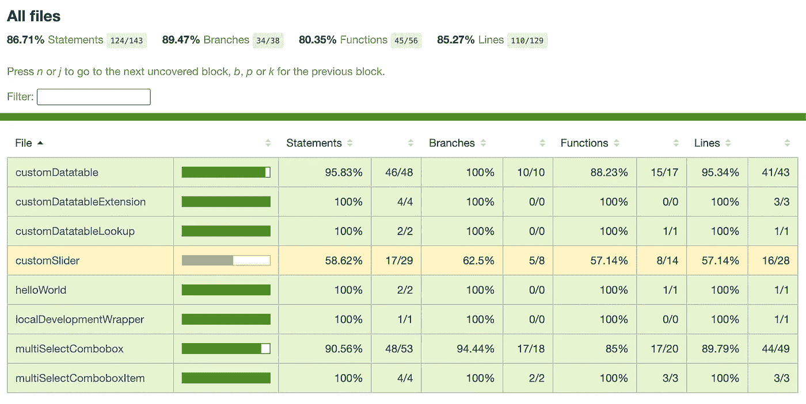
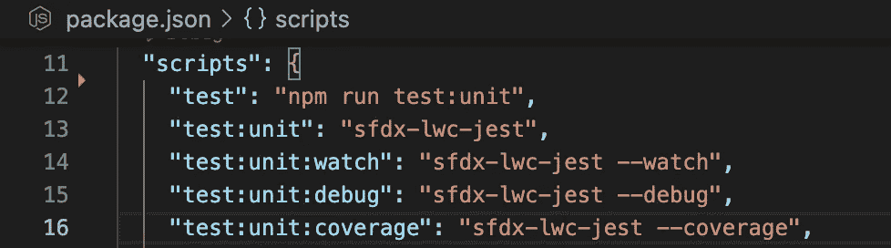
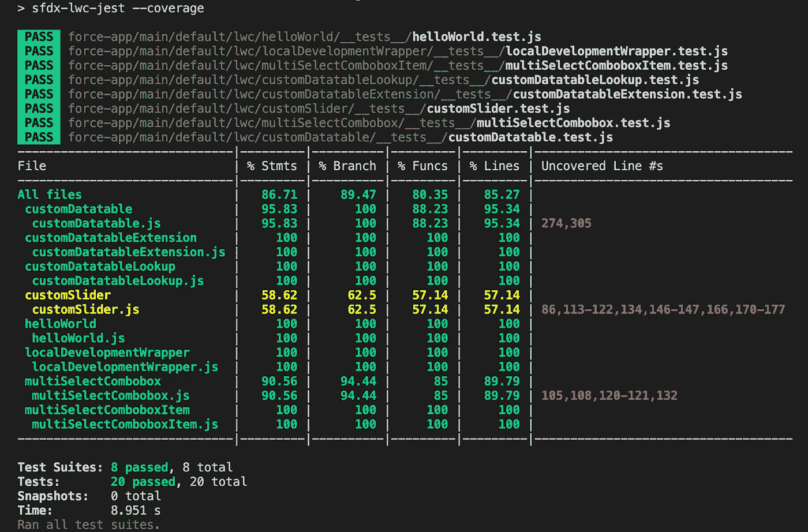
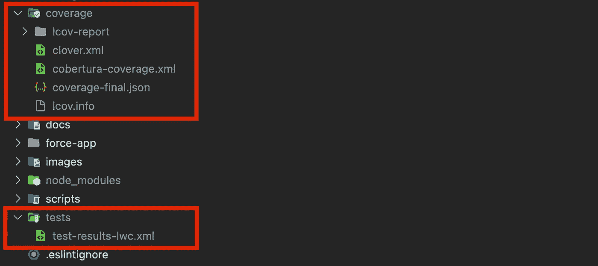
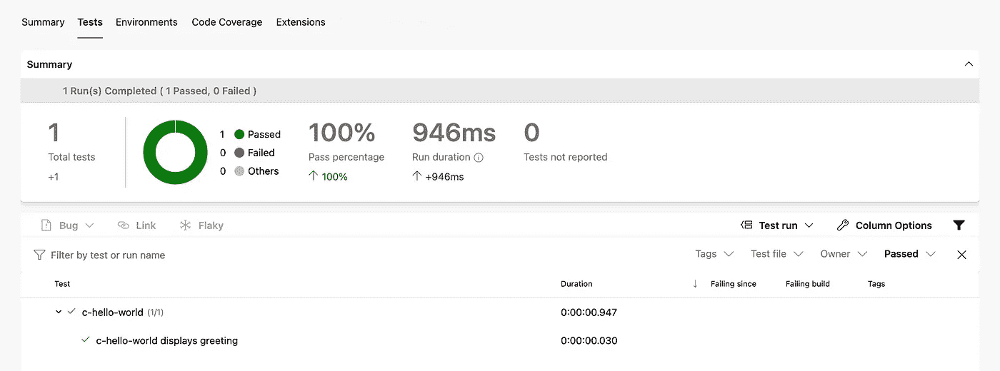

# 如何用 LWC 笑话利用报道和考验记者

> 原文：<https://betterprogramming.pub/how-to-use-coverage-and-test-reporters-with-lwc-jest-c40caedbf439>

## 为 Lightning Web 组件生成测试结果和代码覆盖报告



Lightning web 组件的 LCOV HTML 代码覆盖率报告示例

[Jest](https://jestjs.io/) 是一个 JavaScript 测试框架，适用于不同类型的项目，包括 Angular、React 以及 Salesforce Lightning Web 组件。尽管在 Salesforce 生态系统中，与 [Apex 代码覆盖率](https://developer.salesforce.com/docs/atlas.en-us.apexcode.meta/apexcode/apex_code_coverage_intro.htm)相比，LWC 单元测试及其覆盖率与部署无关，但在我看来，高覆盖率的良好测试对于确保 UI 中的高代码质量也很重要。

已经有很多关于 Lightning Web 组件 Jest 测试的优秀指南。因此，我想把重点放在本指南中的测试结果和覆盖率报告部分。

好吧，让我们开始吧。

# 默认 LWC Jest 配置

创建新的 SFDX 项目时，LWC 单元测试的默认 Jest 配置位于项目根目录中，如下所示:

如果您保持这个配置不变，那么您可以使用下面的命令来计算当前已存在的 LWC 测试类的相应代码覆盖率:

```
sfdx-lwc-jest --coverage
```

如果 [sfdx-lwc-jest](https://www.npmjs.com/package/@salesforce/sfdx-lwc-jest) 没有全局安装，只是作为当前项目的一个依赖项，您也可以在`package.json`文件中添加相应的脚本，如下所示:



package.json 中 LWC 测试执行的脚本

然后可以执行这些脚本，例如，如下所示:

```
npm run test:unit:coverage
```

在运行命令并完成所有测试的执行之后，计算出的代码覆盖率会在终端中输出:



LWC 代码覆盖的终端输出

此外，在项目的`/coverage`目录中会自动生成一个 LCOV 覆盖报告。然而，在一些项目中，您可能需要以其他格式生成的代码覆盖率和测试结果，例如使用 Cobertura 或 JUnit，以便能够在自动化管道运行中使用它们进行报告或发布。

因此，在下一节中，我们将看看如何为 SFDX 项目扩展 LWC Jest 的默认配置。

# 高级 LWC Jest 配置

在上一节中，我们看到了所提供的 LWC Jest 默认配置的可能性。但是，参考官方文档，可以用各种选项覆盖或扩展配置([配置 Jest](https://jestjs.io/docs/configuration) )。如果这样做，还可以使用前面提到的记者 Cobertura、JUnit，甚至其他。

例如，要使用 Cobertura 或其他覆盖报告程序和格式，您只需将下面一行添加到现有的`jest.config.js`配置文件中:

```
coverageReporters: ['clover', 'json', 'text', 'lcov', 'cobertura'],
```

如果以这种方式扩展配置，这将自动导致在`/coverage`目录中指定报告类型的额外输出。

要启用 JUnit 支持，还需要一个名为 [jest-junit](https://www.npmjs.com/package/jest-junit) 的额外 npm 包，它可以作为项目的开发依赖项安装，如下所示:

```
npm i jest-junit --save-dev
```

为了自动使用 Jest 这个报告器，还必须将它添加到`jest.config.js`配置文件中。包含所有调整的最终 Jest 配置将如下所示:

从现在开始，下面的两个目录将会自动填充我们每次测试执行的测试报告。`/coverage`目录包含所有与代码覆盖相关的信息，而`/tests`目录包含所有最新测试执行的一般结果。



生成了包含最新 LWC 测试执行结果的目录

# 在 CI / CD 自动化中使用测试报告

之前，我们看到了如何为 Lightning Web 组件生成各种格式的测试结果和代码覆盖报告。现在它们有几种用途。例如，上面显示的配置可以在 CI / CD 管道中使用，以向代码分析工具(如 [SonarCloud](https://sonarcloud.io/) )发布代码覆盖信息，甚至使测试结果在管道运行中直接可见。以 [Azure Pipelines](https://azure.microsoft.com/en-us/services/devops/pipelines/) 为例，让我们看看后者是如何工作的。

## Azure 管道使用示例

Azure Pipelines 是微软 Azure DevOps 工具套件中的 CI / CD 自动化解决方案，可用于构建、测试和部署您的代码。当然，这并不意味着是 Azure Pipelines 的指南，但是，让我们看看如何为 LWC 测试执行和结果报告添加相应的任务，作为一个例子。

让我们假设我们有一个 CI 管道，它根据一个 pull 请求自动执行，我们希望看到每个管道运行相应的测试结果以及计算出的代码覆盖率。

首先，我们需要运行我们的测试来生成我们的报告，就像我们之前在本地所做的那样。管道的设计以 YAML 格式定义。在我们的 YAML 管道定义文件中，我们可以添加下面的任务来执行 LWC 测试，它再次使用了之前在我们的`package.json`中定义的脚本。

这个任务执行所有的测试，即使一些测试失败也不会中止，因为我们当然对所有最终可能失败的测试感兴趣。

## Azure 管道中的 JUnit 测试报告

为了发布我们当前测试执行的总体结果，我们只需要向我们的管道定义文件添加另一个任务。此任务自动搜索指定的结果文件，并为当前管道运行发布它。

下一次运行管道时，我们将看到一个新的“测试”选项卡，根据我们生成的测试报告，结果将以如下格式显示:



Azure Pipelines 中的示例 JUnit 测试报告

## Azure 管道中的 Cobertura 代码覆盖报告

除了我们测试的一般结果，我们当然也对它们各自的代码覆盖率感兴趣。Azure Pipelines 中也有相应的任务，我们可以将它添加到我们的管道定义中。此任务还接收格式规范以及结果文件的相应路径:

在下一次管道执行之后，该任务还会创建一个新的标签为“Coverage”的选项卡，它还会很好地为当前运行格式化我们的 LWC 测试的相应代码覆盖率。


Azure Pipelines 中的示例 Cobertura 代码覆盖报告

# 结论

在本指南中，我们已经了解了如何使用 LWC Jest 来生成不同类型的测试结果和代码覆盖率报告，以及如何在 CI/CD 过程中使用它们。当然，这不仅适用于 Azure 管道，如这里的例子所示，也适用于其他管道解决方案，如 [Bitbucket 管道](https://support.atlassian.com/bitbucket-cloud/docs/get-started-with-bitbucket-pipelines/)、 [GitHub Actions](https://docs.github.com/en/actions) 或 [GitLab CI/CD](https://docs.gitlab.com/ee/ci/quick_start/) 。

在我在 GitHub 上的一个存储库中，本指南中显示的测试配置也可以作为参考，以及它在 GitHub 操作中的使用，包括在个人 SonarCloud 项目中自动发布测试结果。

前面提到的 GitHub 资源库和 SonarCloud 项目可以在这里找到:

[](https://github.com/svierk/awesome-lwc-collection) [## github-svierk/awesome-LWC-collection:⚡️一个现成的 Lightning Web 组件集合…

### 该存储库应该提供一个现成的 Lightning Web 组件集合，可能对您的 SFDX 项目有所帮助…

github.com](https://github.com/svierk/awesome-lwc-collection)  [## sonar cloud-svierk/awesome-LWC-collection

### 这个项目包含了仓库 awesome-lwc-collection 的全部代码分析结果。

sonarcloud.io](https://sonarcloud.io/project/overview?id=svierk_awesome-lwc-collection)