# 如何使用 CSS Flexbox

> 原文：<https://betterprogramming.pub/how-to-use-css-flexbox-4b382a45e015>

## 不再有浮动或清除

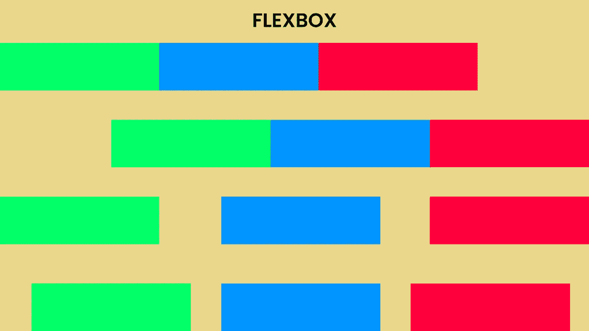

Flexbox

柔性盒模块，或 Flexbox，是一种一维布局模型，可以帮助我们以非常高效的方式处理空间分配。因为它是一维的，所以它一次处理一个维度的布局，即一行或一列。在本文中，您将看到 Flexbox 的所有有用属性，您可以在样式表中使用它们来进行更好的设计。

## 两个轴

Flexbox 有两个轴:主轴和横轴。

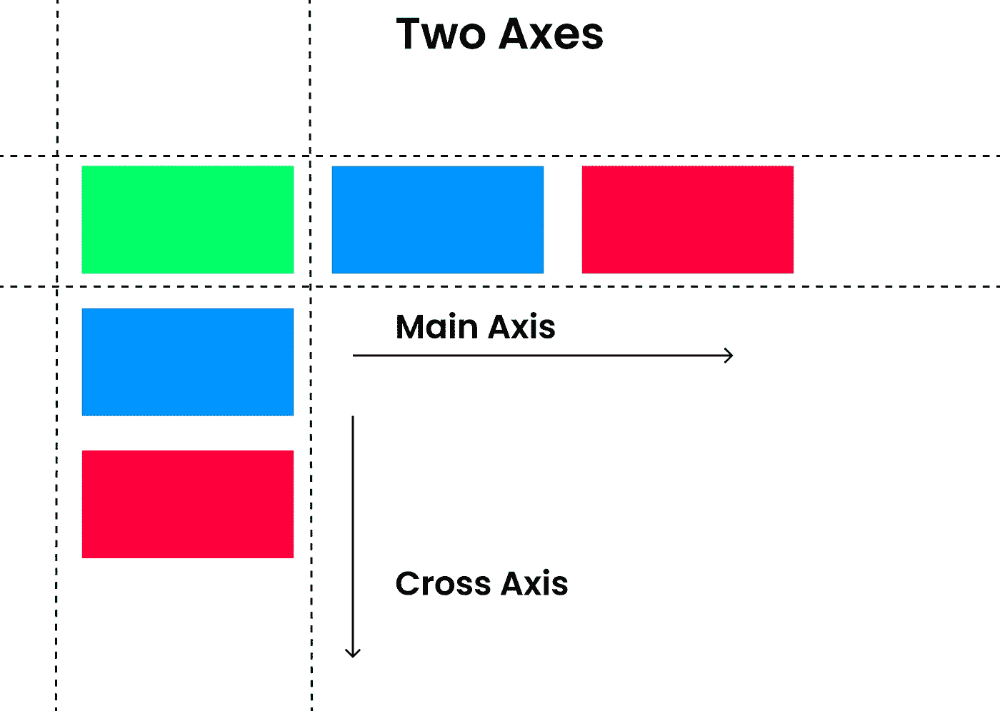

主轴和横轴

主轴是默认值。Flexbox 有两个主轴属性，**行**和**行-反转。****行**属性是默认行为，从屏幕左侧一直运行到右侧。 **Row-reverse** 反转整行，因此最后一个元素将被视为逆序的第一个元素。

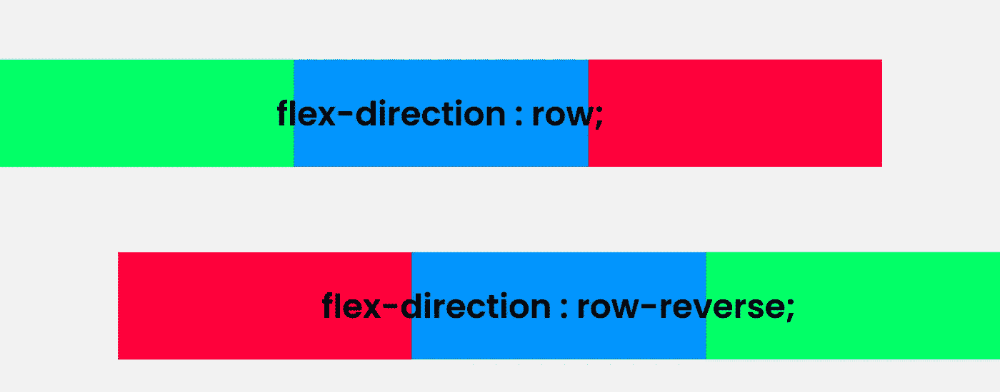

主茎

横轴垂直于主轴。基本上，在横轴中主轴改变方向，从上到下运行。我们可以通过使用属性" **flex-direction，"**来改变方向，因此您所要做的就是将父元素设置为 flex，使用 flex-direction 并设置方向**列**或**列-reverse。**

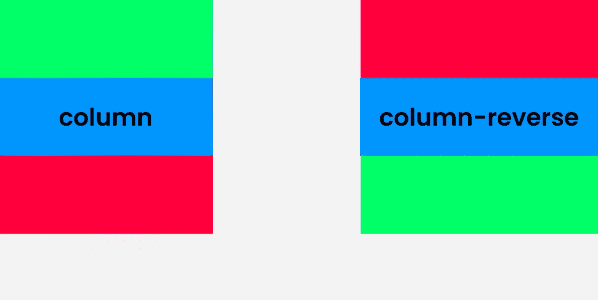

横轴

***注意:*** *如果主轴设置为行或行反转，则横轴沿列运行。如果主轴设置为列或列反转，则横轴沿行延伸。*

## 子属性

Flexbox 子属性使我们能够更好地控制 flex 项目。这些包括元素相对于它们的柔性容器的增长、收缩和缠绕。(将显示属性设置为 flex 的 flex 项目/子元素的**父**元素被称为 flex 容器，或者简单地说，flex 容器是具有 flex 显示的元素。)子属性是:

1.  灵活增长
2.  弯曲收缩
3.  柔性包装
4.  弹性基础

**flex-grow** flex-grow 属性使 flex 项沿主轴增长，项将相对于该轴上的可用空间扩展。有趣的是，我们可以在每个单独的项目中使用该属性，使它们根据需要进行不同的扩展。

HTML:

```
<div class="parent"> 
        <div class="child child1"></div>
        <div class="child child2"></div>
        <div class="child child3"></div>
 </div>
```

CSS:

```
.parent{
    display: flex;
    background: #f2f2f2;
}.child{
    height: 100px;
    width: 100px;
    flex-grow: 1;
}.child1{background: #00FF66;}
.child2{background: #0094FF;}
.child3{background: #FF003D;}
```

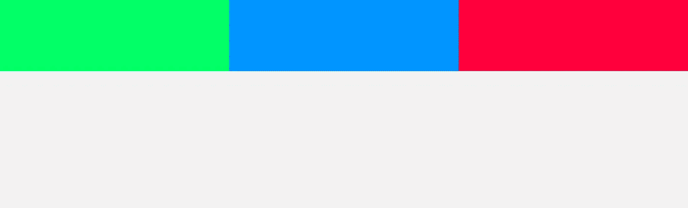

以上代码的结果

将 flex-grow 属性设置为 1 会使子项在主轴上均匀扩展。让我们从“中移除 flex-grow。child”类，并将其设置为每个单独的子元素。

```
.child {
    height: 100px;
    width: 100px;
}
.child1 {
    background: #00FF66;
    flex-grow: 1;
}
.child2 {
    background: #0094FF;
    flex-grow: 2;
}
.child3 {
    background: #FF003D;
    flex-grow: 3;
}
```

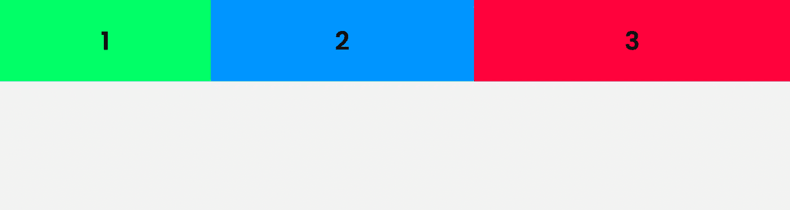

以上代码的结果

***注意:*** *为了澄清，flex-grow 属性需要一个整数。这指定了项目的增长，而不是顺序。因此，我们可以将 child1、child2 和 child3 分别设置为 1、2 和 3，而不是将其设置为 3、5、7，这样仍然会得到与上面相同的结果。*


其他一些例子有:

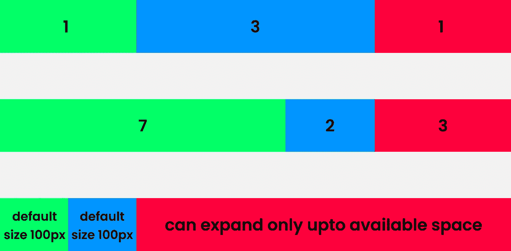

对于最后一个，前两个子节点的 flex-grow 设置为 0。这意味着它们将保持默认大小，在我们的例子中是 100 像素。

**伸缩** 伸缩属性指定伸缩项目的“伸缩因子”。这与 flex-grow 相反，在 flex-grow 中，如果行上没有足够的空间，则项目相对于 flex 项目收缩。

```
<div class="wrapper">
      <div class="parent"> 
        <div class="child child1"></div>
        <div class="child child2"></div>
        <div class="child child3"></div>
    </div>
</div>.wrapper{
    width: 100%;
    max-width: 960px;
}
.parent{
    display: flex;
}

.child{
    width: 320px;
    height: 100px;
}
.child1{
    background: #00FF66;
    flex-shrink: 1;
}
.child2{
    background: #0094FF;
    flex-shrink: 2;
}
.child3{
    background: #FF003D;
    flex-shrink: 3;
}
```

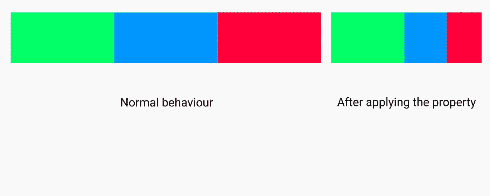

缩小浏览器尺寸以查看结果。

伸缩也需要一个整数。请记住，物品的比率设置得越大，它相对于其他物品的大小就越小。

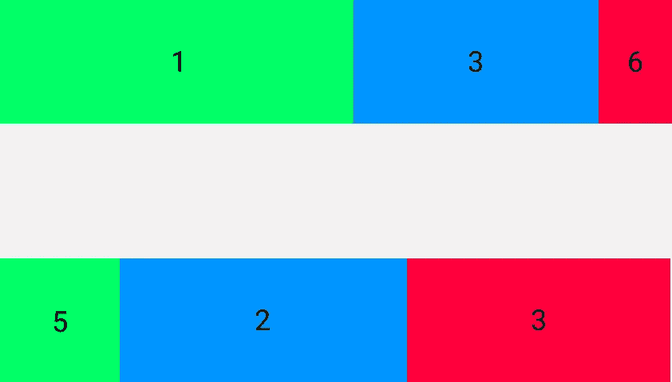

**flex-wrap** flex-wrap 属性指定 flex 项是否应该换行。Flex-wrap 包含三种可以在其上设置的不同类型的值:

1.  Wrap:必要时包装 flex 项目；
2.  Wrap-reverse:如有必要，以相反的顺序包装 flex 项目；和
3.  Nowrap:默认值；指定伸缩项不换行。

考虑一个示例，其中 flex 容器具有 100%的宽度，并且 flex 容器的每个 flex 项目被赋予相等的宽度量，即 33.33%。在这种情况下，flex-wrap 属性将不起作用，因为 flex 项目的总组合宽度为 99.99%，几乎等于 100%，但是如果任何 flex 项目具有更大的宽度(比如说与其他项目相比宽 34%)，则如果该属性设置为 wrap 或 wrap-reverse，该项目将换行。

```
.parent{
    display: flex;
    flex-wrap: wrap;
    width: 100%;
}

.child{
    width : 33.33%;
    height: 100px;
}
.child1{
    background: #00FF66; 
}
.child2{
    background: #0094FF;
}
.child3{
    background: #FF003D;
    width: 34%; 
    height: 100px;
}
```

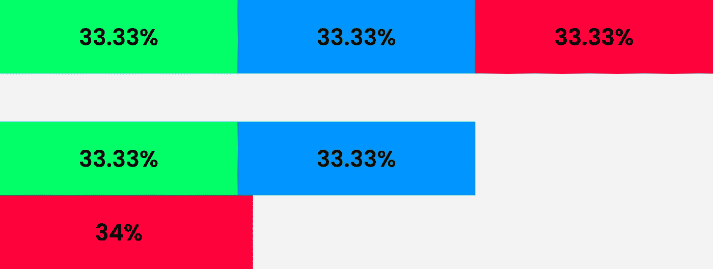

上述示例以可视格式显示

**flex-basis** flex-basis 属性有点类似于 min-width；它指定伸缩项的起始宽度。唯一的区别是，具有最小宽度的元素将保持它的值，如果屏幕变小，浏览器将添加一个滚动条来查看整个元素。但是在弹性基础的情况下，项目通常会像弹性项目一样收缩。

```
.parent{
    display: flex;
    flex-wrap: wrap;
    width: 100%;
}

.child{
    flex-basis: 300px; /* change flex-basis to min-width and reduce   the borwser size to see the difference */
    height: 100px;
}
```

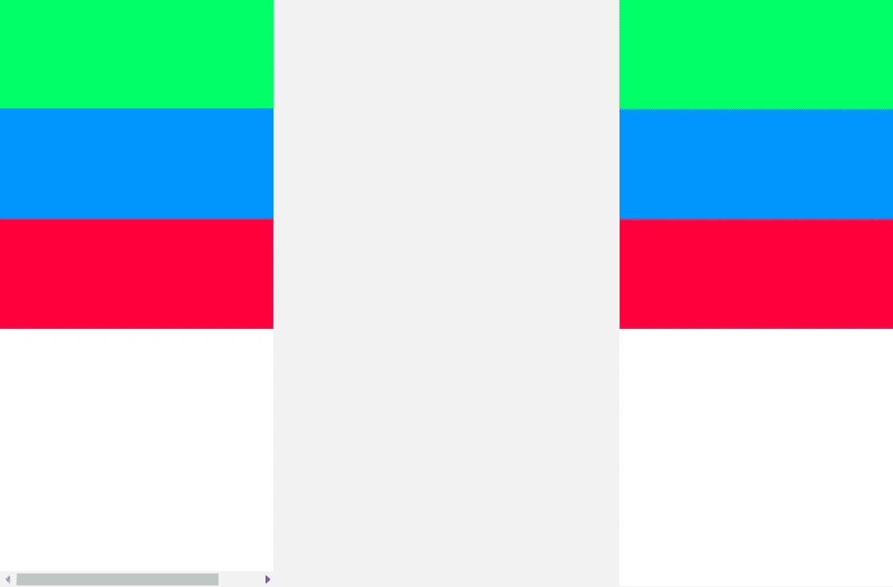

观察左侧屏幕截图底部的滚动条。

## 人手不足

Flexbox 有一些子属性，这些子属性实际上是简化工作的简写属性。

**flex 速记。** 这是**伸缩增长**、**伸缩收缩**和**伸缩基础**的简写。flex-shrink 和 flex-basis 参数是可选的:这意味着在使用 flex 时，可以将 flex-shrink 或 flex-basis 参数与 flex-grow 一起使用。

**语法:** flex:*flex-grow*flex-shrinkflex-basis| auto | initial | inherit；
例子:

```
flex : 1 1 200px;
flex : 1 200px;
flex : 1 1;
flex : 0 1 400px;
```

**伸缩流简写** 这是**伸缩方向**和**伸缩缠绕的简写。**您可以使用其中一个或两个参数，而不必考虑顺序。

**语法:**flex-flow:flex-direction | | flex-wrap
示例:

```
flex-flow: row-reverse wrap;
flex-flow: row wrap-reverse;
flex-flow: column;
flex-flow: wrap; 
```

# Flexbox 的魅力

我最喜欢 Flexbox 的一点是它能够让**对齐**和**对齐** flex 项目，并在它们之间分配空间。

## 对齐-项目

顾名思义，align-items 属性控制 flex 项在横轴上的对齐方式。

**拉伸**是项目被拉伸以适应伸缩容器的默认值。
**Flex-start** 将物品定位在 flex-container 的中心。
**Flex-end** 将物品放置在柔性容器的末端。
**中心**将项目定位在柔性容器的中心。

```
<div class="parent"> 
        <div class="child child1">item 1</div>
        <div class="child child2">item 2</div>
        <div class="child child3">item 3 Curabitur aliquet quam id  dui posuere blandit.</div>
</div>.parent{
width: 250px;
height: 200px;
border: 1px solid black;
display: flex;  
align-items: center; /* put any value and observe */
}.child1 { background: #00FF66; }
.child2 { background: #0094FF; }
.child3 { background: #FF003D; }
```

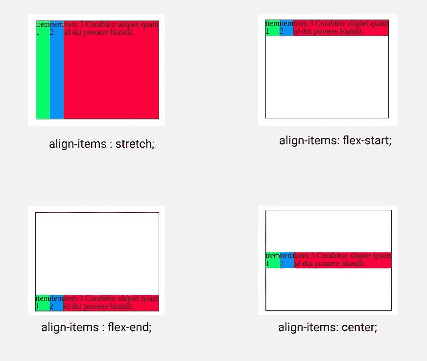

对齐项目示例

## 调整内容

Justify-content 在主轴上对齐 flex 项目，并指定项目之间和项目周围的空间分布。

**Flex-start** 是在主轴起点对齐项目的默认值。
**Flex-end** 将 Flex 项目定位在 flex-container 的末端。 **中心**将伸缩项目定位在伸缩容器的中心。
**Space-between** 在 flex-container 中平均分配 flex 项目之间的可用空间。
**空间环绕**平均分配项目，在两端留出一些空间。
**等间距**以相等的间距均匀分布项目。

```
.parent{
    width: 500px;
    height: 200px;
    border: 1px solid black;
    display: flex;
    justify-content: space-evenly; /* put different values and observe */
}
.child{
    text-align: center;
    line-height: 50px;
    height: 50px;
    width: 80px;
}
```

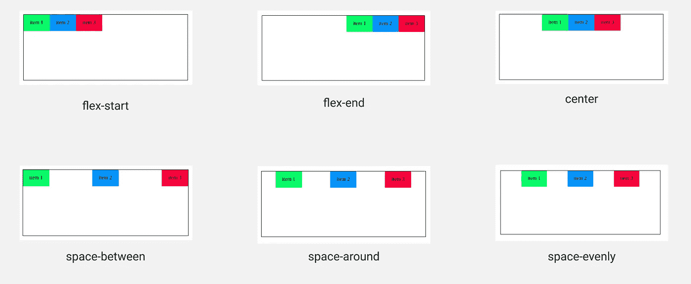

调整内容示例

在结束这篇文章之前，我想给出一个问题的解决方案"**如何将一个 div 放在另一个 div 的中间。"**这是使用 Flexbox 的方式:

```
<!-- HTML -->
 <div class="parent"> 
  <div class="child">against the current</div>
 </div> /* CSS  */
.parent{
            margin: 0 auto;
            margin-top: 30%;
            width: 500px;
            height: 200px;
            border: 1px solid black;
            display: flex;
            justify-content: space-evenly;
            align-items: center;
         }
        .child{
            text-align: center;
            line-height: 100px;
            height: 100px;
            width: 200px;
            background: pink;
        }
```


谢谢你读到这里。