# 使用 CSS 网格和 Flexbox 创建一个图库

> 原文：<https://betterprogramming.pub/how-to-use-css-grid-and-flexbox-to-create-an-image-gallery-924f7896d142>

## 理解 Flexbox 的实际例子

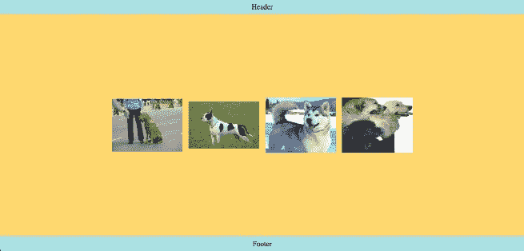

如果你是前端开发人员，你应该很了解如何应用 [CSS Grid](https://developer.mozilla.org/en-US/docs/Web/CSS/CSS_Grid_Layout/Basic_Concepts_of_Grid_Layout) 和 [Flexbox](https://developer.mozilla.org/en-US/docs/Web/CSS/CSS_Flexible_Box_Layout/Basic_Concepts_of_Flexbox) 。虽然掌握这些技能并不难，但不练习一段时间后很容易忘记。

在本文中，让我们一起练习使用 CSS Grid 和 Flexbox 来避免生疏。我将展示如何使用以下代码来规划和编码一个图片库:

*   页面布局的 CSS 网格
*   用于对齐图像的 Flexbox

为了增加一点挑战性，我将用来自公共 API 的随机图像填充图像库。

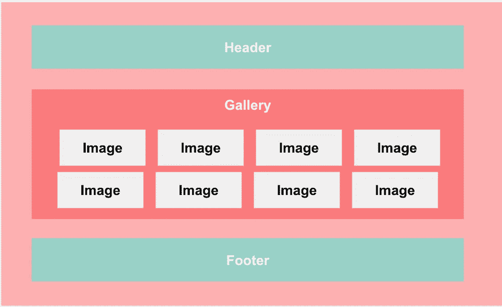

我们将在本文中创建的模型

让我们看一下计划。

# 1.编码前计划

如果你读过我写的关于创建一个单页布局的文章，你就会知道编写布局的诀窍是事先有一个计划。

让我们从使用 CSS 网格的页面布局开始。

## CSS 网格:确定行数

我首先将元素(在下面的屏幕截图中用方框表示)横向分组。

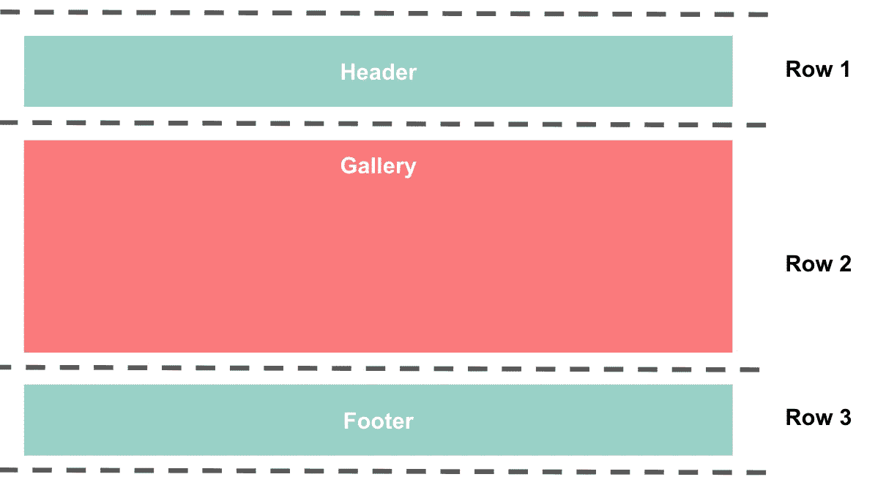

因为页眉、画廊和页脚各占一行，所以需要三行。

**注意:**图像不包含在页面布局中，因为它们嵌套在图库中，不被视为网格的一部分。

## 确定列数

接下来，我决定列的数量，看看垂直方向上有多少组。此布局只需要一列。

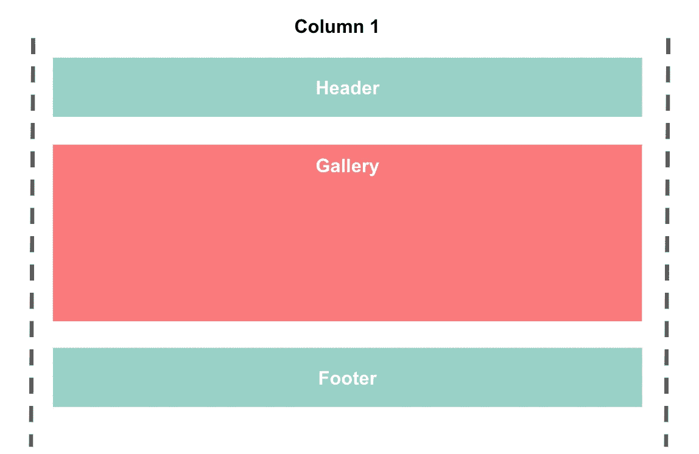

## 创建指南

在确定了列数和行数之后，我现在有了一个在编码时可以遵循的指南。在本指南中，我标出了网格线，并记下了父元素和子元素。

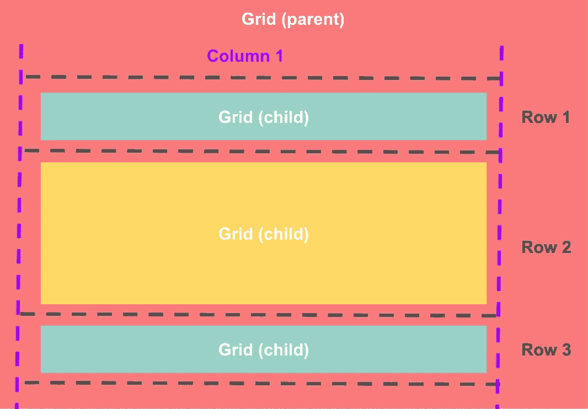

至于图片库里面的图片，我计划在它们上面应用 Flexbox，我可能会为图片添加一个换行，以便当它在一行中占据更多空间时，将它分成不止一行。

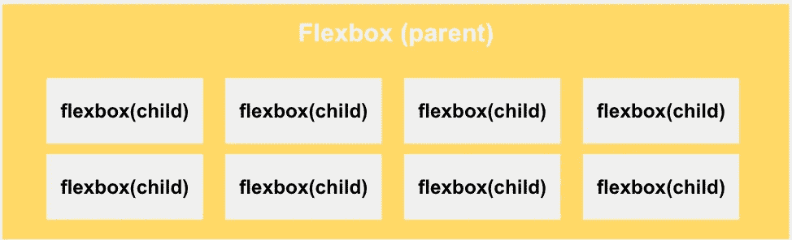

# 2.创建 HTML 文件

对于一个简单的布局，我在处理 CSS 之前把所有的 HTML 都打出来。

注意，我只添加了`<header>`、`<div>`和`<footer>`。``标签不包括在内，因为它们将使用 JavaScript 动态添加。

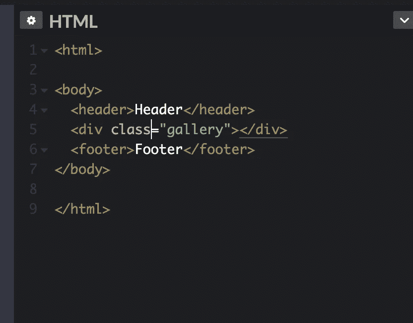

# 3.创建 CSS 文件

创建 CSS 文件，并将其链接到 HTML 文件。

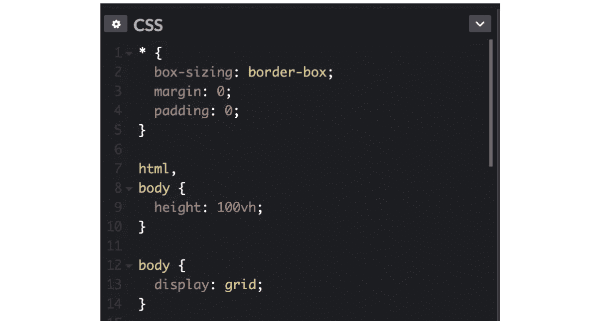

## 设置

*   移除所有元素的默认边距和填充，并应用`box-sizing: border-box`。应用后者告诉浏览器考虑为元素的宽度和高度指定的值中的任何边框和填充。
*   将`height: 100vh`添加到`body`元素中，这样页面就会充满浏览器窗口。

## 创建网格

*   在`body`元素上声明`display:grid`，将它变成一个网格容器(又名*网格父*)。这是创建显示在页面上的响应式布局的重要一步。

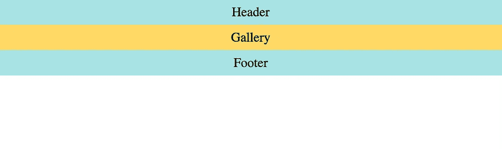

' body '元素上加与不加'`display: grid'`的区别。

*   接下来，指定网格行的高度。由于`header`和`footer`只包含内容，所以图片库应该扩展到页面的其余部分——同时将`footer`推到页面的末尾。添加`grid-template-rows: min-content auto min-content`。

**注意:**`min-content`的值是表示占据网格轨道的网格项的最大最小内容贡献的关键字，而`auto`是如果是最大值则与最大内容相同的关键字。

之后再添加一些表面的 CSS，让页面看起来更好看。

单击“运行笔”查看页面和代码

# 3.切换到 JavaScript 并创建 JavaScript 文件

创建一个 JavaScript 文件，并将其作为脚本包含在 HTML 文件中。

如果你要将代码从 CodePen 复制到你自己的代码编辑器中，下面是一个你应该如何将 CSS 和 JavaScript 链接到 HTML 文档的例子。

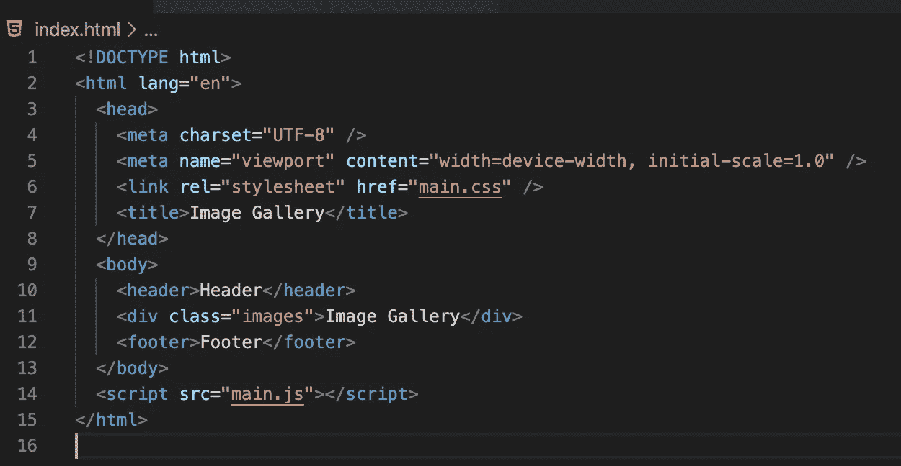

为了从公共 API[Dog API](https://dog.ceo/dog-api/)获取图像，我使用了 fetch API，这是浏览器的一个功能。fetch API 提供了一个通过网络获取资源的接口。

`fetch()`方法将我们想要获取的资源的 URL 路径作为参数。无论成功与否，它都返回一个解析为该请求的`Response`的`Promise`对象。

一个`then`方法可以被链接到一个`fetch()`方法来对`Response`数据执行代码。在这个阶段，需要对数据进行一些处理，将其转换成可以在我们的网页上使用的形式。

```
fetch(“[https://dog.ceo/api/breeds/image/random/10](https://dog.ceo/api/breeds/image/random/10)")
 .then((response) => response.json())
 .then((data) => data.message)
 .then((arrayOfLinks) => addPhoto(arrayOfLinks))
 .catch((e) => console.log(e));
```

上面的代码显示了如何在页面上呈现狗的图像。`fetch()`如何工作超出了本文的范围。我只想说，您现在可以复制代码并使用它。

用作参数的 URL 路径取自 Dog API 的文档。

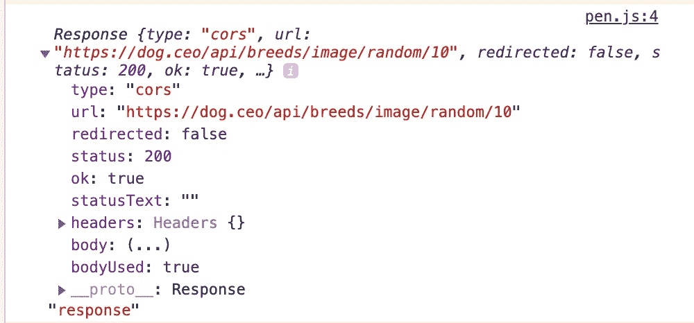

我得到的响应数据。

然后，我们将一些`then()`方法链接到我们的 fetch 调用:

*   第一个`.then()`解析返回的`Response`数据，并返回一个以 JSON 格式解析结果数据的承诺

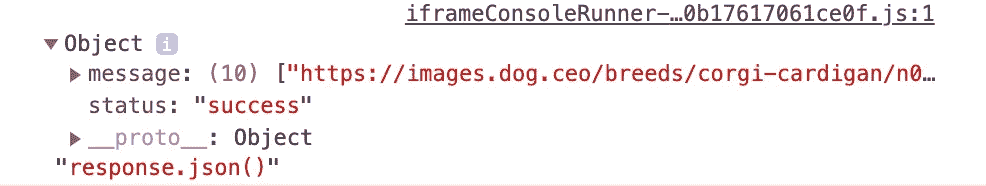

*   第二个`.then()`方法提取保存在 JSON 数据的`message`属性中的数据
*   第三个使用从`message`属性提取的数组作为参数来调用创建`img`元素的函数
*   如果代码中有错误，JS 引擎将运行最后一行的`.catch()`方法

让我们一行一行地检查`addPhoto`函数中的代码。

```
function addPhoto(links) {
  let gallery= document.querySelector(".gallery");
  for (let link of links) {
    let image = document.createElement("img");
    image.src = link;
    gallery.appendChild(image);
  }
}
```

*   当调用`addPhoto`时，一个新的执行上下文被创建，其中作用域变量`gallery`被声明并赋给`document.getElementById(“images”)`
*   一个`for`循环用于从图像数组中提取每张狗图像的 URL 路径

**注意:**如果你需要复习一下，MDN 提供了一个很好的关于用 JavaScript 操作 DOM 的[指南。](https://developer.mozilla.org/en-US/docs/Learn/JavaScript/Client-side_web_APIs/Manipulating_documents)

*   在`for`循环的每一次迭代中，一个名为`image`的新范围变量被声明并赋给`document.createElement(“img”)`。这将创建 HTML `img`元素。
*   使用点符号将属性`src`添加到`image`变量中。然后它被赋值给`link`的值。
*   然后用`gallery.appendChild(image)`将`image`变量添加到图库中
*   一切完成后，我在页面上得到一个 10 张图片的列表

最后要做的是处理图像的定位和样式

# 4.切换回 CSS

回忆一下我的图库计划:

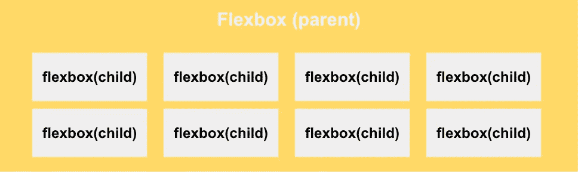

为了将图库转换成 flex 容器，我在类名为`gallery`的`div`元素上添加了`display: flex`。

还记得我在图库中嵌套了动态生成的图像吗？

通过在类名为`gallery`的`div`元素上应用`display: flex`，嵌套的图像现在是 flex 项(flex 子元素)。

要将 flex 项目排列成行，并在它们无法全部放入一行时将它们拆分到另一行，请在`img`元素上添加简写`flex-flow: row wrap`。

单击“运行笔”查看页面和代码

接下来，我将处理图像的大小。

我首先固定每个图像的高度，并在每个图像之间添加一些空间。为此，我在周围声明`height: 200px`和`padding of 10px`。

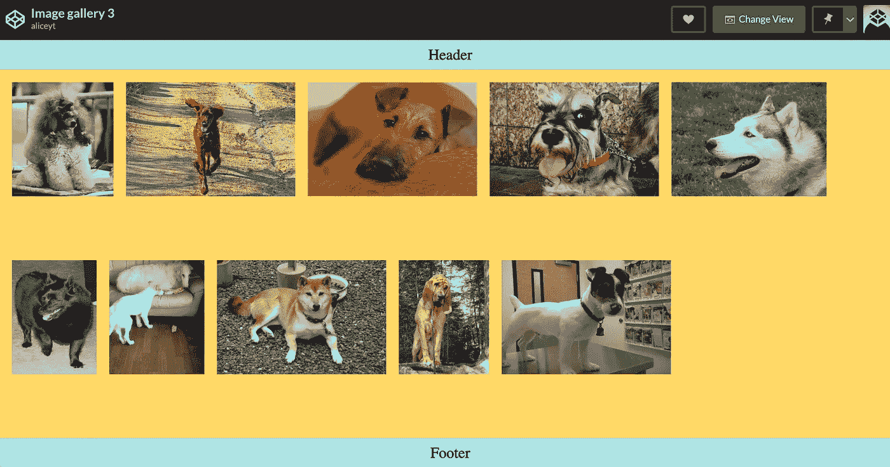

然后我声明`flex-grow: 1`来扩展图像。该值指定 flex 容器中分配给每个`img`元素的剩余空间量。

单击“运行笔”查看页面和代码

# 5.检查任何有问题的样式

注意最后一行的图像是如何被拉伸的？

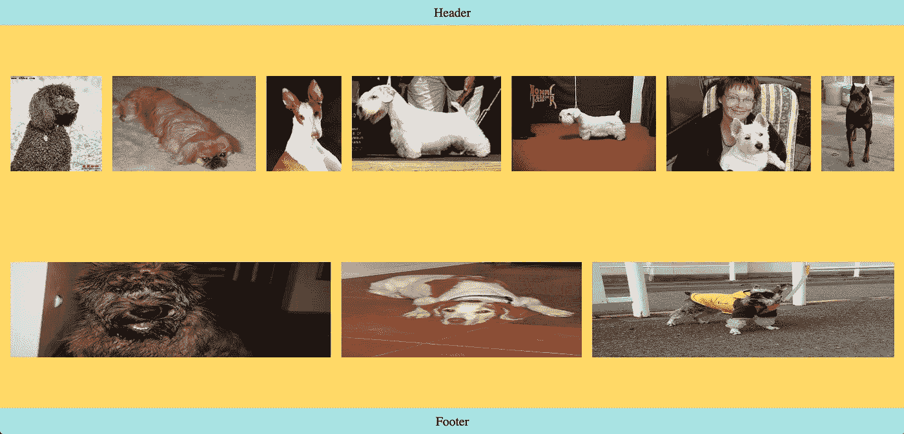

那是因为我之前在图像上应用了`flex-grow: 1`。由于最后一行中的图像太少，无法填满 flex 容器的整个宽度，因此这些图像必须扩展以填满 flex 容器的整个宽度。

为了确保它们不会扩展太多，给图像添加`max-width: 250px`。

在`img`元素上，我声明了`align-items: center`和 `justify-content: center`来使元素在父容器中居中。

# 最后一步

最后，当我有太多或太少的图片时，我会检查是否有任何布局问题。

这是通过更改 URL 路径的编号来实现的，例如，将值从`10`更改为`4`，以在页面上呈现一个图像。

```
fetch(“[https://dog.ceo/api/breeds/image/random/10](https://dog.ceo/api/breeds/image/random/10)")
 .then((response) => response.json())
 .then((data) => data.message)
 .then((arrayOfLinks) => addPhoto(arrayOfLinks))
 .catch((e) => console.log(e));
```

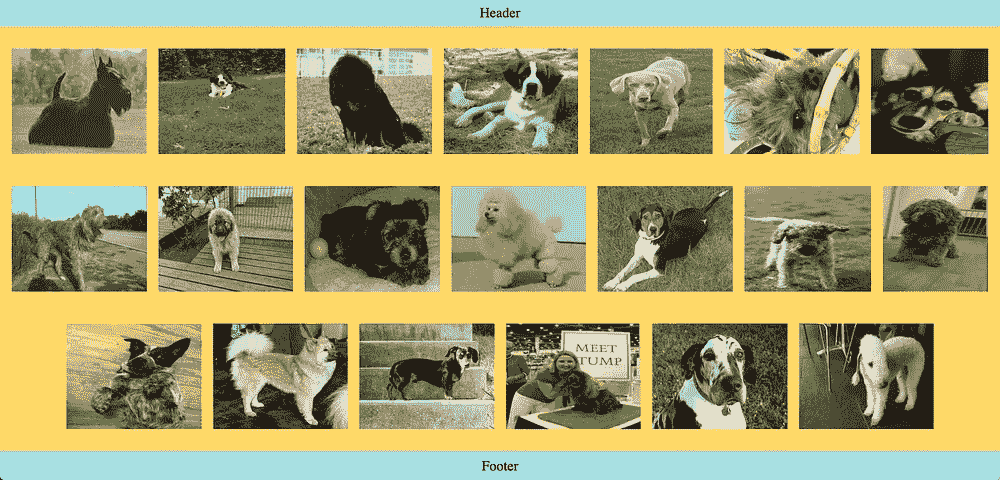

# 作者说明


卢卡·奥尼博尼在 [Unsplash](https://unsplash.com/s/photos/author?utm_source=unsplash&utm_medium=referral&utm_content=creditCopyText) 上的照片

在准备这篇文章时，我发现自己参考了 MDN 文档几次，因为我忘记了 Flexbox 和 CSS Grid 的一些语法。虽然参考文档是一种常态，但我发现自己参考文档的次数比之前关于布局的文章要多，因为我已经有一段时间没有编写页面布局代码了。

这对我来说是一个及时的提醒，在一段时间没有练习之后，很容易忘记如何使用 Flexbox 和 CSS Grid。

希望这篇文章能刷新你对 Flexbox 和 CSS Grid 的记忆。如果你在工作中没有应用它们，这可以提醒你自己练习使用 CSS Grid 和 Flexbox！

# 摘要

概括地说，本文中使用的布局属性是:

## 格子

*   `display: grid`
*   `grid-template-rows`

## Flexbox

*   `display: flex`
*   `flex-flow`
*   `flex-grow`

请参考下面的资源以了解更多信息:

*   [MDN Flexbox 的基本概念](https://developer.mozilla.org/en-US/docs/Web/CSS/CSS_Flexible_Box_Layout/Basic_Concepts_of_Flexbox)
*   [MDN 的 Flexbox](https://developer.mozilla.org/en-US/docs/Learn/CSS/CSS_layout/Flexbox)
*   [基于 MDN 的 CSS 网格布局](https://developer.mozilla.org/en-US/docs/Web/CSS/CSS_Grid_Layout)
*   [CodePen 收藏本文使用的所有笔](https://codepen.io/collection/nrpOBL)