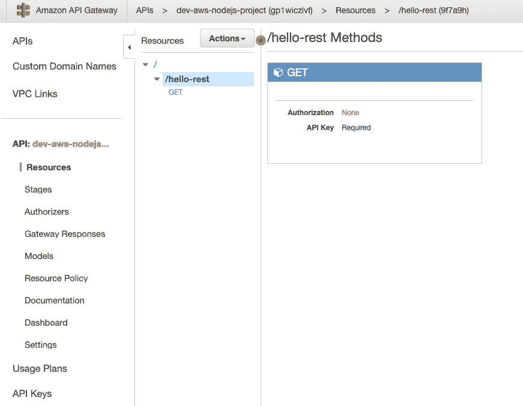
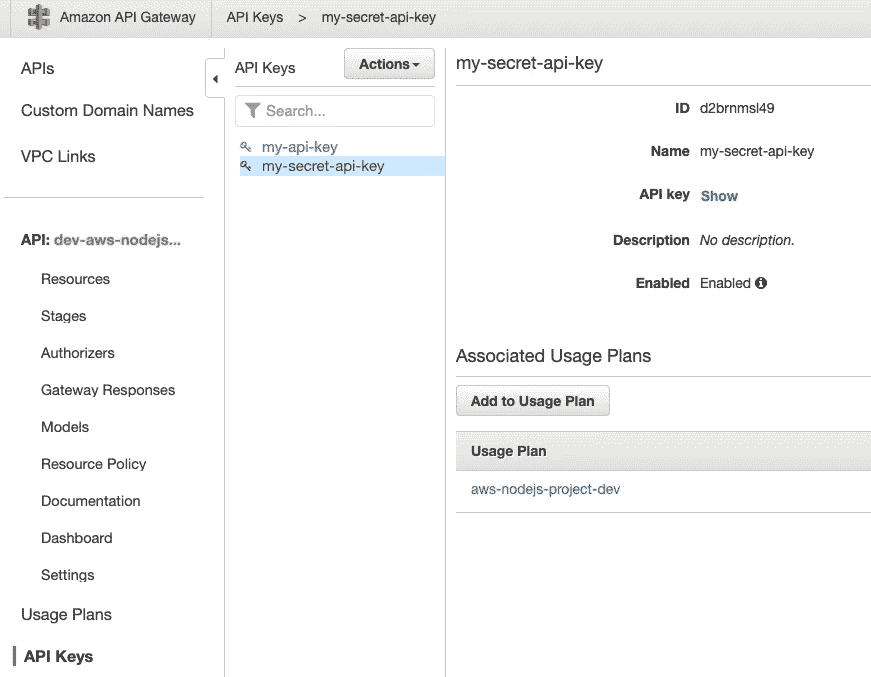
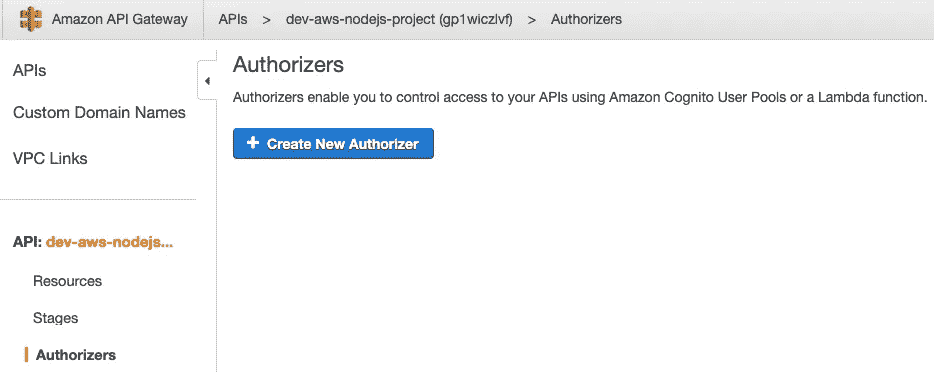
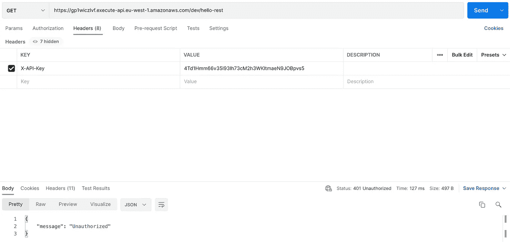
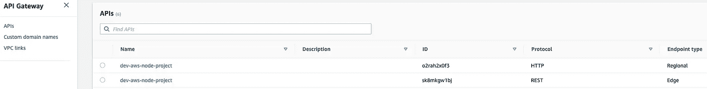
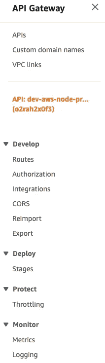
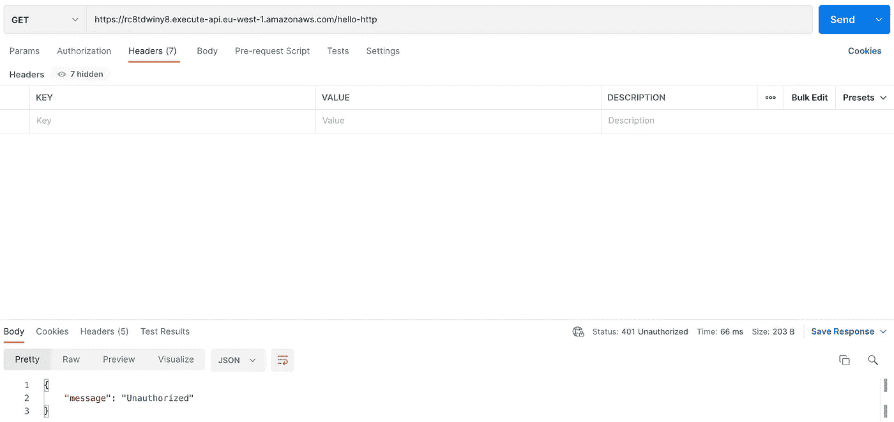
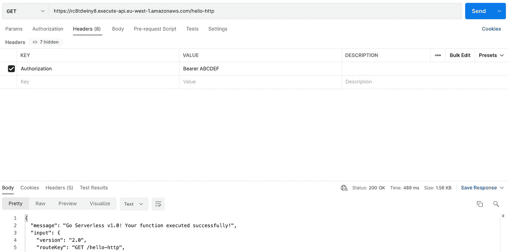

# 如何在 AWS API 网关中使用无服务器的自定义授权器

> 原文：<https://betterprogramming.pub/how-to-use-custom-authorizer-in-aws-api-gateway-with-serverless-4ddf42f32390>

## 自定义授权器和无服务器


图片由[https://unsplash.com/@adigold1](https://unsplash.com/@adigold1)

# 介绍

在本教程中，我们将回顾如何设置两个*相似的*API。我们将在无服务器的帮助下，比较 AWS 中使用 REST API 和 HTTP API 的异同。每个解决方案都有自己的优点和缺点。

要开始本教程，您必须至少熟悉基本的 Javascript 编程，安装了 VS 代码(或您喜欢的任何 IDE)，熟悉命令提示符，安装了`npm`和`aws-cli`，最重要的是拥有配置了凭证的 AWS 帐户。如果你正在读这篇文章，那么我认为你已经具备了所有的先决条件。

首先，让我们快速回顾一下 AWS 及其令人困惑的*命名约定。*

AWS —显然代表亚马逊网络服务。为了遵循本教程，你必须至少有一些基本的 AWS 知识或兴趣来学习一些新的东西。

**API** —应用编程接口。连接计算机程序并允许数据交换的软件。很快我们将意识到 API 缩略词几乎无处不在:

**API 网关** —顾名思义，是我们 API 的网关。登录 AWS 帐户后，我们可以导航到 API Gateway，以便检查或手动配置不同的 API。

**REST API** 又名**API Gateway v1**——当今最常见的 API 类型。

**HTTP API** 又名**API Gateway v2**——我们刚刚说了一些令人困惑的命名约定吗？现在开始。HTTP API 也是 REST API！但是，AWS 决定命名 HTTP API (v2)，以区别于 REST API (v1)。此外，HTTP 代表超文本传输协议，REST API (v1)和 HTTP API (v2)都可以使用。因此，我们将使用 HTTP *协议*向 REST API (v1)和 HTTP API (v2)发送请求。

**API Key** —我们 API 的密钥，随机字母和数字格式。REST API (v1)支持这一点，而 HTTP API (v2)不支持。

**授权人**—API 访问控制的另一种形式。但是，这种方法更加复杂，可以根据访问策略和用户权限授予对某些资源的访问权限。

# 无服务器

如果你还没有`serverless`(简称`sls`，那么最简单的方法就是通过`npm`在全球范围内安装它:

```
npm install -g serverless
```

不过，让我们先启动空的`npm`项目

```
mkdir aws-nodejs-project
cd aws-nodejs-project
npm init -y# Right now we have empty project
# Let's add slsnpm install serverless --save-dev# Create empty SLS projectnpx sls create -t aws-nodejs
```

成功完成最后一个命令后，我们的 aws-nodejs-project 将包含以下文件或目录:

```
handler.js
node_modules
package-lock.json
package.json
serverless.yml
```

# REST API

我们打开`serverless.yml`做必要的修改吧。如果你正在学习本教程，那么`serverless.yml`将会有很多例子，注释掉配置，因为我们已经使用了`aws-nodejs`模板(那是我们在`sls create`命令中使用的`-t`参数)。

我们可以清理干净然后离开，不多不少于:

```
service: aws-nodejs-project
frameworkVersion: '2'provider:
  name: aws
  runtime: nodejs12.x
  lambdaHashingVersion: 20201221functions:
  hello:
    handler: handler.hello
```

在这个阶段，我们应该能够使用`npx sls deploy -s dev -r eu-west-1`部署我们的功能

作为回报，我们将获得:

```
Serverless: Uploading service aws-nodejs-project.zip file to S3 (69.31 kB)...
Serverless: Validating template...
Serverless: Updating Stack...
Serverless: Checking Stack update progress...
...............
Serverless: Stack update finished...
Service Information
service: aws-nodejs-project
stage: dev
region: eu-west-1
stack: aws-nodejs-project-dev
resources: 6
api keys:
  None
endpoints:
functions:
  hello: aws-nodejs-project-dev-hello
layers:
  None
```

然而，我们并没有真正配置任何端点，因为`events`部分被注释掉了。让我们在`functions`下快速重新添加这个

```
functions:
  hello:
    handler: handler.hello
    events:
      - http:
          path: /hello-rest
          method: get
```

一旦再次部署，我们将获得我们的端点地址，并且我们将能够对`/hello-rest`进行`GET`请求

尽管没有安全性，但任何人都可以访问我们的端点。我们先添加 API key，将`private: true`和`my-secret-api-key`添加到`serverless.yml`配置中:

```
service: aws-nodejs-project
frameworkVersion: '2'provider:
  name: aws
  runtime: nodejs12.x
  lambdaHashingVersion: 20201221
  apiKeys:
    - my-secret-api-keyfunctions:
  hello:
    handler: handler.hello
    events:
      - http:
          path: /hello-rest
          method: get
          private: true
```

像往常一样，在做出更改后，我们需要重新部署我们的功能:

```
npx sls deploy -s dev -r eu-west-1
```

作为回报，我们将获得 API 密钥:

```
Service Information
service: aws-nodejs-project
stage: dev
region: eu-west-1
stack: aws-nodejs-project-dev
resources: 14
api keys:
  my-secret-api-key: 4Td1Hmm66v35l93Ih73cM2h3WKltmaeN9JOBpvs5
endpoints:
  GET - [https://gp1wiczlvf.execute-api.eu-west-1.amazonaws.com/dev/hello-rest](https://gp1wiczlvf.execute-api.eu-west-1.amazonaws.com/dev/hello-rest)
functions:
  hello: aws-nodejs-project-dev-hello
layers:
  None
```

如果我们只是试图打开 URL(例如在网络浏览器中)，我们将得到`403 Forbidden`错误。重要的是 API Gateway 实际上已经停止了那个请求。

因此，让我们切换到 POSTMAN 并将`X-API-Key`头添加到`GET`请求中。我们使用`deploy`命令返回的密钥作为密钥值。

一旦我们发送更新的请求，那么作为回报，我们将得到`200 OK`和由`handler.js`生成的主体:

```
module.exports.hello = async (event) => {
  return {
    statusCode: 200,
    body: JSON.stringify(
      {
        message: 'Go Serverless v1.0! Your function executed successfully!',
        input: event,
      },
      null,
      2
    ),
  };// Use this code if you don't use the http event with the LAMBDA-PROXY integration
// return { message: 'Go Serverless v1.0! Your function executed successfully!', event };
};
```

目前，我们的 REST API 正在工作，并受到`X-API-Key`的保护

如果我们登录 AWS 并转到 API Gateway，我们可以在那里找到我们的 API:



API 密钥在这里:



## REST API 中的自定义授权者

如果我们单击“授权人”链接，我们会看到还没有授权人:



但是，我们将使用无服务器，而不是通过 Web 控制台手动创建授权者。让我们回到我们的 IDE，修改几个文件:

创建一个新文件`authorizer.js`并添加以下代码。请注意，我们没有使用合适的令牌，而是硬编码了`ABCDEF`:

```
'use strict';module.exports.handler = async (event) => {
  if (event.authorizationToken === 'Bearer ABCDEF') {
    return {
      principalId: 'anonymous',
      policyDocument: {
        Version: '2012-10-17',
        Statement: [
          {
            Action: 'execute-api:Invoke',
            Effect: 'Allow',
            Resource: event.methodArn,
          },
        ],
      },
    };
  }
  throw Error('Unauthorized');
};
```

接下来，让我们修改`serverless.yml`并向其添加自定义授权人:

```
functions:
  hello:
    handler: handler.hello
    events:
      - http:
          path: /hello-rest
          method: get
          private: true
          authorizer: custom-authorizercustom-authorizer:
  handler: authorizer.handler
```

最后，我们需要用`sls deploy`命令重新部署我们的功能。

现在，让我们在 POSTMAN 中测试一下。如果我们不对请求做任何更改，我们将得到`401 Unauthorized`错误:



为了通过授权，我们必须在请求中添加`Authorization`标题:


现在，我们的端点受到了`API Key`和自定义授权器的保护，该授权器授予对某些资源的访问权限！

# HTTP API

如果我们想使用 HTTP API (API Gateway v2 ),那么我们可以通过创建一个新项目或者修改现有的项目来重新开始。事实上，我们可以在同一个项目中拥有 API v1 和 API v2！

在`functions`下的`serverless.yml`中，让我们添加一个名为`hello-http`的新功能:

```
functions:
...
  hello-http:
    handler: handler.hello
    events:
      - httpApi:
          path: /hello-http
          method: get
```

对于这个例子，我们没有创建新的处理程序。我们只是重复使用现有的。HTTP API 与 REST API 的主要区别在于`events`下的`httpApi`。此外，没有 API 键，我们还没有配置自定义授权！

一旦我们重新部署项目，那么这个端点将对每个人开放。

如果我们返回 AWS Web 控制台，那么在 API Gateway 中，我们将看到两个 API！



现有的 REST API 和新增的 HTTP API。值得注意的是，如果我们在 API Gateway 中打开我们的 HTTP API，那么可用的配置选项将会不同:



一个很大的区别是没有 API 键。对于所有的差异，我们可以查看这个比较页面:[在 HTTP APIs 和 REST APIs 之间选择](https://docs.aws.amazon.com/apigateway/latest/developerguide/http-api-vs-rest.html)

## HTTP API 中的自定义授权者

我们有一个工作的 HTTP API 端点，现在我们只需要用自定义授权器来保护它。然而，REST 和 API 授权者之间有一个微妙的区别。因此，让我们删除现有的 REST API，只留下 HTTP API。

先修改一下`serverless.yml`。我们可以删除现有的 REST API 函数，连同 API 键。然后，我们可以向 HTTP API 添加自定义授权器。我们的`serverless.yml`最终看起来会像:

```
service: aws-nodejs-project
frameworkVersion: '2'provider:
  name: aws
  runtime: nodejs12.x
  lambdaHashingVersion: 20201221
  httpApi:
    authorizers:
      customAuthorizer:
        type: request
        functionName: custom-authorizerfunctions:
  hello-http:
  handler: handler.hello
  events:
    - httpApi:
        path: /hello-http
        method: get
        authorizer:
          name: customAuthorizercustom-authorizer:
  handler: authorizer.handler
```

在我们重新部署我们的项目之前，我们必须在`authorizer.js`中做一些小而重要的改变

我们必须用现在的`event.headers.authorization`代替`event.authorizationToken`，并且我们必须用`Resource: event.routeArn`替换`Resource: event.methodArn`

此处更新`authorizer.js`

```
'use strict';module.exports.handler = async (event) => {
  if (event.headers.authorization === 'Bearer ABCDEF') {
    return {
      principalId: 'anonymous',
      policyDocument: {
        Version: '2012-10-17',
        Statement: [
          {
            Action: 'execute-api:Invoke',
            Effect: 'Allow',
            Resource: event.routeArn,
          },
        ],
      },
    };
  }
  throw Error('Unauthorized');
};
```

接下来，在重新部署项目后，如果没有`Authorization`头，我们的 HTTP API 端点将无法访问:



这正是我们所期待的！

现在让我们用我们的超级机密`ABCDEF`令牌添加`Authorization`头:



这就结束了我们使用定制授权器的 REST 和 HTTP API 比较。

# 结论

HTTP 和 REST APIs 非常相似。甚至命名约定也可以互换使用。然而，我们必须注意我们使用的是哪一个，因为有细微的差别。

你将选择哪一个取决于几个因素。比如你是否从头开始构建一个全新的 API，是否需要 API Keys 等。

在这两种情况下，我们可以使用配置和代码非常相似的定制授权器。