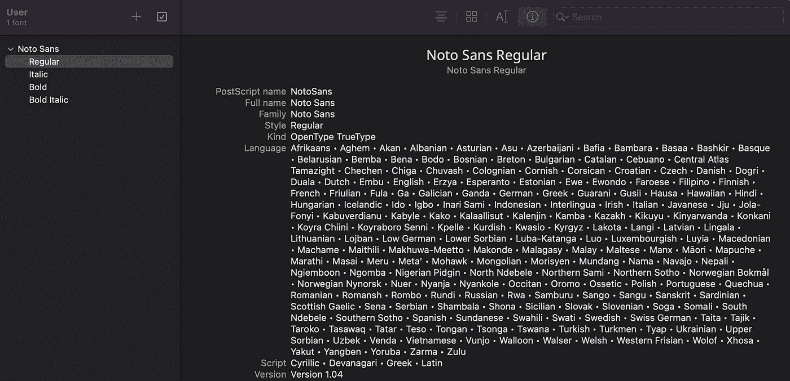
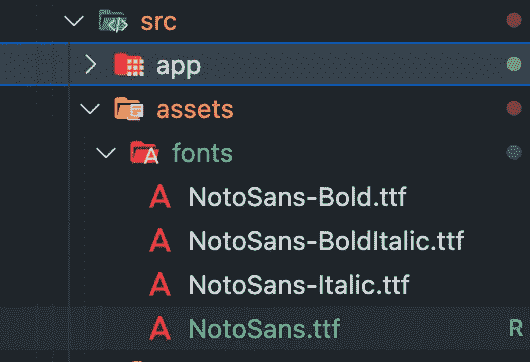
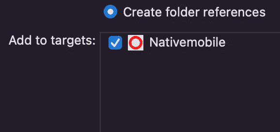
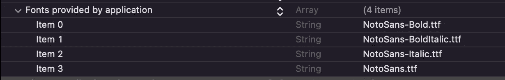

# 如何在 React 原生应用程序中使用自定义字体

> 原文：<https://betterprogramming.pub/how-to-use-custom-fonts-in-a-react-native-app-e581af7422a1>

## 适用于普通 RN 应用程序和 NX Monorepo 应用程序的分步指南


照片由[克拉丽莎·沃森](https://unsplash.com/@clarephotolover?utm_source=medium&utm_medium=referral)在 [Unsplash](https://unsplash.com?utm_source=medium&utm_medium=referral) 上拍摄

我写这篇指南的原因是，我是“调试时间节省你 5 分钟阅读文档”方法的受害者。不要落入这个陷阱。向 React 原生应用添加字体似乎很容易——事实也的确如此！

1.  第一步是下载你的字体。你可能会有几个`.ttf`文件(TrueType 字体),比如常规、中等、斜体和粗体——但是你可以有更多。你可以从[谷歌字体](https://fonts.google.com/)中获取你的字体。
2.  在 React 本地项目`src`目录中，您应该创建一个`assets`目录。在这里，每种资源(SVG、字体等)都有一个目录。因此，创建一个`fonts`目录并粘贴您下载的字体。
3.  在 React 本地项目的根目录下创建一个名为`react-native.config.js`的文件，并粘贴以下内容:

重要提示:请注意您在“资产”字段中填写的路径。如果您没有完全按照步骤 2，那么您应该修改路径，以匹配您粘贴字体的位置。

4.这一步同样非常重要:重命名文件以匹配字体的 PostScript 名称。我的字体不起作用的原因是我认为这一步不重要——天哪，我的不重要的时间也过去了。

打开“字体册”(如果您在 Mac 上)并导入您的字体。对于它们中的每一个，您应该切换到 info 选项卡(顶部的第四个)并检查 PostScript 名称。将每种字体重新命名。



对于我的例子——使用 NotoSans 字体，我需要将我的字体重命名为:



5.对于 iOS，您需要执行以下步骤:

5.1.在 Xcode 中打开 React 原生项目的`ios`目录。你应该打开`.xcworkspace`文件。

5.2.右键单击你的目标并添加一个新的组。我们将它命名为`Resources`。右键单击新创建的目录并选择`Add files to "<your target name>"`选项。您将从`assets/fonts`目录中选择 4 个文件。确保您的目标在`Add to targets`部分打勾。这将允许您的项目识别这些文件。



5.3.打开`info.plist`文件。这里我们将添加一个新的类型为`Fonts provided by the application`的数组。对于数组的每个值，我们将添加每个字体的确切文件名。重要提示:您必须包括`.ttf`扩展名。



如果您切换`info.plist`文件的视图，您的数组将如下所示:

```
<key>UIAppFonts</key>
<array>
  <string>NotoSans-Bold.ttf</string>
  <string>NotoSans-BoldItalic.ttf</string>
  <string>NotoSans-Italic.ttf</string>
  <string>NotoSans.ttf</string>
</array>
```

就是这样！

您将这样使用您的字体:

```
h1: {
  fontFamily: 'NotoSans',
  fontWeight: '500',
  fontSize: fonts.fontSize.dp22,
  color: TextDarkColor,
},
```

如果您遇到任何问题，请尝试清理两个平台的构建文件夹。做一个`npm install`。您还应该尝试将`react-native-vector-icons`添加到您的项目中。我看到一些地方告诉你添加这个——这也是我的项目的一部分。如果你尝试了这个方法，但是没有这个库它也不能工作，请留言帮助其他人。

# 结论

希望以上步骤对你有所帮助。如果您有任何问题或建议，请不要犹豫，评论这篇文章。这些教程的目的是创建适用于每个人的指南，其中包含清晰简洁的步骤，以及人们在遇到该任务时可以随时访问的指南。

感谢阅读！