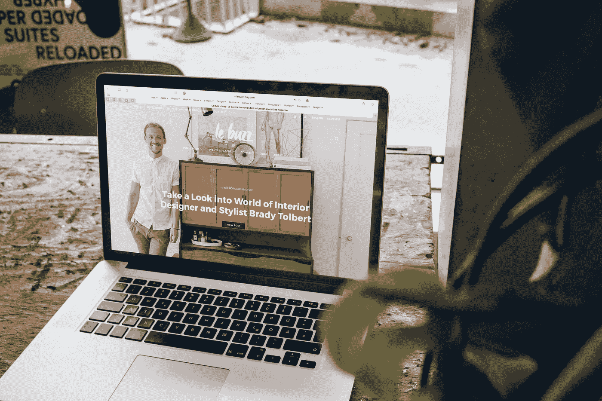
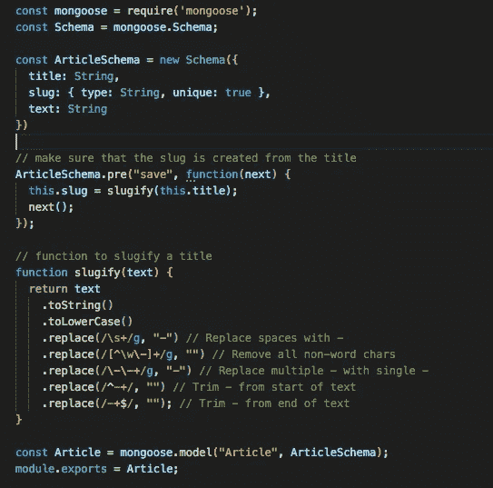
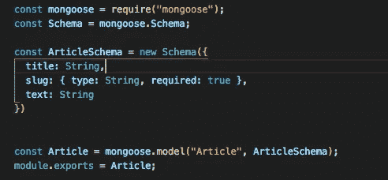
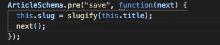
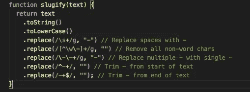
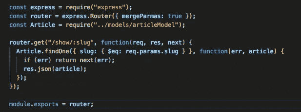
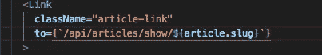
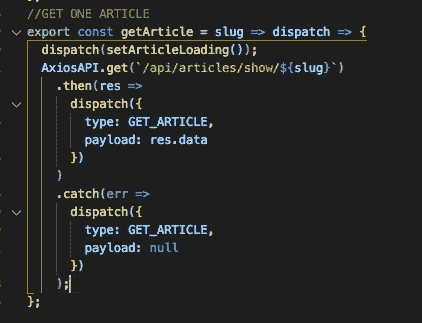

# 如何缩短你的 MERN 应用程序的网址

> 原文：<https://betterprogramming.pub/how-to-use-custom-slugs-in-your-url-instead-of-ids-on-your-mern-application-75d4e598081a>

## 使用自定义 slugs 代替 id

由 [Le Buzz](https://unsplash.com/@le_buzz?utm_source=unsplash&utm_medium=referral&utm_content=creditCopyText) 在 [Unsplash](https://unsplash.com/search/photos/blog?utm_source=unsplash&utm_medium=referral&utm_content=creditCopyText) 上拍摄

假设您正在创建一个博客，或者甚至是某种 CRUD 应用程序，并且您在 URL 中看到“www . your blog . com/1343324940234023423”。你难道不想看看像"www.yourblog.com/your-blog-title"这样的地方吗？

我知道我会的！

今天我将向你展示如何实现这一点。

我假设你已经设置好了博客的后端和前端。我不会指导您如何设置您的服务器或客户端——让我们直接进入您的博客模型代码。

## TL；速度三角形定位法(dead reckoning)

包含在您的 BlogModel 中的代码，用于将您的博客标题转换为在您的 URL 中使用的 slug:

# **后端**

好了，这是我创建的一个简单博客模型的片段。

我们想确保我们可以从来自客户的博客标题创建一个 slug。

`.pre`是猫鼬自带的钩子。具体来说，我们使用的是预保存挂钩，这是一个在文档保存到数据库后启动的中间件——非常简单明了。

接下来，我们定义之前添加到`BlogSchema`中的 slug。这段代码说明我们正在获取博客标题，并把它转换成一个 slug，这就是*函数* `slugify`正在做的事情。

现在，让我们写出这个函数来修改博客标题:

通过“强化”标题，我们基本上是把它从“这个博客标题”转换成“这个博客标题”。以下是博客模型的完整代码:

博客模型

现在让我们来看看路线。

展示一篇独特博文的基本途径:

博客. js

这里我们有一个路由，它是一个`get` 路由，当被定向时，它将在 url 中以这种格式显示您的博客标题:“www . your blog . com/your-blog-title”。但这并不是它的全部功能:它还会找到你试图向客户展示的独特的博客文章，并将其与正确的 slug 进行匹配。我知道有些人也在网址中使用博客 ID，所以这取决于你。我个人认为鼻涕虫是一个干净得多的外观！

# **客户端(React 和 Redux)**

快好了。现在我们所要做的就是改变`:slug`之前你的路线中可能使用的任何`:id`。在我的情况下，这包括任何链接到特定的博客文章。react-router 中的路由可以保持为`:id`。该鼻涕虫仍然会出现在您的网址。

## Redux

同样，如果你在你的应用程序中使用 Redux，也包括在动作创建器中改变它。在操作创建器中，您应该使用 ES6 语法:

actionCreator.js

并且:

我知道有一百万个其他的 npm 包和其他的方法可以做到这一点，但是，对我来说，这是最简单最容易的方法。希望这对你有帮助！