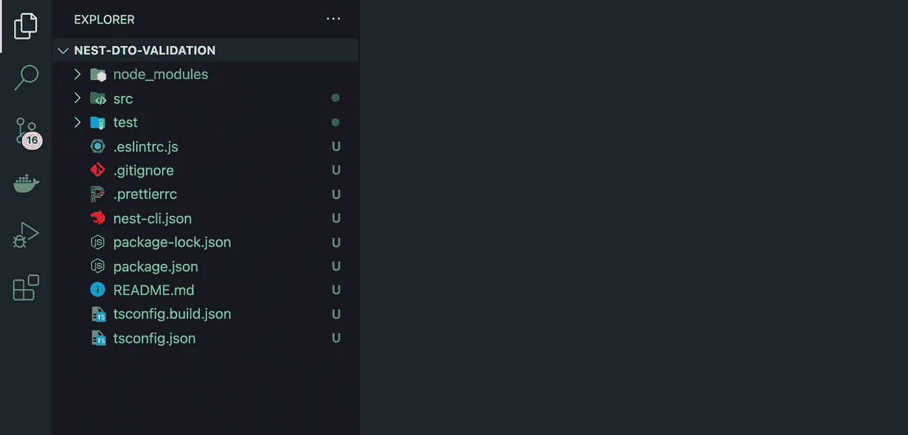

# 如何在 NestJS (2022)中使用 DTO 进行验证

> 原文：<https://betterprogramming.pub/how-to-use-data-transfer-objects-dto-for-validation-in-nest-js-7ff95309f650>

## 知道 DTO 在 NestJS 是如何工作的吗


照片由[费尔南多·埃尔南德斯](https://unsplash.com/@_ferh97?utm_source=medium&utm_medium=referral)在 [Unsplash](https://unsplash.com?utm_source=medium&utm_medium=referral) 上拍摄

今天我将讨论 NestJS 中的**数据传输对象** (DTO)以及如何使用它们来验证你的传入请求。

# 什么是 DTO？

DTO 本身更多的是为开发者和那些使用 API 的人提供指导，让他们知道请求体期望是什么样的形状，它实际上并不自己运行任何验证**。**

**然而，使用 TypeScript，您可以使用内置的[验证管道](https://docs.nestjs.com/techniques/validation)从[类验证器](https://github.com/typestack/class-validator)库中添加 decorators，并对传入的请求运行验证，以便只有预期的请求体可以进来。**

# **先决条件**

**需要对 Node.js 和 TypeScript 有基本的了解。我会选择 [Visual Studio 代码](https://code.visualstudio.com/)作为我的代码编辑器。你可以用你喜欢的任何东西。**

# **我们开始吧**

**首先，我们将安装 NestJS CLI，因此打开您选择的终端并键入:**

```
$ npm i -g @nestjs/cli
```

**我们用它的 CLI 初始化一个新的 NestJS 项目。这可能需要一分钟。CLI 脚本将询问您想要使用哪个软件包管理器。对于这个例子，我选择 NPM。**

```
$ nest new nest-dto-validation
```

**完成该命令后，您可以在代码编辑器中打开您的项目。由于我使用 Visual Studio 代码，我将通过键入以下命令打开项目:**

```
$ cd nest-dto-validation
$ code .
```

**我的项目在 VSC 是这样的(Visual Studio 代码):**

****

**让我们安装一些依赖项。**

```
$ npm i class-validator class-transformer
```

**现在，让我们开始编码。首先，我们添加 ValidationPipe 作为全局管道。以下是对其属性的解释:**

*   ****白名单**:删除不在 DTO 中的请求主体的所有属性**
*   ****转换**:这个属性允许我们转换属性，例如，将一个整数转换成一个字符串。我们今天不讨论这个。**

**请将`src/main.ts`从**

**src/main.ts**

**到**

**src/main.ts**

**在修改了 main.ts 之后，我们需要在`src/`目录中创建一个名为`app.dts.ts`的新文件。您可以通过以下命令添加它(Mac、Linux):**

```
$ touch src/app.dto.ts
```

**我们将把这些内容添加到`src/app.dts.ts`中。这个文件将负责验证。我在文件中添加了一些注释。**

**src/app.dto.ts**

**最后但同样重要的是，我们需要修改我们的`src/app.controller.ts`文件。我们为一个`POST`请求添加了一个新的路由处理程序。如您所见，我们添加了在上一步中刚刚创建的`FormDTO`类作为表单类型。**

**让我们把`src/app.controller.ts`从**

**src/app .控制器. ts**

**到**

**src/app .控制器. ts**

**就是这样！现在让我们测试我们的新邮政路线。你可以使用软件如[邮差](https://www.postman.com/)或简单地通过你的终端中的 CURL 命令。**

```
$ *curl -X POST http://localhost:3000 -H "Content-Type: application/json" -d '{"age": 1, "name": "Elon Musk", "acceptedTOS": true, "nums": [2]}'***Server Response:**{"age":1,"name":"Elon Musk","acceptedTOS":true,"nums":[2]}
```

**太好了，有用。现在让我们发送相同的请求，但是让我们稍微改变一下主体。如您所知，我们需要一个整数作为**年龄**属性。所以这次我们将把年龄作为一个字符串发送:**

```
$ *curl -X POST http://localhost:3000 -H "Content-Type: application/json" -d '{"age": "1", "name": "Elon Musk", "acceptedTOS": true, "nums": [2]}'***Server Response:**{"statusCode":400,"message":["age must be a number conforming to the specified constraints"],"error":"Bad Request"}
```

**任务完成！我们得到了预期的 400 错误响应。**

**感谢您阅读我关于 NestJS 中验证的文章。我希望，你明白 dto 现在是如何工作的。**

**干杯！**

**我希望你喜欢读这篇文章。如果你愿意支持我成为一名作家，可以考虑注册[成为](https://medium.com/@hellokevinvogel/membership)的媒体成员。每月只需 5 美元，你就可以无限制地使用 Medium。**

**想支持我？给我买杯咖啡。**

# **了解更多关于 NestJS 的信息**

**[](/nest-js-project-with-typeorm-and-postgres-ce6b5afac3be) [## 用 TypeORM 和 Postgres 构建一个 NestJS 应用程序(2022)

### 使用 Nest.js & TypeORM 创建可扩展的应用程序

better 编程. pub](/nest-js-project-with-typeorm-and-postgres-ce6b5afac3be) [](https://blog.bitsrc.io/how-to-enable-cors-in-nest-js-90c1b6316289) [## 如何在 NestJS (2022)中启用 CORS

### 关于如何在 NestJS 中启用 CORS 的简要指南

blog.bitsrc.io](https://blog.bitsrc.io/how-to-enable-cors-in-nest-js-90c1b6316289) [](https://blog.bitsrc.io/how-to-update-nest-js-ecd0e9466165) [## 如何更新 NestJS (2022)

### 如何用您需要安装的两个包更新 NestJS？

blog.bitsrc.io](https://blog.bitsrc.io/how-to-update-nest-js-ecd0e9466165)**