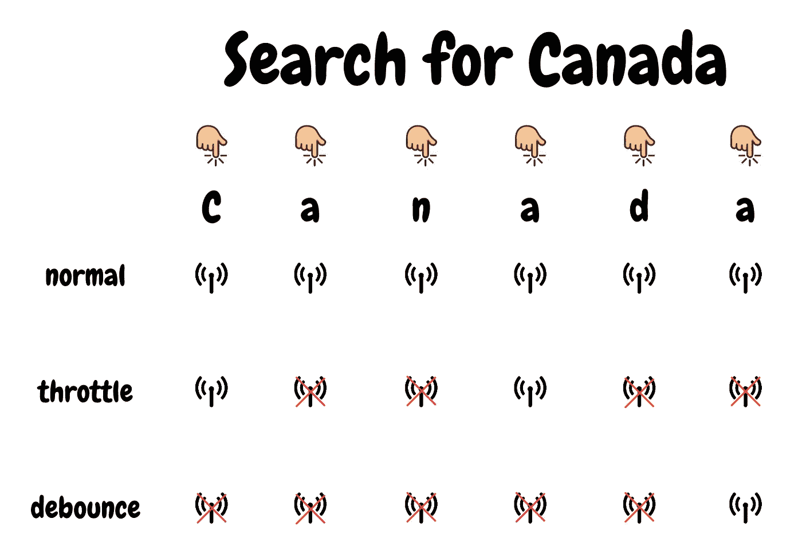

# 如何在 JavaScript 中使用去抖和节流

> 原文：<https://betterprogramming.pub/how-to-use-debounce-and-throttle-in-javascript-da95dc151f7b>

## 使用您可能没有使用的 JavaScript 方法


由 [Balázs Kétyi](https://unsplash.com/@balazsketyi?utm_source=medium&utm_medium=referral) 在 [Unsplash](https://unsplash.com?utm_source=medium&utm_medium=referral) 拍摄的照片。

你有没有经历过当你向下滚动或者运行一些动画时，你的页面变得非常慢？

当我过去为仪表板制作画布动画时，仅仅是流畅地呈现每秒钟的动画就需要大量的 CPU 资源。后来有一天，增加了一个新的需求:当鼠标光标悬停在画布上时，工具提示应该显示出来。这真的要了我的命。我的 CPU 资源如此耗尽，以至于我的电脑都快冻僵了。

过了一段时间，我学会了解决这个问题的方法:节流或去抖。所以在这篇文章中，我想分享它们是什么，为什么它们有用。

# 阅读前

如果你知道 JavaScript 的异步函数和 HOF 是如何工作的，你会更容易接受这个理论。你可能会对我其他关于 [JavaScript 事件](https://medium.com/better-programming/be-the-master-of-the-event-loop-in-javascript-part-1-6804cdf6608f)和[HOF](https://medium.com/javascript-in-plain-english/functional-programming-higher-order-function-hof-aaa46bb444bb)的文章感兴趣。

# 问题的一个例子

假设您想通过 API 调用来搜索一个国家名称。屏幕上有一个输入框，你可以在里面输入国家名称的字符串。一旦您将字符串放入其中，您的应用程序就会调用 API 来加载包含您的字符串的所有国家。

下面是 CodeSandBox 做的一个简短的例子:

尝试搜索任何国家。

对于移动用户或像我这样的懒人，如果您查找国家，会发生以下情况:


屏幕上的`Request Count`指你已经向服务器发送了多少个 HTTP 请求。请注意，每次按下键盘时，它都会增加，包括退格键。这看起来没问题，但是想象一下你工作的应用程序或者像 Airbnb 这样的大型应用程序的正常大小。

然而，每次从键盘或任何用户动作发送请求肯定是太多了。我们需要一个解决方法。

# 去抖和节流从何而来？

要了解它们到底是什么，我觉得还是告诉你上面这个问题的解决方案背后的想法比较好。

主要问题是发送了太多的 HTTP 请求。假设你想搜索“加拿大”但是如果你的网页因为请求“C”，“Ca”，“Can”，“Cana”等而冻结了。我肯定没有人会高兴。因此，减少请求的需求应运而生。

去抖和节流只是实际减少请求的名称。去抖和节流的共同点是一个简单的概念:一旦我的手指按下键盘，在我说可以之前，暂时不要发送任何请求。



作者照片。

看上图。它代表了所发生的事情，这取决于具体情况。`Normal`每次发送请求。`Throttle`在周期内第一次发送请求，并且在周期结束前不再发送请求。一旦周期结束，它再次发送新的请求。`Debounce`接受一个将在几毫秒内被调用的回调，并且只要在此期间没有添加额外的请求，就只发送一个请求。看看按下“加拿大”的“n”时的情况。添加了一个额外的请求，按下“a”时添加的前一个请求现在将被忽略。按照这种逻辑，如果所有请求都是在这段时间(几毫秒)内添加的，那么只有最后一个请求会被执行。

# 深入研究代码—节流

好了，现在我们来探究一下代码吧！

```
import axios from 'axios';const search = async (city) =>
  await axios.get(`https://restcountries.eu/rest/v2/name/${city}`)
```

`search`是使用样本城市 API 发送城市的函数。为了让这个例子更加真实，我在测试中使用了真正的 restful API。你所需要做的就是在`city`中填入城市名称。[自己尝试一下](https://restcountries.eu/rest/v2/name/canada)。

让我们先看看代码:

这个匿名函数是一个返回另一个函数的 HOF。第一次调用该函数时，`inThrottle`被分配给`false`。然后一旦返回的函数被再次调用，`inThrottle`被设置为`true`，执行回调函数(`fn`)。然后`inThrottle`在`delay`毫秒内再次变为`false`，同时`inThrottle`为`true`时，不能执行`throttle`返回的函数。


你还记得这个吗？例如，即使你一直点击按钮，`Throttle`也不允许你连续执行该功能，除非`inThrottle`是`false`。

那么新的请求方法应该是这样的:

```
const sendRequestThrottle = throttle(500, search);<input type="text" onChange={sendRequestThrottle} />
```

但是，有一件事你需要小心。

HOF 方法`throttle`不应包含在 React 组件中。当组件 A 中的状态变量被改变时，A 被重新渲染，所有的东西都被重新赋值。如果`throttle`保持重新渲染，`inThrottle`也会被重新分配给`false`。

# 深入了解代码——去抖

现在让我们来看看`Debounce`。这段代码与`Throttle`非常相似，所以你也应该很容易理解这一部分:

仅此而已。超级简单。和`Throttle`唯一的区别就是`Debounce`不检查`inDebounce`是不是`true`什么的。如果回调在某个时间段内被执行，它会取消之前将要运行的`setTimeout`并创建一个新的。因此，如果你一直快速按下键盘，你的回调将永远不会运行。


现在你会更好地理解为什么`Debounce`的调用看起来像上图。

您所需要做的就是在 DOM 中注册您的回调:

```
const sendRequestDebounce = debounce(500, search);<input type="text" onChange={sendRequestDebounce} />
```

# Lodash 中的节流和去抖

在大多数情况下，您不需要编写`Throttle`或`Debounce`，因为有太多好的轻量级库支持这些特性。 [Lodash](https://lodash.com/) 也是其中之一。

代码挺长的，但是看看`debounced`函数，是一个 HOF:

`debounce`返回实际执行的新函数(`debounced`)。在`debounced`内部，使用`lastCallTime`。因此您可能会注意到`Lodash`中的`debounce`可能会将之前的时间(函数之前被调用的时间)与当前的时间(函数当前被调用的时间)进行比较。

为了使这种策略简单一点，代码可能如下所示:

如果你愿意，你可以创建自己的`debounce`,但是记住重要的是把函数的执行推迟到以后。

# 结论

`Debounce`和`Throttle`都来自于延迟函数执行的需要，因为用户不希望发出太多的 HTTP 请求。如今，这些都是提高 web 性能的重要方法。对于任何想要延迟的任务，例如滚动事件，您都可以使用它们中的任何一个。