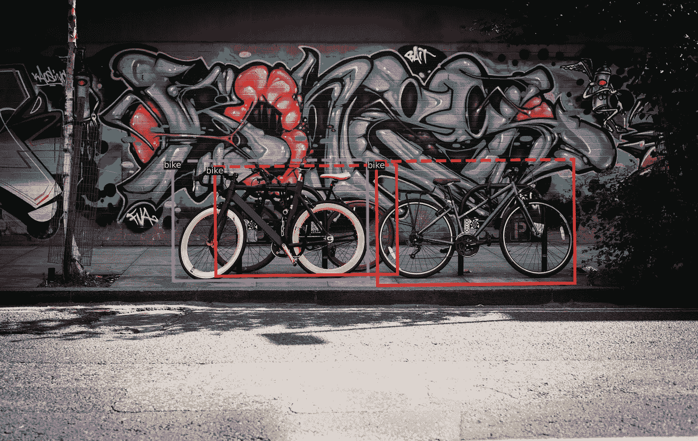
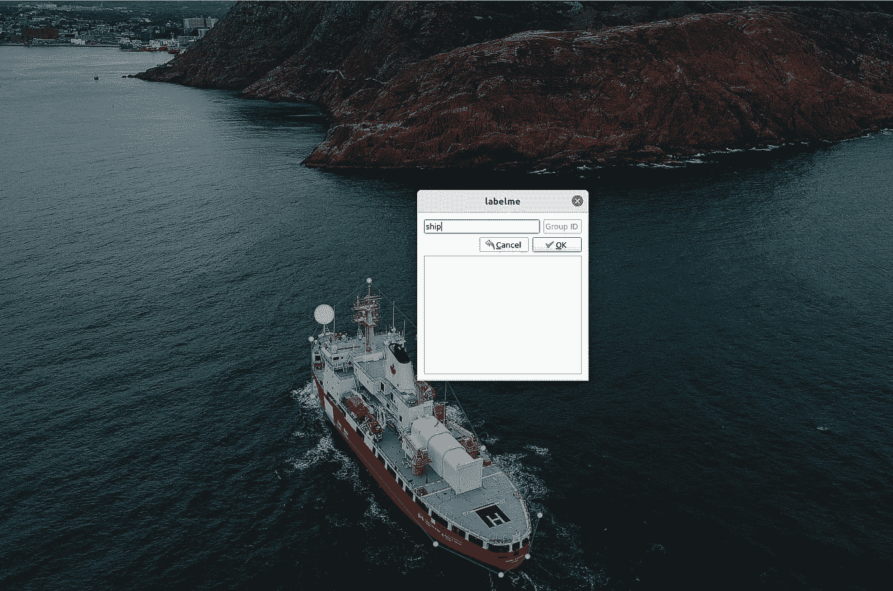

# 如何使用 Detectron2 对自定义数据集进行旋转边界框检测

> 原文：<https://betterprogramming.pub/how-to-use-detectron2-for-rotated-bounding-box-detection-on-a-custom-dataset-63916514b368>

## 从对齐边界框到旋转边界框在概念上很简单，但在技术上没那么简单。



YOLOv5 和 Detectron2 等模型系列仅提供现成的轴对齐边界框。如果盒子应该被旋转呢？(图片来源: [Clem Onojeghuo](https://www.pexels.com/photo/black-and-yellow-fatbike-beside-mountain-bikes-173294/) 来自 [Pexels](https://www.pexels.com/)

当今绝大多数的计算机视觉和物体检测都围绕着检测包围盒。有多种开箱即用的方法来实现这一点，如 [YOLOv5](https://ultralytics.com/yolov5) 或 Meta 的 [Detectron2](https://ai.facebook.com/blog/-detectron2-a-pytorch-based-modular-object-detection-library-/) 。然而，有一个问题:这些解决方案的普通版本只提供轴对齐边界框的检测。如果你想检测的物体被旋转了呢？

在这个例子中，我们将使用船只的图像作为例子。正如您在下图中看到的，要检测的船只没有与图像的水平/垂直轴对齐。因此，希望能够使用旋转的边界框来检测它们。



我们使用[label me](https://github.com/wkentaro/labelme)(https://github.com/wkentaro/labelme)多边形注释来标记图像中的船只。(图片来源:[埃里克·麦克莱恩](https://www.pexels.com/photo/photo-of-boat-sailing-on-sea-4700618/)来自[派克斯](https://www.pexels.com/)

本教程的其余部分将向您展示:

1.  如何使用 [labelme](https://github.com/wkentaro/labelme) 为自定义数据集生成旋转的边界框标签
2.  如何使用[检测器 2](https://github.com/facebookresearch/detectron2) 配置和设置旋转边界框检测的训练
3.  如何在看不见的图像上可视化预测

# 为自定义数据集生成旋转的边界框标注

需要旋转边界框的检测任务的一个很好的例子是检测航空或卫星图像中的各种元素。现成的标记数据集，如 [DOTA](https://captain-whu.github.io/DOTA/dataset.html) 存在，但通常这种数据集的商业使用被禁止，或者要检测的元素或对象与实际用例不完全匹配。

我们将要用来为自定义数据集创建旋转边界框注释的工具叫做 [labelme](https://github.com/wkentaro/labelme) 。Labelme 特别支持使用多边形来标记对象，这可以很容易地用于提取最小面积的旋转边界框。

## 安装标签

Labelme 为安装贴标 GUI 提供了各种选项，请参考这里的说明:[https://github.com/wkentaro/labelme](https://github.com/wkentaro/labelme)

## 创建多边形

用`labelme --autosave --nodata --keep-prev`启动 labelme。GUI 允许您逐个或基于目录选择要标记的图像。强烈建议将要标记的图像放在一个目录中，因为带有标签的 json 文件将在与该文件相同的目录中生成。当训练实际模型时，将所有图像和标签放在同一个目录中会使事情变得容易得多。

`--autosave`标志支持自动保存，因此无需对每张图像进行`ctrl+s`。`--nodata`标志跳过在为每个图像生成的 json 文件中保存实际图像数据。使用`--keep-prev`可以被认为是可选的，但如果图像是视频中的连续帧，这将非常有用，因为该选项将标签从先前标记的图像复制到当前图像。

# 安装检测器 2

在我们可以可视化旋转的边界框注释和训练模型之前，我们需要安装 [Detectron2](https://github.com/facebookresearch/detectron2) 。警告:这一步可能会引起头痛。

## 安装 PyTorch、OpenCV 和 Detectron2

在安装探测器 2 之前，我们需要安装 [PyTorch](https://pytorch.org/) 。这意味着我们不能提供一个包含所有依赖项的干净的`requirements.txt`文件，因为没有办法告诉`pip`以什么顺序安装列出的包。出于[兼容性原因](https://github.com/facebookresearch/detectron2/blob/9258799e4e72786edd67940872e0ed2c4387aac5/setup.py#L166)，Detectron2 在其安装要求中也不包含依赖关系。

根据你是想用 CPU 还是 GPU(如果有的话)来使用 Detectron2，从 https://pytorch.org/[安装合适的版本。探测器 2](https://pytorch.org/) [安装文档](https://detectron2.readthedocs.io/en/latest/tutorials/install.html)也提供了一些背景和调试步骤，如果有问题的话。

## 测试安装并可视化数据集

我在我的博客 GitHub repo 中提供了一个可视化注释数据集的例子。为了测试安装并显示旋转的边界框，在[这个](https://github.com/hietalajulius/blog/blob/main/detectron2/README.md)目录中安装必要的依赖项`pip install -r requirements.txt`。


多边形用于确定旋转的边界框。(图片来源:[埃里克·麦克莱恩](https://www.pexels.com/photo/photo-of-boat-sailing-on-sea-4700618/)来自[派克斯](https://www.pexels.com/)

为了验证注释是否正确，您可以使用`python visualize_dataset.py <path-to-dataset>`运行可视化[脚本](https://github.com/hietalajulius/blog/blob/main/detectron2/visualize_dataset.py)来可视化注释。船只的示例数据集可在[此处](https://drive.google.com/file/d/1V7Sw29WLjFaP1nwks_0sVNMAWwuJ7w9F/view?usp=sharing)获得(请[发电子邮件](mailto:julius.hietala@gmail.com)给我获取)。正如你所看到的，多边形被正确地转换成旋转的包围盒。

# 训练和评估模型


来自训练模型的预测。(图片来源:[来自](https://www.pexels.com/photo/photo-of-boat-sailing-on-sea-4700618/) [Pexels](https://www.pexels.com/) 的埃里克·麦克莱恩

要运行培训，运行`python train_rotated_bbox.py <path-to-dataset> --num-gpus <gpus>`(脚本可从[这里](https://github.com/hietalajulius/blog/blob/main/detectron2/train_rotated_bbox.py)获得)。脚本和`rotated_bbox_config.yaml`文件包含各种配置训练的方法，详情见文件。默认情况下，模型的最终和中间权重保存在当前工作目录中(`model_*.pth`)。

若要可视化来自定型模型的预测，请运行:

```
python visualize_predictions <path-to-dataset> --weights <path-to-pth-model>.
```

# 摘要

检测旋转的边界框是检测轴对齐的边界框的自然延伸。不幸的是，关于如何实现这一点，没有太多好的例子。我希望这个教程和[提供的例子](https://github.com/hietalajulius/blog/tree/main/detectron2)有助于实现旋转包围盒检测！

感谢您的阅读！欢迎反馈和改进意见！

你可以在 [LinkedIn](https://www.linkedin.com/in/julius-hietala-8967b8a2/) 、 [Twitter](https://twitter.com/hietalajulius?lang=en) 和 [GitHub](https://github.com/hietalajulius) 上找到我。此外，查看我的个人[网站/博客](https://www.hietalajulius.com/),了解涵盖 ML 和 web/移动应用的主题！