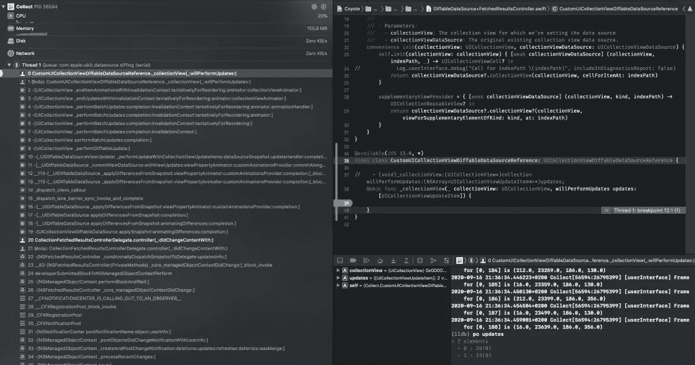

# 如何对核心数据使用不同的数据源

> 原文：<https://betterprogramming.pub/how-to-use-diffable-data-sources-with-core-data-2031b0fb69ec>

## 通过快照更改数据


照片由 [Jonas Lee](https://unsplash.com/@1eemingwell?utm_source=medium&utm_medium=referral) 在 [Unsplash](https://unsplash.com?utm_source=medium&utm_medium=referral) 上拍摄。

WWDC 2019 引入了不同的数据源，作为对`UICollectionViewDataSource`和`UITableViewDataSource`的替代。该 API 在 iOS 13 及更高版本中可用，可以轻松设置数据列表，其中的更改通过所谓的快照进行管理。

核心数据团队在`NSFetchedResultsControllerDelegate`中添加了新的委托方法，使得在核心数据中处理不同的数据源变得更加容易。然而，事实证明[很容易犯错误，导致糟糕的表现](https://twitter.com/twannl/status/1306196094754455552?s=20)。我没有放弃，并设法让核心数据与不同的数据源很好地协同工作。这就是这篇文章的内容。

*注意:如果你想知道在整个项目中建立不同数据源的快速方法，请查看我的博客文章* [*轻松采用不同数据源*](https://www.avanderlee.com/swift/diffable-data-sources-adoption/) *。*

# 为核心数据创建不同的数据源

在核心数据中采用不同的数据源从创建新的数据源实例开始。在本文给出的例子中，我们主要关注集合视图，但是同样的技术也可以用于表视图。

数据源的创建如下所示:

它遵循几个步骤:

*   数据源实例是使用单元提供程序创建的。
*   数据通过`cell provider`属性分配给我们的单元格。
*   数据源被分配给实例属性，以确保它被保留。`UICollectionView`的数据源属性弱引用其委托，将直接释放它。
*   集合视图连接到数据源。

如您所见，我们还没有获取任何数据，也没有设置初始快照。这是一个常见的错误，很容易导致性能下降。稍后我会更详细地解释这一点。

# 使用来自小区提供商的数据的重要性

在从旧快照到新快照的转换过程中，数据源可能会针对给定的索引路径请求一个在所获取的对象集合中尚不存在的单元。在应用快照后，`NSFetchedResultsController`中提取的对象被更新，但是在转换完成前可能会请求一个单元。这主要发生在转场是动画的时候。

因此，重要的是利用单元格提供程序中提供的数据，而不是从获取结果控制器中手动获取数据。这样，您将确保始终与数据源的当前状态保持同步。

# 实现新的 NSFetchedResultsController 委托方法

在应用数据的第一个快照之前，我们必须为不同的数据源设置提取结果控制器的委托方法。这是从 iOS 13 开始可用的新方法，取代了旧式的委托`didChange`方法。

通过实现这种新方法，核心数据自动只使用这种方法，而不使用旧方法。这使得迁移到不同的数据源变得非常容易，同时保持对旧版本 iOS 的支持。

实现如下所示:

请注意，我们已经内置了一个额外的检查来确保我们的数据源配置正确。我们还添加了一个简单的检查来了解集合视图是否已经显示了一组数据。如果是这样的话，我们希望动画到新的数据快照。如果还没有可见的数据，我们希望在没有动画的情况下尽可能快地应用快照，以便尽可能快地对用户可见。

这是为不同的数据源配置提取结果控制器所需的全部代码。接下来是确保我们的初始数据集正确显示。

# 配置数据的初始快照

既然我们的数据源和提取结果控制器已经准备好了，我们需要应用数据的第一个快照。这通常是第一个错误发生的地方，因为我们试图用核心数据处理不同的数据源，就像我们在没有核心数据的情况下使用它一样。

一个常见的错误是使用提取结果控制器中的`fetchedObjects`属性，并将其作为初始快照。稍后我会解释这意味着什么，但是现在，我们唯一需要做的事情是执行一个`fetch`:

```
fetchedResultsController.performFetch()
```

确保在设置好数据源的提取结果控制器委托方法后，只执行一个`fetch`。这样，我们让获取的结果控制器负责设置数据的初始快照，我们可以确保一切都得到优化。调用前面的设置委托方法，并将快照应用到我们的集合视图。

这就是我们使不同的数据源与核心数据一起工作所需要的一切。我想告诉你一些常见的陷阱，因为你可能会在设置好一切后遇到问题。

# 你可能遇到的常见陷阱

当不同的数据源以正确的方式配置时，它们是很棒的。然而，如果你没有按照你应该做的那样做，也很容易遇到问题。在我自己实现这个的时候，我经历了几个陷阱，我想和你分享一下。

在这个过程中，我使用了一个调试数据源，它允许我打印出处理快照后应用的更改:

它实现了一个不能在生产中使用的私有 API。`willPerformUpdates`方法将包含一组更新，作为将更新前的快照与新应用的快照进行比较的结果。

## 缺陷 1:使用 fetchedObjects 作为初始快照

上面的调试方法让我意识到我在用一组错误的数据配置获取结果控制器:



调试核心数据中的不同数据源。

如您所见，它打印出两个更新:

*   `DS(0)`，意为“删除第 0 节”
*   `IS(0)`，意为“插入第 0 节”

换句话说，整个数据段都被新的快照替换了。它不是插入和删除在两个快照之间更改的项目，而是一次替换所有项目。在这个例子中，我收集了 900 个项目。为了降低性能，我的 collection 视图布局决定将所有 900 个项目制作成动画。

Core Data 认为我插入了一组全新的数据的原因是它实际上是真实的。这是由两件事造成的:

*   在设置不同的数据源之前，我使用了`performFetch`。
*   初始快照是使用`fetchedObjects`属性手动配置的。

错误的代码大致如下:

这是错误的主要原因是产生的快照包含了一个`NSManagedObject`实例的集合，而应该是一个`NSManagedObjectID`的快照。尽管我们也可以自己创建它，但是最好使用`performFetch`并让获取的结果控制器负责配置数据。

## 陷阱 2:不使用小区提供商数据

在从一个快照到另一个快照的动画过程中，数据源将创建用于动画化更改的单元格。这可能意味着它试图用尚不存在于`fetchedObjects`数组中的数据来配置单元格。因此，如果您直接使用获取的对象数组中的数据来配置您的单元格，您可能会遇到崩溃。这是因为您将尝试为某个尚不可用的索引获取数据。

单元提供者给出的内容总是与快照的过渡同步，并确保您可以正确设置单元。

# 结论

提取结果控制器可以配置为使用不同的数据源。如果需要，更改会自动应用并很好地动画化。常见的陷阱会使这个过程变得复杂，但是通过遵循正确的步骤，它会变得相对容易。

感谢阅读！