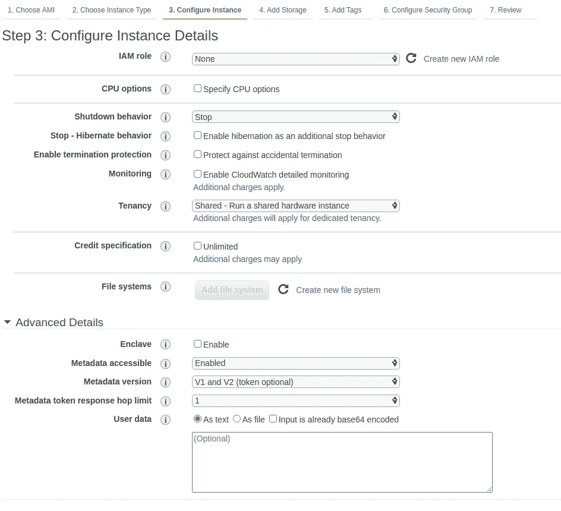
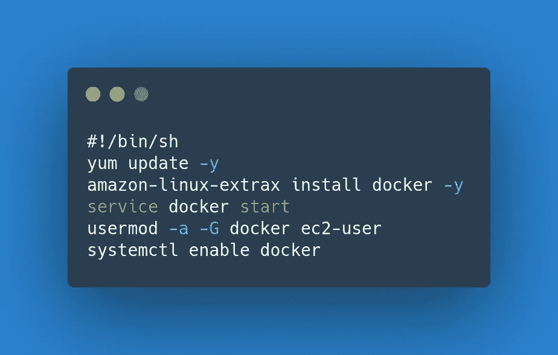

# 如何在 Amazon EC2 实例中使用 Docker

> 原文：<https://betterprogramming.pub/how-to-use-docker-in-an-amazon-ec2-instance-5453601ec330>

## 像在本地一样使用 Amazon 机器实例


照片由[拉胡尔·查克拉博蒂](https://unsplash.com/@hckmstrrahul?utm_source=medium&utm_medium=referral)在 [Unsplash](https://unsplash.com?utm_source=medium&utm_medium=referral) 拍摄。

它在我的机器上工作！很好，但是我们如何让它在云中工作呢？Docker 正好解决了这个问题。

这篇文章非常适合那些将应用程序迁移到云或者正在学习云的人。此时，您通常有一个(或多个)应用程序正在使用 Docker 运行。

在之前的[文章](/how-to-push-a-docker-image-to-amazon-ecr-with-jenkins-ed4b042e141a)中，我们看到了如何将这样的 Docker 映像迁移到 Amazon cloud——更具体地说，迁移到 Amazon ECR。

在本文中，我们将更进一步。我们将关注以下三件事:

*   如何安装 Docker？
*   如何安装 docker-compose？
*   如何从亚马逊 ECR 拉 Docker 图片？

到本文结束时，EC2 实例中的所有东西都可以使用 Docker 了，就像它可以在 Linux 计算机上工作一样。

好奇？那我们开始吧。

# 如何安装 Docker

在 Amazon Linux 2 Amazon 机器映像(AMI)上安装 Docker 相当容易。如果您还没有启动您的实例，请查看[本](https://docs.aws.amazon.com/AWSEC2/latest/UserGuide/AccessingInstances.html)指南来启动并运行一个实例。

安装 Docker 包括五个小步骤。

首先，您必须更新实例上已安装的包和包缓存。通常，这是一个不必要的步骤，因为您将刚刚启动一个实例，但这只是一个最佳实践。

*注:* `*-y*` *选项是必需的，因为命令经常提示您回答是或否。它通过回答是来解决这个问题。*

```
sudo yum update -y
```

其次，你得把 Docker 作为一个包来安装。Amazon 推荐使用下面的命令，但是您也可以使用`yum`来完成:

```
sudo amazon-linux-extras install docker -y
```

现在我们有了 Docker 即服务。第三步是启动 Docker 服务:

```
sudo service docker start
```

现在，我们到了第四步。这一条相当重要，也经常被遗忘。为了能够在不使用`sudo`的情况下使用 Docker 命令，您必须将`ec2-user`添加到`docker`组:

```
sudo usermod -a -G docker ec2-user
```

*注意:如果你想确保系统获得这些 Docker 权限，你可以注销并重新登录，但它们对我来说是现成的。*

通过运行任何 Docker 命令来验证安装(例如，`docker info`应该工作正常)。

仅此而已。Docker 现在已经安装好，可以使用了。

但是还有一个更微妙的细节。每次 Amazon AMI 重启时，您都希望 Docker 服务保持运行。因此，我们有最后一个命令可以使用:

```
sudo systemctl enable docker
```

最后，您还可以在启动 Docker AMI 时在用户数据中列出这些命令，这样您就不必在启动新机器后运行它们。

启动 AMI 时，您可以在步骤 3 中填写用户数据:



配置实例详细信息(使用用户数据)

用户数据内部不需要使用`sudo`。

*注意:当 AMI 启动时，用户数据只执行一次，所以您必须启动一个新的、干净的 AMI 来测试您的用户数据。我的建议是:首先在 AMI 中测试每个命令，然后启动一个新的完全配置的 AMI。*



userdata.txt

# 如何安装 Docker-Compose

我个人认为 docker-compose 是一个非常方便的工具。如果您有一些 Docker 图像，您很快就会厌倦通过命令行输入所有内容。这就是 docker-compose 的用武之地。它允许您在一个地方配置所有图像。

这就是为什么我现在还在 EC2 实例中安装 docker-compose。它允许我从一个文件中完成所有的配置。您可以通过几种方式将该文件下载到您的容器中(例如通过 Git)。

由多个容器组成的应用程序可以很容易地用命令`docker-compose up -d`启动，用`docker-compose down`停止。

你必须安装 docker-compose 来使用这些命令。这分三步完成。

第一步，下载最新版本的 docker-compose(在本例中是`1.28.2`):

```
sudo curl -L "https://github.com/docker/compose/releases/download/1.28.2/docker-compose-$(uname -s)-$(uname -m)" -o /usr/local/bin/docker-compose
```

第二步，让它可执行。您可以使用`chmod`以标准的 Linux 方式做到这一点:

```
sudo chmod +x /usr/local/bin/docker-compose
```

在最后一步中，您会发现 docker-compose 还不在您的路径上，因此您可以创建一个符号链接(或 symlink)来使它工作:

```
sudo ln -s /usr/local/bin/docker-compose /usr/bin/docker-compose
```

当您完成所有这些工作后，您也可以选择将这些命令添加到您的用户数据中(没有`sudo`)。

太好了，现在 EC2 中已经有 docker-compose 工具了！

# 如何从 Amazon ECR 中提取 Docker 图像

您可能会尝试的第一件事是从 Amazon ECR 中提取一个 Docker 图像。

好吧，如果你不配置任何东西，它会失败。要实现这一点，您需要解决两个问题。

首先，在启动 AMI 的步骤 3 中，选择一个 IAM 角色。您至少需要 ECR 的读取权限，才能从私有存储库中提取 Docker 图像。如果您只是从 ECR 中提取，将它限制为只读访问是一个好的做法。

如果您计划也推送 Docker 图像，它看起来会像下面的图像:


其次，您需要在 EC2 容器中登录 AWS。该命令如下所示。不要忘记更换`region`和`registry URL`。当从 Amazon 管理员控制台访问它时，您也可以在您的 ECR 存储库中查找它。

*注意:您也可以将该命令附加到您的用户数据中，但是您必须不时地重新执行它，因为登录将过期。*

```
aws ecr get-login-password --region **eu-west-2** | docker login --username AWS --password-stdin **XXXXXXXXXXXX.dkr.ecr.eu-west-2.amazonaws.com**
```

# 结论

就是这样！

在本文中，我们使用 Docker、docker-compose 和对 Amazon ECR 的访问成功地设置了一个 EC2 Amazon 机器映像。您还看到，您可以在用户数据中列出这些命令，以便在启动时配置机器。

这使您可以像在本地一样工作，但现在是在云中。

如果你有任何问题，请在评论区提问！