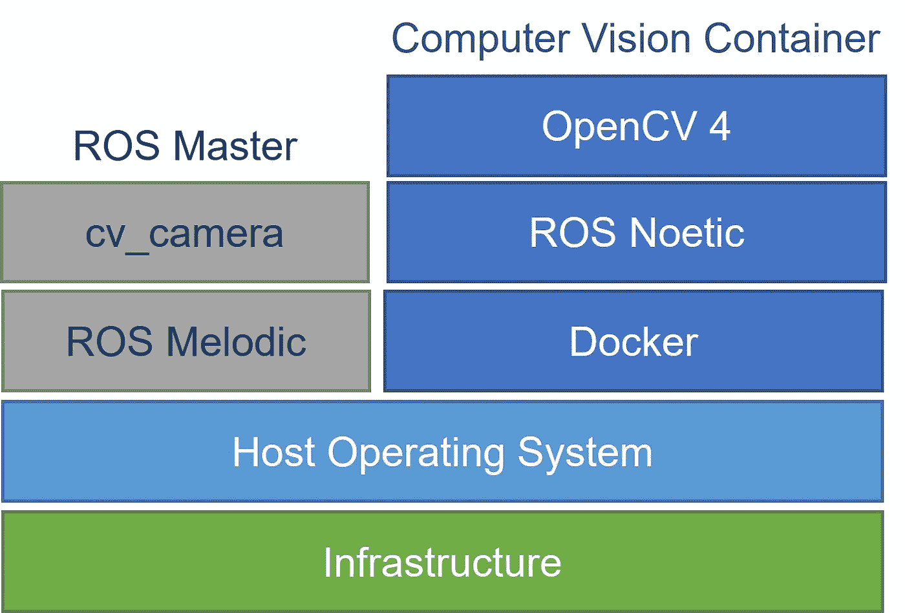

# 如何使用 Docker 在同一台机器上运行多个 ROS 发行版

> 原文：<https://betterprogramming.pub/how-to-use-docker-to-run-multiple-ros-distributions-on-the-same-machine-d851b42aed5>

## 用 ROS Melodic 运行 Python 代码


[伊恩·泰勒](https://unsplash.com/@carrier_lost?utm_source=medium&utm_medium=referral)在 [Unsplash](https://unsplash.com?utm_source=medium&utm_medium=referral) 上拍照

机器人操作系统广泛应用于机器人领域。但是，不同的可用 [ROS 发行版](http://wiki.ros.org/Distributions)会导致软件版本冲突。

每个 Ubuntu 版本都有不同的 ROS 发行版。比如 Ubuntu 18.04 用的是 ROS Melodic，基于 Python 2.7。Ubuntu 20.04 使用的是基于 Python 3 的 ROS Noetic。

通常，我们的 ROS master 需要是一个较旧的 ROS 版本，以获得特定的硬件驱动程序支持。在这种情况下，使用现代的基于 Python3 的软件库——如 OpenCV 4、Tensorflow 和 py torch——会产生问题。

在这篇文章中，我将向你展示如何在同一台机器上保存一个 ROS Melodic master 和最近的 ROS 发行版。我们可以通过使用 Docker 封装我们的软件模块来做到这一点。

# Docker 是什么？

Docker 目前是容器化软件的行业标准。它像一个虚拟机，但更轻量级，因为每个容器都使用主机的操作系统。

> Docker 容器映像是一个轻量级、独立、可执行的软件包，包含运行应用程序所需的一切:代码、运行时、系统工具、系统库和设置[1]

在 Docker 容器中，我们可以安装任何我们想要使用的 ROS 发行版和软件库——而不会给我们的主机系统带来问题。

作为本文中的一个示例用例，我们将使用以 ROS Melodic 为主的 Ubuntu 18.04。出于演示目的，我们将发布一个网络摄像头图像主题。使用 Docker，我们将使用 ROS Noetic 和 OpenCV 4 为计算机视觉任务创建并运行一个容器。

通过下图所示的设置，ROS Melodic 节点可以使用 Docker 的`--network host`设置与 ROS Noetic 节点共存和通信。



如何在同一台电脑上使用不同 ROS 版本的 Docker？[来源:作者]

# 发布带有 ROS 旋律的网络摄像机流

如果您的计算机上还没有柳絮工作空间，请使用以下命令创建一个工作空间[2]:

```
mkdir -p ~/catkin_ws/src
cd ~/catkin_ws/
catkin_make
```

首先，我们必须在我们的主机系统上启动 ROS Melodic master。为此，在新的终端中键入`roscore`。

接下来，我们用 ROS 包`cv_camera`【3】发布一个网络视频流。要从 GitHub 克隆这个包，用柳絮 _make 构建这个包，运行`cv_camera_node`，执行以下命令:

```
cd ~/catkin_ws/src
git clone https://github.com/OTL/cv_camera.git
cd ..
catkin_make
source devel/setup.bash
rosrun cv_camera cv_camera_node
```

您现在应该能够看到图像主题`/cv_camera/image_raw`。

# 使用 ROS Noetic 运行 Docker 容器

对于我们的模拟计算机视觉节点，我们将在文件夹`ROS_Docker`中创建以下三个文件:

```
/home/username/ROS_Docker/
|-- Dockerfile
|-- cv_node.py
|-- start_ros_node.sh
```

## Dockerfile 文件

要创建和运行 Docker 容器，我们必须编写一个 Docker 文件。docker 文件就像一个蓝图。它告诉 Docker 如何建立一个形象。Docker 使用图像来创建和运行容器。

在 Dockerfile [4]中，我们用`FROM`从基本映像开始，然后用`RUN apt-get update && apt-get install`安装所有需要的依赖项。

对于我们的 ROS 应用程序，我们必须创建一个柳絮工作空间[2]。然后，我们需要用`RUN git clone`从 vision_opencv [5]包中安装 cv_bridge。

```
FROM ros:noetic

# install packages with apt-get
RUN apt-get update && apt-get install -y --no-install-recommends \
    git \
    libopencv-dev python3-opencv \
    && rm -rf /var/lib/apt/lists/*

# create and build a catkin_ws
SHELL ["/bin/bash", "-c", "-l"]
WORKDIR /home/catkin_ws
RUN mkdir src && source "/opt/ros/$ROS_DISTRO/setup.bash" && catkin_make

# get ROS packages from github
WORKDIR /home/catkin_ws/src
RUN git clone -b noetic https://github.com/ros-perception/vision_opencv.git
WORKDIR /home/catkin_ws/
RUN source /home/catkin_ws/devel/setup.bash && catkin_make

# copy our scripts
WORKDIR /home
COPY ./cv_node.py .
COPY ./start_ros_node.sh .
ENTRYPOINT ["/home/start_ros_node.sh"]
```

## cv_node.py

`cv_node`的目的是订阅我们的网络摄像头主题，对图像做一些事情，然后发布一个新的图像主题。为了在 ROS 图像和 OpenCV 图像之间转换，我们使用 cv_bridge。

下面的代码将订阅网络摄像头主题，用 OpenCV 4 添加文本，并在新主题上发布新图像。

```
#!/usr/bin/env python3

import rospy
import cv2
from sensor_msgs.msg import Image, CompressedImage
from cv_bridge import CvBridge

class cv_node:
    def __init__(self):
        self.bridge = CvBridge()
        image_sub = rospy.Subscriber("/cv_camera/image_raw", Image, self.callback, queue_size=1)
        self.image_pub = rospy.Publisher("/cv_camera/image_out/compressed", CompressedImage, queue_size=1)

    def callback(self, data):
        cv_img = self.bridge.imgmsg_to_cv2(data)               
        cv_img = cv2.putText(cv_img, "Published with ROS Noetic", (30,30), cv2.FONT_HERSHEY_SIMPLEX, 1.1, (255,0,0), 2)
        cv_img = self.bridge.cv2_to_compressed_imgmsg(cv_img)
        self.image_pub.publish(cv_img)

def main():
    rospy.init_node('cv_node')
    node = cv_node()

    rate = rospy.Rate(30) # frequency in Hz
    while not rospy.is_shutdown():
        rate.sleep()

if __name__ == '__main__':
    main()
```

这个节点可以用来执行更高级的任务。例如，我们可以在`cv_img`上使用深度神经网络进行对象检测。

如果您想要导入其他库——例如 PyTorch 或 tensor flow——请确保使用`RUN pip install [...]`将它们安装在 other 文件中

## start _ ros _ 节点. sh

这个脚本是我们 Docker 容器的入口点。它只是启动我们的 ROS 节点`cv_node.py`。

```
#!/bin/bash
source /home/catkin_ws/devel/setup.bash
python3 cv_node.py
```

# *构建并运行容器*

要构建 docker 映像，请在终端中执行以下命令:`docker build -t medium .`

这将运行当前目录中的 Docker 文件，并创建一个带有标记 medium 的 Docker 映像。

构建过程完成后，在终端中运行以下命令:

`docker run -it --network host medium:latest`

这将在交互模式下运行标签为 medium 的最新容器。此外，它将使用主机的网络，以便 Docker 容器和我们的 ROS 主机可以通信。

就是这样！现在，您应该在主机系统上看到新主题/cv _ camera/image _ out/compressed。您可以使用命令`rosnode info cv_node`检查`cv_node`。

使用 Docker，我们可以将不同的 ROS 发行版容器化，并安装额外的软件库。因为它们是封装的，所以不会给我们的主机系统带来问题。

Docker 容器和主机之间的通信可以使用 Docker 的`--network host`设置来建立。

# 资源

[1]使用容器构建、共享和运行您的应用:[https://www.docker.com/resources/what-container/](https://www.docker.com/resources/what-container/)(访问日期:2022 年 11 月 30 日)

[2]为柳絮创建工作空间:【http://wiki.ros.org/catkin/Tutorials/create_a_workspace】T2(访问时间:2022 年 11 月 30 日)

[3] ROS 包 cv _ camera:【http://wiki.ros.org/cv_camera (访问时间:2022 年 11 月 30 日)

[4]文档参考:[https://docs.docker.com/engine/reference/builder/](https://docs.docker.com/engine/reference/builder/)(访问日期:2022 年 11 月 30 日)

[5] ROS 包 vision _ opencv:[http://wiki.ros.org/vision_opencv](http://wiki.ros.org/vision_opencv)(访问时间:2022 年 11 月 30 日)