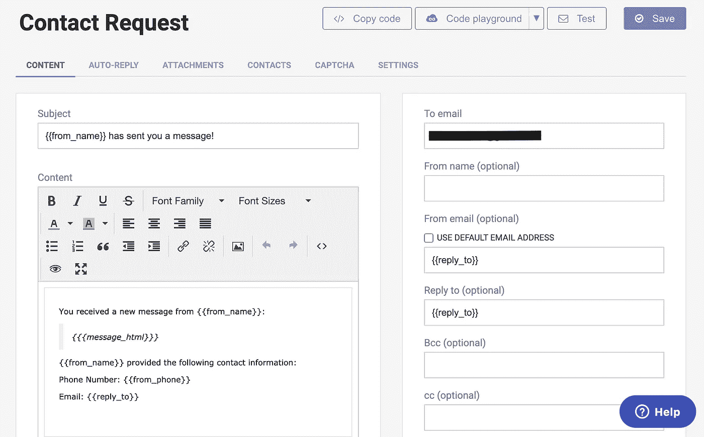
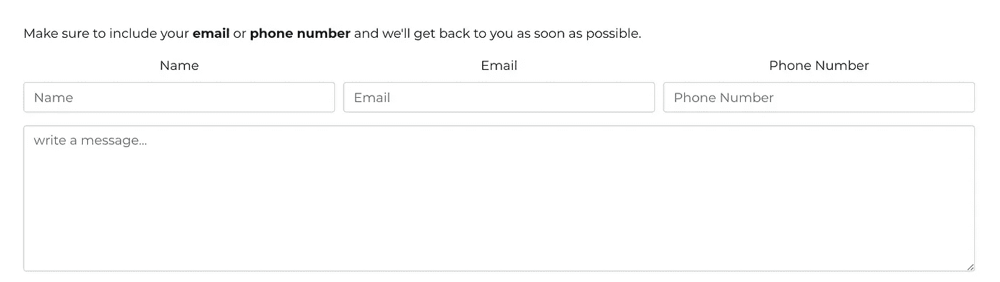
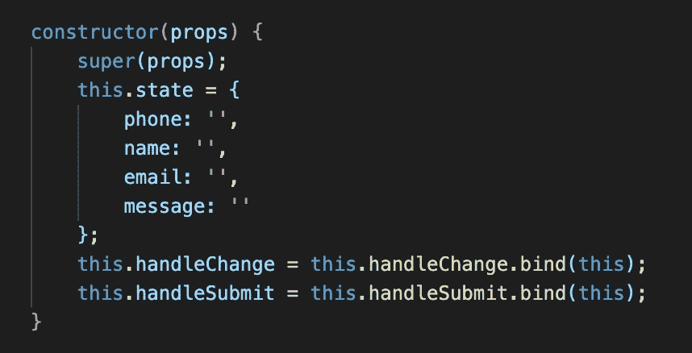
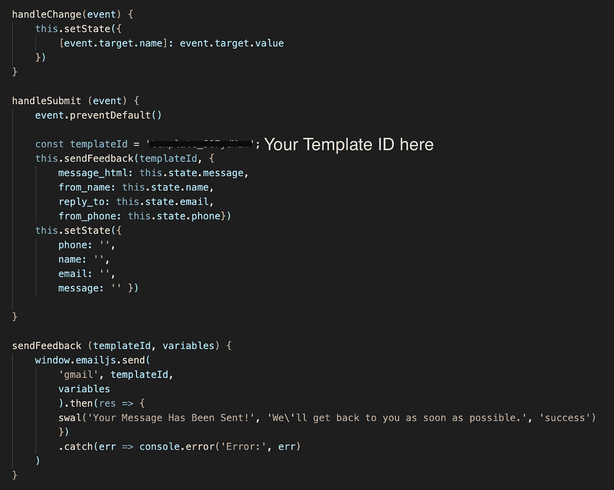

# 如何在 React 中使用 EmailJS 自动发送电子邮件

> 原文：<https://betterprogramming.pub/how-to-use-emailjs-for-automated-emails-react-js-d0828165e2f>

## 立即从您的应用发送电子邮件


斯蒂芬·菲利普斯-Hostreviews.co.uk 在 [Unsplash](https://unsplash.com?utm_source=medium&utm_medium=referral) 上的照片[。](https://unsplash.com/@hostreviews?utm_source=medium&utm_medium=referral)

最近，我一直在为一家小建筑公司做一个项目，需要一个自动化的电子邮件系统。该公司希望每当客户在其网站上填写“联系我们”表格时，都能收到一封自动发送的电子邮件，所以我求助于谷歌，想出最好的解决办法。

立刻， [EmailJS](https://www.emailjs.com/) 看起来是完美的候选人。它有很好的文档和一个简单易学的系统。本教程将带你完成它。

# 安装电子邮件

在我们进入代码之前，您需要[创建一个 EmailJS 帐户](https://dashboard.emailjs.com/account/create)。使用您的帐户，您可以创建电子邮件模板，并选择您希望自动发送的电子邮件发送到的电子邮件。

接下来，在您的项目上安装 EmailJS:

```
$ npm install emailjs-com --save
```

然后将以下代码片段添加到项目的开头:

要获取您的用户 ID，请访问您的电子邮件帐户页面[并点击“API 密钥”部分。](https://dashboard.emailjs.com/account)

# 创建电子邮件模板

现在，您已经安装了 EmailJS 并创建了一个帐户，您需要添加一个电子邮件服务。我选择了 Gmail，但你可以选择最适合你需求的服务。

接下来，我们将创建电子邮件模板。首先，导航到[模板](https://dashboard.emailjs.com/templates/)页面。应该已经有一个示例模板，如果您愿意，可以选择修改那个模板。如果您想从头开始创建新模板，只需单击“创建新模板”按钮。



我的模板看起来像这样。

EmailJS 使用动态变量使模板易于重用。我的模板中有四个变量:

*   `from_name`
*   `message_html`
*   `from_phone`
*   `reply_to`



这些变量对应于我的联系人表单上的输入字段。您可以根据需要使用任意多或任意少的变量。

您还需要填写“收件人”、“发件人”和“回复”栏。“收件人”栏是您想要发送自动电子邮件的电子邮件地址，而“发件人”和“回复”栏是用户提供的电子邮件地址。

好了，现在我们的模板已经准备好了！只需点击“保存”，我们就可以开始发送电子邮件了。

# 将模板连接到表单

现在我们已经完成了设置，剩下的就是发送电子邮件的部分了。为此，您需要创建您的`Contact.js`组件，并使用以下代码创建一个构造函数:



接下来，在表单中添加您希望在电子邮件中发送的信息字段:

最后，我们将创建用于更改表单、提交请求和向用户提供反馈的函数:



我使用 SweetAlert 向我的用户提供反馈。

# 结论

就是这样！你现在应该可以随心所欲地发送自动邮件了(或者更像是在 EmailJS 的限额内)。

无论如何，我希望这篇教程能让发送自动邮件变得简单一些。感谢阅读！