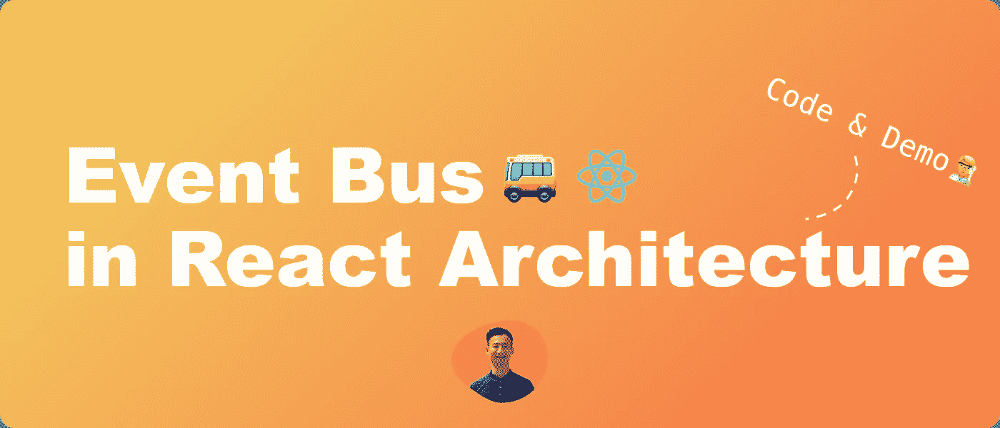
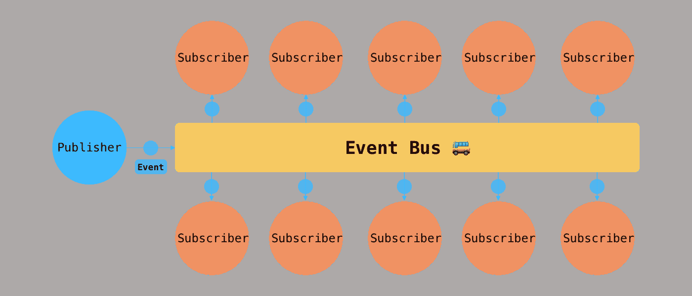
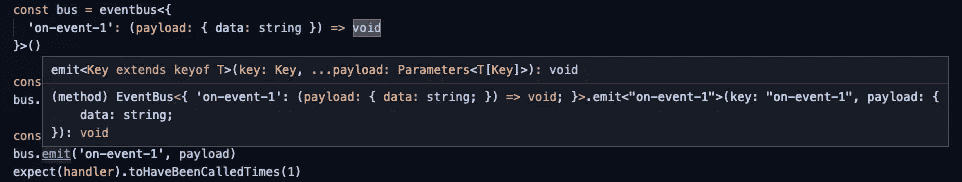
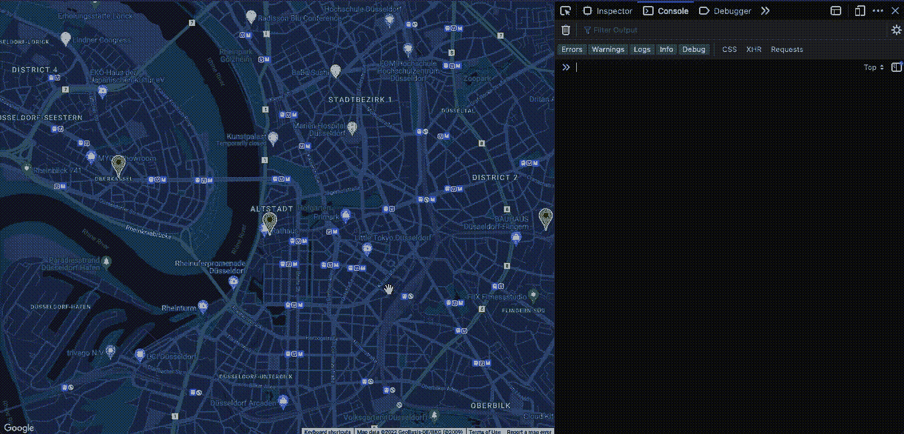

# 如何在 React 架构中使用事件总线

> 原文：<https://betterprogramming.pub/how-to-use-event-bus-in-react-architecture-f90485477647>

## 让我们创建一个混音应用程序



作者图片

# TL；速度三角形定位法(dead reckoning)

*   我们将用 60 行代码从头开始编写一个轻量级的事件总线！
*   我们将学习在 React best 中使用事件总线的用例。
*   我们将在 Google Maps API 的演示中应用事件总线。

我最近在工作中遇到了一个有趣的事件总线用例。在全球范围的 web 应用程序中，这是一个非常精简的模块来组织日志分析。它在一个大的代码库中创造了巨大的清晰度，所以我想与你分享我对这个有用的设计模式的案例研究。

我们走吧。

# 什么是事件总线？

事件总线是一种设计模式，它允许组件之间进行发布子样式的通信，同时组件保持松散耦合。

组件可以向事件总线发送消息，而不知道消息发送到哪里。另一方面，组件可以监听事件总线上的消息，并在不知道消息来自何处的情况下决定如何处理该消息。通过这种设计，独立的组件可以在彼此不了解的情况下进行通信。

可视化看起来像这样:



*   事件:在事件总线上发送和接收的消息。
*   发布者:发出事件的发送者。
*   订阅者:监听事件的接收者。

让我们仔细看看事件总线。

# 从头开始构建事件总线

受 [Vue 的遗留事件 API](https://v3-migration.vuejs.org/breaking-changes/events-api.html) 的启发，我们将为我们的事件总线实现以下 API:

*   `on`:供订阅者监听(订阅)一个事件，并注册其事件处理程序。
*   `off`:供订阅者删除(取消订阅)一个事件及其事件处理程序。
*   `once`:对于订阅者来说，一个事件只听一次。
*   `emit`:发布者向事件总线发送事件。

现在，我们的事件总线的数据结构应该有两种能力:

*   对于发布者:能够在调用 emit 时触发与事件键关联的已注册事件处理程序。
*   对于订阅者:能够在调用 on、once 或 off 时添加或移除事件处理程序。

我们可以为它使用一个键值结构，如下所示:

要实现`on`方法，我们需要做的就是将事件键添加到总线上，并将事件处理程序追加到处理程序数组中。我们还想返回一个取消订阅函数来删除事件处理程序。

为了实现`off`，我们可以简单地从总线上移除事件处理器。

当调用`emit`时，我们希望触发所有与事件相关的事件处理程序。我们将在这里添加错误处理，以确保所有的事件处理程序将被触发，尽管有错误。

由于`once`只会监听一个事件一次，我们可以把它看作是一个注册处理程序的方法，这个处理程序在触发后会取消自己的注册。一种方法是创建一个高阶函数`handleOnce`。代码如下:

现在我们的事件总线中有了所有的方法！

# 改进打字稿打字

事件总线的当前类型是相当开放的。事件键可以是任何字符串，事件处理程序可以是任何函数。为了使用起来更安全，我们可以添加类型检查，将事件键和处理程序关联添加到`EventBus`。

现在，我们指示 TypeScript 键必须是`keyof T`中的一个，并且处理程序应该具有相应的处理程序类型。例如:

```
interface MyBus {
  'on-event-1': (payload: { data: string }) => void
}const myBus = eventbus<MyBus>()
```

开发时应该能看到清晰的类型定义。



# 在 React 中使用事件总线

我创建了一个 [Remix](https://remix.run/) 应用程序来演示如何使用我们刚刚构建的事件总线。



> *你可以在这里* *找到* [*GitHub 库进行演示。*](https://github.com/DawChihLiou/eventbus-demo)

该演示展示了如何在同构的 React 应用程序中使用事件总线组织日志记录。我选择了三个事件来记录:

*   `onMapIdle`:当地图完成实例化或者用户完成拖动或缩放地图时，事件发生。
*   `onMapClick`:用户点击地图时事件发生。
*   `onMarkerClick`:当用户点击地图标记时事件发生。

让我们创建两个事件通道。一个用于地图，一个用于标记。

分离事件通道的原因是为了清晰地分离关注点。当应用程序增长时，这种模式可以水平增长。

现在，让我们使用 React 组件中的事件通道。

我们订阅了`Index`组件中的事件，并在地图和标记交互时发出事件。此外，通过订阅和取消订阅组件的生命周期，我们可以在用户旅程开始时只注册必要的事件处理程序。

# 最后的想法

如果你正在寻找一个事件总线库，Vue.js 推荐了几个选择:

*   米特
*   [微型发射器](https://github.com/scottcorgan/tiny-emitter)

Reddit 上还有一个有趣的关于使用 Redux 作为事件总线的讨论。一个维护者建议了一些基于 Redux 的工具来处理事件:

*   [redux-toolkit 的新监听器中间件](https://github.com/reduxjs/redux-toolkit/releases/tag/v1.8.0)
*   [redux-observable](https://github.com/redux-observable/redux-observable/)
*   [Redux-Saga](https://github.com/redux-saga/redux-saga)

# 参考

*   [GitHub:米特](https://github.com/developit/mitt)
*   [GitHub:微型发射器](https://github.com/scottcorgan/tiny-emitter)
*   [GitHub:redux-observable](https://github.com/redux-observable/redux-observable/)
*   [GitHub: Redux-Saga](https://github.com/redux-saga/redux-saga)
*   [GitHub: eventbus-demo](https://github.com/DawChihLiou/eventbus-demo)
*   [文档:Vue 3 迁移指南—事件 API](https://v3-migration.vuejs.org/breaking-changes/events-api.html)
*   文档:redux-toolkit 的新监听器中间件
*   [文档:混音](https://remix.run/)

```
**Want to Connect?**This article is originally posted on [Daw-Chih’s website](https://dawchihliou.github.io/articles/event-bus-for-react).
```