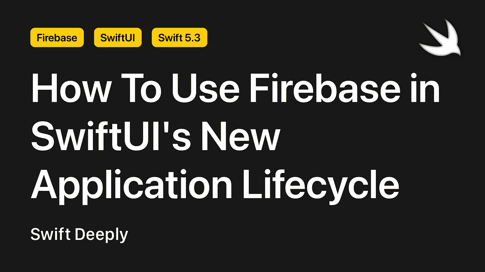

# 如何在 SwiftUI 的新应用生命周期中使用 Firebase

> 原文：<https://betterprogramming.pub/how-to-use-firebase-in-swiftuis-new-application-lifecycle-c77a8a306d63>

## 使用 SwiftUI 2.0 探索 Firebase



作者照片。

SwiftUI 2.0 给我们带来了很多新功能。我最喜欢的是新的应用程序生命周期，因为它比旧的更简单，但用 Firebase 配置它可能会很棘手。

在本文中，我们将学习如何用 SwiftUI 的新生命周期配置 Firebase。

首先，我们来看看新旧 app 生命周期的区别！

*注:您可以在 GitHub 上* [*下载本文的示例项目和源代码*](https://github.com/Unobliging/How-to-Use-Firebase-in-SwiftUI-s-New-Application-Lifecycle) *。*

# UIKit 应用委托生命周期与 SwiftUI 生命周期

有了 UIKit 的生命周期，你需要在`didFinishLaunchingWithOptions`方法中编写 Firebase 的`configure()`函数。此方法用于首次打开应用程序时应该完成的操作。

```
**import** UIKit
**import** Firebase**@UIApplicationMain**
**class** AppDelegate: UIResponder, UIApplicationDelegate {
    **var** window: UIWindow? **func** application(_ application: UIApplication, didFinishLaunchingWithOptions launchOptions: [UIApplication.LaunchOptionsKey: Any]?) -> **Bool** {
    FirebaseApp.configure()
 **return true**
    }
}
```

SwiftUI 的生命周期与 UIKit 不同，因为 SwiftUI 是一个声明性框架。这就是为什么有不同的方法和类。显然，我们将在 SwiftUI 生命周期中使用的方法会略有不同。

如果你以前一起使用过 SwiftUI 和 UIKit，你知道我们想在 SwiftUI 中使用的一些类或方法来自 UIKit，因为 SwiftUI 中仍然不支持很多东西。我们将从 UIKit 获得帮助，同时使 SwiftUI 应用生命周期适应 Firebase。

目前，我不能说它们之间有显著的区别。也许 SwiftUI 3.0 会改变这一切。

# 开始使用 SwiftUI 的新生命周期

首先，我们需要创建一个新的 Xcode 项目(要使用 SwiftUI 的新生命周期，需要 [Xcode 12](https://apps.apple.com/tr/app/xcode/id497799835?mt=12) )。)创建新项目时，确保“界面”是“SwiftUI”，“生命周期”是“SwiftUI App”。


创建一个项目后，进入`ExampleProjectApp.swift`文件(你的项目名称可以和我的不同)。当使用新的应用程序生命周期时，参与生命周期的最早可能点是通过向应用程序的主入口点添加初始化器。

```
**import** SwiftUI**@main**
**struct** Example_ProjectApp: App {
    **var** body: some Scene {
         WindowGroup {
            ContentView()
         }
    }
}
```

假设您正在这个项目上配置 Firebase。我们需要在这个文件上导入 Firebase。

```
**import** SwiftUI
**import** Firebase
```

嗯，我们如何初始化 Firebase？答案很简单:`init`方法。

```
import SwiftUI
import Firebase**@main**
**struct** Example_ProjectApp: App { // MARK: - Life Cycle
    **init**() {
        FirebaseApp.configure()
    }

    // MARK: - UI Elements
    **var** body: **some** Scene {
        WindowGroup {
            MainScreen()
        }
    }
}
```

这适用于 Firebase SDKs，如 Cloud Firestore，但对于 Firebase Cloud Messaging 来说还不够，因为它使用方法 swizzling 来挂钩应用程序生命周期。这种机制允许框架拦截对特定方法的调用，并在将调用传递给应用程序之前处理它们。

在这种情况下，您需要使用`@UIApplicationDelegateAdaptor`属性包装器将您的应用程序连接到`AppDelegate`的实例。

```
**import** SwiftUI
**import** Firebase**class** AppDelegate: NSObject, UIApplicationDelegate {

    // MARK: - Methods
    **func** application(_ application: UIApplication, didFinishLaunchingWithOptions launchOptions: [UIApplication.LaunchOptionsKey : **Any**]? = **nil**) -> **Bool** {
        **return** **true**
    }
}**@main**
**struct** Example_ProjectApp: App {

    // MARK: - Properties
    **@UIApplicationDelegateAdaptor**(AppDelegate.**self**) **var** delegate

    // MARK: - Life Cycle
    **init**() {
        FirebaseApp.configure()
    }

    // MARK: - UI Elements
    **var** body: **some** Scene {
        WindowGroup {
            ContentView()
        }
    }
}
```

同时，您将能够逐步迁移到新的应用程序生命周期模型。

# 结论

我希望这篇文章对你有所帮助。我会继续写 Firebase，敬请期待！

如果你想见我或有关于 iOS 开发等问题。你可以在这里和我[进行一对一的会谈。](https://superpeer.com/canbalkya)