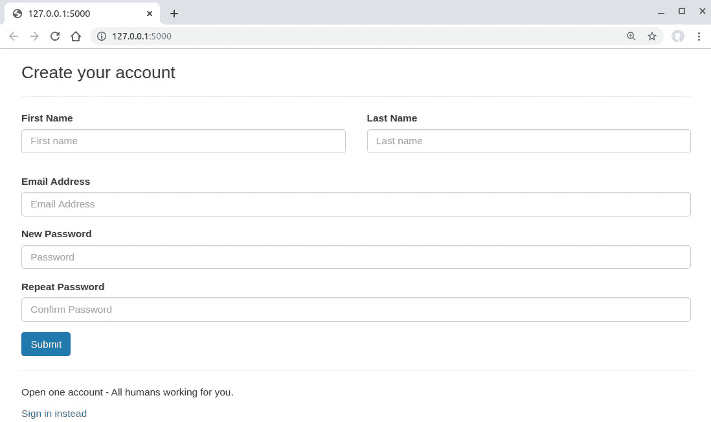
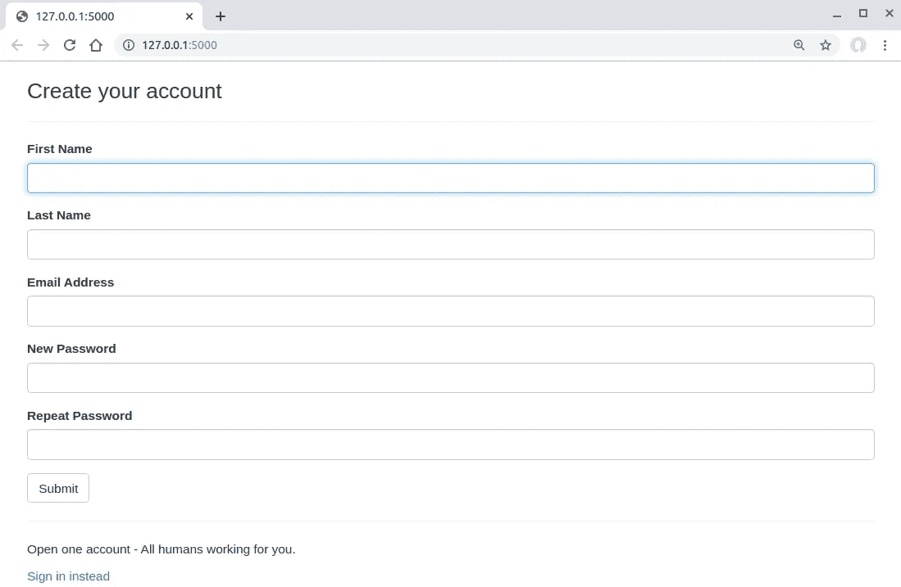

# 如何使用 Flask-WTForms

> 原文：<https://betterprogramming.pub/how-to-use-flask-wtforms-faab71d5a034>

## 让表单验证变得轻而易举


Alejandro Escamilla 在 [Unsplash](https://unsplash.com?utm_source=medium&utm_medium=referral) 上拍摄的照片

# 元信息

## 目标

*   介绍如何使用 [Flask-WTForms](https://flask.palletsprojects.com/en/1.1.x/patterns/wtforms/) 简化表单生成和验证
*   使用 Flask-WTForms 构建一个只有一个注册页面的功能性 [Flask](http://flask.palletsprojects.com/) 应用程序。最终产品看起来像:



自定义样式的注册表单

## 读者假设

*   了解 Python。
*   了解 Flask 的基础知识。

## **代码**

*   本文的代码可以在 [GitHub](https://github.com/Neo-Hao/wtf-registration-form) 上获得。

# 什么是**烧瓶-WTForms**

当你使用 Flask 构建一个交互式应用时，你不能避免表单。用于创建表单和处理表单数据(尤其是表单验证)的代码会很快变得难以阅读并且编写起来很乏味。

Flask-WTForms 是帮助表单验证的一个很好的工具(例如，避免[跨站点请求伪造](https://www.owasp.org/index.php/Cross-Site_Request_Forgery_(CSRF)) (CSRF))。Flask-WTForms 可以帮助创建和使用带有简单 Python 模型的 web 表单，将单调乏味的表单验证变得轻而易举。

# 使用 Flask-WTForms

## 一个简单的 Flask 应用程序的基本代码

为了展示 Flask-WTForms 的强大功能，我们将保持我们的代码库最小化。因此，我们将坚持使用单个 Python 文件和一个 HTML 模板。

为了从头开始，我们创建一个名为`wtf-registration-form`的文件夹，在文件夹中导航，创建并激活虚拟环境，然后安装 Flask:

```
$ python3.7 -m venv env
$ source env/bin/activate
(env)$ pip install flask
```

我们的代码库`app.py`只有大约 10 行代码:

相应的 HTML 文件`registration.html`到目前为止完全是静态的:

## 快速表单生成和验证

`quick_form`是一个为完整的 Flask-WTF 表单输出引导标记的方法。

正如你可能猜到的，它同时依赖 Flask-Bootstrap 和 Flask-WTF。`quick_form`是 Flask-WTForms 如何使表单生成和验证变得容易的最佳演示之一。

要使用`quick_form`，我们需要安装 Flask-Bootstrap 和 Flask-WTF:

```
(env)$ pip install flask_bootstrap
(env)$ pip install Flask-WTF
```

现在我们可以开始更新`app.py`:

有三件事需要解释。

1.  首先，我们使用 Bootstrap 并依赖它来设计我们的表单。要加载新安装的引导程序，你只需要在初始化`app`(一个 Flask 对象)时说`Bootstrap(app)`。

加载引导程序时，您的 HTML 模板文件将可以访问一组准备好的引导程序模板文件(包括 HTML、CSS 和 JS 文件)，它们位于您的`templates`文件夹中的`Bootstrap`文件夹下。

你实际上看不到这个`Bootstrap`文件夹，你最好参考[它的手册](https://pythonhosted.org/Flask-Bootstrap/)来了解如何使用它。

2.其次，我们创建一个表示表单的对象，并通过`render_template`方法将其传递给名为`registration.html`的模板文件。因此，我们可以使用这个表单对象在 HTML 模板文件中呈现表单:

将生成一个包含各种东西的表单，比如 CSFR 避免、表单验证和默认引导样式。在上面的模板代码中，它将通过`app.py`中的`render_template`方法传递的表单对象作为唯一的变量。

3.第三，从`app.py`到`registration.html`通过`render_template`方法传递的 form 对象是从一个名为`RegForm`的类中强制转换的，这是我们自己做的。

这个只有 15 行代码的类将生成一个注册表单，在必要时自动验证每个字段:

`flask_wtf`负责将`wtfform`系在砂箱框架上。我们的`RegForm`从`flask_wtf`继承了`Form`类。关于`flask_wtf`下的`Form`类的更多信息，请查看本文。

`wtfform`是一个不同于`flask_wtf`的类。当您想到处理表单生成和验证时，这些是`wtfform`的工作。`wtfform`定义了一组对应于各种`<input>`元素的字段。

例如，`StringField`对应于带有`type="text"`的`<input>`元素。`StringField`的第一个参数是标签，它代表了`<input>`元素的文本标签。`StringField`的第二个参数是验证器列表。

更具体地说，让我们看看`model.py`中的这行代码:

```
name_first = StringField('First Name', [validators.DataRequired()])
```

当您启动应用程序时，这一行将生成以下 HTML 代码:

```
<div class="form-group  required">
<label class="control-label" for="name_first">First Name</label>
<input class="form-control" id="name_first" name="name_first" required="" type="text" value="" autocomplete="off">
</div>
```

准备好这三个文件后，您可以继续，通过启动 Flask 应用程序来查看`quick_form`的实际效果:

```
(env)$ python3 app.py
```

你会看到这个:



默认引导样式的注册表单

注意，上面的样式只是默认的引导样式。当你使用`quick_form`时，那是它能做的最好的。

## 自定义表单生成和验证

当您需要定制您的注册表单的样式时(例如，在同一行中列出名字和姓氏的输入)，您必须放弃使用`quick_form`并手动编写您的 HTML 模板的样式。

Flask-Bootstrap 和 Flask-WTF 支持另一个名为`from_field`的方法，该方法可以监听和解析从`app.py`发送到 HTML 模板的表单对象。

例如，以下几行将名字和姓氏的输入字段放在同一行中:

请注意，`from_field`方法的第一个参数是对应于输入字段的实例。其余参数指定其他属性，如类、占位符等。

此外，值得注意的是，我们需要在表单中包含以下行，以避免 CSRF。

```
{{ form.csrf_token() }}
```

当我们使用`quick_form`时，这部分被自动处理。当我们制作自定义表单模板时，我们必须手动完成。总的来说，自定义模板如下所示:

自定义模板呈现以下效果:


具有自定义样式的注册表单(同一行上的两个字段和一个蓝色按钮)

# 相关故事

[两周内开发一个谷歌文档插件我学到了什么](https://blog.bitsrc.io/what-i-learned-from-developing-a-google-doc-add-on-in-two-weeks-5985675aff81?source=friends_link&sk=f29b2358c8a7acd24abfaa2d544cdba4)