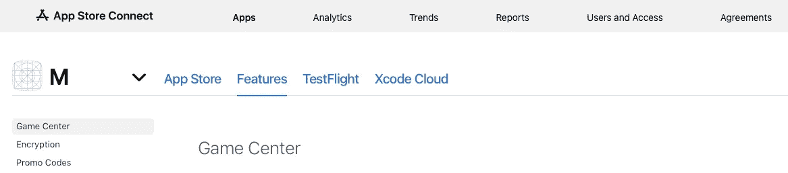
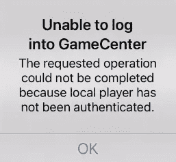
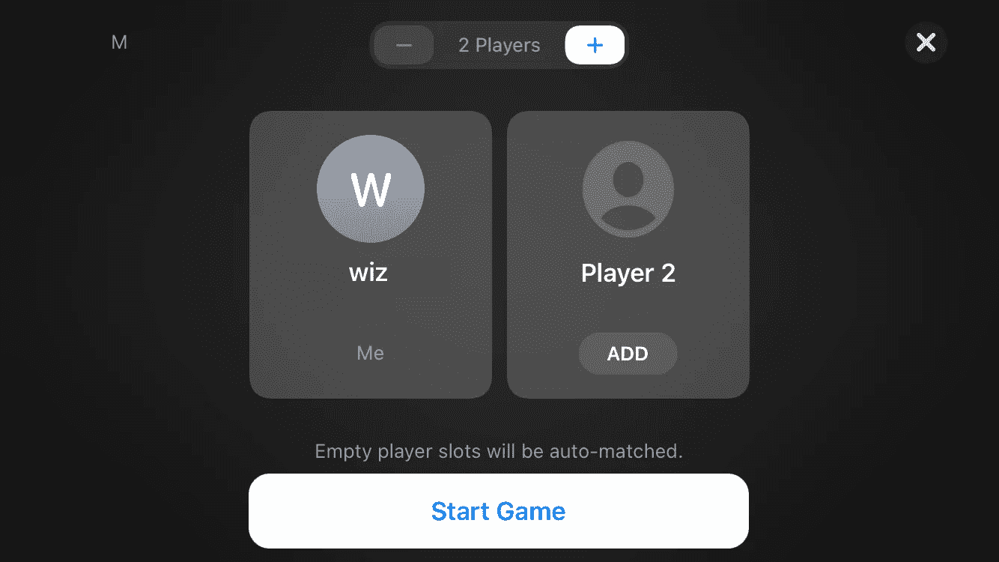

# 如何在 SwiftUI 中使用 GameKit

> 原文：<https://betterprogramming.pub/how-to-use-gamekit-in-swiftui-d8f5b9c2b3d6>

## 让 GameKit 在 SwiftUI 应用程序中工作


由[伯特·布瑞尔](https://unsplash.com/@bertsz?utm_source=unsplash&utm_medium=referral&utm_content=creditCopyText)在 [Unsplash](https://unsplash.com/s/photos/network?utm_source=unsplash&utm_medium=referral&utm_content=creditCopyText) 拍摄的照片

在过去的一两个月里，我已经发表了半打关于在 SwiftUI 环境中构建基于 SpriteKit 的游戏的文章，同时我自己也在悄悄地开发一个游戏。当我这么做的时候，我意识到我没有发布任何关于 SpriteKit 的二表哥 GameKit 的信息。遗憾的是，这个框架还没有被移植到 SwiftUI 上。一石二鸟，我想我会在更新自己的工作时记录下来，因为我需要更新我对框架的理解。和我一起踏上这样的旅程吧。

GameKit 是苹果公司的社交网络平台。它的目标是通过使用排行榜、挑战、成就和共享数据的网络功能等策略鼓励用户之间的竞争，来帮助开发者销售更多的游戏。

这是最后一个元素，也是苹果在 WWDC2021 上就这个主题的演示中一直在默默努力的联网部分。这也是我的游戏需要的地方，也是本文的主题。一个多平台功能，让您的用户使用自动匹配、朋友、联系人、最近玩过的游戏，甚至是附近的其他人一起玩您的游戏。

但是等等——在我们考虑将它用于一个基于 SwiftUI 的游戏之前，我们需要讨论一下这个代码的`UIViewControllerRepresentable`。让我们从我能创建的最简单的 VC 开始，这一个。经典的“你好，世界”

我使用这个结构在 SwiftUI 应用程序中启动它。

简单地这样称呼它:

用 SwiftUI 项目运行它，您会在 SwiftUI 视图的中心看到由 UIKit 生成的单词“hello world”。

太好了，我们进展顺利——但是在我启动 GameKit 之前，有一句话要小心。在写这篇文章之前，我花了好几天时间来确保我理解了这个怪物，而这个框架并不像它应该的那样坚固。实现 GameKit，尤其是社交网络方面，并不适合胆小的人。你还需要至少两台真实设备，以及一个苹果开发者账户才能继续。

您还必须将 Game Center 作为一项功能包含在您的项目中。这将要求您在 [appstoreconnect](https://appstoreconnect.apple.com/apps) 中声明您正在开发的应用的功能中的排行榜。



# 游戏工具包实现

GameKit 中的多人选项有几种风格，它们的工作方式不同，至少可以说是一个挑战。取决于你运行哪个`GKMatchController` ，你需要用 GKFramework 查看不同的方法来把它们结合在一起，以及不同的协议。我也注意到，可悲的是，一些关于苹果的在线文档已经过时了，而且引用的方法有时已经不仅仅是贬值了，它们已经被根除了。

## GKMatchmakerViewController

所以我从`GKMatchmakerViewController`开始，最灵活的一种。使用与我为`ShortViewController`做的相同的代码将它添加到项目中。我用一些新的模板代码替换了`ViewDidLoad`方法中的“hello world”代码。登录 GameKit 社交网络环境所需的代码。

**注意:**要使用链接到 GK 框架的任何方法，您需要登录到社交游戏网络。如果你在成为认证用户之前尝试启动一些东西，最好的情况是它安静地不起作用，最坏的情况是它会在你身上爆炸。

这当然立即难倒了我，因为我需要在启动网络匹配部分之前等待确认我已通过身份验证。这意味着我需要使用我在这篇[文章](/7-ways-to-link-swiftui-views-to-spritekit-scene-58180a57ab58)中概述的方法之一将我的 SwiftUI 接口链接到新的控制器。链接它，以便我可以手动启动后，它验证了我的下一个阶段。

为此，我将这段代码添加到了`ViewDidLoad`方法中，如下所示:

假设 GameCenter 是开着的，这要么让你登录，要么让你登录。也就是说，通读 SO 的帖子，看起来你不会得到游戏中心被禁用的提示。您将简单地得到一条连接失败的消息，如下所示:



也有可能在 GameCenter 上关闭附近的玩家。再次，这是一个选项，将投掷扳手到工程应该碰到它。

继续前进，手动确认 Game Center 正在运行并且附近有连接，是时候采取下一步了。

我需要实现一种方法来启动 GKGameKit 的交互界面。为此，我决定简单地创建一个共享类，它将是一个我可以在 SwiftUI 界面或 GameKit 类中访问的单例类。在一个类中，我将有一个`passThroughSubject`，我将通过 SwiftUI arm 中的 singleton 订阅我的 GK 类并引用它。我将在 SwiftUI 和 GameKit 之间共享的类如下所示。

SwiftUI 中对它的引用如下所示:

以及在类本身的`viewDidLoad`方法中。

通过 SwiftUI 界面上的点击手势启动该方法。请注意，您需要遵守`GKMatchmakerViewControllerDelegate`和`UINavigationControllerDelegate`协议，这些协议需要包含在内，以便能够设置这里看到的委托。

现在，当你点击媒人文本时，它会弹出一个窗口，看起来像这样:



游戏套件启动屏幕截图

在这张照片中，我用昵称 wiz 登录了 GameCenter，游戏的名字是“M”。在上面的代码中，minPlayers 和 maxPlayers 一样被设置为 2，这就是为什么您在这里只看到两个框。

现在，你可能已经错过了三个小要点:

*   确保设置了 zIndex，这样你的文本就高于游戏视图。否则，GameView 可能会在 SwiftUI 文本上方打开，从而停止 onTap 手势。
*   只在一台设备上运行界面，邀请其他设备加入游戏。两者兼而有之，结果不会好。
*   我在 VC 上设置的**委托**叫做 **matchmakerDelegate。**你也会找到一个代表，暂时忽略它。我不知道苹果是如何/为什么这么做的？

随着界面的运行，你可以选择一个客户端或开始游戏，让自动匹配找到一个。现在对我来说，**自动匹配不起作用**。我有两个 iPads，它们都运行蓝牙，都在同一个网络上——都登录到同一个应用程序(游戏)的 GameCenter。两者都尽可能地公开对话，都运行相同版本的 iOS。自动匹配对我来说肯定应该工作；它没有。我不禁怀疑，苹果正在远离你可以找到随机玩家一起玩的想法，这听起来不太以隐私为中心，苹果正在走的路。

如果你不遵循这条路线，并选择添加一个球员，一些奇怪的错误信息将滚动过去的控制台后，它发现并提供第二个设备作为候选，你可以确认和连接。

**注意:**要在您的测试环境中实现这一点，您需要让两台设备登录到不同的 Apple IDs。Game Center 不让你启动游戏自己玩:)

你有大约三秒钟的时间来响应通知，这太快了，苹果注意了，对于有可访问性问题的用户。当然，如果您错过了通知，您可以取回它，但这并不理想。当您在运行相同代码的第二个设备上点击通知时，协议将启动该方法，其中的代码需要说明这一点。

我回来的`corePlayer`场景。这与您在`makeMatch`方法中调用的控制器相同，只是参数不同。是的，我也觉得很困惑。

但是舞蹈还没有完全结束，因为你发出邀请的第一个设备现在运行这个方法作为响应，对此我添加了四行代码。这段代码允许你保存一个对比赛的引用，设置一个委托，保存一个对球员名字的引用，并关闭 VC。请记住，您需要将`GKMatchDelegate`、GKLocalPlayerListener、`GKMatchmakerViewControllerDelegate`和`UINavigationControllerDelegate`协议添加到`SimpleViewController`类中，以使所有这些都按预期工作。

默认情况下，属性`isHosted`被设置为 false，这就是调用此方法的原因。如果设置为 true，那么我引用“GameKit 在找到玩家时调用`[matchmakerViewController(_:didFindHostedPlayers:)](https://developer.apple.com/documentation/gamekit/gkmatchmakerviewcontrollerdelegate/1492421-matchmakerviewcontroller)` delegate 方法”，而不是这个。据我所知，托管游戏和点对点游戏(默认)的区别在于控制玩家的访问。在主机游戏中，你管理连接，所以你邀请一个玩家，然后控制他们是否可以继续玩。在一个点对点的游戏中，有一次你邀请了一个玩家；您不能撤回邀请；所有的玩家实际上都是对等的。

好了，回到我们的连接。现在你可以从一个向另一个发送数据，尽管背后的故事同样令人费解。您可以调用两种方法来发送数据，也可以调用两种方法根据您发送数据的方式做出响应。

将这两个方法添加到`SimpleViewController`类中。

并向 switch 语句和 SwiftUI 接口添加更多代码，以便您可以使用相同的技术调用它们。附加有`onTapGesture`的文本。

**注:**最初，您需要使用第二种方法，因为连接设备在收到来自邀请设备的数据之前，不知道正在进行的比赛的详细信息。

回到游戏视图。根据您用来发送数据的方法，它将从显示/记录的两种方法中选择一种。

一切就绪后，您现在应该能够选择另一个设备，连接并向游戏中的所有玩家发送数据，之后他们也可以相互发送数据。请注意，我在代码中添加了音频回放，这样我就可以知道发送的数据已被接收。

这里有一个奇怪的警告——为了让你的所有玩家得到他们同伴的推荐，他们需要互相交谈。但是那个信息，谁在玩，只有游戏发起者知道。因此，具有讽刺意味的是，尽管官方称之为对等关系，但实际上，它看起来更像是星型拓扑。

我想我们可以在 GameCenter 和朋友们一起做点什么，但这超出了本文的范围。

但是等等，因为这个圈还不完整。我们需要为我们的`SimpleViewController`类设置一种方法，将数据发送回 SwiftUI 接口，以便它可以报告问题。为此，我扩展了`Multiple` 类，并添加了第二个带有元组的`PassThroughSubject`，如下所示:

```
var alertView = PassthroughSubject<(String,String),Never>()
```

并使用我在这篇文章[中展示的相同的警报模板代码](/7-alertview-options-in-swiftui-691ccb742d22)。我将这段代码添加到 SwiftUI 接口中，以便在需要时可以调用它来显示警报。

最后，我在 GameView 类中添加了使用新的`Subject`的新功能，我在这里展示了一个例子。

您应该将此方法添加到任何/所有需要向接口报告某些内容的协议回调中。确保你在主线程上调用它，否则你会得到一个紫色的警告。

# 下一步是什么？

所有这些都让我想到了这篇文章的结尾。根据这篇文章的反响，我可能还会探索另外两个主要选项。首先是双人游戏控制器。一种游戏控制器，设计用于只需要两个玩家轮流玩的游戏。

第二种选择是完全定制化；所以不要用苹果的 GameKit 接口，用自己的就行了。你仍然可以登录 GameCenter，但是不需要依赖他们的界面来协商玩家的参与。也就是说，观看关于这个主题的 WWDC2021 演示，完全定制不是他们希望你走的路线，尽管有人认为这应该会阻止你上应用商店。

尽管如此，我需要使用 GameKit 继续开发我的应用程序。请跟随我关注 medium.com，或者阅读我以前的一些文章。在过去的 18 个月里，我已经出版了 150 多本。