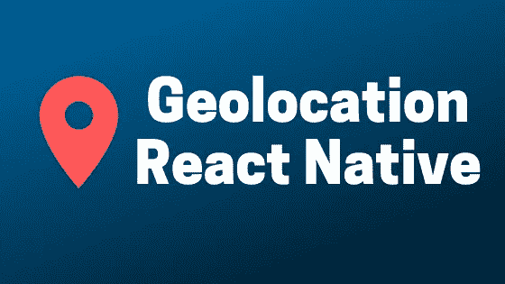

# 如何在 React Native With Hooks 中使用地理定位

> 原文：<https://betterprogramming.pub/how-to-use-geolocation-in-react-native-hooks-aea06bf58263>

## React Native 中地理定位 API 的说明性介绍

要开始使用 React Native 中的地理位置 API，您需要确保您已经使用`react-native-cli`或`expo-cli`创建了 React Native 项目。如果你还没有，你可以通过下面的操作使用`react-native-cli`创建一个新的应用。

通过 npm 安装 React 本机 CLI:

`npm i -g react-native-cli`

创建新的 React 本机项目:

`react-native init geolocation-project`

# 装置

现在我们已经建立了 React 本地项目，我们需要安装 React 本地地理定位模块，并将其链接到我们的本地模块。以前，地理位置 API 是由 React Native 直接提供的，但后来它被转移到自己的 npm 包中。

安装:

`npm i @react-native-community/geolocation -S`

链接(如果使用 React 本机 CLI):

`react-native link @react-native-community/geolocation`

# 使用 API

地理定位 API 提供了两种方法，我们可以利用它们来检索设备的地理位置:`getCurrentPosition`和`watchPosition`。如果您只需要检索位置一次，并且不监听更新，那么您将需要使用`getCurrentPosition`。

然而，如果你想订阅更新和收听位置的变化，你需要使用`watchPosition`。

让我们看看如何在 react 组件中使用这些方法的一些例子。

## 获取当前位置

这里有一个例子，说明我们如何使用`getCurrentPosition`方法向用户显示当前的纬度和经度。这个示例还处理在尝试检索位置时可能出现的错误，您可以以最适合您的应用程序的方式调整这个逻辑。

## 观察位置

下面，我创建了一个`useGeolocation`钩子，在组件挂载时使用`watchPosition`方法设置订阅，然后在组件卸载时取消订阅。这个钩子将在当前位置改变时强制重新呈现，并在每次更新时返回更新后的位置。

# 配置权限

## ios

你需要在你的`Info.plist`中包含`NSLocationWhenInUseUsageDescription`和`NSLocationAlwaysAndWhenInUseUsageDescription`键，以便在使用应用程序时启用地理定位。

如果你需要在后台访问地理位置，你还需要在`Info.plist`中包含`NSLocationAlwaysUsageDescription`键，并在 Xcode 的`Capabilities`标签中添加位置作为后台模式。

## 机器人

您需要将以下内容添加到您的`AndroidManifest.xml` : `<uses-permission android:name="android.permission.ACCESS_FINE_LOCATION"/>`

更多详情可以参考[自述](https://github.com/react-native-community/react-native-geolocation/blob/master/README.md)。

# 结论

希望这篇文章能帮到你，让你知道如何在 React Native 中使用地理定位 API。感谢您的阅读，祝您的项目好运。