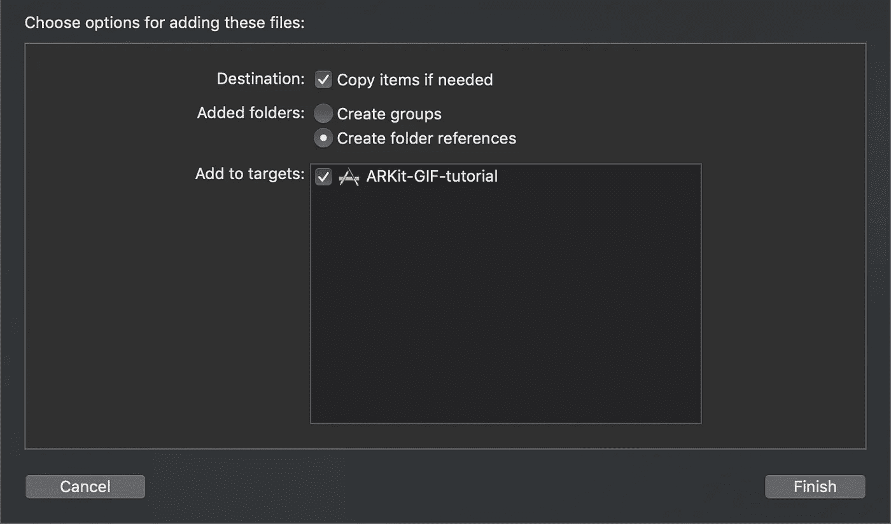

# 如何在 ARKit 上使用 gif

> 原文：<https://betterprogramming.pub/how-to-use-gifs-with-arkit-tutorial-610e4c1602da>

## 3D 得到了很多人的喜爱，但是在 ARKit 中使用 2D 怎么样呢？


帕特里克·施耐德在 [Unsplash](https://unsplash.com?utm_source=medium&utm_medium=referral) 上的照片

我注意到在苹果的 ARKit 平台上实现 gif 的教程明显不足。我认为这是因为人们对 AR 的 3D 方面比对 2D 方面更感兴趣，但我相信 2D 有一些有趣的使用案例。

ARKit 实现 gif 的关键是什么？不幸的是，这并不像在节点上应用 GIF 文件作为材质那么简单，因为动画不会播放。幸运的是，有人为 UIImage 创建了一个扩展，您可以简单地将它添加到您的项目中，以便播放 gif。

让我们从在 Xcode 中创建新项目开始。有些人更喜欢从单视图应用程序开始，但这里我们将创建一个增强现实应用程序。确保内容技术设置为 SceneKit。


如果您从增强现实模板开始， **info.plist** 将自动填写隐私-相机使用描述。这很重要，因为所有新的 ARKit 项目都需要用户的许可才能使用手机的摄像头。现在我们需要 UIImage 扩展。iOS 开发中心的人创建了一个很棒的扩展，可以很好地与 ARKit 兼容。只需在您的项目中创建一个新的 Swift 文件，并将代码放入其中:

```
//
//  iOSDevCenters+GIF.swift
//  GIF-Swift
//
//  Created by iOSDevCenters on 11/12/15.
//  Copyright © 2016 iOSDevCenters. All rights reserved.
//
import UIKit
import ImageIO
// FIXME: comparison operators with optionals were removed from the Swift Standard Libary.
// Consider refactoring the code to use the non-optional operators.
fileprivate func < <T : Comparable>(lhs: T?, rhs: T?) -> Bool {
  switch (lhs, rhs) {
  case let (l?, r?):
    return l < r
  case (nil, _?):
    return true
  default:
    return false
  }
}

extension UIImage {

    public class func gifImageWithData(_ data: Data) -> UIImage? {
        guard let source = CGImageSourceCreateWithData(data as CFData, nil) else {
            print("image doesn't exist")
            return nil
        }

        return UIImage.animatedImageWithSource(source)
    }

    public class func gifImageWithURL(_ gifUrl:String) -> UIImage? {
        guard let bundleURL:URL? = URL(string: gifUrl)
            else {
                print("image named \"\(gifUrl)\" doesn't exist")
                return nil
        }
        guard let imageData = try? Data(contentsOf: bundleURL!) else {
            print("image named \"\(gifUrl)\" into NSData")
            return nil
        }

        return gifImageWithData(imageData)
    }

    public class func gifImageWithName(_ name: String) -> UIImage? {
        guard let bundleURL = Bundle.main
            .url(forResource: name, withExtension: "gif") else {
                print("SwiftGif: This image named \"\(name)\" does not exist")
                return nil
        }
        guard let imageData = try? Data(contentsOf: bundleURL) else {
            print("SwiftGif: Cannot turn image named \"\(name)\" into NSData")
            return nil
        }

        return gifImageWithData(imageData)
    }

    class func delayForImageAtIndex(_ index: Int, source: CGImageSource!) -> Double {
        var delay = 0.1

        let cfProperties = CGImageSourceCopyPropertiesAtIndex(source, index, nil)
        let gifProperties: CFDictionary = unsafeBitCast(
            CFDictionaryGetValue(cfProperties,
                Unmanaged.passUnretained(kCGImagePropertyGIFDictionary).toOpaque()),
            to: CFDictionary.self)

        var delayObject: AnyObject = unsafeBitCast(
            CFDictionaryGetValue(gifProperties,
                Unmanaged.passUnretained(kCGImagePropertyGIFUnclampedDelayTime).toOpaque()),
            to: AnyObject.self)
        if delayObject.doubleValue == 0 {
            delayObject = unsafeBitCast(CFDictionaryGetValue(gifProperties,
                Unmanaged.passUnretained(kCGImagePropertyGIFDelayTime).toOpaque()), to: AnyObject.self)
        }

        delay = delayObject as! Double

        if delay < 0.1 {
            delay = 0.1
        }

        return delay
    }

    class func gcdForPair(_ a: Int?, _ b: Int?) -> Int {
        var a = a
        var b = b
        if b == nil || a == nil {
            if b != nil {
                return b!
            } else if a != nil {
                return a!
            } else {
                return 0
            }
        }

        if a < b {
            let c = a
            a = b
            b = c
        }

        var rest: Int
        while true {
            rest = a! % b!

            if rest == 0 {
                return b!
            } else {
                a = b
                b = rest
            }
        }
    }

    class func gcdForArray(_ array: Array<Int>) -> Int {
        if array.isEmpty {
            return 1
        }

        var gcd = array[0]

        for val in array {
            gcd = UIImage.gcdForPair(val, gcd)
        }

        return gcd
    }

    class func animatedImageWithSource(_ source: CGImageSource) -> UIImage? {
        let count = CGImageSourceGetCount(source)
        var images = [CGImage]()
        var delays = [Int]()

        for i in 0..<count {
            if let image = CGImageSourceCreateImageAtIndex(source, i, nil) {
                images.append(image)
            }

            let delaySeconds = UIImage.delayForImageAtIndex(Int(i),
                source: source)
            delays.append(Int(delaySeconds * 1000.0)) // Seconds to ms
        }

        let duration: Int = {
            var sum = 0

            for val: Int in delays {
                sum += val
            }

            return sum
        }()

        let gcd = gcdForArray(delays)
        var frames = [UIImage]()

        var frame: UIImage
        var frameCount: Int
        for i in 0..<count {
            frame = UIImage(cgImage: images[Int(i)])
            frameCount = Int(delays[Int(i)] / gcd)

            for _ in 0..<frameCount {
                frames.append(frame)
            }
        }

        let animation = UIImage.animatedImage(with: frames,
            duration: Double(duration) / 1000.0)

        return animation
    }
}
```

接下来，找到您选择的 GIF 并将其拖到您的项目中(确保它在根文件夹中，而不是在 Assets.xcassets 文件夹中)。出现提示时，确保选中“根据需要复制项目”。



现在我们准备进行一些编码。在`viewDidLoad()`中，将所有 ARKit 模板开始时的默认场景(名为“art . scna sets/ship . SCN”)替换为:

```
let scene = SCNScene()
```

接下来，创建一个名为`addGif()`的函数，该函数接受一个字符串作为您添加到项目中的 GIF 的名称，并将返回一个`SCNNode`。

```
func addGIF(name: String) -> SCNNode {
  let gifNode = SCNNode()

  return gifNode
}
```

因为该函数期望返回一个`SCNNode`，我们创建了一个名为`gifNode`的节点，并在函数结束时返回。现在，我们将借助之前导入的 UIImage 扩展对它应用 GIF:

```
func addGIF(name: String) -> SCNNode {
  let gifNode = SCNNode() let gifPlane = SCNPlane(width: 1, height: 1)  
  let gifImage = UIImage.gifImageWithName(name)
  let gifImageView = UIImageView(image: gifImage)    
  gifPlane.firstMaterial?.diffuse.contents = gifImageView gifNode.geometry = gifPlane
  gifNode.position = SCNVector3(0, 0, -1)

  return gifNode
}
```

这里发生了什么事？首先，我们创建一个宽度和高度为 1 米的`SCNPlane`(ARKit 使用米)。接下来，我们用 GIF 的名字创建一个`UIImage`，然后提供给`gifImageView`。然后我们将`gifImageView`作为一种材料应用于`gifPlane`。反过来，我们将`gifNode` *的*几何指定为`gifPlane`的几何。最后，我们将 it -1 定位在 Z 轴上:距离我们第一次打开应用程序的地方一米。ARKit 轴超出了本教程的范围——我推荐阅读[这篇文章](https://www.raywenderlich.com/378-augmented-reality-and-arkit-tutorial)以更好地了解它是如何工作的。

我们还需要做一件事，才能看到我们的 GIF 在运行:用我们的`viewDidLoad()`方法调用它。

```
override func viewDidLoad() {
  super.viewDidLoad()
  . . .
  sceneView.scene = scene sceneView.scene.rootNode.addChildNode(addGIF(name: "giraffe"))
}
```

编译您的代码并运行您的应用。厉害！您刚刚创建了第一个带有 gif 的 ARKit 应用程序(希望如此！)

请随意检查[完成代码](https://github.com/modium/ARKit-GIF-tutorial)。

这是我把这个工作流程和 ARKit 2 的图像检测结合起来做的