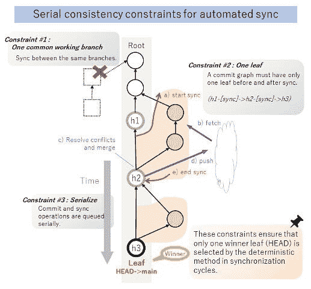
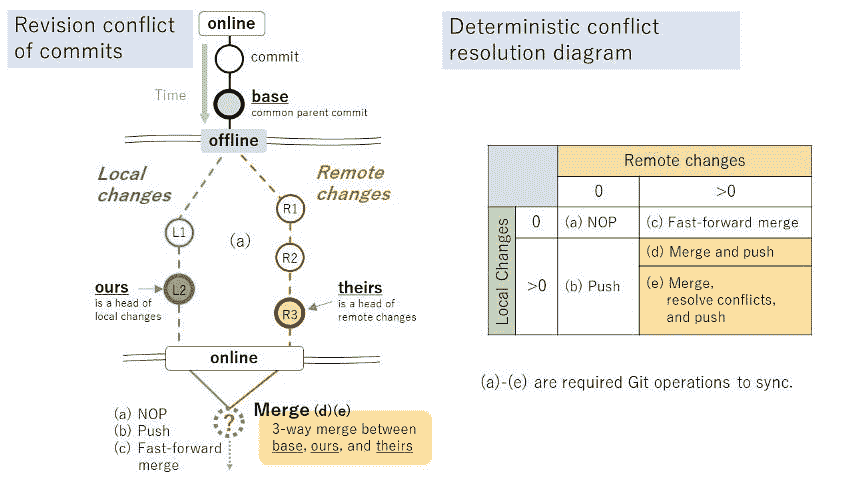
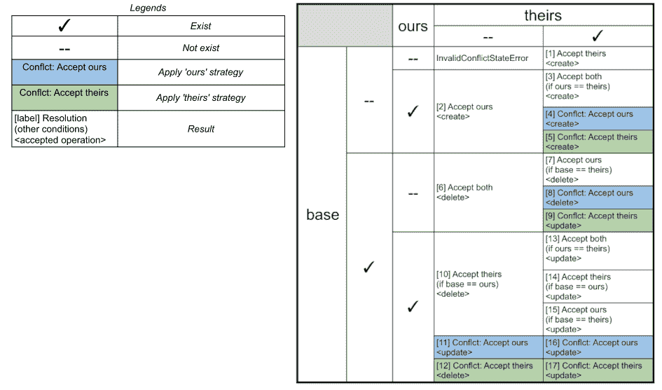
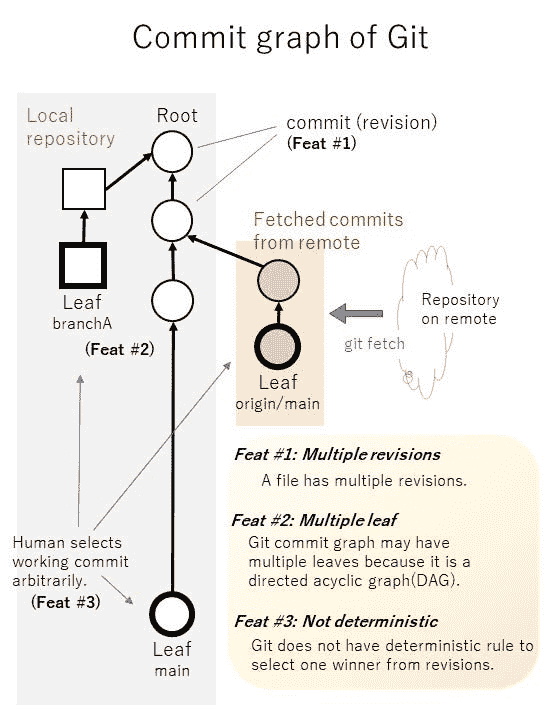

# 如何使用 Git 作为离线优先数据库

> 原文：<https://betterprogramming.pub/how-to-use-git-as-an-offline-first-database-dca7f9604142>

## 答案是为自动同步和冲突解决设计确定性的规则

图 1:离线优先的概念。图片来源:作者

上面是我的画，展示了离线优先的概念。[离线优先](http://offlinefirst.org/)是一个设计范例，确保你的应用程序离线和在线都能工作。

他的名字叫不插电塔努基。他平时都是离线，偶尔在线。他将数据存储在分散的地方，以便无论身在何处都能享受乐趣。此外，当在线时，他可以将他的分布式数据彼此同步。正因为如此，他脱离了互联网连接。

多主数据库是这种模式的重要组成部分。在多主数据库中，您拥有的分布式数据不是服务器的缓存，而是克隆的原始数据。因此，您不需要从服务器获取初始数据。

作为一个类似的概念，您可能对 Git 很熟悉。Git 是一个流行的分布式版本控制系统，它允许您管理多个位置的文件，并将本地文件与远程文件合并。如果 Git 可以被用作数据库，难道不可以创建离线优先的应用程序，与 Git 强大的工具集和 GitHub 这样的生态系统一起工作吗？

Git 当然是一个优秀的离线优先系统。尽管如此，还没有将它用作分布式数据库的例子。这是为什么呢？

原因是 Git 是一个面向人的工具，你需要为自动化处理设置规则。Git 没有内置的自动方法来同步和解决分布式数据的冲突。

图 2:完全自动化的 Git。图片来源:作者

在本文中，我将讨论 Git 全自动同步和冲突解决的规则。之后，我将介绍 GitDocumentDB，这是一个离线优先的数据库，它使用 TypeScript 实现那些规则。

顺便问一下，我们能不能把版本控制系统和分布式数据库相提并论？问题可以代替这个问题，“Git 是 CRDT 吗？."在本文中，我将首先展示该问题的技术解决方案。然后我将给出一些关于 CRDTs 的理论背景。

# 规则 1:提交的串行一致性约束

在 Git 中，一个文件有许多版本，用户可以任意决定选择哪一个。另一方面，计算机不能决定，除非有一个确定性的规则，只选择一个版本。

为了帮助 Git 确定性地工作并确定冲突的唯一赢家，您可以设置以下三个约束:

图 3:提交的串行一致性约束。图片来源:作者

## 1)一个公共工作分支

只有一个工作分支和一个远程分支与之同步。

## 2)一片叶子

提交图在同步前后必须只有一个叶。

在图 3 中，同步之前提交树中唯一的叶子是(h1)，其中(h1)是 HEAD。当 a)同步开始，b)获取，c)解决冲突和合并，d)推送，以及 e)同步结束时，提交树中唯一的叶子是(h2)。在这一点上，历史绝不能出现分歧。

结果，计算机只能选择一片叶子(h2)作为下一个头。

## 3)序列化

提交和同步操作必须按顺序排队。

这些约束确保在同步周期中确定性方法仅选择一个优胜叶(头)。

# 规则 2:确定性冲突解决流程

接下来，我们需要定义自动同步和冲突解决的流程。

在同步工作流中，可能会出现以下三种冲突:

## 1)一致性冲突

当本地和远程储存库不具有相同根的相同提交树时，就会发生冲突。如果您组合这些不一致的存储库，将会对任一存储库中的提交树产生破坏性的后果。在这种情况下，用户必须提前决定是抛出异常还是强制合并。

## 2)交易冲突

假设在同步过程中，在远程端进行了新的提交。在这种情况下，将会发生冲突，因为远程状态将在同步开始前改变。重试同步可以解决这种冲突。

## 3)历史冲突

当在本地和远程端的提交树上执行不同的操作时，会发生冲突。

本节将仅详述历史冲突的自动解决流程。

在图 4 中，本地存储库和远程存储库有共同的提交，并且是离线的。
离线时向本地和远程添加不同的提交会导致它们再次在线时发生冲突。

图 4:历史冲突。图片来源:作者

在上表中，本地端的新提交数量位于纵轴上。在远程端的新提交的数量在水平轴上，并且所需的操作被填充。

*   **(a) NOP** :如果本地提交计数为零，远程提交计数为零，则什么也不做。
*   **(b)推送**:如果本地提交数大于零，远程提交数为零，则执行推送操作。
*   **(c)快进合并**:如果本地提交数为零，远程提交数大于零，则执行快进合并。
*   **(d)合并推送**:如果本地提交数大于零，远程提交数大于零，则需要合并。如果没有冲突，合并和推送。
*   **(e)合并，解决冲突，推送**:在(d)中，如果有冲突，解决冲突，推送。

上述流程与用户的日常合并过程一致。你的下一个问题可能是如何合并和解决冲突。

# 规则 3:回溯文档合并

文档合并是通过比较本地端和远程端对给定文档的更改操作，然后合并更改操作来完成的。

图 5:自动解决冲突的案例。图片来源:作者

图 5 显示了 Git 中三路合并的自动化版本。3-merge 将“base”用于本地和远程端的公共父提交，“ours”用于最新的本地提交，“theirs”用于最新的远程提交。对于给定的文件，检查提交中是否存在单元格，如果不存在，则在单元格上加上“-”。例如，如果在“base”和“theirs”中找不到 README.md 文件，但在“ours”中找到了它，则该表将指向“[2] Accept ours <create>”单元格。这个单元格意味着“我们的”状态将被接受为合并结果，并且将执行文件创建操作。</create>

# 规则 4:冲突解决策略

虽然人类用户可以微调解决冲突时采用的结果，但计算机很难模仿。为了实现自动冲突解决，计算机应该根据人类预先确定的策略运行。

针对冲突的“我们的”策略和“他们的”策略与同名的 Git 策略具有相似的含义。换句话说，上表单元格中的“冲突:接受我们的”意味着在发生冲突时，“我们”方的内容优先于“他们”方的内容。

可以通过覆盖整个文档或合并文档的文本来解决冲突。例如，“我们”方的文件会覆盖“他们”方的文件。在其他情况下，当对文件进行比较并应用合并的补丁时,“我们的”方将优先于“他们的”方。“他们的”策略则相反。

函数还可以提供应用程序的决策标准。该函数将“base”、“ours”和“theirs”中要比较的文件作为参数，并返回“ours”策略或“theirs”策略作为结果。

# 添加文档数据库 API

我已经在 [GitDocumentDB](https://gitddb.com/) 中实现了上述规则，这是一个用 TypeScript 编写的库。您可以查看源代码，了解如何实现它，也有教程。

除了自动同步和自动冲突解决之外，GitDocumentDB 还提供了一个数据库 API 来处理 Git 中的 JSON 文档，使其易于用作数据库。

图 6:添加文档数据库 API。图片来源:作者

API 包括读取、写入、更新、删除、正向匹配搜索、倒带修订、收集和使用队列的任务序列化。

使用 GitDocumentDB，应用程序开发人员在开发基于 Git 的应用程序时，不需要创建他们的 API、自动同步或冲突解决。如果他们连接到 GitHub，他们不需要服务器。

从 JavaScript 调用 Git 有两个广为人知的库:[同构-git](https://github.com/isomorphic-git/isomorphic-git) 和[节点 Git](https://github.com/nodegit/nodegit) 。每一个都有其[的优点和缺点](https://gitddb.com/blog/git-engines)，但是 GitDocumentDB 兼容这两个库。

作为一个在 JavaScript/TypeScript 中创建离线优先应用的平台，Electron 可能是最好的选择。

# Git 是 CRDT 吗？

从理论的角度来看，Git 似乎是一种[无冲突复制数据类型(CRDT)](https://en.wikipedia.org/wiki/Conflict-free_replicated_data_type) ，一种在分布式数据库中更新复制数据的模型。

Git 通常不被称为 CRDT，但它从多个角度展现了 CRDT 的方方面面。我很少在社交网站上看到这种讨论。然而，他们没有对 Git 和现有的 CRDTs 进行具体的比较。

图 Git 的提交图。图片来源:作者

首先，Git 有一个多值寄存器(MV 寄存器)的特性。MV-Register 是一种 CRDT，因为一块数据有多个版本，所以在不同地方同时编辑不会破坏数据。

其次，Git 具有只加单调 DAG 的特性。Git 的提交图是一个有向无环图(DAG)。在这个图中，合并操作被设计成不破坏图结构，即使多个用户在不同的位置更新同一个提交图。这样的图是只加单调 DAG，一种 CRDT。

Git 对于分布式数据库有很好的特性，因为上面描述了 CRDTs 的最终一致性模型。坏的方面是 Git 没有为计算机提供确定性地同步和解决冲突的方法，如上所述。其他问题是 Git 没有类似于数据库的 API，并且作为一个数据库来看有很多开销。

CRDTs 通常都有数学证明，这里我只列出了表面的相似之处。希望有人来挑战这个证明。

# 利弊

已经有很多离线优先的数据库了，那么我为什么要使用 Git 作为我的数据库呢？

简单的回答是 GitDocumentDB 兼容 Git。分布式多主数据库和高效的 CI/CD 是从 Git 继承来的特性。

**优点:**

*   除了版本冲突之外，它还通过解决事务性和一致性冲突来自动化 Git 同步工作流。
*   典型的同步模式和差异修补策略可以解决这些问题。用于处理 JSON reduce 任务的可访问 CRUD 和集合 API。

**缺点:**

*   GitDocumentDB 的吞吐量和 Git 差不多。它没有典型的数据库快。
*   管理文档的多个修订版本时，存储容量会增加。

这些是 Git 特性的一个折衷。如果你的离线优先应用不需要 Git 兼容性，还有其他选择。另一个众所周知的具有多个主数据库的离线优先数据库是 [PouchDB](https://pouchdb.com/) 。如果你想要基于 CRDTs 的高级同步，[自动合并](https://github.com/automerge/automerge)或[枪](https://github.com/amark/gun)是一个选项。

# 结论

图 8:由 Git 提供支持。图片来源:作者

如果你想在 JavaScript/TypeScript 中构建一个离线优先的应用，并且 Git 兼容性对你来说至关重要，那么[gitdocumendb](https://gitddb.com/)是一个强有力的候选。

有兴趣的请关注 [@gitddb](https://twitter.com/gitddb) 。

[1]:下面的研究报告介绍了很多 CRDTs，包括 MV-Register 和 add-only 单调 DAG: Marc Shapiro，Nuno Preguiç，Carlos Baquero，Marek Zawirski。对收敛和可交换复制数据类型的综合研究。【研究报告】RR-7506，Inria —巴黎中心-罗奎考特；INRIA。2011 年，第 50 页