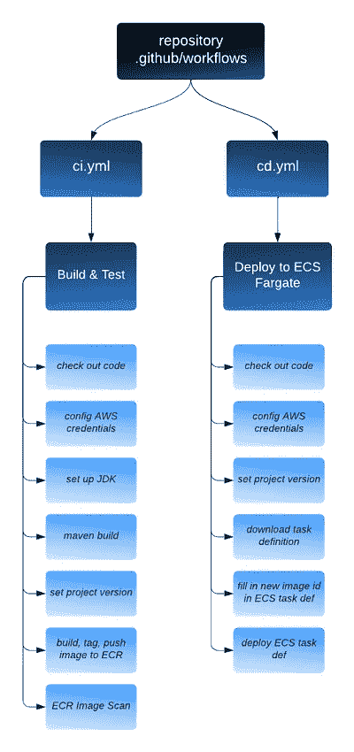

# 深入了解 GitHub Actions 的可重用工作流程

> 原文：<https://betterprogramming.pub/how-to-use-github-actions-reusable-workflow-8604e8cbf258>

## 关于如何在 CI/CD 中实现可重用工作流的详细说明


蒙大拿风景。作者照片

GitHub actions 可重用工作流于 2021 年 11 月 29 日在[正式发布，并从那时起迅速流行起来。可重用工作流的好处非常简单:](https://github.blog/2021-11-29-github-actions-reusable-workflows-is-generally-available/)

*   遵循干(不要重复自己)的原则
*   避免工作流程重复
*   更易于维护工作流程
*   允许我们在他人工作的基础上更快地创建新的工作流。
*   通过使用经过精心设计和测试的工作流来推广最佳实践。

根据 Thoughtworks 技术雷达的[观察，](https://www.thoughtworks.com/en-us/radar/platforms/reusable-workflows-in-github-actions)

> “GitHub Actions 中的可重用工作流为管道设计带来了模块化，甚至允许跨存储库的参数化重用(只要工作流存储库是公共的[或私有的])。它们支持将机密值作为秘密显式传递，并且可以将输出传递给调用作业。
> 
> 通过几行 YAML，GitHub Actions 现在给你提供了你在 [CircleCI](https://www.thoughtworks.com/en-us/radar/platforms/circleci) Orbs 或 [Azure Pipeline 模板](https://www.thoughtworks.com/en-us/radar/platforms/azure-pipeline-templates)中看到的那种灵活性，但不必离开 GitHub 这个平台。"

请注意，方括号中的上述引文中的修改源于 [GitHub 在 2022 年 12 月](https://github.blog/changelog/2022-12-14-github-actions-sharing-actions-and-reusable-workflows-from-private-repositories-is-now-ga/)发布的关于共享操作和私有存储库中可重用工作流的 GA 版本的公告。

在这个故事中，我们将说明如何在您的 CI/CD 项目中实现可重用的工作流。我们将从概述开始，然后深入探讨可重用的工作流。在我们的例子中，我们将使用两个 GitHub 存储库:

*   [客户-服务-可重用-工作流-示例](https://github.com/wenqiglantz/customer-service-reusable-workflows-example):Spring Boot 微服务，在其 CI/CD 中实现可重用工作流。这个微服务有两个工作流，`ci.yml`和`cd.yml`。这两个工作流的目的是不言自明的。
*   [可重用工作流模块](https://github.com/wenqiglantz/reusable-workflows-modules):一个集中的公共存储库，我们在其中存储可重用的工作流。

# 客户服务可重用工作流示例

这是典型的 Spring Boot 微服务，为客户提供 CRUD 端点。我们在它的`.github/workflows`目录下添加了两个工作流，`ci.yml`和`cd.yml`。有关两个工作流程中涉及的详细工作和步骤，请参见下图。



如果我们有许多具有相似工作流的微服务，那么在所有存储库中复制和粘贴这两个工作流会变得很乏味。如果我们需要对工作流中的一个或多个步骤进行更改，维护将成为一场噩梦。

让我们看看如何使这两个工作流可重用，以便可以在集中式可重用工作流中进行更改，并在调用这些可重用工作流的所有微服务中得到反映。

# 可重用-工作流-模块

为了对应上面提到的两个工作流，我们从两个可重用的工作流开始。你可以在下面看到它们。注意，我在可重用工作流的文件命名约定中指定了与特定工作流相关的编程语言(Java)、构建工具(Maven)和关键字(`build`、`test`、`deploy`、`ECS`)。这允许在集中的存储库中容易地识别可重用的工作流，特别是如果您的组织可能使用多种编程语言。每种语言都有自己的一套可重用工作流，这些工作流由其命名约定来标识。

*   `[java-maven-build-test.yml](https://github.com/wenqiglantz/centralized-reusable-workflows/blob/main/.github/workflows/java-maven-build-test.yml)`:用于持续集成(CI)，它进行代码构建、测试、映像构建和映像推送至 AWS 弹性容器注册中心(ECR)。这个可重用的工作流将被`ci.yml`调用。假设您已经为微服务配置了 ECR 和 ECR 存储库。下面提到的秘密已经在 GitHub 中配置好了。

*   `[java-api-deploy-to-ecs.yml](https://github.com/wenqiglantz/centralized-reusable-workflows/blob/main/.github/workflows/java-api-deploy-to-ecs.yml)`:用于连续部署(CD)，它从 ECR 中提取映像并将其部署到 AWS 弹性容器服务(ECS)。这个可重用的工作流将被`cd.yml`调用。假设您已经为微服务调配了 ECS Fargate 集群。下面提到的秘密已经在 GitHub 中配置好了。

现在，让我们深入了解这两个可重复使用的工作流:

# 可重用工作流的属性

## 存在于公共或私人存储库的`.github/workflows`目录中

与其他 GitHub actions 工作流文件一样，可重用工作流位于公共或私有存储库的`.github/workflows`目录中。在我们的示例中，[可重用工作流模块](https://github.com/wenqiglantz/reusable-workflows-modules)公共存储库。

**注意**:不支持`workflows`目录的子目录。

## **添加一个** `**workflow_call**` **触发器**

触发是可重用工作流和普通工作流的主要区别。对于可重用的工作流，`on`的值必须包括`workflow_call`:

```
on:
  workflow_call:
```

## **添加可选输入参数**

可重用工作流在概念上是模板，这意味着它们很可能需要传入参数，以使它们特定于调用工作流。但是，要使工作流可重用，参数并不是必需的。在大多数情况下，可重用工作流利用输入参数来使它们可重用于各种环境、不同版本的编程语言等。

参见下面来自`java-maven-build-test.yml`的片段，注意每个输入参数上面的注释行，了解更多关于这些输入参数的用途。

1.  在可重用工作流中，我们使用`inputs`关键字来定义将从调用者工作流传递的输入。
2.  在可重用的工作流中，我们引用上一步在`on`键中刚刚定义的输入，以`${{ inputs.###}}`的形式，比如`${{ inputs.env}}`。

# 如何调用可重用的工作流？

由于我们将可重用工作流托管在[可重用工作流模块](https://github.com/wenqiglantz/reusable-workflows-modules)公共存储库中，我们可以使用以下语法引用可重用工作流文件:

*   `{owner}/{repo}/.github/workflows/{filename}@{ref}`

`{ref}`可以是阿沙、发行标签或分行名称。例如，我们的客户服务可重用工作流示例的`ci.yml`调用可重用工作流`java-maven-build-test.yml`来构建和测试应用程序。请参见下面的第 21 行:

*   在可重用工作流场景中，特定作业的权限是在调用工作流中定义的。请参见上面的第 18–20 行。
*   为了传递来自调用者工作流的输入或秘密，我们在调用工作流的作业中使用了`with`关键字，第 22 行。在同一组织中调用可重用工作流的工作流可以使用`inherit`关键字，第 24 行，隐式传递 GitHub 中定义的秘密。

通过在调用工作流中配置`secrets: inherit`，我们可以引用可重用工作流中的秘密，即使它们没有在`on`键中定义。参见第 4 行和第 5 行。

同样，`cd.yml`调用可复用的工作流`java-api-deploy-to-ecs.yml`。

# 摘要

在这个故事中，我们探索了 GitHub actions 可重用工作流。我们从概述可重用工作流的好处开始。然后，我们深入到一个示例微服务的 GitHub actions 工作流中，并将它们的作业/步骤提取到可重用的工作流中，这些工作流位于不同的公共存储库中。

我们探讨了如何使工作流可重用的详细步骤，以及如何调用可重用的工作流，如何将输入参数和秘密传递给可重用的工作流。一旦您开始在项目中使用可重复使用的工作流，您将永远不会回头，因为可重复使用的工作流在推出应用的 CI/CD 工作流和消除维护难题方面节省了大量时间和精力。

这个故事中提到的两个 GitHub 库:

*   [https://github . com/wenqiglantz/customer-service-reusable-workflows-example](https://github.com/wenqiglantz/customer-service-reusable-workflows-example)
*   [https://github.com/wenqiglantz/reusable-workflows-modules](https://github.com/wenqiglantz/reusable-workflows-modules)

# 参考

[](https://github.blog/2021-11-29-github-actions-reusable-workflows-is-generally-available/) [## GitHub 操作:可重复使用的工作流通常是可用的| GitHub 博客

### 从在私有存储库中托管私有包到用 GITHUB_TOKEN 加强您的安全配置文件，这里有…

github.blog](https://github.blog/2021-11-29-github-actions-reusable-workflows-is-generally-available/) [](https://www.thoughtworks.com/en-us/radar/platforms/reusable-workflows-in-github-actions) [## GitHub Actions |技术雷达| Thoughtworks 中可重复使用的工作流程

### 自从我们在两个雷达前第一次发现 GitHub 以来，我们看到人们对它的兴趣越来越大。随着可重复使用的……

www.thoughtworks.com](https://www.thoughtworks.com/en-us/radar/platforms/reusable-workflows-in-github-actions) [](https://github.blog/changelog/2022-12-14-github-actions-sharing-actions-and-reusable-workflows-from-private-repositories-is-now-ga/) [## GitHub Actions——共享私有仓库中的动作和可重用工作流现已正式发布

### GitHub Actions——共享私有存储库中的操作和可重用工作流现已正式发布

|…GitHub Actions——来自私有存储库的共享操作和可重用工作流现在是 GAgithub.blog](https://github.blog/changelog/2022-12-14-github-actions-sharing-actions-and-reusable-workflows-from-private-repositories-is-now-ga/)