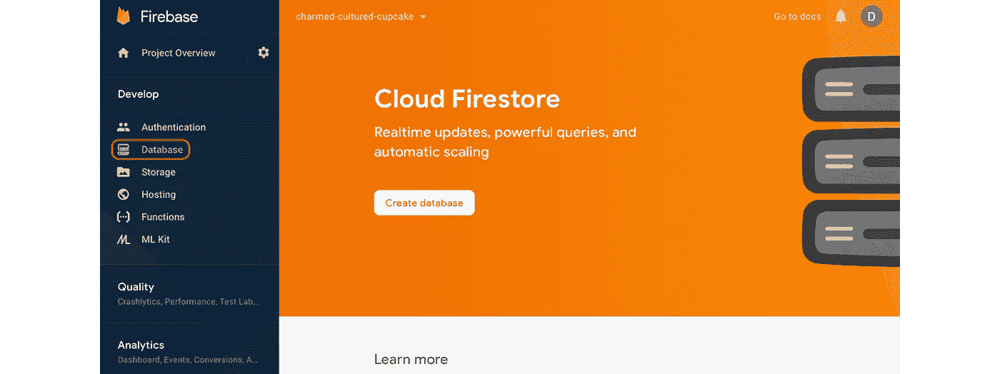

# 如何用 Glitch 使用 Google Cloud Firestore

> 原文：<https://betterprogramming.pub/how-to-use-google-cloud-firestore-with-glitch-e92464f00ee7>

## 设置多行 JSON 秘密的指南


由[考特尼·托萨纳](https://unsplash.com/@courtniebt13?utm_source=medium&utm_medium=referral)在 [Unsplash](https://unsplash.com?utm_source=medium&utm_medium=referral) 拍摄的照片

[Cloud Firestore](https://cloud.google.com/firestore/) 和 [Glitch](https://glitch.com) 都可以用来免费轻松构建强大的网络应用，并以低廉的价格扩展应用。但是要弄清楚如何将它们配置为一起工作可能有点棘手。请继续阅读，学习我的技巧。

Cloud Firestore 是一个托管的 NoSQL 文档数据库服务，可从[谷歌云平台](https://cloud.google.com)获得。该服务有一个免费层，允许每天存储高达 1 GB 的数据和数万次文档读写。API 和 web 控制台都非常容易使用。

Glitch 是一种基于云的协作编程环境服务，可以在您键入时部署代码。Glitch 上托管的应用程序会自动使用 SSL 证书进行保护，并在互联网上公开发布。该服务免费层上的应用每小时最多允许 4000 次请求，并在一段时间不活动后进入睡眠状态。

访问数据库所需的服务帐户凭证由 Firestore 控制台以 JSON 格式的文件提供。在某些环境下，使用 JSON 文件格式来保存机密很方便——但在 Glitch 上就不方便了。在 Glitch 上，默认情况下大多数项目文件都是公开可见的。如果您将 JSON 文件直接添加到 Glitch 项目中，这将向外界公开您的数据库凭证。呀！

幸运的是，还有另一种方法。

Glitch 上的开发工作流是围绕在名为`[.env](https://glitch.com/help/how-do-i-store-secrets-credentials-or-private-data/)`的文件中存储秘密的惯例而设计的。在 Glitch 上，这个文件中的值对除了被邀请的合作者之外的任何人都是隐藏的。Glitch 还自动确保该文件中指定的每个值都可以作为环境变量从运行的应用程序和终端中访问。

模块的文档中有更多关于这个文件格式的细节。关于文件格式，我们需要知道的两个关键问题是，要传递多行值，值必须用引号括起来，当值包含双引号时，我们可以用单引号括起来。

这两件事意味着我们可以轻松地将整个多行 JSON 文件作为单个值传递，只要我们用单引号将它括起来，并且只要 JSON 文件本身不包含任何单引号。所以这正是我们将对包含数据库凭证的 JSON 文件所做的。

我们将创建一个 Firebase 项目，并在该项目中创建一个 Firestore 数据库。然后，我们将数据库凭证文件下载到我们的本地设备，并将内容复制到我们的剪贴板。最后，我们将把凭证粘贴到 Glitch 项目中的一个`.env`文件中。

*   点击[这里](https://glitch.com/edit/#!/remix/hello-express)重新混合基本的基于 NodeJS/Express 的 web app 项目模板，或者使用现有的 Glitch 项目。
*   在 Firebase 控制台[这里](https://console.firebase.google.com)创建一个 Firebase 项目。
*   将 Firebase 项目命名为 Glitch 项目。
*   禁用分析。
*   在 Firebase 控制台中创建一个新的 Firestore 数据库，方法是单击侧栏中的“数据库”，然后单击“创建数据库”:



*   将数据库设置为在生产模式下启动。
*   接受数据库的默认位置。
*   点按齿轮图标，然后点按“项目设置”，再点按“服务帐户”，然后点按“创建服务帐户”:


*   单击“生成新的私钥”将凭据下载到您的本地设备。
*   打开下载的文件，并将内容复制到剪贴板。
*   打开你的 Glitch 项目，在编辑器中选择`.env`文件。
*   单击“纯文本”按钮隐藏图形编辑器。
*   将以下行添加到`.env`文件中:

```
FIREBASE_SERVICE_ACCCOUNT=''
```

*   将文本插入点放在两个单引号之间。从剪贴板粘贴凭据。

当我们完成后，我们的`.env`文件将看起来像这样:

当我们切换回图形编辑器时，我们应该只看到第一行`FIREBASE_SERVICE_ACCOUNT`值:`'{`。别担心，剩下的价值还在。

为了在我们的项目中使用凭证，我们首先添加`[@google-cloud/firestore](https://www.npmjs.com/package/@google-cloud/firestore)`模块作为项目依赖项。然后，我们可以在项目中添加一些代码，如下所示:

第一行解析来自`FIREBASE_SERVICE_ACCOUNT`环境变量的 JSON 凭证数据。第二行加载 Firestore SDK。第三行用凭证初始化 Firestore SDK。

有关如何使用`Firestore`和`db`对象的更多信息，请查看 [Firestore SDK 文档](https://googleapis.dev/nodejs/firestore/latest/index.html)。