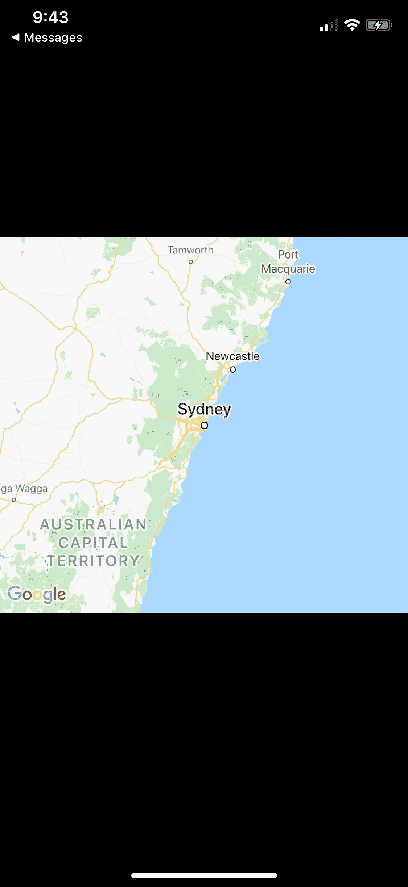

# 如何通过 SwiftUI 使用 Google Maps SDK

> 原文：<https://betterprogramming.pub/how-to-use-googlemaps-sdk-with-swiftui-3d44089b7c90>

## 向您的应用程序添加地图


照片由[亨利·佩克斯](https://unsplash.com/@hjkp?utm_source=unsplash&utm_medium=referral&utm_content=creditCopyText)在 [Unsplash](https://unsplash.com/s/photos/google-maps?utm_source=unsplash&utm_medium=referral&utm_content=creditCopyText) 上拍摄

我们将创建一个简单的视图来查看 Google Maps 和 Google Places 如何工作。

*   这是 GitHub 上的[样本启动器。](https://github.com/afanaian/GoogleMapsWithSwiftUISample/tree/StarterProject)
*   确保运行 pod 安装来获得谷歌地图和谷歌地点 SDK。如果你不知道如何使用 pod——请访问 [CocoaPods 文档](https://guides.cocoapods.org/using/using-cocoapods.html)。在 starter 项目中已经为您创建了 Podfile。

# **第一步**

首先，让我们进入不好玩的部分。我们需要设置 Google SDK 控制台来检索我们的 API 键，这样我们就可以调用 Google Maps/Places。执行以下步骤:

1.  去[谷歌云平台](https://cloud.google.com/gcp/?utm_source=google&utm_medium=cpc&utm_campaign=na-US-all-en-dr-bkws-all-all-trial-p-dr-1008076&utm_content=text-ad-lpsitelinkCCexp2-any-DEV_c-CRE_113120493247-ADGP_Hybrid+%7C+AW+SEM+%7C+BKWS+%7C+US+%7C+en+%7C+Multi+~+Cloud+Platform-KWID_43700011014879364-kwd-10876442192&utm_term=KW_cloud%20platform-ST_cloud+platform)。
2.  在左上角，点击汉堡菜单→API 和服务→凭证。
3.  在顶部，单击“+创建凭证”→ API 密钥。
4.  选择您刚刚创建的 API 密钥，让我们添加一个应用程序限制。选择 iOS APPs →添加项目→继续并更改项目捆绑包 ID(项目→选择当前目标→捆绑包标识符)→并将其粘贴到新项目字段中，然后单击完成。我们这样做是为了限制 API 调用的流量。
5.  继续复制我们刚刚创建的 API 密钥，并将其保存在一个安全的地方(您可以随时回到这个屏幕)。

接下来，我们需要添加将要在控制台中使用的 SDK。如果跳过这一步，您将无法从 SDK 接收任何数据。

1.  回到[控制台](https://console.developers.google.com/)。
2.  点击*仪表板*。
3.  点击“+启用 API 和服务”
4.  请确定您已启用以下项目:“iOS 版谷歌地图 SDK”、“地点 API”和“地图嵌入 API”

# **第二步**

现在让我们进入有趣的部分——代码！继续前进，回到起始项目！

我们需要做的第一步是添加我们刚刚创建的新 API 键。转到您的`AppDelegate`并添加以下内容:

此时，我们已经初始化了 Google SDK，并且正在传递我们的 API 键。

确保在代理的顶部导入`GoogleMaps`和`GooglePlaces`。如果您从 import 语句中得到错误，请确保您运行了 pod install 来将 SDK 添加到您的项目中。

现在，让我们展示一下谷歌地图。

让我们创建一个新的 SwiftUI 文件，并将其命名为`GoogleMapsView.swift`。将以下代码添加到类中:

到目前为止，我们符合`UIViewRepresentable`类，我们正在创建带有硬编码位置的谷歌地图视图。

现在，让我们转到我们的`ContentView.swift`文件并添加谷歌地图`View`。继续将您的`ContentView`更新为以下内容:

我们正在声明一个垂直堆栈，并将我们的 Google Maps 视图添加到 300 的高度。继续运行应用程序，您将看到地图！

如果您的地图视图没有呈现，请返回到 Google 控制台步骤，确保您添加了所有列出的启用的 API 和服务。



如果你看到同样的地图，干得好！现在让我们加载您的当前位置。

下一步是创建一个`LocationManager`类来获取当前用户的位置。创建一个名为`LocationManager`的 Swift 文件，并添加以下内容:

让我们把它分成几个步骤。

1.  我们正在创建一个`@Published`位置变量，它将跟踪当前用户的位置。代理中的位置被更新(步骤 4)。这将允许我们的谷歌地图视图在位置发生变化时进行监听。
2.  我们创建了两个辅助变量来帮助我们跟踪当前的纬度和经度。
3.  此时，我们正在启用设备的`LocationManager.swift`并请求用户访问。
4.  如果用户批准位置跟踪，我们在步骤 3 中声明的`LocationManager`代表将开始接收位置更新。

继续构建应用程序，以确保没有错误。此时，您在 Google 地图视图中看不到任何变化。现在我们需要在地图上标出这个位置。

返回`GoogleMapsView.swift`并进行以下更改:

1.  我们创建了一个变量来监听位置管理器的变化。
2.  在`makeUIView`中，我们更新了谷歌地图摄像头以使用`locationManager`的纬度和经度。
3.  在`updateUIView`中，当位置发生变化时，我们会更新谷歌地图视图。更新相机有多种方式。您可以更深入地研究 Google SDK，并查看完成这一步的更多方法。

在我们运行这个之前，让我们看一下 zoom 变量。

从谷歌文档:

> “相机的变焦水平决定了地图的比例。在较大的缩放级别下，可以在屏幕上看到更多的细节，而在较小的缩放级别下，可以在屏幕上看到世界的更多部分。
> 
> 缩放级别为 0 时，地图的比例为整个世界的宽度约为 256 点。
> 
> 1:世界
> 
> 5:陆地/大陆
> 
> 10:城市
> 
> 15:街道
> 
> 20:建筑。"

你可以在谷歌文档中找到更多信息[。](https://developers.google.com/maps/documentation/ios-sdk/views)

现在我们了解了缩放比例，运行项目。

此时，地图上不会呈现任何内容。您应该会在控制台中看到以下错误:

```
This app has attempted to access privacy-sensitive data without a usage description. The app’s Info.plist must contain an “NSLocationWhenInUseUsageDescription” key with a string value explaining to the user how the app uses this data.
```

让我们前往`Info.Plist`并添加`NSLocationWhenInUseUsageDescription`键。

现在开始运行该项目。您应该能够看到您当前位置的地图视图！太棒了。现在我们已经加载了地图，让我们添加一个附近地点的列表。

创建一个新的 Swift 文件并将其命名为`PlacesManager.swift`。添加以下代码:

1.  我们正在用它的共享类初始化 Google Places 客户端。
2.  我们正在创建一个`@Published`变量来创建一个附近地点的数组。
3.  在这个方法中，我们从 Google 加载附近地点的列表，并更新我们的 places 变量。

继续构建这个项目，并确保没有任何错误。

现在我们需要创建一个地方来查看结果。我们将制作一个`PlacesList`视图和一个`PlaceRow`视图来显示结果。创建两个 SwiftUI 文件，分别命名为`PlacesList`和`PlaceRow`。

`PlacesList`应该如下图所示:

1.  我们正在创建一个名为 *places manager* 的变量来获取地点列表。`observableObject`将订阅位置管理器来监听任何位置变化。
2.  我们正在创建一个地点列表。我们将它初始化为`placesManager`位置变量，这样我们就得到位置列表。注意，我们在这种情况下传递 ID，因为`GMSPlaceLikelihood`不符合 identifiable。`\`代表当前对象(本例中为`GMPlaceLikelihood`)。我们将地点 ID 传递给`List`。
3.  我们将`PlaceRow`初始化为数组中的当前位置。

让我们如下创建`PlaceRow`:

1.  我们正在初始化视图以接受一个`GMSPlace`变量。这将保存从`List`传入的当前位置的所有信息。
2.  我们用一个文本视图来初始化视图，以显示地名。按住 Shift 键并单击`GMSPlace`查看还有哪些属性可用。

继续运行，以确保我们没有任何错误。此时您将看不到任何结果，因为我们仍然需要将列表视图传递给内容视图。

让我们看一下`ContentView.swift`文件，你的身体应该是这样的:

嘣！你应该可以看到你附近的地方列表。

# 结论

恭喜你。你一路过关斩将。这应该会让你对谷歌地图/地点 SDK 的工作原理有一个基本的了解。

完整的源代码可以在 GitHub 上找到[。](https://github.com/afanaian/GoogleMapsWithSwiftUISample)