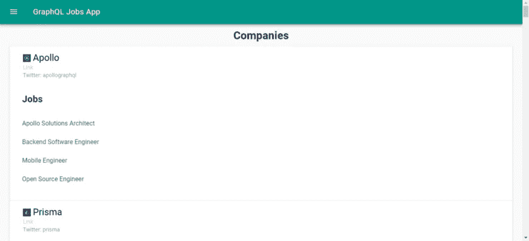
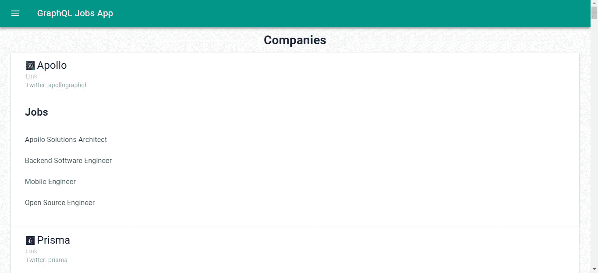

# 如何在 Vue.js 应用中使用 GraphQL APIs

> 原文：<https://betterprogramming.pub/how-to-use-graphql-apis-in-vue-js-apps-58414878867b>



GraphQL 是脸书开发的一种查询语言，用于在互联网上发送请求。它使用自己的查询，但仍然通过 HTTP 发送数据。它只使用一个端点来发送数据。

使用 GraphQL 的好处包括能够为发送的数据字段指定数据类型，以及能够指定返回的数据字段的类型。

语法很容易理解，也很简单。数据仍然以 JSON 的形式返回，以便于访问和操作。这就是为什么 GraphQL 近年来越来越受欢迎。

GraphQL 请求仍然是 HTTP 请求。但是，您总是通过一个端点发送和获取数据。通常，这是`graphql`端点。所有请求都是 POST 请求，无论您是获取、操作还是删除数据。

为了区分获取和操作数据，GraphQL 请求可以分为查询和变异。以下是 GraphQL 请求的一个示例:

```
{
  getPhotos(page: 1) {
    photos {
      id
      fileLocation
      description
      tags
    }
    page
    totalPhotos
  }
}
```

在这个故事中，我们将构建一个 Vue.js 应用程序，它使用位于 [https://graphql.jobs /](https://graphql.jobs/) 的 GraphQL 作业 API 来显示作业数据。为了开始构建应用程序，我们首先通过运行`npm i @vue/cli`来安装 Vue CLI。我们需要安装最新版本的 Node.js LTS。之后，我们运行`vue create jobs-app`为我们的应用程序创建新的 Vue.js 项目文件。

然后，我们安装我们的应用程序需要的一些库，包括 GraphQL 客户端、Vue Material 和用于表单验证的 VeeValidate。我们运行:

```
npm i vue-apollo vue-material vee-validate@2.2.14 graphql-tag
```

这将安装软件包。Vue Apollo 是 GraphQL 客户端，`graphQL-tag` 将 GraphQL 查询字符串转换成 Vue Apollo 可用的查询。

接下来，我们准备写一些代码。首先，我们为组件编写一些助手代码。我们添加了一个 mixin 来对 Jobs API 进行 GraphQL 查询。创建一个名为`mixins`的新文件夹，并在其中添加一个名为`jobMixins.js`的文件。然后在文件中，我们添加:

```
import { gql } from "apollo-boost";export const jobsMixin = {
  methods: {
    getJobs(type) {
      const getJobs = gql`
      query jobs(
          $input: JobsInput,
        ){
          jobs(
            input: $input
          ) {
            id,
            title,
            slug,
            commitment {
              id,
              title,
              slug
            },
            cities {
              name
            },
            countries {
              name
            },
            remotes {
              name
            },
            description,
            applyUrl,
            company {
              name
            }
          }
        }
      `;
      return this.$apollo.query({
        query: getJobs,
        variables: {
          type
        }
      });
    }, getCompanies() {
      const getCompanies = gql`
      query companies{
          companies {
            id,
            name,
            slug,
            websiteUrl,
            logoUrl,
            twitter,
            jobs {
              id,
              title
            }
          }
        }
      `;
      return this.$apollo.query({
        query: getCompanies
      });
    }
  }
}
```

这些函数将从 GraphQL 作业 API 获取我们需要的数据。字符串前面的`gql`是一个标签。标签是一个表达式，它通常是一个函数，用来将一个字符串映射到其他内容。

在这种情况下，它会将 GraphQL 查询字符串映射到一个可供 Apollo 客户机使用的查询对象。

`this.$apollo`由 Vue 阿波罗图书馆提供。它是可用的，因为我们将把它包含在`main.js`中。

接下来，在`view`文件夹中，我们创建一个名为`Companies.vue`的文件，并添加:

```
<template>
  <div class="home">
    <div class="center">
      <h1>Companies</h1>
    </div>
    <md-card md-with-hover v-for="c in companies" :key="c.id">
      <md-card-header>
        <div class="md-title">
          
          {{c.name}}
        </div>
        <div class="md-subhead">
          <a :href="c.websiteUrl">Link</a>
        </div>
        <div class="md-subhead">Twitter: {{c.twitter}}</div>
      </md-card-header><md-card-content>
        <md-list>
          <md-list-item>
            <h2>Jobs</h2>
          </md-list-item>
          <md-list-item v-for="j in c.jobs" :key="j.id">{{j.title}}</md-list-item>
        </md-list>
      </md-card-content>
    </md-card>
  </div>
</template><script>
import { jobsMixin } from "../mixins/jobsMixin";
import { photosUrl } from "../helpers/exports";export default {
  name: "home",
  mixins: [jobsMixin],
  computed: {
    isFormDirty() {
      return Object.keys(this.fields).some(key => this.fields[key].dirty);
    }
  },
  async beforeMount() {
    const response = await this.getCompanies();
    this.companies = response.data.companies;
  },
  data() {
    return {
      companies: []
    };
  },
  methods: {}
};
</script><style lang="scss" scoped>
.logo {
  width: 20px;
}.md-card-header {
  padding: 5px 34px;
}
</style>
```

它使用我们创建的 mixin 函数来获取公司的数据并显示给用户。

在`Home.vue`中，我们用以下代码替换现有代码:

```
<template>
  <div class="home">
    <div class="center">
      <h1>Home</h1>
    </div>
    <form [@submit](http://twitter.com/submit)="search" novalidate>
      <md-field :class="{ 'md-invalid': errors.has('term') }">
        <label for="term">Search</label>
        <md-input type="text" name="term" v-model="searchData.type" v-validate="'required'"></md-input>
        <span class="md-error" v-if="errors.has('term')">{{errors.first('term')}}</span>
      </md-field> <md-button class="md-raised" type="submit">Search</md-button>
    </form>
    <br />
    <md-card md-with-hover v-for="j in jobs" :key="j.id">
      <md-card-header>
        <div class="md-title">{{j.title}}</div>
        <div class="md-subhead">{{j.company.name}}</div>
        <div class="md-subhead">{{j.commitment.title}}</div>
        <div class="md-subhead">Cities: {{j.cities.map(c=>c.name).join(', ')}}</div>
      </md-card-header> <md-card-content>
        <p>{{j.description}}</p>
      </md-card-content><md-card-actions>
        <md-button v-on:click.stop.prevent="goTo(j.applyUrl)">Apply</md-button>
      </md-card-actions>
    </md-card>
  </div>
</template><script>
import { jobsMixin } from "../mixins/jobsMixin";
import { photosUrl } from "../helpers/exports";export default {
  name: "home",
  mixins: [jobsMixin],
  computed: {
    isFormDirty() {
      return Object.keys(this.fields).some(key => this.fields[key].dirty);
    }
  },
  beforeMount() {},
  data() {
    return {
      searchData: {
        type: ""
      },
      jobs: []
    };
  },
  methods: {
    async search(evt) {
      evt.preventDefault();
      if (!this.isFormDirty || this.errors.items.length > 0) {
        return;
      }
      const { type } = this.searchData;
      const response = await this.getJobs(this.searchData.type);
      this.jobs = response.data.jobs;
    }, goTo(url) {
      window.open(url, "_blank");
    }
  }
};
</script><style lang="scss">
.md-card-header {
  .md-title {
    color: black !important;
  }
}.md-card {
  width: 95vw;
  margin: 0 auto;
}
</style>
```

在上面的代码中，我们有一个搜索表单，让用户用他们输入的关键字搜索工作。结果显示在卡片上。

在`App.vue`中，我们用以下代码替换现有代码:

```
<template>
  <div id="app">
    <md-toolbar>
      <md-button class="md-icon-button" [@click](http://twitter.com/click)="showNavigation = true">
        <md-icon>menu</md-icon>
      </md-button>
      <h3 class="md-title">GraphQL Jobs App</h3>
    </md-toolbar>
    <md-drawer :md-active.sync="showNavigation" md-swipeable>
      <md-toolbar class="md-transparent" md-elevation="0">
        <span class="md-title">GraphQL Jobs App</span>
      </md-toolbar><md-list>
        <md-list-item>
          <router-link to="/">
            <span class="md-list-item-text">Home</span>
          </router-link>
        </md-list-item><md-list-item>
          <router-link to="/companies">
            <span class="md-list-item-text">Companies</span>
          </router-link>
        </md-list-item>
      </md-list>
    </md-drawer><router-view />
  </div>
</template><script>
export default {
  name: "app",
  data: () => {
    return {
      showNavigation: false
    };
  }
};
</script><style lang="scss">
.center {
  text-align: center;
}form {
  width: 95vw;
  margin: 0 auto;
}.md-toolbar.md-theme-default {
  background: #009688 !important;
  height: 60px;
}.md-title,
.md-toolbar.md-theme-default .md-icon {
  color: #fff !important;
}
</style>
```

这为我们的应用程序添加了一个顶部栏和左侧菜单，并允许我们切换菜单。它还允许我们显示我们在`router-view`元素中创建的页面。

在`main.js`中，我们输入:

```
import Vue from 'vue'
import App from './App.vue'
import router from './router'
import store from './store'
import VueMaterial from 'vue-material';
import VeeValidate from 'vee-validate';
import 'vue-material/dist/vue-material.min.css'
import 'vue-material/dist/theme/default.css'
import VueApollo from 'vue-apollo';
import ApolloClient from 'apollo-boost';Vue.config.productionTip = false
Vue.use(VeeValidate);
Vue.use(VueMaterial);
Vue.use(VueApollo);const client = new ApolloClient({
  uri: '[https://api.graphql.jobs'](https://api.graphql.jobs'),
  request: operation => {
    operation.setContext({
      headers: {
        authorization: ''
      },
    });
  }
});const apolloProvider = new VueApollo({
  defaultClient: client,
})new Vue({
  router,
  store,
  apolloProvider,
  render: h => h(App)
}).$mount('#app')
```

这将添加我们在应用程序中使用的库(如 Vue Material)并将 Apollo 客户端添加到我们的应用程序中，以便我们可以在我们的应用程序中使用它们。

`this.$apollo`对象在我们的组件和 mixins 中是可用的，因为我们在用于`new Vue`参数的对象中插入了`apolloProvider`。

在`router.js`中，我们放入:

```
import Vue from 'vue'
import Router from 'vue-router'
import Home from './views/Home.vue'
import Companies from './views/Companies.vue'Vue.use(Router)export default new Router({
  mode: 'history',
  base: process.env.BASE_URL,
  routes: [
    {
      path: '/',
      name: 'home',
      component: Home
    },
    {
      path: '/companies',
      name: 'companies',
      component: Companies
    }
  ]
})
```

现在，当我们导航到页面时，可以看到我们创建的页面。

