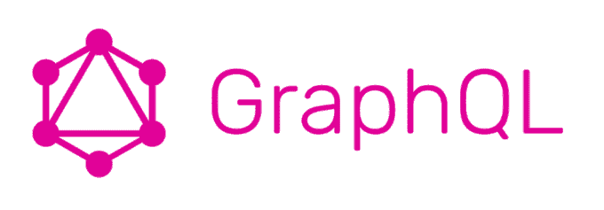
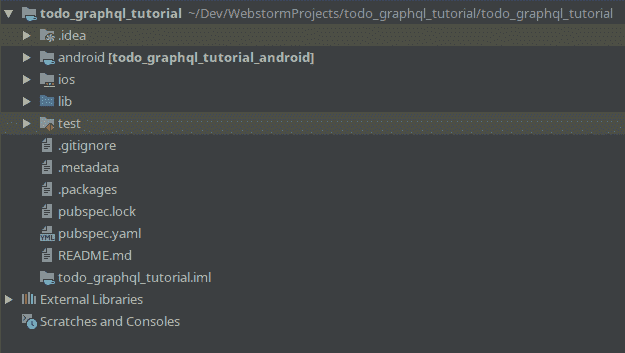
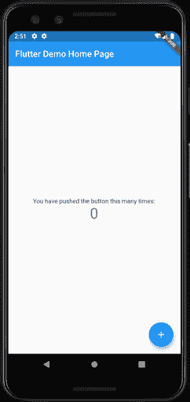
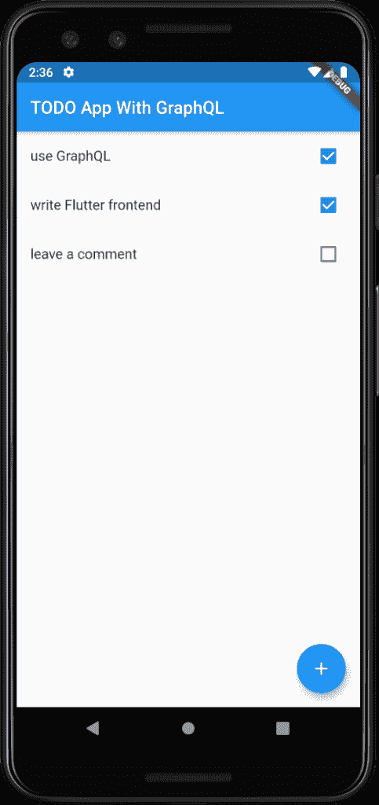

# 如何在 Flutter 中使用 GraphQL

> 原文：<https://betterprogramming.pub/how-to-use-graphql-in-flutter-7decd04a511f>

## 构建一个简单的待办事项应用程序


马库斯·温克勒在 [Unsplash](https://unsplash.com/s/photos/list?utm_source=unsplash&utm_medium=referral&utm_content=creditCopyText) 上的照片

Flutter 正在席卷全球，这一点也不奇怪。它提供无与伦比的性能和强大的多平台支持。在本文中，我将带领您将 GraphQL 集成到 Flutter 应用程序中，进行查询和执行变异。

# GraphQL 是什么？



GraphQL 是由脸书开发的一种查询语言。它应该取代 REST 作为 API 通信的一种方式。在本文的其余部分，我将假设一些 GraphQL 的基础知识。

# 服务器设置

开发 GraphQL API 超出了本文的范围。相反，我们将使用一个预制的。前往[回购](https://github.com/r3dm1ke/todo-graphql-example)并克隆它。我已经从 [@haikyuu](https://github.com/haikyuu) 那里得到了这个服务器——非常感谢你。

克隆完成后，在“终端”中打开它并运行:

```
npm i npm start
```

这将安装所有依赖项并启动服务器。该服务器是一个基本的待办事项应用后端，允许您创建、查询和修改任务。它是使用`json-graphql-server`构建的；一定要去看看。

# 项目设置

在我们启动并运行服务器之后，让我们来设置 Flutter 项目。创建项目后，目录结构应该如下所示:



如果您尝试运行应用程序，模拟器中应该会出现这种情况:



恭喜，我们已经成功了一半！

# 添加 GraphQL 依赖项

在我们开始在 Flutter 应用程序中使用 GraphQL 之前，我们需要安装一些依赖项。打开`pubspec.yaml`文件并在其中添加这一行(在`dependencies`部分:

```
graphql_flutter: ^3.0.0
```

现在使用以下命令安装软件包:

```
flutter pub get
```

几秒钟后，依赖项就应该安装好了。

# 编写一些查询

如您所知，您使用查询与 GraphQL APIs 对话。我们将需要其中的三个:一个获取所有任务列表的查询，一个创建新任务的变异，以及一个完成现有任务的变异。在`/lib`中创建一个文件`api.dart`并将这段代码放入其中:

首先，注意第 1–2 行中的导入。第一个是核心 Flutter 包，它将更新向下传播到组件。第二个是我们之前安装的`graphql_flutter`包。

在第 4–9 行，我们创建了一个 GraphQL `client`。它将用于访问我们的 API。`link`正在使用地址`http://10.0.2.2:3000`，因为这是模拟器内部主机的 IP 地址。如果你在物理设备上运行应用，你需要用你的 PC 的本地 IP 地址替换这个地址(或者使用类似 [ngrok](https://ngrok.com/) 的东西)。

最后，我们有疑问。第一种方法非常简单:获取带有字段`id`、`title`和`completed`的所有查询。`createTaskMutation`是一个变异创造任务(很明显！)并且它接受两个参数:新创建的任务的`id`和它的`title`。由于其简单性，我们使用的后端不会检查`id`的唯一性。最后一个查询将更新带有`id`的任务上的`completed`字段。

UI 还没有变化，所以应用程序看起来应该是一样的。

# 设置用户界面

我们现在剩下的就是将它绑定到 UI。我不会深入解释 UI，因为你应该知道一些基本知识。相反，我将关注它如何与 GraphQL 交互。首先，用以下代码替换`main.dart`中的所有代码:

您首先应该注意到的是第 11 行的`GraphQLProvider`。通过将整个应用程序包装在其中，我们为 GraphQL 客户端提供了其余的小部件。这意味着我们可以在应用程序的任何地方运行查询和突变。

现在，检查第 75 行中的`_ListPageState`类的`build`函数。这里，我们使用`Query`小部件来运行查询，并将结果传递给其子部件。`Query`接受一个`QueryOptions`类型的`options`参数，它设置查询。`gql(getTasksQuery)`将解析该查询，`pollInterval: 1`意味着该查询将每秒刷新一次(这是非常低效的，但现在可以了)。

`Query`将把`QueryResult`和`refetch`和`fetchMore`函数传递给它的`builder`回调函数。`QueryResult`有字段`loading`和`hasException`，我们用它们来决定渲染什么(第 85-90 行)。`refetch`每次用户切换任务时，如果我们调用它，就会重新运行查询(也是非常低效的)。`fetchMore`是在实现分页时使用的，但我们暂时不讨论它。

现在，看看`TaskList`小部件，特别是它的`build`函数。它用`Mutation`类包装，这与`Query`非常相似。主要区别在于`Mutation`不会自动执行变异。它将把`RunMutation`传递给它的`builder`函数，这个函数必须被调用来执行变异。您可以在第 121 行看到它的运行。它接受一个带有突变参数的映射(在本例中是`id`和`completed`)。然后我们调用`onRefresh`来重新运行查询并获得更新的数据。

最后，第 33 行的函数`onCreate`负责显示一个对话框，询问任务标题并创建任务本身。`AlertDialog`被包裹在我们现在熟悉的`Mutation`中，第 63 行称之为变异本身。现在我们正在通过`id`和`title`；`completed`默认为`false`。

应用程序应该是这样的:



如果你在任何时候迷路了，请咨询 Github repo。

# 结束语

感谢您的阅读，我希望您现在知道如何在 Flutter 中使用 GraphQL。在我接下来的文章中，我将讨论性能优化和实时更新。敬请期待！

# 资源

*   [颤振单据](https://flutter.dev/docs)
*   [Graphql-flutter 文档](https://github.com/zino-app/graphql-flutter)