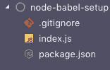
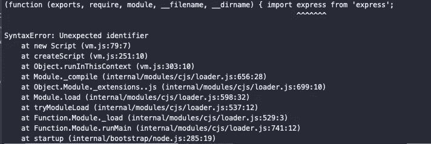
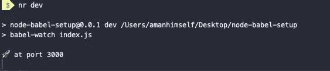

# 如何在 Nodejs 中使用 Import 语句

> 原文：<https://betterprogramming.pub/how-to-use-import-statements-in-nodejs-94c85e23aeb7>

## 用最少的配置在一个节点项目中设置 Babel

塞萨尔·卡利瓦里诺·阿拉贡在 [Unsplash](https://unsplash.com?utm_source=medium&utm_medium=referral) 上发表的《手持工具系列》

我并不总是喜欢尝试设置 Nodejs 应用程序的不同版本。不要误解我——我相信尝试一个人的设置，这可以导致学习新的东西。但这是有限度的。最近，我发现自己更经常地设置 Nodejs 服务器来开发 RESTful API。此外，服务器必须以一种客户机可以轻松使用 API 的方式与客户机协作。对于客户端开发，我使用 ReactJS。

随着客户端和服务器之间的上下文切换，我经常发现自己在这个过程中出错。最常见的一种是在 Nodejs 文件中使用`import`语句。这导致了一个叫做`Unexpected identifier`的语法错误。甚至在我的本地机器上切换到 Nodejs `v10` LTS 之后，我发现不能使用 ES6 模块相当令人失望。

为了克服这个问题，并减少我在开发过程中造成的错误，我阅读了一些教程，但决定建立自己的网格设置。这些教程虽然写得很好，但使用的方法几乎完全相反。我希望在日常工作中处理全栈应用时保持一致性。

因此，我将向您展示在 Nodejs 服务器端应用程序中使用`import`语句的一个简化的、耗时更少的版本。要继续阅读本文，请确保您的本地计算机上安装了以下应用程序:

Nodejs

npm

# 模拟项目入门

我称之为模拟项目，因为我要从头开始建立这个设置。在本教程的最后，我将留下一个 Github 资源库的链接，它可以作为许多 Nodejs plus Express 项目的入门工具包。你可以直接跳到链接部分，然后自己动手做——这里并不复杂。如果你仍然好奇，请继续阅读这篇短文。

首先，创建一个新目录，遍历它并用`npm`初始化它。

在将您的项目初始化为 npm 项目后，您可以签出`package.json`文件。它将填充您用来配置 npm 的详细信息。

接下来，从终端使用以下命令创建一个新文件:

这就是我们建立一个最简单的项目目录所需要的。在下一节中，我们将看看我们必须安装哪些依赖项，以及为什么我们需要这些依赖项。

# 创建节点服务器

要创建服务器，我将使用 Express。要将 Express 作为依赖项包含在我们的项目中，请从您的终端运行以下命令:

接下来，向`index.js`文件添加以下代码:

您可以通过运行命令`node index.js`来运行服务器。访问网址`http://localhost:3000/`，你会看到一条消息显示在浏览器窗口:`Hello from Nodejs!`。

这表明服务器的代码没有问题。现在将`index.js`的第一行修改为:

运行相同的命令`node index.js`并停留在终端窗口。这一次服务器没有启动，因为在这个过程中有一个错误。这和我在本文开头告诉你的错误是一样的。Nodejs 默认不能执行`import`语句。

# 使用巴别塔

我们只需要一个 transpiler，它允许我们使用 ES6 特性编写 JavaScript，比如 Nodejs 项目中的`import`语句。什么是运输工具？

> Transpilers 也称为源到源编译器，它从以一种编程语言编写的源代码中读取代码，并以另一种语言生成等效的代码。

在我们的例子中，我们没有切换编程语言，而是需要使用 LTS 版本的 Node 尚不支持的新语言特性。我将设置 Babel 编译器，并通过以下配置过程在我们的项目中启用它:

首先，您必须安装一些依赖项。请务必标记 mind -D，因为我们的开发环境只需要这些依赖项:

一旦您安装了它们，将一个`.babelrc`文件添加到项目的根目录，并添加以下配置:

配置过程的最后一步是在`package.json`中添加一个`dev`脚本。您可以随意命名这个脚本。一旦有变化，这将自动运行 babel 编译器。这由`babel-watch`完成，它还负责重新启动 Nodejs web 服务器。

要查看它的操作，请确保您的`index.js`代码使用如下的`import`语句。

从终端写入`nr dev`。如果没有错误，您将得到以下内容:

其中`nr`是`npm run`的简写。您也可以在浏览器中访问`http://localhost3000/`来验证结果，并查看服务器是否正常工作。

# 结论

本文向您展示了如何从头开始创建一个最小节点服务器，以及如何使用 Babel 在 Node.js 环境中引入即将到来的 JavaScript 特性。我确信现在你不会像我一样在 *Nodejs* + *插入一个你选择的前端框架/库*中犯同样愚蠢的错误。

本文的完整代码可以在 Github 资源库中找到:

 [## amandeepmittal/node-babel-setup

### 🛠 Nodejs +巴别塔。在 GitHub 上创建一个帐户，为 amandeepmittal/node-babel-setup 开发做贡献。

github.com](https://github.com/amandeepmittal/node-babel-setup)