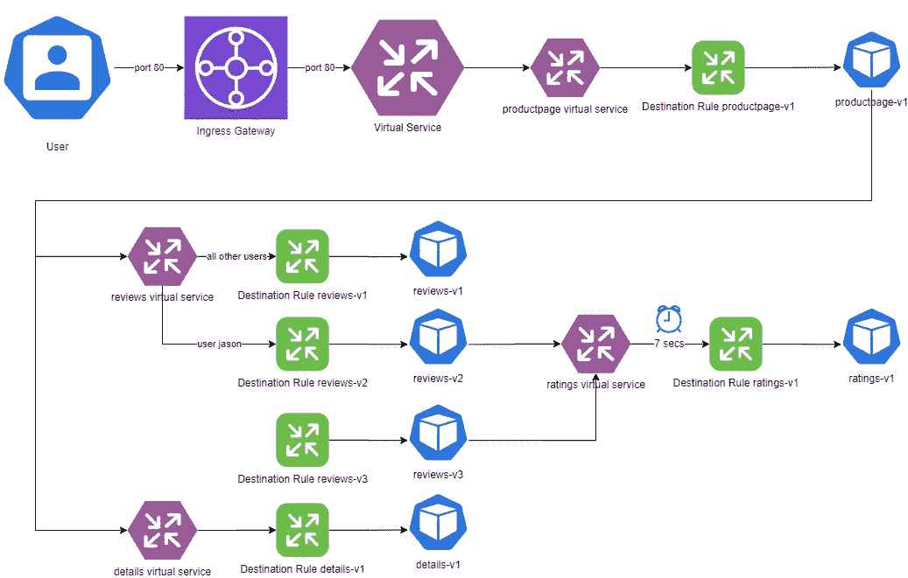
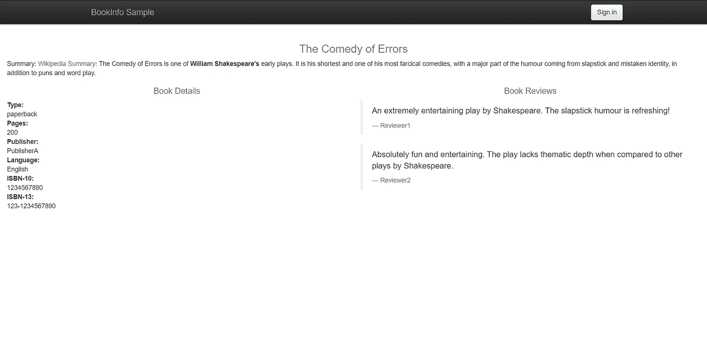
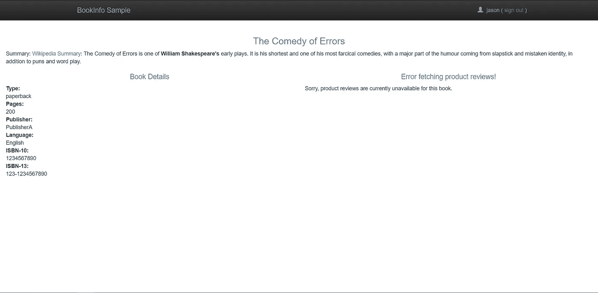
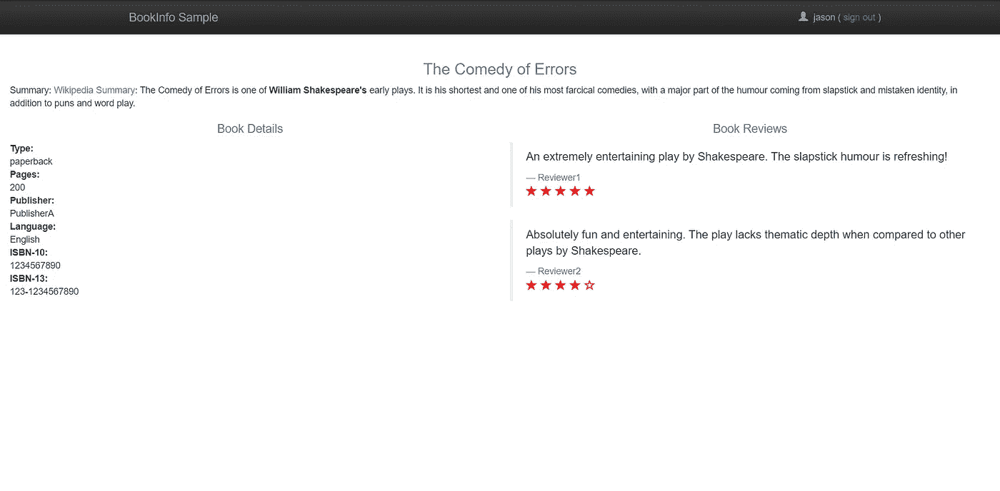
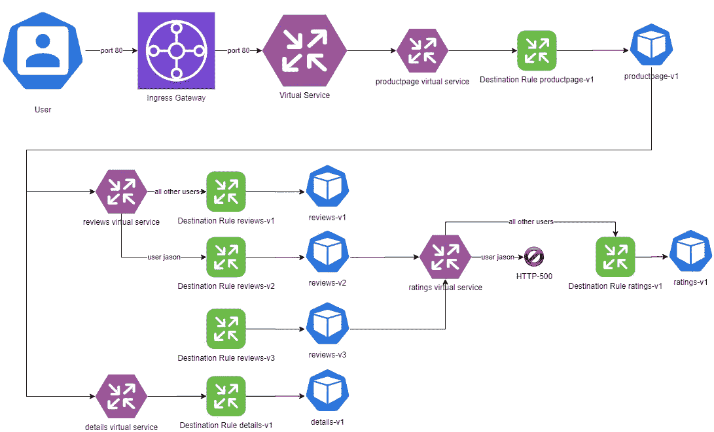
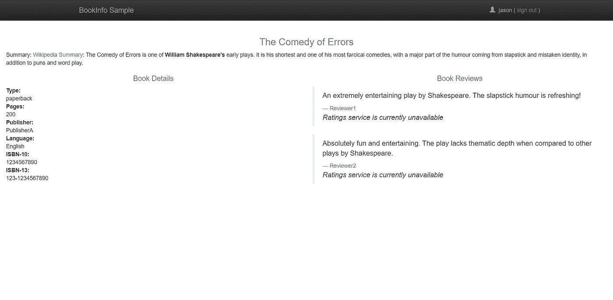

# 如何使用 Istio 注入故障排查 Kubernetes 中的微服务

> 原文：<https://betterprogramming.pub/how-to-use-istio-to-inject-faults-to-troubleshoot-microservices-in-kubernetes-108250a85abc>

## 改善您在 Kubernetes 上运行的微服务


由[布鲁克·卡吉尔](https://unsplash.com/@brookecagle?utm_source=unsplash&utm_medium=referral&utm_content=creditCopyText)在 [Unsplash](https://unsplash.com/?utm_source=unsplash&utm_medium=referral&utm_content=creditCopyText) 拍摄

假设您已经将`reviews-v2`微服务部署到生产中，并且您遇到了一个问题。用户抱怨他们看不到你应用程序中的评论。

您已经在您的开发环境中进行了彻底的调查，但是您无法找到问题所在。

调查问题的唯一方法是查看流经生产服务的流量。您的运营团队中有人注意到了链中的超时，您需要进一步调查。

这个故事是“Kubernetes 中使用 Istio 的基于位置的负载平衡”的后续今天，我们来讨论故障注入和故障排除。

# 什么是故障注入？

在 Istio 的上下文中，*故障注入是一种机制，通过这种机制，我们可以有目的地在我们的网格中注入一些问题，以模拟我们的应用程序在遇到这些问题时的行为。*

这是测试您的应用程序的操作就绪性和弹性的一个很好的工具。

您可以在应用程序中注入两种形式的错误。

*   **延迟:**您可以在虚拟服务中添加一个时间延迟，这允许您模拟像处理延迟或网络过载这样的情况
*   **中止:**这些是微服务中的故障，比如 HTTP 500 内部服务器错误或 TCP 连接故障。这使您能够测试应用程序的潜在错误处理，并查看一个小错误是否会导致应用程序崩溃。

# 调查问题

我们知道该应用程序存在一些问题，用户无法断断续续地看到评论。

由于应用程序包含一个很长的微服务链，调查需要隔离有问题的微服务并修复问题。

为了隔离问题，让我们在我们的链中添加一个合成故障。我们需要有目的地在我们的链中引入 7 秒的延迟，因为 ops 团队报告说请求在 6 秒内超时。



故障注入(延迟)

这使我们能够在环境中重现问题，并帮助我们隔离问题。

但是等等。你在生产中调查。我们不想让这次调查影响我们的最终客户。我们现在能做什么？好吧，让我们利用善良的老杰森。

## 先决条件

确保您有一个正在运行的 Kubernetes 集群。遵循“[如何在 Kubernetes 上使用 Istio 管理流量](https://medium.com/better-programming/how-to-manage-traffic-using-istio-on-kubernetes-cd4b96e00b57)”指南，在我们的应用程序中设置基于用户身份的路由。

# 注入延迟

为了从战术上解决这个问题，我们需要回滚我们所做的更改。我们必须将开关恢复到`v2`，并确保实时流量到达`reviews-v1`；然而，对于我们的业务测试人员`jason`，我们仍然需要将流量路由到`reviews-v2`。

如果您一直在关注上一个故事，那么对于来自我们的业务测试人员`jason`的所有请求，我们都将请求路由到`reviews-v2`。对于其余的用户，流量将到达`reviews-v1`。因此，让我们从那里开始。

因为我们基于用户身份进行路由，所以除了一个用户之外，没有人会受此影响。因此，我们不会打扰我们的客户，我们可以在后台进行调查。

让我们看看我们需要申请注入延迟的清单。

虚拟服务等级测试延迟

如果您看到用户`jason`的清单，它在`ratings`微服务中为 100%的流量注入了 7 秒的延迟。对于其余的消息，没有延迟。

是时候应用更改了。

```
$ kubectl apply -f samples/bookinfo/networking/virtual-service-ratings-test-delay.yaml
virtualservice.networking.istio.io/ratings configured
```

# 测试配置

现在让我们访问网站，看看会发生什么。



公共网站

我们可以看到评论，但没有评级。当我们从`v2`回滚到`v1`时，我们预料到了这一点。以用户`jason`的身份登录—不需要密码。



以“杰森”的身份登录

你注意到加载页面的延迟了吗？为什么我们看不到评论？`reviews-v2`和`ratings`之间的超时是 10 秒的硬编码值。因此，即使有 7 秒的故障注入，您也应该看到评论，但事实肯定不是这样。

如果你打开开发者工具并检查网络选项卡，你会发现产品页面在大约六秒钟内加载完毕。但你加了 7 秒延迟？发生了什么事？我们在这里发现了一个漏洞。

在这种情况下，超时发生在`productpage`和`reviews`微服务之间。它们之间的超时被硬编码为`3s+3s(retry)`，也就是 6 秒。因此，如果`reviews`微服务的响应时间超过 6 秒，`productpage`就会超时。

恭喜你！我们现在已经找到了问题所在。这类问题在使用多个微服务的大型应用程序中普遍存在，在多个团队开发部分应用程序并在孤岛中工作时也是如此。

# 修复问题

那么我们该如何解决这个问题呢？有两种方法可以做到:

*   将`productpage`增加到`reviews`超时
*   将`reviews`减少到`ratings`超时

嗯，我们不想打扰现有正在运行的`productpage`微服务。所以，我们通过部署`reviews-v3`微服务来修复 app 吧。`v3`版本通过将超时减少到两秒半来解决这个问题。

如果您将所有流量迁移到`v3`，就像我们在上一个故事中所做的那样，并注入两秒钟的延迟，您应该会发现这个问题不再存在。

应用以下清单:

```
$ kubectl apply -f samples/bookinfo/networking/virtual-service-reviews-v3.yaml
```

访问页面，您应该看到`reviews-v3`成功运行。



评论 v3

# 注射中止

还有其他方法来调查和隔离问题。例如，您可以在虚拟服务中注入一个 HTTP 错误，以检查您的应用程序在这些情况下的行为。



故障注入(中止)

对于一个演示，您可以应用下面的清单在`ratings`微服务中插入一个 HTTP 500(内部服务器错误)错误。

虚拟服务评级测试中止. yaml

正如您在 YAML 文件中看到的，对于用户`jason`，Istio 为 100%的流量注入一个 HTTP 500 错误。其余流量不受影响。

应用清单:

```
kubectl apply -f samples/bookinfo/networking/virtual-service-ratings-test-abort.yaml
```

# 测试中止注入

访问该页面，你会看到你现在得到一个“评级服务目前不可用”的消息。



HTTP 故障注入

这表明故障注入工作正常，开发人员对页面进行了良好的编码——我们看到的不是崩溃，而是一个优雅的错误。

# 结论

感谢您通读！我希望你喜欢这篇文章。在下一部分，我将讨论“[如何在 Kubernetes](https://medium.com/better-programming/how-to-visualise-your-istio-service-mesh-on-kubernetes-209c7b439a41) 上可视化您的 Istio 服务网格”，并进行实际操作演示，下一个故事再见！