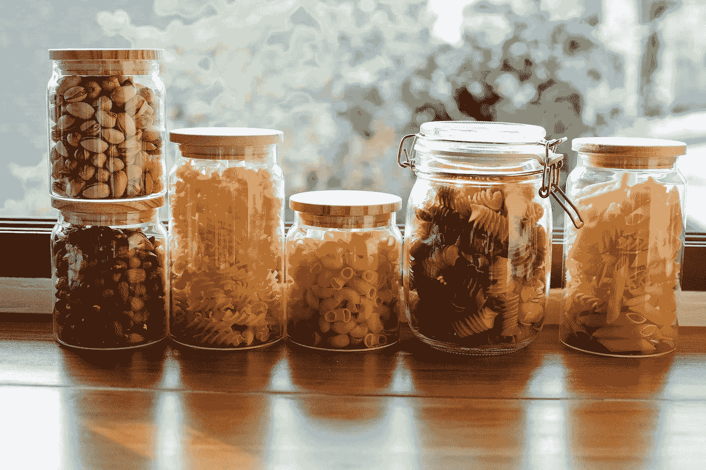
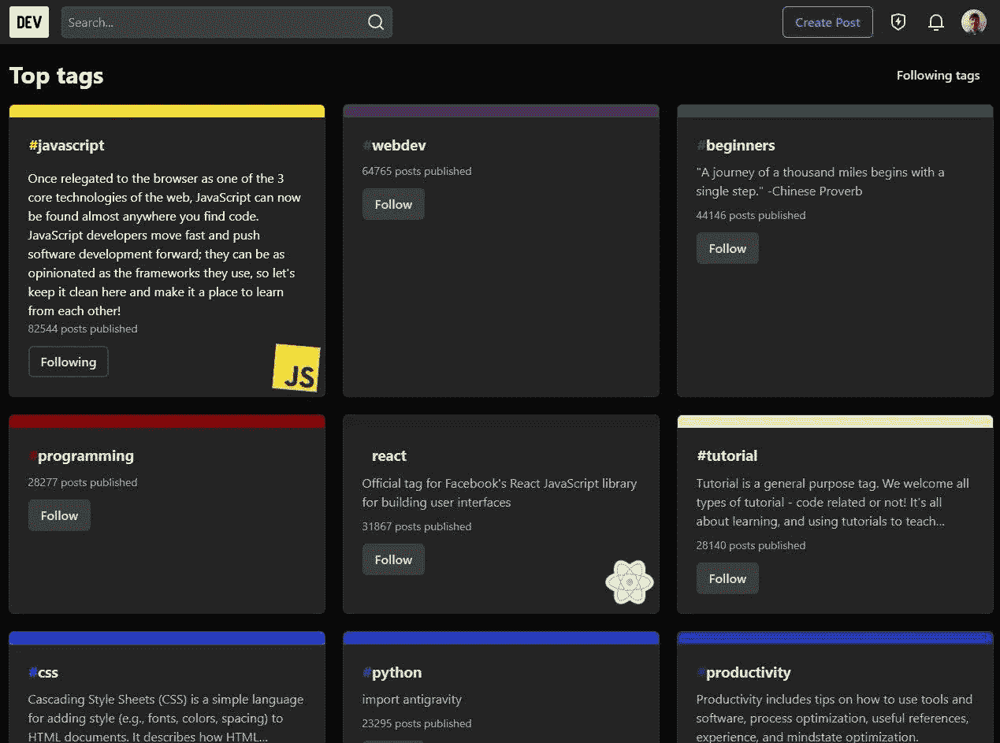
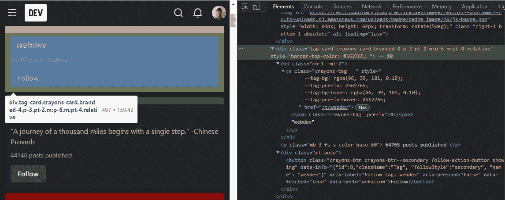
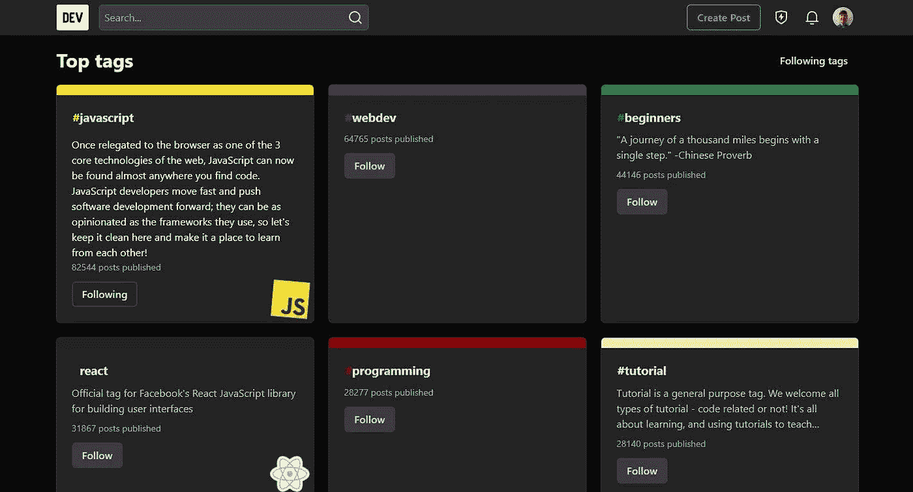

# 如何使用 JavaScript 重新排列网页上的元素

> 原文：<https://betterprogramming.pub/how-to-use-javascript-to-rearrange-elements-on-a-web-page-27a5bb0e595>

## 根据内容对 div 进行排序



*照片由* [*莎拉柴*](https://www.pexels.com/@sarah-chai?utm_content=attributionCopyText&utm_medium=referral&utm_source=pexels) *发自* [*像素*](https://www.pexels.com/photo/jars-with-various-raw-pasta-and-nuts-7262772/?utm_content=attributionCopyText&utm_medium=referral&utm_source=pexels)

你是否曾经访问过内容没有按照你想要的方式排序的网页？而且它没有一个功能可以整理出来？

这确实令人沮丧，但幸运的是，如果您真的需要对内容进行排序，您可以使用 JavaScript 轻松地自己完成！

在本教程中，我将使用来自 [DEV](https://dev.to/) 的一个示例来一步步地指导您:



DEV 上的“[热门标签](https://dev.to/tags)”页面截图，其中标签似乎以未知顺序排序

# 辅导的

在浏览器中打开你想要排序的页面，打开 [DevTools](https://developer.chrome.com/docs/devtools/) ( `F12`)并准备好探索你的页面的 DOM 结构！

## 1 .确定元素的结构

为了能够对所有项目进行排序，您必须了解要排序的元素是如何生成的。用 Inspect 按钮(或`Ctrl + Shift + C`)选择元素并递归展开。



## 2.确定元素的排序依据

是否要按标题对 div 进行排序？也许通过一个数字属性？

在我的例子中，我希望按照发布的帖子数量对它们进行排序。如果我在控制台输入`$0.querySelector('p.color-base-60').innerText`，我就能获得`64765 posts published`。

## 3 .确定顺序

你想要升序还是降序？

```
const ascendingOrder = false;
```

## 4.选择所有元素

你能找到一个选择器来得到你想要排序的所有项目吗？在我的例子中，所有的元素都有`tag-card`类。

```
const elements = [...document.querySelectorAll('.tag-card')];
```

## 5 .查找所有元素的父节点

您可以编写另一个选择器来查找包含所有子元素的 div 元素，或者您可以选择最简单的方法，向第一个元素询问其父元素。

```
const parentElement = document.querySelector('.grid');

// or

const parentElement = elements[0].parentNode;
```

我们将使用父节点通过保留其结构来重新排序其子节点。

## 6 .对元素排序

现在是时候将所有的脚本组合成一个并在我们的页面上运行它了！



标签现在已经按照它们各自发布的文章数量进行了排序！

现在，享受你的新页面吧！

*原载于*[*www . Benjamin rancourt . ca*](https://www.benjaminrancourt.ca/how-to-sort-divs-based-on-contents/)*。*