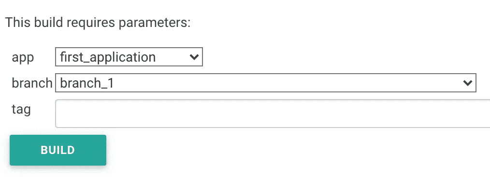
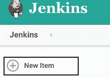
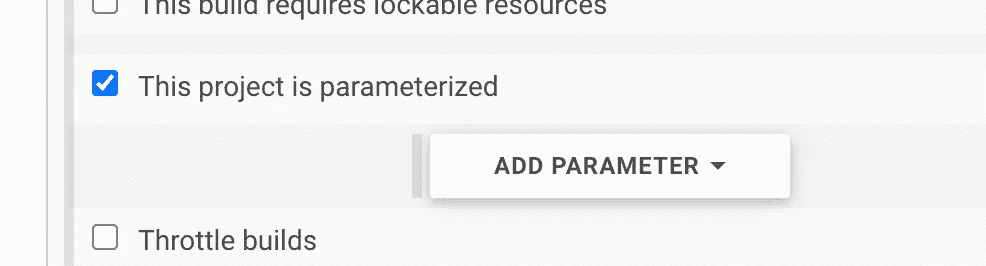
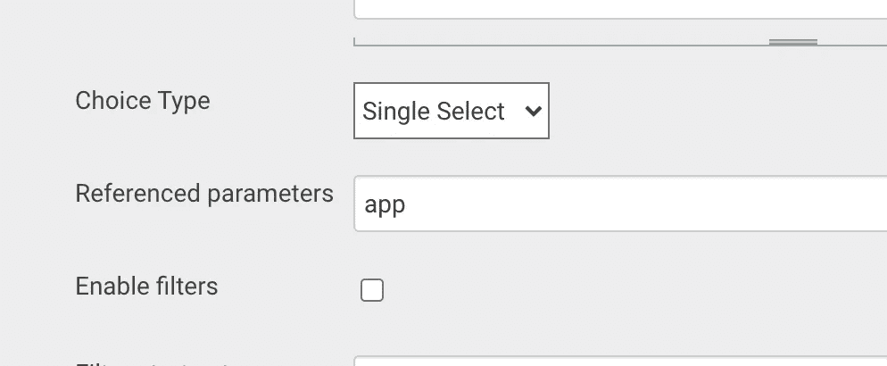
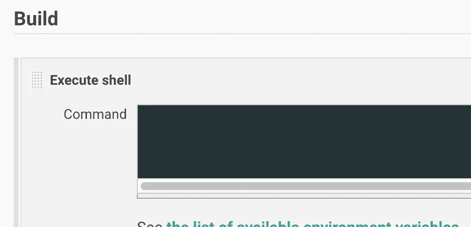

# 如何使用 Jenkins 自动构建 Docker 映像

> 原文：<https://betterprogramming.pub/how-to-use-jenkins-for-automated-builds-of-docker-images-3d8693b04be8>

## 创建 Jenkins 作业以在 Docker Hub 上构建和发布图像的指南


图片由[马库斯·斯皮斯克](https://unsplash.com/@markusspiske)在 [Unsplash](https://unsplash.com/) 上拍摄

构建工作是 [Jenkins](https://www.jenkins.io/) 构建流程的核心。您可以将 Jenkins 作业视为构建过程中的特定任务或步骤。构建可能涉及编译源代码、运行测试、打包和发布。

在本文中，我们将创建一个 Jenkins 作业:

*   推断给定项目的远程分支
*   编译代码
*   使用 Docker 打包代码
*   将图像发布到 Docker Hub

在本教程结束时，您应该会看到如下内容:



# 在詹金斯创造一份工作

在 Jenkins 主页上，通过单击“新建项目”创建一个新项目:



创建新项目

为您的项目命名，并选择“自由式项目”选项作为新项目的类型。

> “Jenkins 的‘自由式’作业支持简单的持续集成，允许您在应用程序生命周期中定义顺序任务。”—詹金斯[文档](https://www.jenkins.io/pipeline/getting-started-pipelines/)

现在，您应该进入新创建项目的配置页面。

# 参数化您的项目

选择“此项目已参数化”,以便配置要用于构建应用程序的输入参数:



我们要添加的第一个参数是应用程序名称。单击添加参数并选择活动选择参数。让我们将这个参数命名为“app”，它将代表我们想要构建的应用程序。

在本教程中，我们将对应用程序进行硬编码，因此我们将使用您能想象到的最简单的 Groovy 脚本:

```
return ['first_application', 'second_application'] 
```

一旦您应用了更改，您应该能够看到[应用程序](https://github.com/proteantecs/devops/pull/487/files)下拉列表已被上述应用程序填充。

接下来，我们希望根据所选的应用程序动态检索 Git 分支。为此，我们将添加一个额外的参数“branch”，它将包含所选应用程序的所有分支。

点击添加参数，并选择[有功选择无功参数](https://plugins.jenkins.io/uno-choice/):

> “活动选择插件用于参数化的自由式 Jenkins 作业，以创建脚本化、动态和交互式作业参数。主动选择参数可以动态更新，并可以呈现为组合框、复选框、单选按钮或丰富的 HTML UI 小部件。”— Jenkins [主动选择文档](https://plugins.jenkins.io/uno-choice/)

我们使用这种类型的参数，因为我们希望在前面的“app”选项中根据所选的应用程序名称显示分支。为此，我们应该告诉 Jenkins 我们想要引用“app”变量。将“app”添加到“引用参数”选项中:



引用的参数“app”

现在，让我们写一些 Groovy！选择“Groovy 脚本”选项，并将以下代码粘贴到文本框中:

解释:

*   `list_branches`是我们用来列出给定存储库的远程分支的命令。
*   `awk`和`cut`命令用于从上面的 Git 命令中提取特定的分支名称。
*   在第 7–10 行中，我们通过管道传输命令来获得结果，split 来创建数组，最后是结果。

我们应该支持的最后一个参数是标签，它将允许我们知道在我们的图像上应该有哪个标签。为此，添加一个字符串参数类型的新参数—一个简单的自由文本输入选项。将其命名为“标签”

# 创建构建脚本

现在我们有了编译和构建所选项目所需的所有信息。

在构建步骤中选择“执行 shell ”:



传递以下内容:

解释:

*   首先克隆选定的应用程序。
*   运行 build 命令来编译源代码。
*   使用提供的 docker 文件打包代码(在存储库中)
*   将图像发布到中心。

**注意:**如果两个项目以相同的方式构建，可以省略条件，将它们合并。

根据您的构建工具和源代码，这个过程可能与上面的不同。然而，这里重要的是理解过程本身，而不是要运行的特定命令。

# 结论

使用 Jenkins，我们创建了一个简单的作业，任何想要从他们的分支构建特定应用程序的人都可以使用它。上面的过程可以更一般化，并且可以集成到更大的管道中，以提供完整的 CI/CD。