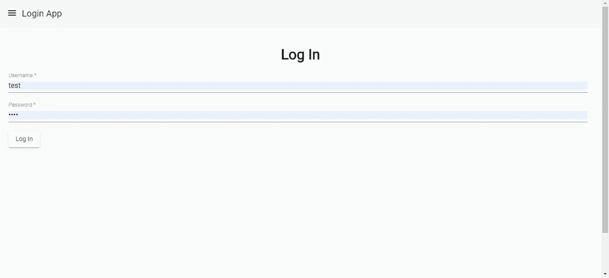
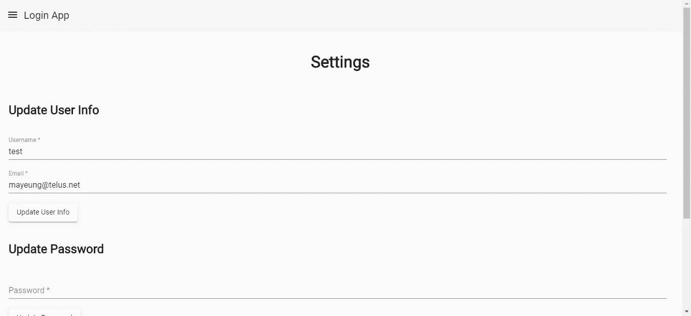
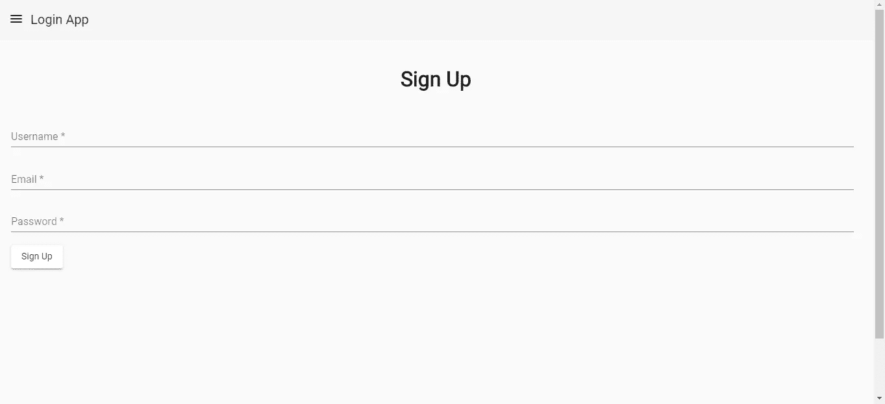

# 如何使用 JSON Web 令牌创建安全的 Web 应用程序

> 原文：<https://betterprogramming.pub/how-to-use-json-web-token-to-make-a-secure-web-app-73eacc1b8999>

## 构建一个使用 JWT 存储认证数据的应用程序


随着单页面前端应用程序和移动应用程序比以往任何时候都更受欢迎，前端与后端是分离的。由于几乎所有的 web 应用程序都需要身份验证，因此前端或移动应用程序需要一种安全的方式来存储用户身份数据。

JSON Web 令牌(JWT)是在前端应用程序上存储身份验证数据的最常见方式之一。对于 Node.js，有一些流行的库可以通过对照存储在后端的密钥检查其真实性来生成和验证 JWT，并且还可以检查有效期。

令牌以大多数应用程序都理解的标准格式编码。它通常包含用户身份数据，如用户 ID、用户名等。当用户可以成功完成身份验证时，会将它提供给用户。

在这一部分中，我们将构建一个使用 JWT 存储认证数据的应用程序。在后端，我们将使用运行在 Node.js 上的 Express 框架和用于生成和验证令牌的`jsonwebtoken`包。对于前端，我们将使用 Angular 框架和用于 Angular 的`@auth0/angular-jwt`模块。在我们的应用程序中，当用户输入用户名和密码，他们在我们的数据库中，然后 JWT 将从我们的密钥生成并返回给用户，并存储在本地存储前端应用程序。每当用户需要访问后端经过身份验证的路由时，他们都需要令牌。后端应用程序中将有一个名为中间件的功能来检查有效的令牌。一个有效的令牌是一个没有过期的令牌，并且根据我们的秘密密钥验证是有效的。除了登录页面之外，还会有注册页面和用户凭证设置页面。

现在我们有了计划，我们可以开始创建前端和后端应用程序文件夹。每人做一个。然后我们开始编写后端应用程序。首先，我们安装一些包并生成我们的 Express 框架代码。我们运行`npx express-generator`来生成代码。然后我们需要安装一些软件包。我们通过运行`npm i @babel/register express-jwt sequelize bcrypt sequelize-cli dotenv jsonwebtoken body-parser cors`来做到这一点。`@babel/register`允许我们使用最新的 JavaScript 特性。`express-jwt`生成 JWT 并根据秘密进行验证。`bcrypt`对我们的密码进行哈希和加盐处理。`sequelize`是我们做 CRUD 的 ORM。`cors`通过允许跨域通信，允许我们的 Angular app 与我们的后端进行通信。`dotenv`允许我们在`.env`文件中存储环境变量。Express 需要`body-parser`来解析 JSON 请求。

然后我们进行数据库迁移。运行`npx sequelize-cli init`来生成数据库到对象映射的框架代码。然后我们运行:

```
npx sequelize-cli model:generate --name User --attributes username:string, password:string, email:string
```

我们进行另一次迁移，并输入:

```
'use strict';module.exports = {
  up: (queryInterface, Sequelize) => {
    return Promise.all([
      queryInterface.addConstraint(
        "Users",
        ["email"],
        {
          type: "unique",
          name: 'emailUnique'
        }), queryInterface.addConstraint(
        "Users",
        ["userName"],
        {
          type: "unique",
          name: 'userNameUnique'
        }),
  }, down: (queryInterface, Sequelize) => {
    return Promise.all([
      queryInterface.removeConstraint(
        "Users",
        'emailUnique'
      ), queryInterface.removeConstraint(
        "Users",
        'userNameUnique'
      ),
    ])
  }
};
```

这可以确保我们没有相同的用户名或电子邮件重复条目。

这将创建`User`模型，并在我们运行`npx sequelize-cli db:migrate`后创建`Users`表。

让我们写一些代码。将以下内容放入`app.js`:

```
require("[@babel/register](http://twitter.com/babel/register)");
require("babel-polyfill");
require('dotenv').config();
const express = require('express');
const bodyParser = require('body-parser');
const cors = require('cors');
const user = require('./controllers/userController');
const app = express();app.use(cors())
app.use(bodyParser.urlencoded({ extended: true }));
app.use(bodyParser.json());app.use((req, res, next) => {
  res.locals.session = req.session;
  next();
});

app.use('/user', user);app.get('*', (req, res) => {
  res.redirect('/home');
});app.listen((process.env.PORT || 8080), () => {
  console.log('App running on port 8080!');
});
```

我们需要:

```
require("[@babel/register](http://twitter.com/babel/register)");
require("babel-polyfill");
```

使用 JavaScript 的最新特性。

我们需要:

```
require('dotenv').config();
```

读取我们在`.env`文件中的配置。

这是切入点。我们将很快在`controllers`文件夹中创建`userController`。

`app.use(‘/user’, user);`将任何以`user`开头的 URL 路由到`userController`文件。

接下来，我们添加`userController.js`文件:

```
const express = require('express');
const bcrypt = require('bcrypt');
const router = express.Router();
const models = require('../models');
const jwt = require('jsonwebtoken');
import { authCheck } from '../middlewares/authCheck';router.post('/login', async (req, res) => {
    const secret = process.env.JWT_SECRET;
    const userName = req.body.userName;
    const password = req.body.password;
    if (!userName || !password) {
        return res.send({
            error: 'User name and password required'
        })
    }
    const users = await models.User.findAll({
        where: {
            userName
        }
    }) const user = users[0];
    if (!user) {
        res.status(401);
        return res.send({
            error: 'Invalid username or password'
        });
    } try {
        const compareRes = await bcrypt.compare(password, user.hashedPassword);
        if (compareRes) {
            const token = jwt.sign(
                {
                    data: {
                        userName,
                        userId: user.id
                    }
                },
                secret,
                { expiresIn: 60 * 60 }
            );
            return res.send({ token });
        }
        else {
            res.status(401);
            return res.send({
                error: 'Invalid username or password'
            });
        }
    }
    catch (ex) {
        logger.error(ex);
        res.status(401);
        return res.send({
            error: 'Invalid username or password'
        });
    }});router.post('/signup', async (req, res) => {
    const userName = req.body.userName;
    const email = req.body.email;
    const password = req.body.password;
    try {
        const hashedPassword = await bcrypt.hash(password, 10)
        await models.User.create({
            userName,
            email,
            hashedPassword
        })
        return res.send({ message: 'User created' });
    }
    catch (ex) {
        logger.error(ex);
        res.status(400);
        return res.send({ error: ex });
    }
});router.put('/updateUser', authCheck, async (req, res) => {
    const userName = req.body.userName;
    const email = req.body.email;
    const token = req.headers.authorization;
    const decoded = jwt.verify(token, process.env.JWT_SECRET);
    const userId = decoded.data.userId;
    try {
        await models.User.update({
            userName,
            email
        }, {
                where: {
                    id: userId
                }
            })
        return res.send({ message: 'User created' });
    }
    catch (ex) {
        logger.error(ex);
        res.status(400);
        return res.send({ error: ex });
    }});router.put('/updatePassword', authCheck, async (req, res) => {
    const token = req.headers.authorization;
    const password = req.body.password;
    const decoded = jwt.verify(token, process.env.JWT_SECRET);
    const userId = decoded.data.userId;
    try {
        const hashedPassword = await bcrypt.hash(password, saltRounds)
        await models.User.update({
            hashedPassword
        }, {
                where: {
                    id: userId
                }
            })
        return res.send({ message: 'User created' });
    }
    catch (ex) {
        logger.error(ex);
        res.status(400);
        return res.send({ error: ex });
    }});module.exports = router;
```

`login`路径搜索用户输入，如果找到，就用`bcrypt`的`compare` 函数检查散列密码。如果两者都成功，就会生成一个 JWT。`signup`路由获取用户名和密码的 JSON 负载并保存。**请注意，在保存之前，会对密码进行哈希和加盐处理。密码不应以纯文本形式存储。** `bcrypt.hash`取两种说法。这个第一个是明文密码，第二个是盐轮数。

`updatePassword`路由是经过认证的路由。它检查令牌，如果有效，将继续通过搜索用户 id 与解码令牌匹配的`User`来保存用户密码。接下来我们将添加`authCheck`中间件。

创建一个`middlewares`文件夹，并在其中创建`authCheck.js`。

```
const jwt = require('jsonwebtoken');
const secret = process.env.JWT_SECRET;export const authCheck = (req, res, next) => {
    if (req.headers.authorization) {
        const token = req.headers.authorization;
        jwt.verify(token, secret, (err, decoded) => {
            if (err) {
                res.send(401);
            }
            else {
                next();
            }
        });
    }
    else {
        res.send(401);
    }
}
```

这允许我们在经过身份验证的路由中检查身份验证，而无需重复代码。通过导入并引用它，我们将`if`放在每个认证路由的 URL 和主路由代码之间。

我们将后端 app 文件夹的根目录制作成一个`.env`文件，内容如下:

```
DB_HOST='localhost'
DB_NAME='login-app'
DB_USERNAME='db-username'
DB_PASSWORD='db-password'
JWT_SECRET='secret'
```

后端应用程序现在已经完成。现在我们来看看前端 Angular 应用程序。

切换到您的前端应用文件夹。要构建 Angular 应用程序，您需要 Angular CLI。

要安装它，请在 Node.js 命令提示符下运行`npm i -g @angular/cli`。然后，运行`ng new frontend`为你的前端应用生成框架代码。

同样，根据[角度文件](https://material.angular.io/guide/getting-started)安装`@angular/material`。

之后，用以下内容替换默认的`app.module.ts`:

```
import { BrowserModule } from '[@angular/platform-browser](http://twitter.com/angular/platform-browser)';
import { NgModule } from '[@angular/core](http://twitter.com/angular/core)';
import { BrowserAnimationsModule } from '[@angular/platform-browser](http://twitter.com/angular/platform-browser)/animations';
import {
  MatButtonModule,
  MatCheckboxModule,
  MatInputModule,
  MatMenuModule,
  MatSidenavModule,
  MatToolbarModule,
  MatTableModule,
  MatDialogModule,
  MAT_DIALOG_DEFAULT_OPTIONS,
  MatDatepickerModule,
  MatSelectModule,
  MatCardModule
} from '[@angular/material](http://twitter.com/angular/material)';
import { MatFormFieldModule } from '[@angular/material](http://twitter.com/angular/material)/form-field';
import { AppRoutingModule } from './app-routing.module';
import { AppComponent } from './app.component';
import { StoreModule } from '[@ngrx/store](http://twitter.com/ngrx/store)';
import { reducers } from './reducers';
import { FormsModule } from '[@angular/forms](http://twitter.com/angular/forms)';
import { TopBarComponent } from './top-bar/top-bar.component';
import { HomePageComponent } from './home-page/home-page.component';
import { LoginPageComponent } from './login-page/login-page.component';
import { SignUpPageComponent } from './sign-up-page/sign-up-page.component';
import { SettingsPageComponent } from './settings-page/settings-page.component';
import { HttpClientModule, HTTP_INTERCEPTORS } from '[@angular/common](http://twitter.com/angular/common)/http';
import { SessionService } from './session.service';
import { HttpReqInterceptor } from './http-req-interceptor';
import { UserService } from './user.service';
import { CapitalizePipe } from './capitalize.pipe';[@NgModule](http://twitter.com/NgModule)({
  declarations: [
    AppComponent,
    TopBarComponent,
    HomePageComponent,
    LoginPageComponent,
    SignUpPageComponent,
    SettingsPageComponent,
  ],
  imports: [
    BrowserModule,
    AppRoutingModule,
    StoreModule.forRoot(reducers),
    BrowserAnimationsModule,
    MatButtonModule,
    MatCheckboxModule,
    MatFormFieldModule,
    MatInputModule,
    MatMenuModule,
    MatSidenavModule,
    MatToolbarModule,
    MatTableModule,
    FormsModule,
    HttpClientModule,
    MatDialogModule,
    MatDatepickerModule,
    MatMomentDateModule,
    MatSelectModule,
    MatCardModule,
    NgxMaterialTimepickerModule
  ],
  providers: [
    SessionService,
    {
      provide: HTTP_INTERCEPTORS,
      useClass: HttpReqInterceptor,
      multi: true
    },
    UserService,
    {
      provide: MAT_DIALOG_DEFAULT_OPTIONS,
      useValue: { hasBackdrop: false }
    },
  ],
  bootstrap: [AppComponent],
})
export class AppModule { }
```

这将创建我们将要添加的所有依赖项和组件。为了使用我们的令牌使认证请求变得容易，我们通过创建`http-req-interceptor.ts`来创建 HTTP 请求拦截器:

```
import { Injectable } from '[@angular/core](http://twitter.com/angular/core)';
import {
    HttpEvent,
    HttpInterceptor,
    HttpHandler,
    HttpResponse,
    HttpErrorResponse,
    HttpRequest
} from '[@angular/common](http://twitter.com/angular/common)/http';
import { Observable } from 'rxjs';
import { environment } from '../environments/environment'
import { map, filter, tap } from 'rxjs/operators';
import { Router } from '[@angular/router](http://twitter.com/angular/router)';[@Injectable](http://twitter.com/Injectable)()
export class HttpReqInterceptor implements HttpInterceptor {
    constructor(
        public router: Router
    ) { }intercept(req: HttpRequest<any>, next: HttpHandler): Observable<HttpEvent<any>> {
        let modifiedReq = req.clone({}); if (localStorage.getItem('token')) {
            modifiedReq = modifiedReq.clone({
                setHeaders: {
                    authorization: localStorage.getItem('token')
                }
            });
        } return next.handle(modifiedReq).pipe(tap((event: HttpEvent<any>) => {
            if (event instanceof HttpResponse) {}
        });
    }
}
```

我们在除登录请求之外的所有请求中设置令牌。

在我们的`environments/environment.ts`中，我们有:

```
export const environment = {
  production: false,
  apiUrl: '[http://localhost:8080'](http://localhost:8080')
};
```

这指向我们后端的 URL。

现在我们需要做侧导航。我们想添加`@ngrx/store`来存储侧导航的状态。我们通过运行`npm install @ngrx/store --save`来安装包。我们通过运行`ng add @ngrx/store`来添加我们的减速器。

我们添加了`menu-reducers.ts`来在我们的 flux store 中集中设置状态:

```
const TOGGLE_MENU = 'TOGGLE_MENU';function menuReducer(state, action) {
    switch (action.type) {
        case TOGGLE_MENU:
            state = action.payload;
            return state;
        default:
            return state
    }
}export { menuReducer, TOGGLE_MENU };
```

要将我们的减速器链接到应用程序的其他部分，请在`index.ts`中输入以下内容:

```
import { menuReducer } from './menu-reducer';
import { tweetsReducer } from './tweets-reducer';export const reducers = {
  menu: menuReducer,
};
```

要获得我们的材料设计外观，请将以下内容添加到`style.css`:

```
/* You can add global styles to this file, and also import other style files */
[@import](http://twitter.com/import) "~[@angular/material](http://twitter.com/angular/material)/prebuilt-themes/indigo-pink.css";
body {
  font-family: "Roboto", sans-serif;
  margin: 0;
}form {
  mat-form-field {
    width: 95vw;
    margin: 0 auto;
  }
}.center {
  text-align: center;
}
```

在`index.html`中的`head`标签之间，我们添加:

```
<link href="https://fonts.googleapis.com/css?family=Roboto&display=swap" rel="stylesheet"><link href="https://fonts.googleapis.com/icon?family=Material+Icons" rel="stylesheet">
```

然后我们通过运行`ng g service user`为用户功能添加一个服务。将创建`user.service.ts`。然后我们把:

```
import { Injectable } from '[@angular/core](http://twitter.com/angular/core)';
import { HttpClient } from '[@angular/common](http://twitter.com/angular/common)/http';
import { environment } from 'src/environments/environment';
import { Router } from '[@angular/router](http://twitter.com/angular/router)';
import { JwtHelperService } from "[@auth0/angular-jwt](http://twitter.com/auth0/angular-jwt)";const helper = new JwtHelperService();[@Injectable](http://twitter.com/Injectable)({
  providedIn: 'root'
})
export class UserService { constructor(
    private http: HttpClient,
    private router: Router
  ) { } signUp(data) {
    return this.http.post(`${environment.apiUrl}/user/signup`, data);
  } updateUser(data) {
    return this.http.put(`${environment.apiUrl}/user/updateUser`, data);
  } updatePassword(data) {
    return this.http.put(`${environment.apiUrl}/user/updatePassword`, data);
  } login(data) {
    return this.http.post(`${environment.apiUrl}/user/login`, data);
  } logOut() {
    localStorage.clear();
    this.router.navigate(['/']);
  } isAuthenticated() {
    try {
      const token = localStorage.getItem('token');
      const decodedToken = helper.decodeToken(token);
      const isExpired = helper.isTokenExpired(token);
      return !!decodedToken && !isExpired;
    }
    catch (ex) {
      return false;
    }
  }}
```

除了用于检查令牌有效性的`isAuthenticated`函数之外，每个函数都请求订阅 HTTP 请求。

我们还需要为我们的应用程序路由，所以我们可以看到页面时，我们去下面列出的网址。在`app-routing.module.ts`中，我们输入:

```
import { NgModule } from '[@angular/core](http://twitter.com/angular/core)';
import { Routes, RouterModule } from '[@angular/router](http://twitter.com/angular/router)';
import { HomePageComponent } from './home-page/home-page.component';
import { LoginPageComponent } from './login-page/login-page.component';
import { SignUpPageComponent } from './sign-up-page/sign-up-page.component';
import { TweetsPageComponent } from './tweets-page/tweets-page.component';
import { SettingsPageComponent } from './settings-page/settings-page.component';
import { PasswordResetRequestPageComponent } from './password-reset-request-page/password-reset-request-page.component';
import { PasswordResetPageComponent } from './password-reset-page/password-reset-page.component';
import { IsAuthenticatedGuard } from './is-authenticated.guard';const routes: Routes = [
  { path: 'login', component: LoginPageComponent },
  { path: 'signup', component: SignUpPageComponent },
  { path: 'settings', component: SettingsPageComponent, canActivate: [IsAuthenticatedGuard] },
  { path: '**', component: HomePageComponent }];[@NgModule](http://twitter.com/NgModule)({
  imports: [RouterModule.forRoot(routes)],
  exports: [RouterModule]
})
export class AppRoutingModule { }
```

现在我们创建上面文件中引用的零件。我们需要防止人们在没有令牌的情况下访问经过认证的路由，所以我们需要在 Angular 中设置一个防护。我们通过运行`ng g guard isAuthenticated`来实现。这产生了`is-authenticated.guard.ts`。

我们将以下内容放入`is-authenticated.guard.ts`:

```
import { Injectable } from '[@angular/core](http://twitter.com/angular/core)';
import { CanActivate, ActivatedRouteSnapshot, RouterStateSnapshot, UrlTree, Router } from '[@angular/router](http://twitter.com/angular/router)';
import { Observable } from 'rxjs';
import { UserService } from './user.service';[@Injectable](http://twitter.com/Injectable)({
  providedIn: 'root'
})
export class IsAuthenticatedGuard implements CanActivate {
  constructor(
    private userService: UserService,
    private router: Router
  ) { }canActivate(
    next: ActivatedRouteSnapshot,
    state: RouterStateSnapshot
  ): Observable<boolean | UrlTree> | Promise<boolean | UrlTree> | boolean | UrlTree {
    const isAuthenticated = this.userService.isAuthenticated();
    if (!isAuthenticated) {
      localStorage.clear();
      this.router.navigate(['/']);
    }
    return isAuthenticated;
  }}
```

这使用来自`UserService`的`isAuthenticated`函数来检查有效的令牌。如果无效，我们清除它并重定向回主页。

现在我们创建用于登录的表单，在登录后设置用户数据。我们运行`ng g component homePage`、`ng g component loginPage`、`ng g component topBar`、`ng g component signUpPage`和`ng g component settingsPage`。这些是用于表单和顶部栏组件的。

主页只是一个静态页面。我们应该在运行最后一段中的命令后生成`home-page.component.html`和`home-page.component.ts`。

在`home-page.component.html`中我们放入:

```
<div class="center">
    <h1>Home Page</h1>
</div>
```

现在我们制作我们的登录页面。在`login-page.component.ts`中，我们把:

```
<div class="center">
    <h1>Log In</h1>
</div>
<form #loginForm='ngForm' (ngSubmit)='login(loginForm)'>
    <mat-form-field>
        <input matInput placeholder="Username" required #userName='ngModel' name='userName'
            [(ngModel)]='loginData.userName'>
        <mat-error *ngIf="userName.invalid && (userName.dirty || userName.touched)">
            <div *ngIf="userName.errors.required">
                Username is required.
            </div>
        </mat-error>
    </mat-form-field>
    <br>
    <mat-form-field>
        <input matInput placeholder="Password" type='password' required #password='ngModel' name='password'
            [(ngModel)]='loginData.password'>
        <mat-error *ngIf="password.invalid && (password.dirty || password.touched)">
            <div *ngIf="password.errors.required">
                Password is required.
            </div>
        </mat-error>
    </mat-form-field>
    <br>
    <button mat-raised-button type='submit'>Log In</button>
    <a mat-raised-button routerLink='/passwordResetRequest'>Reset Password</a>
</form>
```

在`login-page.component.ts`中，我们把:

```
import { Component, OnInit } from '[@angular/core](http://twitter.com/angular/core)';
import { UserService } from '../user.service';
import { NgForm } from '[@angular/forms](http://twitter.com/angular/forms)';
import { Router } from '[@angular/router](http://twitter.com/angular/router)';[@Component](http://twitter.com/Component)({
  selector: 'app-login-page',
  templateUrl: './login-page.component.html',
  styleUrls: ['./login-page.component.scss']
})
export class LoginPageComponent implements OnInit {
  loginData: any = <any>{}; constructor(
    private userService: UserService,
    private router: Router
  ) { } ngOnInit() {
  } login(loginForm: NgForm) {
    if (loginForm.invalid) {
      return;
    }
    this.userService.login(this.loginData)
      .subscribe((res: any) => {
        localStorage.setItem('token', res.token);
        this.router.navigate(['/settings']);
      }, err => {
        alert('Invalid username or password');
      })
  }
}
```

我们确保所有字段都已填写。如果是，将发送登录数据，并且如果身份验证成功，令牌将保存到本地存储。否则，将显示错误警告。

然后在我们的注册页面`sign-up-page.component.html`，我们输入:

```
<div class="center">
    <h1>Sign Up</h1>
</div>
<br>
<form #signUpForm='ngForm' (ngSubmit)='signUp(signUpForm)'>
    <mat-form-field>
        <input matInput placeholder="Username" required #userName='ngModel' name='userName'
            [(ngModel)]='signUpData.userName'>
        <mat-error *ngIf="userName.invalid && (userName.dirty || userName.touched)">
            <div *ngIf="userName.errors.required">
                Username is required.
            </div>
        </mat-error>
    </mat-form-field>
    <br>
    <mat-form-field>
        <input pattern="\S+@\S+\.\S+" matInput placeholder="Email" required #email='ngModel' name='email'
            [(ngModel)]='signUpData.email'>
        <mat-error *ngIf="email.invalid && (email.dirty || email.touched)">
            <div *ngIf="email.errors.required">
                Email is required.
            </div>
            <div *ngIf="email.invalid">
                Email is invalid.
            </div>
        </mat-error>
    </mat-form-field>
    <br>
    <mat-form-field>
        <input matInput placeholder="Password" type='password' required #password='ngModel' name='password'
            [(ngModel)]='signUpData.password'>
        <mat-error *ngIf="password.invalid && (password.dirty || password.touched)">
            <div *ngIf="password.errors.required">
                Password is required.
            </div>
        </mat-error>
    </mat-form-field>
    <br>
    <button mat-raised-button type='submit'>Sign Up</button>
</form>
```

在`sign-up-page.component.ts`中，我们输入:

```
import { Component, OnInit } from '[@angular/core](http://twitter.com/angular/core)';
import { UserService } from '../user.service';
import { NgForm } from '[@angular/forms](http://twitter.com/angular/forms)';
import { Router } from '[@angular/router](http://twitter.com/angular/router)';
import _ from 'lodash';[@Component](http://twitter.com/Component)({
  selector: 'app-sign-up-page',
  templateUrl: './sign-up-page.component.html',
  styleUrls: ['./sign-up-page.component.scss']
})
export class SignUpPageComponent implements OnInit {
  signUpData: any = <any>{}; constructor(
    private userService: UserService,
    private router: Router
  ) { }ngOnInit() {
  } signUp(signUpForm: NgForm) {
    if (signUpForm.invalid) {
      return;
    }
    this.userService.signUp(this.signUpData)
      .subscribe(res => {
        this.login();
      }, err => {
        console.log(err);
        if (
          _.has(err, 'error.error.errors') &&
          Array.isArray(err.error.error.errors) &&
          err.error.error.errors.length > 0
        ) {
          alert(err.error.error.errors[0].message);
        }
      })
  } login() {
    this.userService.login(this.signUpData)
      .subscribe((res: any) => {
        localStorage.setItem('token', res.token);
        this.router.navigate(['/tweets']);
      })
  }
}
```

这两段代码获取注册数据并将其发送到后端，如果它们都有效，后端将保存文件。

同样，在`settings-page.component.html`中:

```
<div class="center">
    <h1>Settings</h1>
</div>
<br>
<div>
    <h2>Update User Info</h2>
</div>
<br>
<form #updateUserForm='ngForm' (ngSubmit)='updateUser(updateUserForm)'>
    <mat-form-field>
        <input matInput placeholder="Username" required #userName='ngModel' name='userName'
            [(ngModel)]='updateUserData.userName'>
        <mat-error *ngIf="userName.invalid && (userName.dirty || userName.touched)">
            <div *ngIf="userName.errors.required">
                Username is required.
            </div>
        </mat-error>
    </mat-form-field>
    <br>
    <mat-form-field>
        <input pattern="\S+@\S+\.\S+" matInput placeholder="Email" required #email='ngModel' name='email'
            [(ngModel)]='updateUserData.email'>
        <mat-error *ngIf="email.invalid && (email.dirty || email.touched)">
            <div *ngIf="email.errors.required">
                Email is required.
            </div>
            <div *ngIf="email.invalid">
                Email is invalid.
            </div>
        </mat-error>
    </mat-form-field>
    <br>
    <button mat-raised-button type='submit'>Update User Info</button>
</form>
<br><div>
    <h2>Update Password</h2>
</div>
<br>
<form #updatePasswordForm='ngForm' (ngSubmit)='updatePassword(updatePasswordForm)'>
    <mat-form-field>
        <input matInput placeholder="Password" type='password' required #password='ngModel' name='password'
            [(ngModel)]='updatePasswordData.password'>
        <mat-error *ngIf="password.invalid && (password.dirty || password.touched)">
            <div *ngIf="password.errors.required">
                Password is required.
            </div>
        </mat-error>
    </mat-form-field>
    <br>
    <button mat-raised-button type='submit'>Update Password</button>
</form>
<br><div *ngIf='currentTwitterUser.id' class="title">
    <h2>Connected to Twitter Account</h2>
    <div>
        <button mat-raised-button (click)='redirectToTwitter()'>Connect to Different Twitter Account</button>
    </div>
</div>
<div *ngIf='!currentTwitterUser.id' class="title">
    <h2>Not Connected to Twitter Account</h2>
    <div>
        <button mat-raised-button (click)='redirectToTwitter()'>Connect to Twitter Account</button>
    </div>
</div>
```

在`settings-page.component.html`中，我们输入:

```
import { Component, OnInit } from '[@angular/core](http://twitter.com/angular/core)';
import { ActivatedRoute, Router } from '[@angular/router](http://twitter.com/angular/router)';
import { SessionService } from '../session.service';
import { NgForm } from '[@angular/forms](http://twitter.com/angular/forms)';
import { UserService } from '../user.service';[@Component](http://twitter.com/Component)({
  selector: 'app-settings-page',
  templateUrl: './settings-page.component.html',
  styleUrls: ['./settings-page.component.scss']
})
export class SettingsPageComponent implements OnInit {
  currentTwitterUser: any = <any>{};
  elements: any[] = [];
  displayedColumns: string[] = ['key', 'value'];
  updateUserData: any = <any>{};
  updatePasswordData: any = <any>{}; constructor(
    private sessionService: SessionService,
    private userService: UserService,
    private router: Router
  ) {

  } ngOnInit() {

  } updateUser(updateUserForm: NgForm) {
    if (updateUserForm.invalid) {
      return;
    }
    this.userService.updateUser(this.updateUserData)
      .subscribe(res => {
        alert('Updated user info successful.');
      }, err => {
        alert('Updated user info failed.');
      })
  } updatePassword(updatePasswordForm: NgForm) {
    if (updatePasswordForm.invalid) {
      return;
    }
    this.userService.updatePassword(this.updatePasswordData)
      .subscribe(res => {
        alert('Updated password successful.');
      }, err => {
        alert('Updated password failed.');
      })
  }
}
```

与其他页面类似，它向我们的后端发送一个请求负载，用于更改用户数据和密码。

最后，为了制作我们的顶栏，我们将以下内容放入`top-bar.component.html`:

```
<mat-toolbar>
    <a (click)='toggleMenu()' class="menu-button">
        <i class="material-icons">
            menu
        </i>
    </a>
    Twitter Automator
</mat-toolbar>
```

并且在`top-bar.component.ts`中:

```
import { Component, OnInit } from '[@angular/core](http://twitter.com/angular/core)';
import { Store, select } from '[@ngrx/store](http://twitter.com/ngrx/store)';
import { TOGGLE_MENU } from '../reducers/menu-reducer';[@Component](http://twitter.com/Component)({
  selector: 'app-top-bar',
  templateUrl: './top-bar.component.html',
  styleUrls: ['./top-bar.component.scss']
})
export class TopBarComponent implements OnInit {
  menuOpen: boolean; constructor(
    private store: Store<any>
  ) {
    store.pipe(select('menu'))
      .subscribe(menuOpen => {
        this.menuOpen = menuOpen;
      })
  } ngOnInit() {
  } toggleMenu() {
    this.store.dispatch({ type: TOGGLE_MENU, payload: !this.menuOpen });
  }
}
```

在`app.component.ts`中，我们输入:

```
import { Component, HostListener } from '[@angular/core](http://twitter.com/angular/core)';
import { Store, select } from '[@ngrx/store](http://twitter.com/ngrx/store)';
import { TOGGLE_MENU } from './reducers/menu-reducer';
import { UserService } from './user.service';[@Component](http://twitter.com/Component)({
  selector: 'app-root',
  templateUrl: './app.component.html',
  styleUrls: ['./app.component.scss']
})
export class AppComponent {
  menuOpen: boolean; constructor(
    private store: Store<any>,
    private userService: UserService
  ) {
    store.pipe(select('menu'))
      .subscribe(menuOpen => {
        this.menuOpen = menuOpen;
      })
  } isAuthenticated() {
    return this.userService.isAuthenticated();
  }[@HostListener](http://twitter.com/HostListener)('document:click', ['$event'])
  public onClick(event) {
    const isOutside = !event.target.className.includes("menu-button") &&
      !event.target.className.includes("material-icons") &&
      !event.target.className.includes("mat-drawer-inner-container")
    if (isOutside) {
      this.menuOpen = false;
      this.store.dispatch({ type: TOGGLE_MENU, payload: this.menuOpen });
    }
  }logOut() {
    this.userService.logOut();
  }
}
```

在`app.component.html`中，我们有:

```
<mat-sidenav-container class="example-container">
    <mat-sidenav mode="side" [opened]='menuOpen'>
        <ul>
            <li>
                <b>
                    Twitter Automator
                </b>
            </li>
            <li>
                <a routerLink='/login' *ngIf='!isAuthenticated()'>Log In</a>
            </li>
            <li>
                <a routerLink='/signup' *ngIf='!isAuthenticated()'>Sign Up</a>
            </li>
            <li>
                <a href='#' (click)='logOut()' *ngIf='isAuthenticated()'>Log Out</a>
            </li>
            <li>
                <a routerLink='/tweets' *ngIf='isAuthenticated()'>Tweets</a>
            </li>
            <li>
                <a routerLink='/settings' *ngIf='isAuthenticated()'>Settings</a>
            </li>
        </ul></mat-sidenav>
    <mat-sidenav-content>
        <app-top-bar></app-top-bar>
        <div id='content'>
            <router-outlet></router-outlet>
        </div>
    </mat-sidenav-content>
</mat-sidenav-container>
```

这允许我们切换我们的侧面导航菜单。请注意，我们有:

```
[@HostListener](http://twitter.com/HostListener)('document:click', ['$event'])
  public onClick(event) {
    const isOutside = !event.target.className.includes("menu-button") &&
      !event.target.className.includes("material-icons") &&
      !event.target.className.includes("mat-drawer-inner-container")
    if (isOutside) {
      this.menuOpen = false;
      this.store.dispatch({ type: TOGGLE_MENU, payload: this.menuOpen });
    }
  }
```

来检测侧面导航的点击。如果我们单击外部，即没有单击任何包含这些类的元素，那么我们将关闭菜单。`this.store.dispatch`将关闭状态传播到所有组件。

最后，我们有:



**在 Twitter 上关注我:**[**https://twitter.com/AuMayeung**](https://twitter.com/AuMayeung)