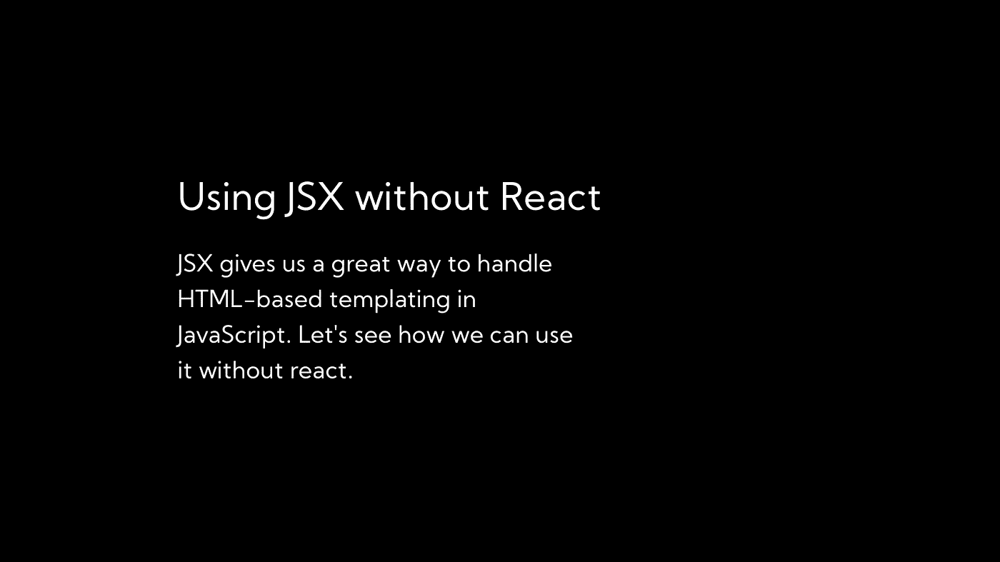

# 如何使用 JSX 没有反应

> 原文：<https://betterprogramming.pub/how-to-use-jsx-without-react-21d23346e5dc>

## JSX 为我们提供了一个在 JavaScript 中处理基于 HTML 的模板的好方法。你知道你可以毫无反应地使用它吗？

我个人是 JSX 的忠实粉丝，喜欢它允许我拆分和组件化代码的方式。尽管 JSX 在 React 之前就已经出现了，但如果没有 React，它也不会像现在这样受欢迎。然而，我们实际上可以在没有反应情况下使用 JSX，这也不是很困难。

React 的工作方式是通过配置你的捆绑器将 JSX 转换成对一个`createElement`函数的调用。比如说:

然而，大多数捆绑器允许你选择你自己的 JSX *杂注*(将代替`React.createElement`的函数)。例如，如果您正在使用 Babel，您可以通过一个简单的注释来指定使用什么功能，如下所示:

现在巴贝尔会把这些参数传给`myJsxFunction`。现在我们需要做的就是创建一个函数，它接受这些参数并创建真正的 DOM 节点，我们可以将这些节点添加到我们的 DOM 中。所以让我们开始吧。(如果你需要一个代码沙箱来玩，你可以使用这个静态模板。)

DOM 节点是使用`document.createNode()`函数创建的。它只需要一个`tag`的名字，所以一个好的开始就是:

现在我们有了一个 DOM 节点，我们必须实际添加提供给我们的属性。这些可以是类似于`class`或`style`的任何东西。所以我们将遍历所有提供的属性(使用`Object.entries`)并在 DOM 节点上设置它们:

不过，这种方法有一个问题。我们如何处理事件？例如，假设我有这个 JSX:

我们的函数将把`onClick`设置为普通属性，回调设置为实际文本。

相反，我们可以做的是检查我们的属性是否以`on`开始，并且在窗口范围内。这会告诉我们这是不是一个事件。例如，`onclick`在窗口范围内；然而，`onfoo`不是。如果是，那么我们可以使用不带`on`的名称部分在该节点上注册一个事件监听器。

看起来是这样的:

不错！现在剩下要做的就是将所有的子元素添加到父元素中。但是，您不能将字符串追加到 DOM 节点，因此如果子节点不是节点，我们可以创建一个文本节点并追加它:

然而，这很快会遇到深度嵌套元素以及使用数组映射创建的元素的问题。因此，让我们用一个递归的`appendChild`方法来代替这一部分:

现在我们可以用这个代替我们的老方法:

有用！试试看。我们现在可以将基本的 JSX 渲染到 DOM:

你应该看到你的 JSX 完美地呈现出来。不过，我们还可以添加一些东西；例如，在 React 中，元素通常是函数。实现这个将允许我们嵌套组件并充分利用道具，这是 JSX 的一个重要特征。

幸运的是，实现起来非常简单。我们所要做的就是检查`tag`名称是否是一个函数而不是一个字符串。如果是，我们不做任何其他的事情，而只是调用函数。它看起来是这样的:

现在让我们来试试:

如你所见，实现它也允许我们使用道具！你可以说我们已经完成了，但是我还想实现一个特性:片段。对于那些不熟悉的人来说，*片段*是在 JSX 拥有空容器的一种方式，他们使用空标签。示例:

但是要做到这一点，我们需要一个接受这个片段的函数，而不是创建一个 DOM 元素，它只是返回它的子元素。它看起来是这样的:

它开箱即用，因为我们的递归`appendChild`方法。

就是这样！我们做到了。一个超级简单的 JSX 到 DOM 函数，让我们可以使用 JSX 的能力，而不必特别使用 rReact。你可以在[这个代码沙箱](https://codesandbox.io/s/jsx-in-the-browser-qd2hq)中找到它的源代码。

我希望这篇文章对你有所帮助，我也希望你能找到一些很酷的方法来使用 JSX 的力量。我实际上是在使用 [Dhow](https://github.com/kartiknair/dhow) 时了解到这些的，这是一个 JSX 驱动的 Node.js 静态站点生成器。它基本上允许你编写 Next.js 风格的代码，但可以毫无顾虑地将其转换为静态 HTML。