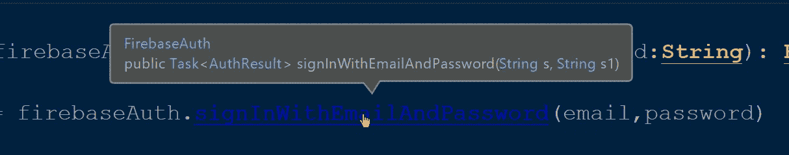
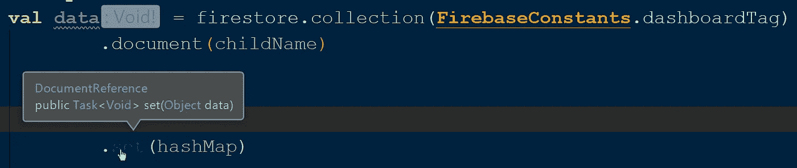

# 如何在 Firebase 中使用 Kotlin 协同程序

> 原文：<https://betterprogramming.pub/how-to-use-kotlin-coroutines-with-firebase-6f8577a3e00f>

## 给你的 Firebase 请求增加一些悬念


# 介绍

Firebase 通过`[kotlinx-coroutines-play-services](https://github.com/Kotlin/kotlinx.coroutines/tree/master/integration/kotlinx-coroutines-play-services)`库增加了对协程的支持。Firebase 身份验证和 Firestore 数据库操作可以暂停，以确保它们不在主线程上运行。请继续阅读，了解如何使用它以及它是如何在引擎盖下工作的。

从 Google Play 服务版本 9.0.0 开始，您可以使用一个`Task` API 和许多返回`Task`或其子类的函数。`Task` 是一个代表异步方法调用的 API。Firebase 认证和 Firestore 操作返回由`Task`包装的结果。看一看:



Firebase 身份验证返回类型。



Firestore 操作返回类型。

在`Task`中，我们添加了一个监听器，将我们与事件的变化联系起来，比如成功和失败:

Firebase 简单验证示例

通过使用`addOnCompleteListener`，我们适应了回调风格。协程的主要目标之一是将我们从回调地狱中解放出来，回调地狱可能不知道发起请求的组件的生命周期。

这就是`kotlinx-coroutines-play-services`的用武之地——它通过在`Task`上使用`await`而不是添加一个监听器来为 Firebase 和 Firestore 操作提供协同支持。

# 它是如何工作的

`suspend fun <T> Task<T>.await(): T`

当你在一个`task`上应用`await`时，它会一直等待，直到它完成，而不会阻塞线程。

当你在一个任务上应用`await()`时，它将返回可取消的暂停功能。如果当前协程的[作业](https://kotlin.github.io/kotlinx.coroutines/kotlinx-coroutines-core/kotlinx.coroutines/-job/index.html)被取消或完成，而该暂停函数正在等待，则该函数停止等待完成阶段，并立即通过`[CancellationException](https://kotlin.github.io/kotlinx.coroutines/kotlinx-coroutines-core/kotlinx.coroutines/-cancellation-exception.html)`恢复。

这意味着您不再需要编写样板代码来维护生命周期支持，因为协程是生命周期感知的。如果你的项目在 MVVM 或者清洁建筑中，这将会更有帮助。

在 Firebase 中,`await`扩展功能并不是现成的特性——您必须深入研究协程库才能了解它是如何工作的。

它首先检查给定的任务是否已经完成。如果是，它将进行一系列检查，以检查它是否已被取消或是否发生了任何异常。如果满足任何异常检查，它将返回适当的异常，否则，它将返回结果。

另一方面，如果请求没有完成，它将返回一个使用了原来的`completelistener`的`suspendCancellableCoroutine`。有了`await`的支持，Firebase 请求将具有生命周期意识。

是时候编码了！

# 综合

要首先将`await()`应用于认证和数据库操作，您需要将 Firebase 认证和 Firestore 库与`kotlinx-coroutines-play-services`库集成在一起。看一看:

必需的库

# 使用协程的 Firebase 认证

首先，让我们看看如何为那些不知道的人执行一个标准的 firebase auth 请求。为了简单起见，我使用了电子邮件和密码功能(Firebase 具有广泛的身份验证功能，如电话号码、脸书、动态登录链接等等):

Firebase 使用电子邮件和密码登录

很简单——您创建一个`FirebaseAuth`的实例，然后通过提供电子邮件和密码来调用`signInWithEmailAndPassword`函数。这将返回由`Task`包装的`FirebaseUser` ，因此我们添加了`onCompleteListener`来在任务完成后更新 UI。

现在，让我们看看如何使用协程执行相同的请求:

使用协同例程的 Firebase Auth

我们没有添加监听器，而是使用协程中的`await()`来停止执行，直到任务完成。一旦完成，我们将结果赋给`data`变量。您不需要添加任何回调或者检查组件是否是活动的，因为协程是生命周期感知的。

# 带有协程的 Firestore

不管是 Firebase Auth 请求还是 Firestore 数据库操作，如果它们返回`Task`，我们可以使用`await()`来暂停执行，直到它完成，如上所示。首先，让我们看一个没有协程的简单 Firestore 更新操作:

没有协程的 Firestore 更新请求

现在，让我们看看使用协程执行相同的请求。

带有协同例程的 Firestore 更新请求

因为这是一个更新请求，所以返回类型将是 void。另一方面，Firestore 上的`GET` 请求与此类似，但它的返回类型是 document-snapshot，我们必须将它转换成适当的数据类型。用协程程序查看 Firestore `GET` 请求:

Firestore 使用协程获取请求

# Firebase、协程程序和 **KTX**

我们已经看到了如何使用协程执行 Firebase 和 Firestore 请求。现在是时候学习如何使用`ktx`函数了，这些函数让开发人员的生活变得如此简单。

我们必须将以下库集成到应用程序级`build.gradle`文件中，以便使用带有 Kotlin 扩展的 Firestore。

```
implementation 'com.google.firebase:firebase-firestore-ktx:$VERSION'
```

现在，让我们来看看一些有扩展和没有扩展的 Firebase 操作

## 1.将 DocumentSnapshot 转换为数据类

## 2.获取 FirebaseFirestore 的实例

## 3.使用本地模拟器设置 Firestore

# 奖金！

要了解更多关于 Kotlin 和 coroutines 的知识，请阅读下面的文章并关注我以获取更新。

*   [使用 Kotlin 进行高级编程](https://medium.com/better-programming/advanced-android-programming-with-kotlin-5e40b1be22bb)
*   [使用 Kotlin 进行高级编程-第 2 部分](https://medium.com/android-dev-hacks/advanced-android-programming-with-kotlin-part-2-aae2a15258b0)
*   [使用 Kotlin 进行高级编程-第 3 部分](https://medium.com/better-programming/advanced-programming-in-kotlin-2e01fbc39134)
*   [Kotlin 协程，从基础到高级](https://medium.com/better-programming/kotlin-coroutines-from-basics-to-advanced-ad3eb1421006)
*   [科特林的密封类](https://medium.com/@sgkantamani/sealed-classes-in-kotlin-e48e072daca8)
*   [使用新的 Kotlin 流进行异步数据加载](https://medium.com/better-programming/asynchronous-data-loading-with-new-kotlin-flow-233f85ae1d8b)

感谢您的阅读。