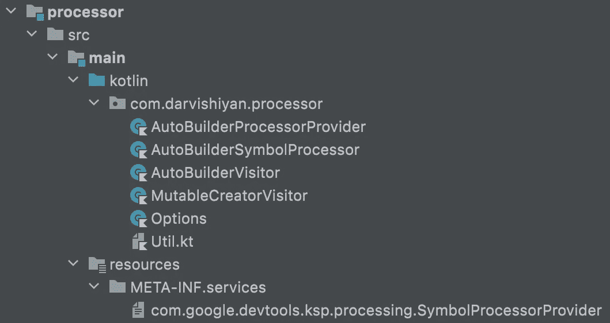
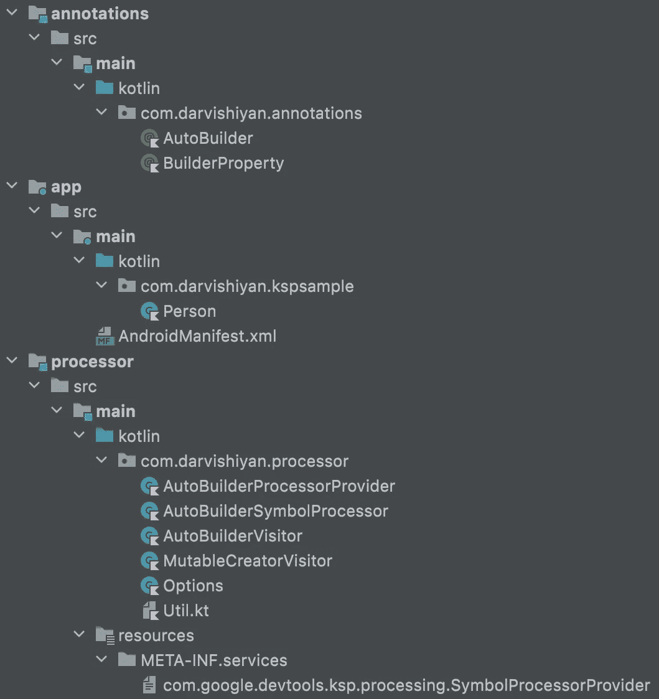
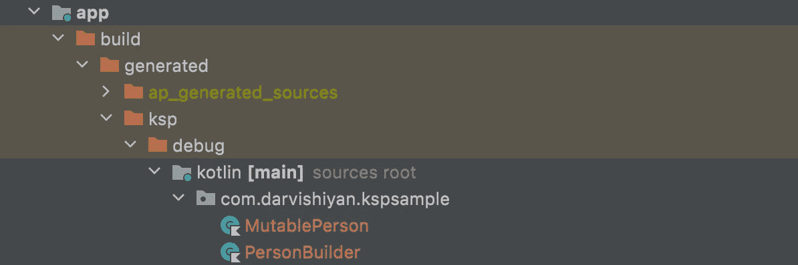
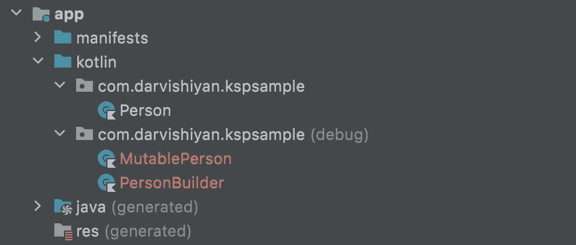

# 如何在 Android 上使用 Kotlin 符号处理器

> 原文：<https://betterprogramming.pub/how-to-use-ksp-on-android-f7df3a87d05e>

## 我们将深入探讨由 KSP 自动生成样板代码，并讨论挑战和解决方案


由 [Shane](https://unsplash.com/es/@theyshane?utm_source=medium&utm_medium=referral) 在 [Unsplash](https://unsplash.com?utm_source=medium&utm_medium=referral) 上拍摄的照片

让我首先重申一个问题:

什么是注释？

> Java 注释用于为 Java 代码提供元数据。Java 注释不会直接影响代码的执行，尽管某些类型的注释可以用于此目的。
> — [参考](https://jenkov.com/tutorials/java/annotations.html)，[更多](https://en.wikipedia.org/wiki/Java_annotation)

用什么平台不重要；只要使用 Kotlin，就可以在项目中实现 KSP。

值得注意的是，注释处理是一个编译时操作，不涉及运行时开销。

# 例子

通过一个例子，我们将更好地理解 KSP。

考虑下面的数据类。

在本例中，我们希望基于`Builder`模式生成一个构建器类。

我们生成的类有一个编译时错误！因为我们无法更新**数据类**属性。我们必须自动生成一个具有可变属性的对象来解决这个问题。

我们应该将构建器类改为下面的代码！

# 履行

我们需要三个模块:

1.  注释模块:定义注释。
2.  处理器模块:生成代码。
3.  App 模块:显然，要用标注。

# 注释模块

我们应该创建一个`Jave or Kotlin Library`模块，创建`annotation class`，定义参数并指定哪些类型的对象可以被`@Target`注释:


注释模块结构

`AutoBuilder`指定了数据类。

`BuilderProperty`指定了哪些对象应该有独立的方法。

最后，`flexible`决定我们是否想要生成可变对象。

这些注释会将我们的数据类更改为以下对象:

# **处理器模块**

我们的项目需要以下类路径。

```
classpath ‘org.jetbrains.kotlin:kotlin-gradle-plugin:1.7.0’
```

以及`**main gradle**`文件中的如下插件:

```
id 'com.google.devtools.ksp' version '1.7.0-1.0.6' apply false
```

现在我们应该向`**Processor module**`添加以下依赖项。

```
implementation project(path: ':annotations')
implementation "com.google.devtools.ksp:symbol-processing-api:1.7.0-1.0.6"
```

为了处理注释，我们需要一个提供处理器的对象。因此，我们创建了一个类并实现了`**SymbolProcessorProvider**`。

下一步是注册提供者。因此，创建以下目录:

```
processor/src/main/resources/META-INF/services
```

并使用以下名称创建一个文件:

```
com.google.devtools.ksp.processing.SymbolProcessorProvider
```


在文件中写入您的提供程序的完全限定名。*例如:*

```
your.domain.processor.AutoBuilderProcessorProvider
```

我们的提供商必须有一个`**SymbolProcessor**`。因此，创建一个类并实现`**SymbolProcessor**` 接口。

然后在`**SymbolProcessorProvider**`中实现`**create**`功能。

> *像 a，b，c 一样简单*

现在，我们应该解决最后一个问题。再来看`**SymbolProcessor**`。

我们应该在这个类中实现`**process**`函数。作为第一步，我们必须找到带有注释的对象。

```
val symbols: Sequence<KSClassDeclaration> = resolver
    .getSymbolsWithAnnotation(AutoBuilder::class.java.name)
    .filterIsInstance<KSClassDeclaration>()
```

> 值得注意的是，`**process**`函数返回一个已处理注释的列表，以避免**重新处理。**

因此，在开始处理对象之前，有必要检查是否有任何带有我们的注释的对象。由于我们的对象是一个`Sequence`，我们将使用`hasNext`。

```
if (symbols.iterator().hasNext().not()) return emptyList()
```

注意:对象可以有多个注释，注释可以有各种参数，所以我们需要用它们的名字来得到一个特定的注释和一个特定的参数。

> 为了使代码更具可读性，我使用了以下扩展函数！

现在，我们可以开始处理我们的对象了。很简单——使用`**forEach**`

```
symbols.forEach { symbol ->
   // …
}
```

首先，我们必须检查对象是否是数据类:

```
if (symbol.modifiers.containsIgnoreCase("data").not()) {
    logger.error("This object is not a data class", symbol)
    return emptyList()
}
```

我们可以使用以下代码从特定的注释中检索参数值:

```
val flexible = symbol.annotations
   .getAnnotation(AutoBuilder::class.java.simpleName)
   .arguments.getParameterValue<Boolean>("flexible")
```

此代码有问题；我们使用了一个字符串，这增加了出错的可能性。将批注类更改为以下代码:

并将前面的代码更改为以下代码:

```
val flexible = symbol.annotations
   .getAnnotation(AutoBuilder::class.java.simpleName)
   .arguments.getParameterValue<Boolean>(AutoBuilder.flexible)
```

为了处理对象，我们需要实现`KSVisitor`接口，这个接口有两个通用类型:

d:它是作为输入发送或在流程步骤中创建的对象。它是我们的类将要返回的一个对象。

`KSVisitor`有一些实现。根据具体情况，我们可以使用它们来代替实现`KSVisitor`。

> 我们在本文中查看构建器访问者，源代码包含可变的构建器。

我们在这个例子中使用`KSVisitorVoid`，因为我们的输入和输出是`null`。

因为我们的注释目标是类，所以我们必须覆盖`*visitClassDeclaration*`。

在这一步，我们必须创建我们的文件:

```
val file: OutputStream = codeGenerator.createNewFile(
   dependencies = Dependencies(false), 
   packageName = [Package Name],
   fileName = [File Name]
)
```

在这段代码中，除了`dependencies`，一切都很清楚。

为了防止重新处理和重新生成不必要的文件，KSP 使用了增量处理技术。为了简洁起见，我将跳过这项技术的工作。然而，如果你愿意，你可以[在文档](https://kotlinlang.org/docs/ksp-incremental.html)中读到它。

下面的`**operation function**`帮助我们拥有更多可读的代码。

记住在`END`处`CLOSE`到`OutputStream`。

在文件中写入很容易；你需要一行一行地写。

在这个例子中，我们应该读取属性三次。

首先是创建承包商:

```
class PersonBuilder(name: kotlin.String)
```

第二步是创建私有对象:

```
private val mutablePerson: MutablePerson = MutablePerson(
   name = name,
   age = null,
   email = null,
   contact = null,
)
```

第三是创建构建器函数:

```
fun age(age: kotlin.Int): PersonBuilder {
   mutablePerson.age = age
   return this
}
```

## 注 1:

找到所有的 off 类型并写在文件的顶部是复杂的。为了解决这个问题，我们应该使用类型的限定名，而不是简单名。

意思是写:

```
kotlin.collections.List<kotlin.Boolean>
```

而不是:

```
List<Boolean>
```

## 注 2:

获取泛型类型并不容易。为了处理它，我们应该使用下面的递归函数。

## 注 3:

调用`resolve`操作在计算方面开销很大。所以，你必须小心使用它。

因此，我们的处理器模块生成以下代码:



处理器模块结构

# **App 模块**

要将处理器模块添加到应用程序模块，我们应该将以下插件添加到主模块:

```
id 'com.google.devtools.ksp'
```

此外，将以下依赖项添加到主模块:

```
implementation project(path: ':annotations')
ksp project(path: ':processor')
```

构建并同步项目，并创建以下类:



项目结构

再次构建项目，并在以下地址找到您的文件:

```
~/build/generated/ksp/debug/kotlin/...
```



自动生成的文件

# 挑战和解决方案

挑战 1 —我想在 Android 模式下展示自动生成的对象。

为了在 Android 模式下显示自动生成的对象，我们应该将以下代码添加到`.gradle`文件中。

应用模块:

```
applicationVariants.all { variant ->
    kotlin.sourceSets {
        def name = variant.name
        getByName(name) {
            kotlin.srcDir("$buildDir/generated/ksp/$name/kotlin")
        }
    }
}
```

库模块:

```
libraryVariants.all { variant ->
    kotlin.sourceSets {
        def name = variant.name
        getByName(name) {
            kotlin.srcDir("$buildDir/generated/ksp/$name/kotlin")
        }
    }
}
```



挑战 2 —我想要配置选项:

我们可以在`**ksp**`块中编写我们的配置来拥有配置选项。

```
android {
    ...
    ksp {
        arg("myConfig1", "true")
        arg("myConfig2", "myText")
        arg("myConfig3", "1")
    }
}
```

我使用下面的代码来读取配置。

最后，我们无法访问默认值；如果有必要，你可以定义一些注释并通过它们发送默认值。检查这个[问题](https://github.com/google/ksp/issues/268)。

# 源代码

[](https://github.com/Darvishiyan/KSP-Builder-Sample) [## GitHub-Darvishiyan/KSP-生成器-示例

### 此时您不能执行该操作。您已使用另一个标签页或窗口登录。您已在另一个选项卡中注销，或者…

github.com](https://github.com/Darvishiyan/KSP-Builder-Sample) 

另一个例子:[这个项目](https://github.com/Darvishiyan/KSP-DiffCallback-Sample)自动为 Android 中的`ListAdapter`生成`DiffCallback`对象。

# 参考

*   [科特林符号处理 API |科特林](https://kotlinlang.org/docs/ksp-overview.html)
*   [google/ksp: Kotlin 符号处理 API](https://github.com/google/ksp)
*   [那么，我如何编写一个 Kotlin 符号处理器(KSP)？](https://proandroiddev.com/so-how-do-i-write-a-kotlin-symbol-processor-ksp-b9606e9e3818)