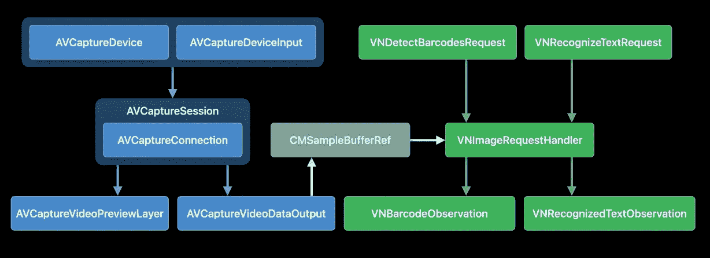
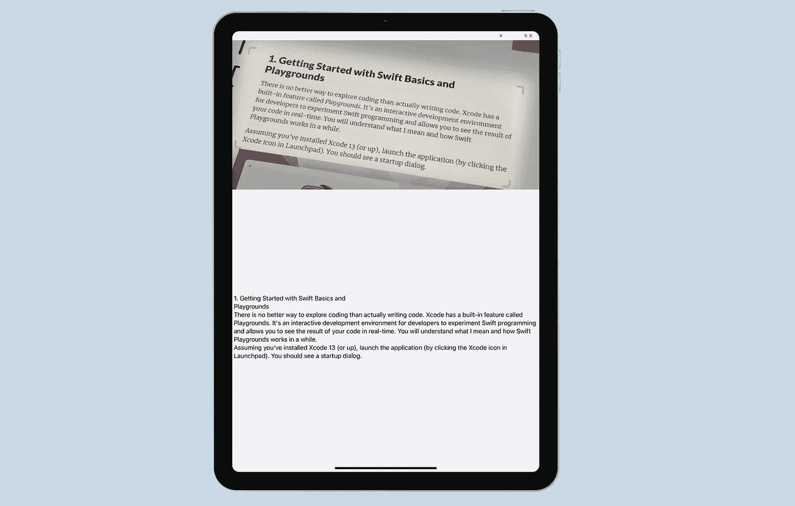
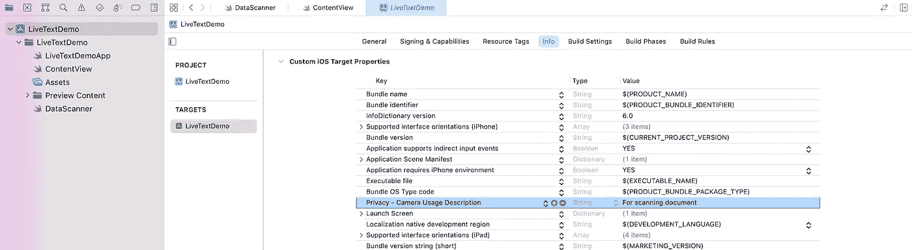
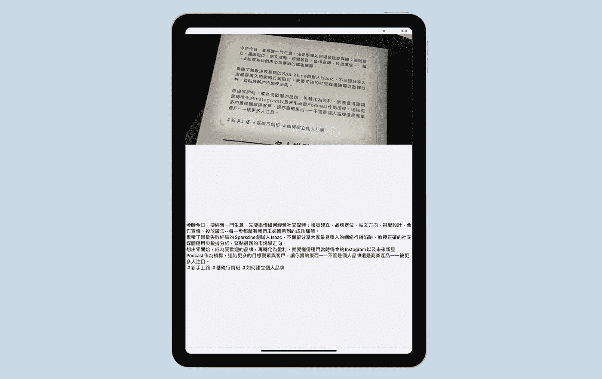

# 如何在 SwiftUI 中使用实时文本 API

> 原文：<https://betterprogramming.pub/how-to-use-live-text-apis-in-swiftui-db5a073b67b2>

## 利用现成的人工智能


由[拍摄的照片](https://unsplash.com/@lemonvlad?utm_source=medium&utm_medium=referral)在 [Unsplash](https://unsplash.com?utm_source=medium&utm_medium=referral)

去年，iOS 15 附带了一个非常有用的功能，称为[实时文本](https://support.apple.com/en-hk/HT212630)。您可能听说过术语 OCR(光学字符识别的缩写)，它是将文本图像转换为机器可读文本格式的过程。这就是实时文本的意义所在。

实时文本内置在相机应用程序和照片应用程序中。如果你还没有尝试过这个功能，只需打开相机应用程序。当你将设备的摄像头对准文本图像时，你会在右下角发现一个动态文本按钮。轻按按钮，iOS 会自动为您捕捉文本。然后，您可以将其复制并粘贴到其他应用程序中(如 Notes)。

对于大多数用户来说，这是一个非常强大和方便的功能。作为一名开发人员，如果能够将这种实时文本功能融入到自己的应用程序中，岂不是很棒？在 [iOS 16](https://www.appcoda.com/swiftui-4/) 中，苹果发布了 Live Text API，供开发者使用 Live Text 为其应用提供动力。在本教程中，让我们看看如何将 Live Text API 与 SwiftUI 一起使用。

# 使用 DataScannerViewController 启用实时文本

在关于 [*用 VisionKit*](https://developer.apple.com/videos/play/wwdc2022-10025) 捕捉机器可读代码和文本的 WWDC 会议上，苹果的工程师展示了如下图表:



文本识别并不是 iOS 16 的新功能。在旧版本的 iOS 上，您可以使用 AVFoundation 和 Vision 框架中的 API 来检测和识别文本。但是实现起来相当复杂，尤其是对于 iOS 开发新手来说。

在 iOS 的下一个版本中，上述所有内容都简化为 VisionKit 中一个名为`DataScannerViewController`的新类。通过使用这个视图控制器，您的应用程序可以自动显示具有实时文本功能的摄像头 UI。

要使用该类，首先要导入`VisionKit`框架，然后检查设备是否支持数据扫描器特性:

```
DataScannerViewController.isSupported
```

Live Text API 仅支持 2018 年或更新版本发布的带有 Neural engine 的设备。除此之外，您还需要检查可用性，看看用户是否同意使用 data scanner:

```
DataScannerViewController.isAvailable
```

一旦两次检查都得出肯定的结果，您就可以开始扫描了。以下是启动带有实时文本的摄像机的示例代码:

```
let dataScanner = DataScannerViewController(
                     recognizedDataTypes: [.text()],
                     qualityLevel: .balanced,
                     isHighlightingEnabled: true
                  )present(dataScanner, animated: true) {
   try? dataScanner.startScanning()
}
```

您只需要创建一个`DataScannerViewController`的实例，并指定可识别的数据类型。对于文本识别，您传递`.text()`作为数据类型。一旦实例准备好了，您就可以通过调用`startScanning()`方法来呈现它并开始扫描过程。

# 在 SwiftUI 中使用 DataScannerViewController

`DataScannerViewController`类现在只支持 UIKit。对于 SwiftUI，它需要做一些工作。我们必须采用`UIViewControllerRepresentable`协议来在 SwiftUI 项目中使用该类。在本例中，我创建了一个名为`DataScanner`的新结构，如下所示:

```
struct DataScanner: UIViewControllerRepresentable {
 .
 .
 .
}
```

该结构接受两个绑定变量:一个用于触发数据扫描，另一个是用于存储扫描文本的绑定。

```
@Binding var startScanning: Bool
@Binding var scanText: String
```

为了成功采用`UIViewControllerRepresentable`协议，我们需要实现以下方法:

```
func makeUIViewController(context: Context) ->DataScannerViewController {
   let controller = DataScannerViewController(
                       recognizedDataTypes: [.text()],
                       qualityLevel: .balanced,
                       isHighlightingEnabled: true
                   )

   return controller
}
​
func updateUIViewController(_ uiViewController:DataScannerViewController, context: Context) {

   if startScanning {
       try? uiViewController.startScanning()
   } else {
       uiViewController.stopScanning()
   }
}
```

在`makeUIViewController`方法中，我们返回一个`DataScannerViewController`的实例。对于`updateUIViewController`，我们根据`startScanning`的值开始(或停止)扫描。

为了捕获扫描的文本，我们必须采用下面的`DataScannerViewControllerDelegate`方法:

```
func dataScanner(_ dataScanner: DataScannerViewController, didTapOnitem: RecognizedItem) {
 .
 .
 .
}
```

当用户点击检测到的文本时，该方法被调用，因此我们将这样实现它:

```
class Coordinator: NSObject, DataScannerViewControllerDelegate {
   var parent: DataScanner

   init(_ parent: DataScanner) {
       self.parent = parent
   }

   func dataScanner(_ dataScanner: DataScannerViewController,didTapOn item: RecognizedItem) {
       switch item {
       case .text(let text):
           parent.scanText = text.transcript
       default: break
       }
   }

}
​
func makeCoordinator() -> Coordinator {
   Coordinator(self)
}
```

我们检查已识别的项目，如果识别出任何文本，就存储扫描的文本。最后，在`makeUIViewController`方法中插入这一行代码来配置委托:

```
controller.delegate = context.coordinator
```

该控制器现在可以在 SwiftUI 视图中使用了。

# 使用 DataScanner 捕获文本

例如，我们将构建一个具有非常简单的用户界面的文本扫描仪应用程序。当应用程序启动时，它会自动显示实时文本的摄像头视图。当检测到文本时，用户可以点击文本来捕获它。扫描的文本显示在屏幕的下部。



假设您已经创建了一个标准的 SwiftUI 项目，打开`ContentView.swift`和`VisionKit`框架。

```
import VisionKit
```

接下来，声明几个状态变量来控制数据扫描器和扫描文本的操作。

```
@State private var startScanning = false
@State private var scanText = ""
```

对于`body`部分，让我们像这样更新代码:

```
VStack(spacing: 0) {
   DataScanner(startScanning: $startScanning, scanText: $scanText)
       .frame(height: 400)

   Text(scanText)
       .frame(minWidth: 0, maxWidth: .infinity, maxHeight:.infinity)
       .background(in: Rectangle())
       .backgroundStyle(Color(uiColor: .systemGray6))

}
.task {
   if DataScannerViewController.isSupported &&DataScannerViewController.isAvailable {
       startScanning.toggle()
   }
}
```

当应用程序启动时，我们启动数据扫描仪。但在此之前，我们调用`DataScannerViewController.isSupported`和`DataScannerViewController.isAvailable`来确保设备支持实时文本。

演示应用程序几乎可以测试了。由于 Live Text 需要摄像机访问，请记得转到项目配置。在`Info.plist`文件中添加密钥*Privacy-Camera Usage Description*，并指定您的应用程序需要访问设备摄像头的原因。



更改后，您可以将应用程序部署到真实的 iOS 设备上，并测试实时文本功能。

除了英语，Live Text 还支持法语、意大利语、德语、西班牙语、中文、葡萄牙语、日语和韩语。



对于这个演示项目的源代码，你可以在 GitHub 上查看。

```
**Note**: To dive deeper into SwiftUI, you can check out our [Mastering SwiftUI book](https://www.appcoda.com/swiftui). We are updating the book for iOS 16\. You will receive a free update later this year.This article was originally published on [appcoda.com](https://www.appcoda.com/live-text-api/).
```