# 如何在 JavaScript 中使用本地存储

> 原文：<https://betterprogramming.pub/how-to-use-local-storage-with-javascript-9598834c8b72>

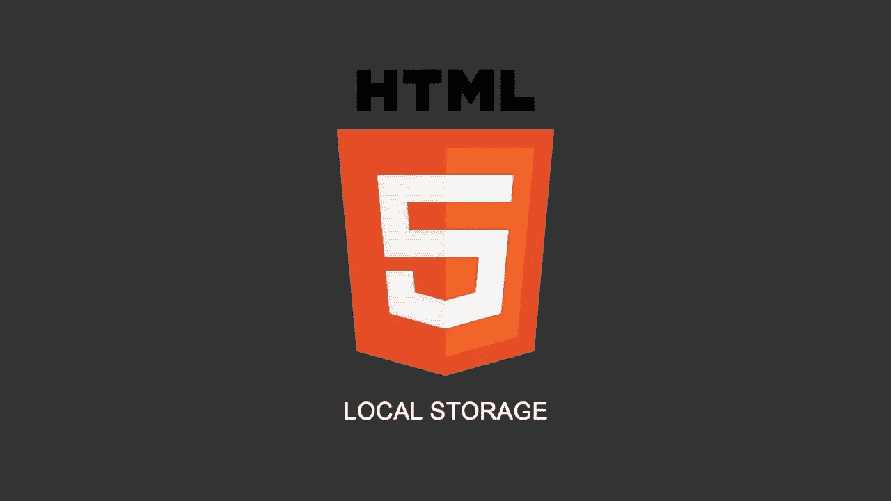

本地存储是本地存储在客户端浏览器中的数据。也是纯 JavaScript。

有两种类型的存储可供您使用:

*   **本地存储**:即使刷新页面或关闭浏览器，数据仍然存在。
*   **会话存储**:浏览器关闭时将被清除的数据。

# 为什么本地存储和会话存储有用？

您不必使用 cookies 来存储临时数据，临时数据需要由 web 服务器创建，并且不会随每个 HTTP 请求一起发送。

因此，如果你正在构建一个静态网站，你不需要任何后端语言或逻辑来存储数据。此外，您的本地存储提供 5MB 的数据存储，而您在 cookie 中最多只能存储 4KB。

一些技术性的东西:

*   您可以设置键:值对。
*   您只能存储字符串。
*   你可以存储数组和对象，但是你必须先把它们转换成字符串，使用一个叫做`JSON.stringify()`和`JSON.parse()`的方法。稍后将详细介绍。

以下是本地存储的方法:

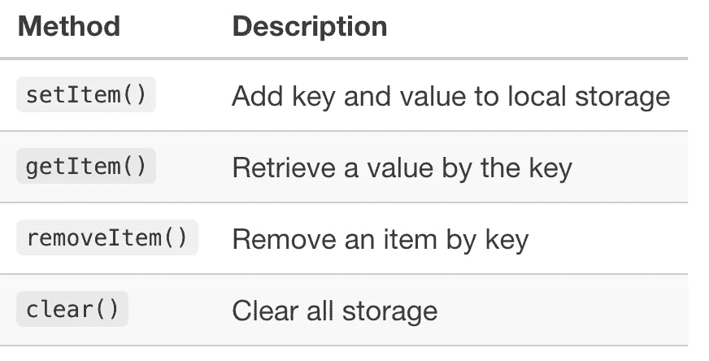

将数据设置到本地存储:

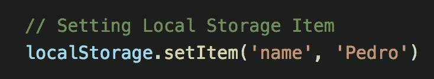

它们被保存为键:值对。

将数据设置到会话存储中:

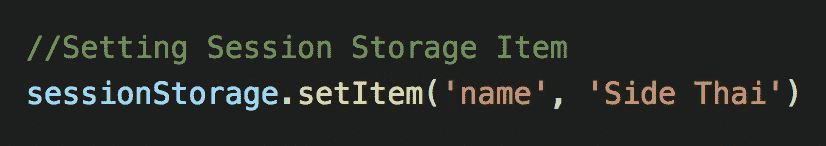

这些也被保存为键:值对。

如果你在你的浏览器(`CMD+Option+J`)中进入你的控制台，进入应用程序选项卡，你可以看到你的数据。

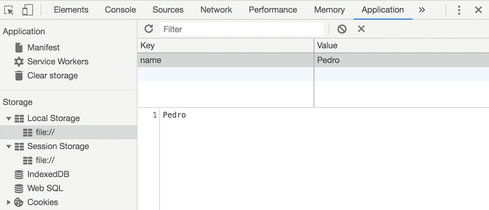

我们可以`get`从存储:

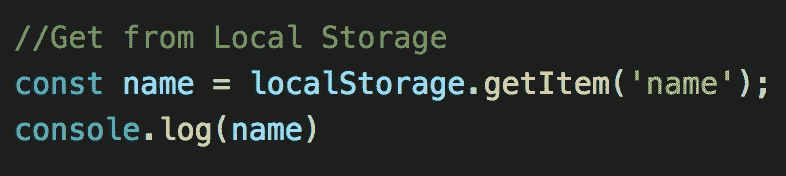

使用 console.log()作为显示数据的示例。

我们可以从存储中`remove`:

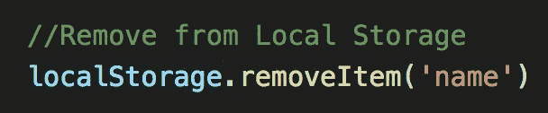

我们可以`clear`全部从存储:

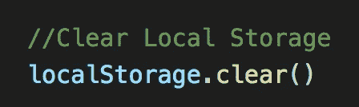

数据将变为空。

# 示例:保存任务

快速举例。如果你有一个表单，比如说，一个任务列表，你想保存用户提交的任务，你可以这样做:

查找您的表单输入:

将事件`‘submit’`添加到表单输入:

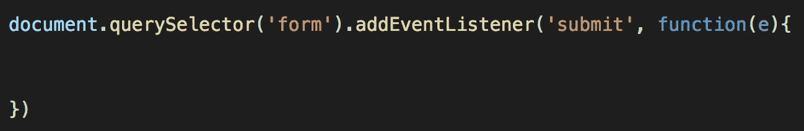

抓取表单的输入`value`:

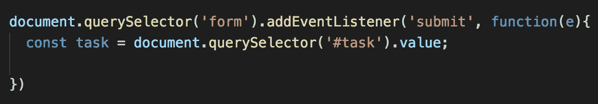

我有一个 ID 为“task”的输入标签，我使用 value 方法获取用户的输入，并将其存储在一个变量中。

这是有点棘手的部分。如果我们想要存储来自用户的多个任务，我们需要创建一个任务数组，并将其存储为一个字符串。

1.  首先，我们需要检查本地存储中是否有内容，如果有，就将其取出并添加到。如果没有，设置一个空数组。

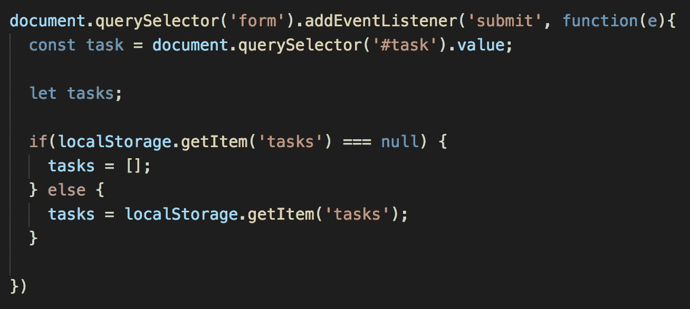

2.现在我们想用一个叫做`JSON.parse()`的方法来包装我们的`localStorage.getItem(‘tasks’);`。然后，我们想把我们的`task`变量传递给我们的`tasks`变量。

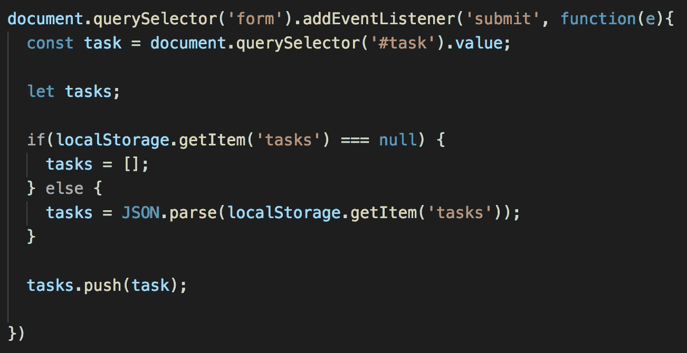

3.我们将任务转换回字符串，因为我们只能在本地和会话存储中存储字符串。

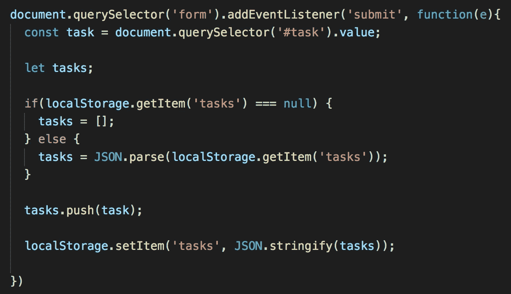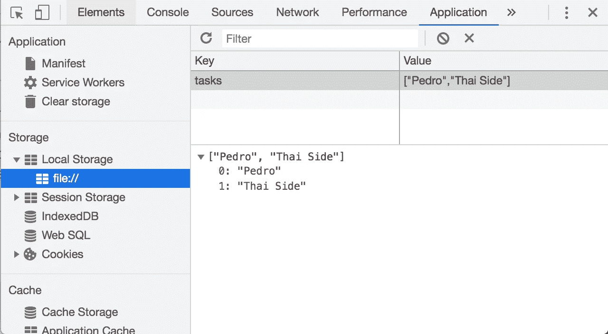

4.现在，如果我们想遍历它并使用一个`forEach()`，我们必须解析它，否则我们会得到`TypeError` : `forEach`不是一个函数错误，因为 tasks 是一个数组——我们从只存储字符串的本地存储中取出它。

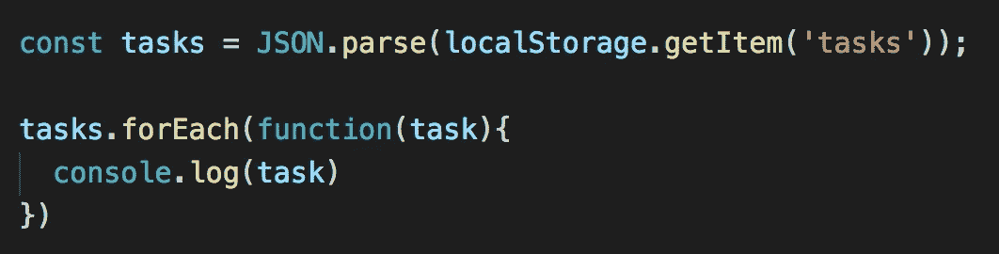

感谢阅读！