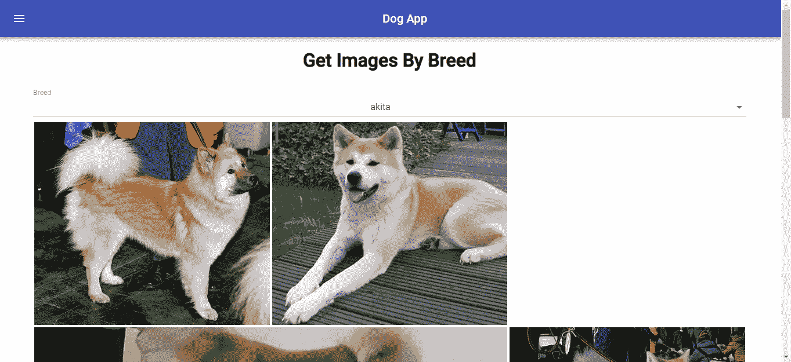

# 如何利用材质 UI 让材质设计产生反应

> 原文：<https://betterprogramming.pub/how-to-use-material-ui-to-bring-material-design-to-react-a327c875ab86>

## 使用 React、材质 UI 和[狗 API](https://dog.ceo/dog-api/documentation/) 创建应用程序


照片由 [ipet photo](https://unsplash.com/@ipet_photo?utm_source=unsplash&utm_medium=referral&utm_content=creditCopyText) 在 [Unsplash](https://unsplash.com/search/photos/dog?utm_source=unsplash&utm_medium=referral&utm_content=creditCopyText) 上拍摄

[材质 UI](https://material-ui.com/) 是 React 最流行的[材质设计](https://material.io/design/)库之一。它有基本的材质设计 UI 元素，如输入、卡片、网格、表格、导航、工具栏、下拉菜单、字体等。这是[完整列表](https://material-ui.com/)。

它以[节点](https://nodejs.org/)包的形式提供。要安装它，运行`npm i @material-ui/core`。然后，您可以在需要时将它们导入到组件文件中。

在这篇文章中，我将制作一个带有 React 和 Material UI 的应用程序，它使用了 [Dog API](https://dog.ceo/dog-api/documentation/) 。

要创建一个新的 React 应用程序，使用 React 开发人员制作的`create-react-app`代码生成器。这里有[自述文件](https://github.com/facebook/create-react-app)和[完整文档](https://facebook.github.io/create-react-app/)。

要创建应用程序，运行`npx create-react-app`并按照说明操作，你将获得一个新的应用程序。然后，你就可以准备安装 [React 路由器](https://reacttraining.com/react-router/)了。要安装它，运行`npm i react-router-dom`。

之后，运行`npm i @material-ui/core axios`安装@material-ui/core 和 [Axios](https://github.com/axios/axios) 。材质 UI 为我们的应用程序提供了材质设计外观，Axios 是一个 HTTP 客户端，可用于客户端应用程序。

在`index.js`中，我们有:

```
**import** React **from** 'react';
**import** ReactDOM **from** 'react-dom';
**import** './index.css';
**import** App **from** './App';
**import** * **as** serviceWorker **from** './serviceWorker';
**import** { breedsReducer, imagesReducer } **from** './reducers';
**import** { Provider } **from** 'react-redux'
**import** { createStore } **from** 'redux'
**import** { combineReducers } **from** 'redux'
**const** dogApp = combineReducers({
  breeds: breedsReducer,
  images: imagesReducer
})**const** store = createStore(dogApp);
ReactDOM.render(
  <Provider store={store}>
    <App />
  </Provider>
, document.getElementById('root')
);
serviceWorker.unregister();
```

上面的文件是 reducers 映射到状态的地方。通过调用`combineReducers`函数，创建了商店，然后将商店传递给应用程序，在应用程序中,`mapStateToProps`将状态作为`props`提供给组件。

`mapDispatchToProps`允许你通过 props 中的一个函数在你的组件中设置状态，如下图所示。

我们添加 reducers 来将状态存储在一个集中可用的位置。我们的应用程序的状态在这里设置。

我们制作一个叫做`reducer.js`的文件:

```
import { SET_BREEDS, SET_IMAGES } from './actions';function breedsReducer(state = {}, action) {
    switch (action.type) {
        case SET_BREEDS:
            state = JSON.parse(JSON.stringify(action.payload));
            return state;
        default:
            return state
    }
}function imagesReducer(state = [], action) {
    switch (action.type) {
        case SET_IMAGES:
            state = JSON.parse(JSON.stringify(action.payload));
            return state;
        default:
            return state
    }
}export { breedsReducer, imagesReducer };ima
```

在`actions.js`中，我们为我们的 [Redux](https://redux.js.org/) 动作添加了这些常量:

```
**const** SET_BREEDS = 'SET_BREEDS';
**const** SET_IMAGES = 'SET_IMAGES';
**export** { SET_BREEDS, SET_IMAGES };
```

在`actionCreators.js`中，我们添加:

```
import { SET_BREEDS, SET_IMAGES } from './actions';const setBreeds = (breeds) => {
    return {
        type: SET_BREEDS,
        payload: breeds
    }
};const setImages = (images) => {
    return {
        type: SET_IMAGES,
        payload: images
    }
};export { setBreeds, setImages };
```

在`app.js`中，我们将默认代码改为:

```
import React, { useState, useEffect } from "react";
import './App.css';
import { setBreeds } from './actionCreators';
import { connect } from 'react-redux';
import { Router, Route, Link } from "react-router-dom";
import HomePage from './HomePage';
import BreedsPage from './BreedsPage';
import SubBreedsPage from './SubBreedsPage';
import AppBar from '[@material](http://twitter.com/material)-ui/core/AppBar';
import Toolbar from '[@material](http://twitter.com/material)-ui/core/Toolbar';
import Typography from '[@material](http://twitter.com/material)-ui/core/Typography';
import Button from '[@material](http://twitter.com/material)-ui/core/Button';
import IconButton from '[@material](http://twitter.com/material)-ui/core/IconButton';
import Drawer from '[@material](http://twitter.com/material)-ui/core/Drawer';
import List from '[@material](http://twitter.com/material)-ui/core/List';
import ListItem from '[@material](http://twitter.com/material)-ui/core/ListItem';
import ListItemText from '[@material](http://twitter.com/material)-ui/core/ListItemText';
import { makeStyles } from '[@material](http://twitter.com/material)-ui/core/styles';
import { createBrowserHistory as createHistory } from 'history'
const history = createHistory();
const axios = require('axios');const useStyles = makeStyles(theme => ({
  root: {
    flexGrow: 1,
  },
  menuButton: {
    marginRight: theme.spacing(2),
  },
  title: {
    flexGrow: 1,
  },
}));function App({ setBreeds }) {
  const classes = useStyles();
  const [initialized, setInitialized] = useState(false);
  const [state, setState] = useState({
    openDrawer: false
  }); const titles = {
    '/': 'Dog App',
    '/breeds': 'Get Images By Breed - Dog App',
    '/subbreeds': 'Get Images By Breed or Sub-Breed - Dog App'
  } history.listen((location, action) => {    
    document.title = titles[location.pathname];
    setState({ openDrawer: false });
  }); const toggleDrawer = (open) => event => {
    if (event.type === 'keydown' && (event.key === 'Tab' || event.key === 'Shift')) {
      return;
    }
    setState({ openDrawer: open });
  }; const links = {
    'Home': '/',
    'Breeds': '/breeds',
    'Sub-Breeds': '/subbreeds',
  } const getBreeds = () => {
    setInitialized(true);
    axios.get('[https://dog.ceo/api/breeds/list/all'](https://dog.ceo/api/breeds/list/all'))
      .then((response) => {
        setBreeds(response.data.message);
      })
      .catch((error) => {
        console.log(error);
      })
      .finally(() => { });
  } useEffect(() => {
    if (!initialized) {
      getBreeds();
    }
  }); return (
    <div className="App">
      <Router history={history}>
        <Drawer anchor="left" open={state.openDrawer} onClose={toggleDrawer(false)}>
          <List>
            <ListItem button>
              <h2><b>Dog App</b></h2>
            </ListItem>
            {Object.keys(links).map((text) => (
              <ListItem button key={text}>
                <Link to={links[text]}>
                  <ListItemText primary={text} />
                </Link>
              </ListItem>
            ))}
          </List>
        </Drawer>
        <AppBar position="static">
          <Toolbar>
            <IconButton edge="start" className={classes.menuButton} color="inherit" aria-label="Menu" onClick={toggleDrawer(true)}>
              <i className="material-icons">menu</i>
            </IconButton>
            <Typography variant="h6" className={classes.title}>
              Dog App
            </Typography>
          </Toolbar>
        </AppBar> <Route path="/" exact component={HomePage} />
        <Route path="/breeds/" component={BreedsPage} />
        <Route path="/subbreeds/" component={SubBreedsPage} />
      </Router>
    </div>
  );
} const mapStateToProps = (state) => ({
    breeds: state.breeds
  }) const mapDispatchToProps = (dispatch) => ({
    setBreeds: breeds => dispatch(setBreeds(breeds))
  })export default connect(
  mapStateToProps,
  mapDispatchToProps
)(App);
```

注意，在上面的代码中，我们将所有需要的小部件导入到组件文件中，然后将它包含在`return`语句中。

对于样式，我们导入`makeStyles`函数并在其中放置一个对象。我们通过提供类似 CSS 的属性和值来设计它的样式。

顶级键是类。它们将在调用导入的`useStyles()`时创建。那么，我们可以参考`classes.className`来使用。

例如，`classes.menuButton`将用于将`menuButton`类应用到上面的按钮。

上面的代码有钩子。

```
**const** [initialized, setInitialized] = useState(**false**);
**const** [state, setState] = useState({
  openDrawer: **false** });
```

这些函数相当于基于类的组件中的`setState`函数。

数组中的第一个元素(`initialized`)相当于`this.state.initialized`，`setInitialized`相当于调用基于类的组件中的`this.setState({initialized: initializedValue});`的函数。

钩子只适用于基于函数的组件。这样做的好处是，只需编写较少的代码就可以达到设置状态的相同效果。

还要注意，我们在上面的组件中有这个:

```
useEffect(() => {
  **if** (!initialized) {
    getBreeds();
  }
});
```

因为我们不像基于类的组件那样有`componentDidMount`，我们必须检查组件是否加载了我们自己的标志。

`getBreeds`函数一旦运行成功就将`initialized`标志设置为`true`，这样`getBreeds`函数就不会永远重复运行。`useEffect`是一个在每次渲染时都会运行的函数，所以注意不要把必要的代码放在里面。

注意上面文件末尾的`connect`函数。这是状态连接到组件的地方。`setBreeds`是一个函数，返回一个带有动作类型和有效载荷的普通对象。

这允许减速器根据`type`字段设置状态，在本例中为`SET_BREEDS`或`SET_IMAGES`。状态将被设置、返回，并且新状态将通过`props.breeds`用于`breeds`。

`<Route path=”/breeds/” component={BreedsPage} />`是定义路线的地方。肯定在`<Router history={history}></Router>`里面。

这是我们应用程序的路由部分。有了这个，我们输入`http://localhost: 3000/breeds`就可以去页面了。

当路线改变时，该块设置标题并隐藏左侧的应用抽屉:

```
history.listen((location, action) => {
   document.title = titles[location.pathname];
   setState({ openDrawer: **false** });
});
```

我们现在为我们的应用程序创建页面，这些页面将使用 React Router 进行路由。首先，我们创建一个显示品种的页面，我们称之为`BreedPage.js`。

代码将如下所示:

```
import React from 'react';
import './BreedsPage.css';
import { setImages } from './actionCreators';
import { connect } from 'react-redux';
import InputLabel from '[@material](http://twitter.com/material)-ui/core/InputLabel';
import MenuItem from '[@material](http://twitter.com/material)-ui/core/MenuItem';
import FormControl from '[@material](http://twitter.com/material)-ui/core/FormControl';
import Select from '[@material](http://twitter.com/material)-ui/core/Select';
import { makeStyles } from '[@material](http://twitter.com/material)-ui/core/styles';
import ImagesBox from './ImagesBox';
const axios = require('axios');const useStyles = makeStyles(theme => ({
    formControl: {
        margin: theme.spacing(1),
        width: '90vw',
    },}));function BreedsPage({ breeds, setImages }) {
    const classes = useStyles();
    const [state, setState] = React.useState({
        breed: '',
    });
    const [initialized, setInitialized] = React.useState(false); const handleChange = name => event => {
        setState({
            ...state,
            [name]: event.target.value,
        }); if (name == 'breed') {
            getImagesByBreed(event.target.value);
        }
    }; const getImagesByBreed = (breed) => {
        axios.get(`[https://dog.ceo/api/breed/${breed}/images`](https://dog.ceo/api/breed/${breed}/images`))
            .then((response) => {
                setImages(response.data.message);
            })
            .catch((error) => {
                console.log(error);
            })
            .finally(() => {});
    } React.useEffect(() => {
        if (!initialized) {
            setInitialized(true);
            setImages([]);
        }
    }); return (
        <div className="App">
            <h1>Get Images By Breed</h1>
            <form>
                <FormControl className={classes.formControl}>
                    <InputLabel>Breed</InputLabel>
                    <Select
                        value={state.breed}
                        onChange={handleChange('breed')}
                    >
                        {Object.keys(breeds || {}).map(b =>
                            <MenuItem value={b} key={b}>
                                {b}
                            </MenuItem>
                        )}
                    </Select>
                </FormControl>
                <ImagesBox></ImagesBox>
            </form>
        </div>
    );}const mapStateToProps = state => {
    return {
        breeds: state.breeds,
        images: state.images
    }
}const mapDispatchToProps = dispatch => ({
    setImages: images => dispatch(setImages(images))
})export default connect(
    mapStateToProps,
    mapDispatchToProps
)(BreedsPage);
```

最后，当您转到`[http://localhost:](http://localhost/)3000/breeds`时，您会看到下面的屏幕:

