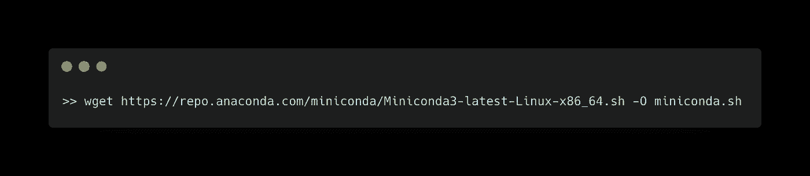
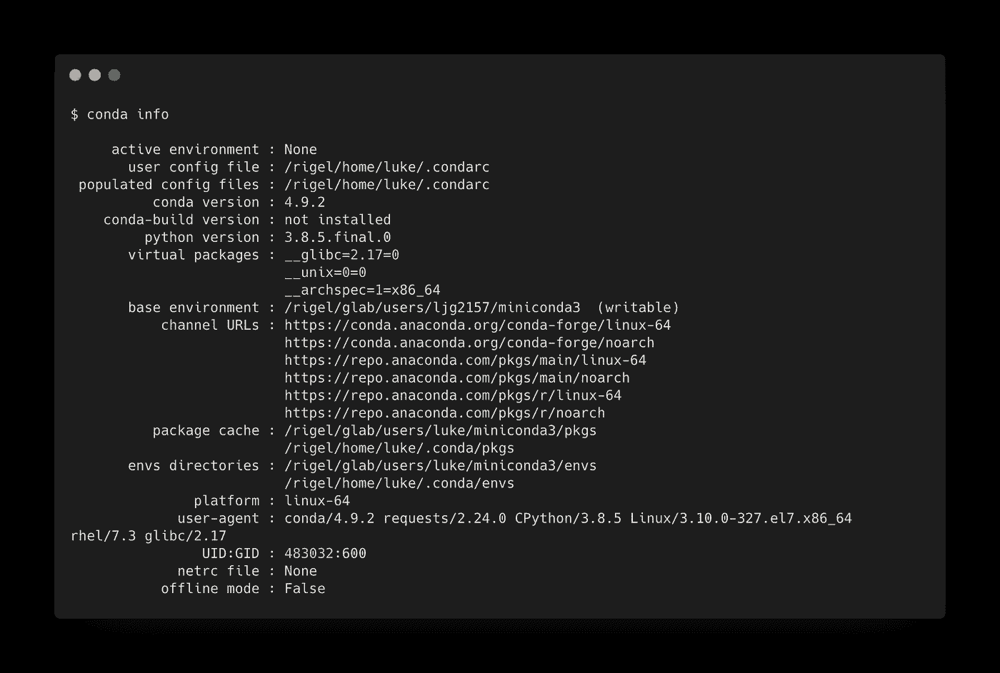
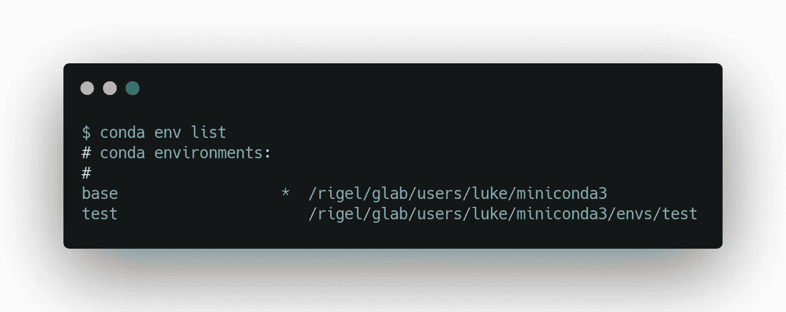
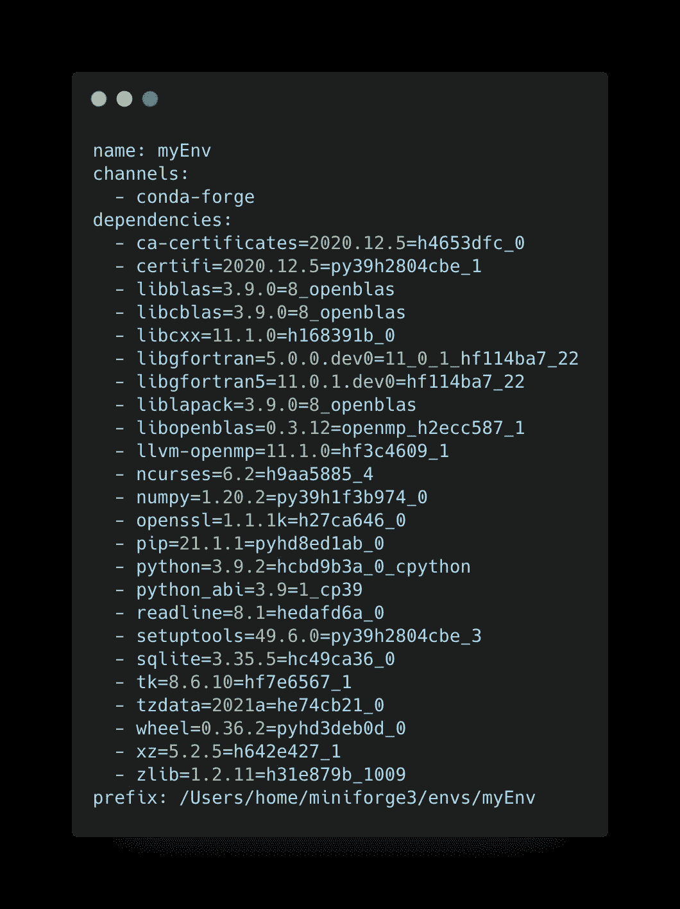
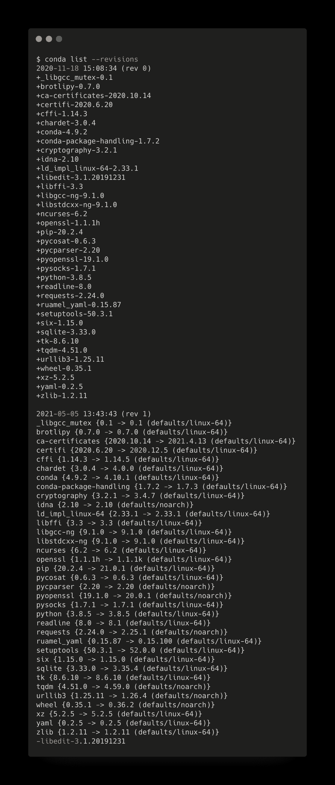

# 如何将 Miniconda 与 Python 和 JupyterLab 结合使用

> 原文：<https://betterprogramming.pub/how-to-use-miniconda-with-python-and-jupyterlab-5ce07845e818>

## 从头开始设置极简 Python 环境


达里奥·沃尔夫在 [Unsplash](https://unsplash.com?utm_source=medium&utm_medium=referral) 上的照片

Miniconda 是一个最小的 conda 安装程序，只包含 Python、conda 及其依赖项。Miniconda 允许您通过安装成千上万个附加软件包中的附加软件包来创建定制的环境。您可以为每个项目创建单独的环境，并轻松地与其他人共享您的环境，以便于复制。使用 conda，您可以在本地机器上创建一个环境，并无缝地将其复制到大型共享高性能计算机(HPC)上。

本文将概述安装和使用 Miniconda 创建和管理定制环境、安装包以及将这些环境移动到远程计算机所需的一切。Miniconda 让您处于控制之中，不会根据您的需要安装不必要的包，这可能会带来一个全面的 Anaconda 安装。

## **目录**

*   [安装](#6c8a)
*   [基础知识](#0229)
*   [安装包](#5cd1)
*   [创建自定义环境](#73e3)
*   [使用带有 JupyterLab 的环境](#3963)
*   [将环境迁移到新计算机上](#1c6a)
*   修复和清洁你的环境
*   [修改 condarc 文件](#6ddc)
*   [最终想法](#b1f7)

# 装置

首先，[为您的系统下载](https://docs.conda.io/en/latest/miniconda.html)Miniconda 安装程序。使用`wget`或`cURL`复制安装程序脚本。下面是一个使用`wget`将 64 位 Linux 安装程序复制到当前工作目录的例子。`-O`标志将文件重命名为`miniconda.sh`。



复制完成后，运行安装程序脚本并按照屏幕上的说明进行操作。

```
bash miniconda.sh
```

系统将提示您:

1.  接受许可条款。
2.  选择安装位置。
    - `$HOME`是默认位置，但是你可以选择任何位置。
    -如果您要在空间有限的`$HOME`共享计算机上安装，您应该选择不同的位置。
3.  初始化 Miniconda。
    -【是】将更新你的`.bashrc`文件中的`$PATH`变量。我推荐这个选项。
    -【否】要求您手动更新`$PATH`:
    `export PATH=”$HOME/miniconda/bin:$PATH”`
4.  重启您的终端或源文件`.bashrc`以使更改生效。

# 基础知识

现在康达已经安装好了，我们可以开始探索了。第一个尝试的命令是`conda info`。这将显示关于您的 conda 安装的信息，例如安装位置、环境所在的位置、您的 conda 版本以及大量其他信息。



您可以使用`conda info --envs`只显示您的环境。注意`conda env list`达到了相同的结果。一开始，你只会看到`base`环境。如果您没有首先激活环境或明确指定软件包的安装位置，这就是软件包的安装位置。

下面是两种环境下的输出示例:`base`和`test`。环境的名称在左边，位置在右边。`*`表示当前活动的环境。



# 安装软件包

Miniconda 极其简约，要求你安装你需要的包，而不仅仅是像 [NumPy](https://numpy.org/) 这样常用的包。您可以使用`conda install`命令后跟软件包名称来安装软件包。

下面是安装 NumPy 的方法:

```
conda install numpy
```

在安装开始之前，它总是提示将安装哪些依赖项，以及将升级或降级哪些包。这让您知道是否要安装。

您不必一次安装一个软件包。相反，您可以一次指定多个包。

```
conda install xarray netcdf4
```

包从远程[通道](https://docs.conda.io/projects/conda/en/latest/user-guide/concepts/channels.html)下载，这些通道是包含包的目录的 URL。这很重要，因为不是所有的包都在默认通道中。您可以使用`-c`标志指定不同的通道。在这个例子中，我从社区驱动的 [conda-forge](https://conda-forge.org) 渠道安装 NumPy。

```
conda install numpy -n base -c conda-forge
```

`-n`标志指定软件包将被安装在哪个环境中。如果不指定此标志，软件包将安装在活动环境中。但是，我认为在这里明确一点是个好主意。

## 列出包

您可以列出当前安装的所有软件包，如下所示:

```
conda list
```

## 取出包裹

移除软件包就像安装一样简单。下面是一个删除包的示例。

```
conda remove numpy -n base -c conda-forge
```

就像安装一个包一样，我认为明确您要从哪个环境中移除包以及使用哪个通道是一个好主意。

## 安装或删除软件包时出错？

如果您在安装软件包时收到错误，您可以尝试以下两种方法:

1.  更新 conda: `conda update -n base -c defaults conda`
    注意使用`-n`和`-c`标志来指定环境和通道。
2.  从不同的频道安装或移除。最好从您安装的频道中删除软件包。

康达锻造公司通常拥有最新版本。您可以从 conda-forge 通道安装，如下所示:

```
conda install numpy -n base -c conda-forge
```

或者像这样删除从 conda-forge 安装的包:

```
conda remove numpy -n base -c conda-forge
```

# 创建自定义环境

有些人喜欢为每个项目提供不同的环境，或者为特定的任务提供不同的环境。例如，可能一个专门用于机器学习，另一个专门用于使用 [xESMF](https://xesmf.readthedocs.io/en/latest/) 重新划分数据。

使用环境的另一种方式是拥有一个干净的基础环境和一个单独的开发环境，以确保在添加新包时没有冲突。

无论您如何使用环境，创建环境的方式都是一样的。下面是如何使用 Python 版创建一个名为 myenv 的新环境。

```
conda create --name myenv python=3.7
```

指定 Python 版本时注意`=`与`==`:

*   `python=3.7`告诉 conda 使用 Python 3.7 树中的最新版本。例如，如果最新版本是 Python 3.7.6，那么将安装该版本。
*   `python==3.7`告诉 conda 使用那个版本，Python 3.7。

您可以在任何想要使用环境的时候激活环境:

```
source activate myenv
```

然后，您可以像以前一样安装软件包，并指定环境(`-n`)和通道(`-c`)。

```
conda install numpy -n myenv -c conda-forge
```

完成后，您可以像这样停用环境:

```
conda deactivate
```

如果你想复制一个现有的环境，也许是为了测试一个新的包的行为，你可以在创建它的时候传递`--clone`标志。

```
conda create --clone myenv --name myenv2
```

这将把 myenv 中安装的所有包复制到 myenv2 中。请注意，这将复制包；它不共享它们。换句话说，删除其中一个环境不会影响另一个环境。

克隆基本环境与克隆任何其他环境是一样的。

```
conda create --clone base --name baseclone
```

如果您需要删除一个环境，您可以这样做:

```
conda env remove --name baseclone
```

这将删除 baseclone 及其包含的包。

## 列出环境

记住，如果你忘记了你创建了哪些环境，你可以用`conda env list`来显示它们。

# 使用带有 JupyterLab 的环境

您不能立即使用带有 [JupyterLab](https://jupyter.org/documentation) 的环境。这涉及到一点点设置。首先，您需要安装 JupyterLab。你可以用`conda install jupyterlab -c conda-forge`安装 JupyterLab。

然后按照这些说明将环境转换成内核，这样您就可以在 Jupyter 笔记本中使用它。

1.  激活环境:`source activate myEnv`。
2.  安装 ipykernel: `conda install ipykernel`。
3.  运行这个命令:`python -m ipykernel install --user --name myEnv --display-name “my_environment”`。

这里，`--name`指定了环境名，`--display-name`是将在 JupyterLab 中显示的内核名。在您启动 JupyterLab 之后，您会看到`my_envionrment`作为一个内核选项。选择此项将在 myEnv 环境中运行命令。

# 将环境移动到新计算机

假设您有一个在笔记本电脑上工作的环境，您想将该环境转移到 HPC 上。您可以从一个[环境文件](https://conda.io/projects/conda/en/latest/user-guide/concepts/environments.html#create-environment-file-by-hand)中创建，而不是浪费时间手动安装每个包。

为此，您首先需要从笔记本电脑上的环境中创建您的`environment.yml`文件:

```
conda env export --name myEnv > environment.yml
```

这会将`myEnv`环境导出到一个名为`environment.yml`的文件中。可以直接用 name 标志指定环境，也可以先激活环境，然后去掉`--name myEnv`部分:`conda env export> environment.yml`。下面是一个`environment.yml`文件的例子。



environment.yml 文件示例

现在您可以使用`scp`将`environment.yml`文件移动到您的 HPC。然后，在您安装 conda 之后，您可以从这样的文件创建您的新环境:

```
conda env create --file environment.yml
```

这将下载并安装所有的软件包及其依赖项。没有必要指定名称，因为它已经在`environment.yml`中声明了。

# 修复和清理您的环境

## 恢复到以前的版本

我们必须记住 Python 是免费和开源的，包是社区驱动的。有时当我们安装一个包时，它与已经安装的包并不匹配。值得庆幸的是，康达有记忆，我们可以恢复到我们的环境以前的版本。

这将列出所有的修订和修改的内容。

```
conda list --revisions
```

使用(版本)号，我们可以恢复到以前的版本，如下所示:

```
conda install --revision 0
```

现在环境就像(rev 0)一样。

这是修订清单的一个例子。这将显示分别使用`+` 和`-`安装和移除的软件包。版本和频道变化用`->`表示。



## 删除缓存的包 tarballs

你创造的环境越多，你获得的 tarballs 就越多。你可以像这样去掉所有不需要的 tarballs:

```
conda clean --tarballs
```

# 修改 condarc 文件

现在你已经知道如何使用 conda，我想谈的最后一个主题是如何修改你的`.condarc`文件。例如，如果您喜欢从特定的渠道下载，如 conda-forge，这是很有用的。然后，您可以将 conda-forge 添加到要搜索的默认频道列表中。

例如，您可以将 conda-forge 频道添加到您的`.condarc`文件中，如下所示:

```
conda config --append channels conda-forge
```

# 最后的想法

本文提供了使用 conda 管理环境所需的大部分知识。每个命令都有比我讨论的更多的标志，这些标志可以在[文档](https://docs.conda.io/projects/conda/en/latest/commands.html#conda-general-commands)中找到。

文档还提供了一个方便的[备忘单](https://docs.conda.io/projects/conda/en/latest/user-guide/cheatsheet.html?highlight=cheat%20sheet)，它概述了一些常见的命令。

使用 Miniconda 的好处是能够在计算机之间移动环境。作为一个在多台机器上工作的人，我发现 Miniconda 可以无缝地移动环境。

除了将环境转移到新计算机上，我还可以在共享项目时将环境文件转移给其他人。这确保了环境是稳定的，代码会像其他人期望的那样运行，这对于可再现性是非常重要的。

*感谢阅读和支持媒体作者*

[](https://lukegloege.medium.com/membership) [## 通过我的推荐链接加入 Medium—Luke Gloege 博士

### 作为一个媒体会员，你的会员费的一部分会给你阅读的作家，你可以完全接触到每一个故事…

lukegloege.medium.com](https://lukegloege.medium.com/membership)